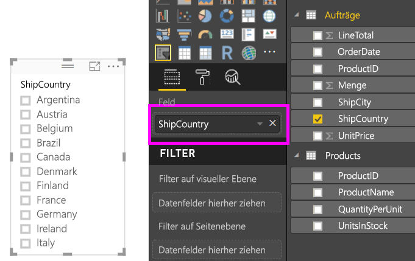
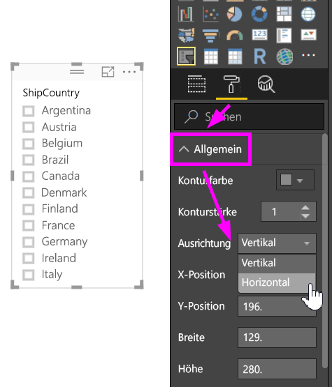
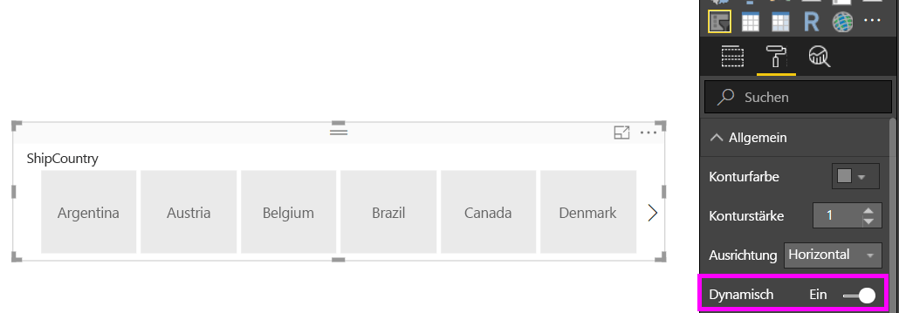
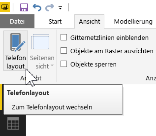
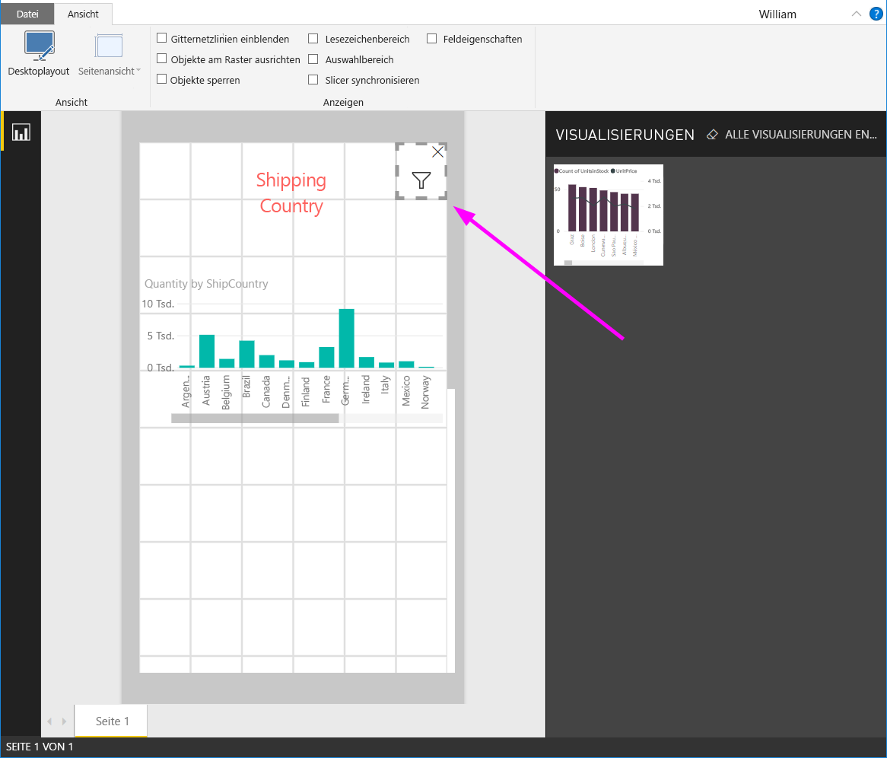

# Erstellen eines dynamischen Datenschnitts mit anpassbarer Größe in Power BI

Bei dynamischen Datenschnitten kann die Größe an einen Bericht angepasst werden. Sie können dynamische Datenschnitte in verschiedenen Größen und Formen anzeigen, von horizontal über quadratisch zu vertikal. Dabei werden die Werte im Datenschnitt automatisch neu angeordnet. In Power BI Desktop und im Power BI-Dienst können Sie horizontale Datenschnitte und Datums-/Bereichsdatenschnitte als dynamisch konfigurieren. Datums-/Bereichsdatenschnitte verfügen außerdem über optimierte Touchbereiche und können daher ganz einfach mit einem Fingertippen geändert werden. Sie können dynamische Datenschnitte beliebig klein oder groß erstellen. Sie werden automatisch angepasst, um perfekt in Berichte sowohl im Power BI-Dienst und auch in den mobilen Power BI-Apps zu passen. 

## Erstellen von Slicern

Der erste Schritt beim Erstellen eines dynamischen Datenschnitts besteht darin, einen einfachen Datenschnitt zu erstellen. 

1. Wählen Sie im Bereich **Visualisierungen** das **Datenschnittsymbol**  aus.
2. Ziehen Sie das Feld, das gefiltert werden soll, auf **Feld**.

    

## Konvertieren in einen horizontalen Datenschnitt

1. Wählen Sie einen Datenschnitt aus. Wählen Sie dann im Bereich **Visualisierungen** den Abschnitt **Format** aus.
2. Erweitern Sie den Abschnitt **Allgemein**, und wählen Sie dann unter **Ausrichtung** die Option **Horizontal** aus.

     

1.  Sie möchten den Datenschnitt wahrscheinlich breiter machen, um weitere Werte anzuzeigen.

     

## Hinzufügen der Dynamik und Testen

Dieser Schritt ist einfach. 

1. Stellen Sie direkt unter **Ausrichtung** im Abschnitt **Allgemein** der Registerkarte **Format** den Schalter **Dynamisch** auf **Ein**.  

    

1. Jetzt können Sie damit etwas experimentieren. Ziehen Sie die Ecken, um ihn kurz, lang, breit oder schmal anzuzeigen. Wenn Sie ihn sehr klein anzeigen, sehen Sie nur ein Filtersymbol.

    

## Hinzufügen zu einem Berichtslayout für Smartphones

In Power BI Desktop können Sie ein Telefonlayout für jede Seite eines Berichts erstellen. Wenn eine Seite über ein Telefonlayout verfügt, wird sie auf Mobiltelefonen im Hochformat angezeigt. Andernfalls müssen Sie sie im Querformat anzeigen. 

1. Wählen Sie im Menü **Ansicht** die Option **Telefonlayout** aus.

     
    
1. Ziehen Sie alle Visuals, die der Telefonbericht enthalten soll, in das Raster. Ziehen Sie den dynamischen Datenschnitt auf die gewünschte Größe – in diesem Fall nur ein Filtersymbol.

    

Weitere Informationen zum Erstellen von [für mobile Power BI-Apps optimierten Berichten](desktop-create-phone-report.md).

## Hinzufügen von Dynamik für Zeit- oder Berichtsdatenschnitte

Sie können die gleichen Schritte ausführen, um einen Kachel- oder Berichtsdatenschnitt als dynamischen Datenschnitt zu konfigurieren. Wenn Sie **Dynamisch** auf **Ein** festlegen, werden Sie verschiedene Dinge bemerken:

- Bei Visuals wird die Reihenfolge der Eingabefelder abhängig von der Größe des Zeichenbereichs optimiert. 
- Die Anzeige von Datenelementen wird optimiert, damit der Datenschnitt abhängig vom verfügbaren Platz im Zeichenbereich so benutzerfreundlich wie möglich ist. 
- Durch neue, runde Ziehpunkte an den Schiebereglern werden Touchinteraktionen optimiert. 
- Wenn ein Visual zu klein wird, um noch nützlich zu sein, wird sie stattdessen als Symbol dargestellt, das den Typ des Visuals zeigt. Tippen Sie auf das Symbol, um die Visualisierung im Fokusmodus zu öffnen und damit zu interagieren. Hierdurch wird Platz auf der Berichtsseite gespart, ohne dabei Funktionalität zu verlieren.

## Nächste Schritte

- [Slicer im Power BI-Dienst](visuals/power-bi-visualization-slicers.md)
- Weitere Fragen? [Stellen Sie Ihre Frage in der Power BI-Community.](http://community.powerbi.com/)