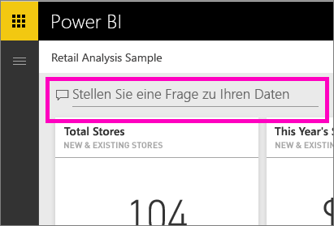
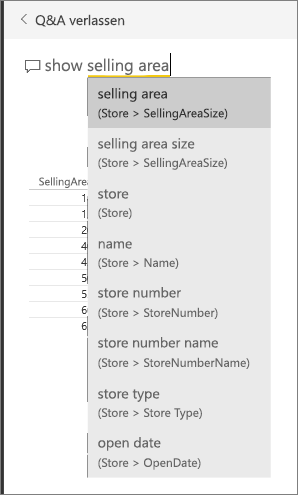
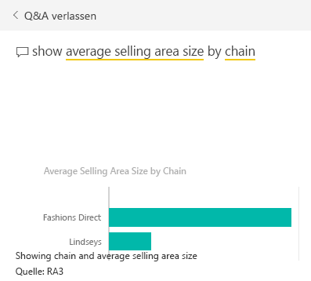
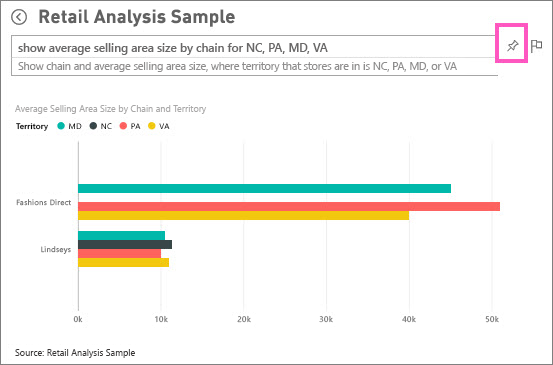

# Tutorial: Verwenden von Q&A zum Erstellen von Visualisierungen und Berichten
In der [Übersicht über Q&A](consumer/end-user-q-and-a.md) wurde Ihnen Power BI Q&A vorgestellt, und dabei wurde zwischen *Nutzern* (für die Dashboards und Berichte freigegeben werden) und *Erstellern* (Besitzer der zugrunde liegenden Berichte und Datasets) unterschieden. Der erste Teil dieses Tutorials ist in erster Linie für Personen vorgesehen, die mit dem Power BI-Dienst Dashboards nutzen. Und der zweite Teil ist für Personen konzipiert, die mit dem Power BI-Dienst oder mit Power BI Desktop Berichte erstellen. [Q&A und Power BI Mobile](consumer/mobile/mobile-apps-ios-qna.md) sowie [Q&A mit Power BI Embedded](developer/qanda.md) werden in eigenen Artikeln behandelt.

Q&A ist interaktiv und sogar unterhaltsam. Häufig erhalten Sie durch nur eine Frage Antworten auf viele weitere, da die Visualisierungen interessante weitere Verweise enthalten. Sehen Sie sich an, wie Amanda mithilfe von Q&A Visualisierungen erstellt, diese Visuals erläutert und sie an Dashboards anheftet.

<iframe width="560" height="315" src="https://www.youtube.com/embed/qMf7OLJfCz8?list=PL1N57mwBHtN0JFoKSR0n-tBkUJHeMP2cP" frameborder="0" allowfullscreen></iframe>

## Teil 1: Verwenden von Q&A in einem Dashboard im Power BI-Dienst (app.powerbi.com)
Ein Dashboard enthält angeheftete Kacheln aus einem oder mehrere Datasets, sodass Sie Fragen zu allen Daten in einem dieser Datasets stellen können. Um festzustellen, welche Berichte und Datasets zum Erstellen des Dashboards verwendet wurden, wählen Sie auf der Menüleiste **Verwandte Inhalte anzeigen** aus.

Das Q&A-Fragefeld befindet sich in der linken oberen Ecke des Dashboards, und hier geben Sie Ihre Frage in natürlicher Sprache ein. Q&A erkennt die Wörter die Sie eingeben und prüft, wo (in welchem Dataset) die Antwort zu finden ist. Q&A unterstützt Sie mit automatischer Vervollständigung, Neuformulierung und anderen textlichen und visuellen Hilfsmitteln bei der Formulierung Ihrer Frage.

Die Antwort auf Ihre Frage wird als eine interaktive Visualisierung angezeigt und beim Ändern der Frage aktualisiert.

1. Öffnen Sie ein Dashboard, und platzieren Sie den Cursor im Fragefeld. Noch bevor Sie mit der Eingabe beginnen, zeigt Q&A einen neuen Bildschirm mit Vorschlägen für die Formulierung Ihrer Frage an. Die Namen der Tabellen in den [zugrunde liegenden Datasets](service-get-data.md) werden angezeigt, und möglicherweise werden sogar vollständige Fragen aufgeführt, wenn der Besitzer des Datasets [ausgewählte Fragen](service-q-and-a-create-featured-questions.md) erstellt hat.

   

   Sie können eine dieser Fragen als Ausgangspunkt verwenden und die Frage verfeinern, um die genaue Antwort darauf zu erhalten. Alternativ können Sie einen Tabellennamen zum Formulieren einer neuen Frage verwenden.

2. Wählen Sie eine der Datasetoptionen, oder beginnen Sie mit der Eingabe einer eigenen Frage, und wählen Sie Vorschläge aus der Dropdownliste aus.

   

3. Wenn Sie eine Frage eingeben, wählt Q&A die optimale [Visualisierung](visuals/power-bi-visualization-types-for-reports-and-q-and-a.md), um Ihre Antwort anzuzeigen. Wenn Sie die Frage ändern, wird die Visualisierung dynamisch angepasst.

   

4. Wenn Sie eine Frage eingeben, sucht Power BI nach der besten Antwort, unter Verwendung jedes Datasets, das über eine Kachel auf diesem Dashboard verfügt.  Wenn alle Kacheln von *DatasetA* stammen, ergibt sich Ihre Antwort ebenfalls aus *DatasetA*.  Wenn Kacheln aus *datasetA* und *datasetB* verfügbar sind, sucht Q&A in beiden Datasets nach der optimalen Antwort.

   > [!TIP]
   > Gehen Sie umsichtig vor. Wenn es für *datasetA* nur eine Kachel gibt und Sie diese aus dem Dashboard entfernen, hat Q&A keinen Zugriff mehr auf *datasetA*.
   >
   >
5. Wenn Sie mit dem Ergebnis zufrieden sind, [heften Sie die Visualisierung an ein Dashboard an](service-dashboard-pin-tile-from-q-and-a.md), indem Sie das Anheftsymbol in der oberen rechten Ecke auswählen. Wenn das Dashboard für Sie freigegeben wurde oder Bestandteil einer App ist, können Sie die Visualisierung nicht anheften.

   

##    Teil 2: Verwenden von Q&A in einem Bericht im Power BI-Dienst oder in Power BI Desktop

Verwenden Sie Q&A, um das Dataset zu untersuchen und dem Bericht sowie Dashboards Visualisierungen hinzuzufügen. Ein Bericht basiert auf einem einzelnen Dataset. Er kann vollständig leer sein oder mit Visualisierungen gefüllte Seiten enthalten. Wenn ein Bericht leer ist, bedeutet dies jedoch nicht unbedingt, dass er keine Daten enthält, die Sie untersuchen können. Das Dataset ist mit dem Bericht verknüpft, und Sie können es untersuchen und Visualisierungen erstellen.  Um festzustellen, welches Dataset zum Erstellen eines Berichts verwendet wird, öffnen Sie den Bericht in der Leseansicht des Power BI-Diensts, und wählen Sie auf der Menüleiste **Verwandte Inhalte anzeigen** aus.

Um Q&A in Berichten verwenden zu können, benötigen Sie Bearbeitungsberechtigungen für den Bericht und das zugrunde liegende Dataset. In der [Übersicht über Q&A](consumer/end-user-q-and-a.md) haben wir dies als *Erstellerszenario* bezeichnet. Wenn Sie hingegen einen Bericht *nutzen*, der für Sie freigegeben wurde, ist Q&A nicht für Sie verfügbar.

1. Öffnen Sie einen Bericht in der Bearbeitungsansicht (Power BI-Dienst) oder Berichtsansicht (Power BI Desktop), und wählen Sie auf der Menüleiste **Frage stellen** aus.

    **Power BI Desktop**    
    

    **Power BI-Dienst**    
    

2. Das Q&A-Fragefeld wird im Zeichenbereich des Berichts angezeigt. Im folgenden Beispiel wird das Fragefeld auf einer anderen Visualisierung angezeigt. Dies ist in Ordnung, jedoch ist es möglicherweise besser, dem Bericht eine leere Seite hinzuzufügen, bevor Sie eine Frage stellen.

    

3. Platzieren Sie den Cursor im Fragefeld. Während Sie Text eingeben, werden in Q&A Vorschläge angezeigt, die Sie bei der Formulierung der Frage unterstützen.

   

4. Wenn Sie eine Frage eingeben, wählt Q&A die optimale [Visualisierung](visuals/power-bi-visualization-types-for-reports-and-q-and-a.md), um Ihre Antwort anzuzeigen. Wenn Sie die Frage ändern, wird die Visualisierung dynamisch angepasst.

   

5. Sobald die gewünschte Visualisierung angezeigt wird, drücken Sie die EINGABETASTE. Wählen Sie zum Speichern der Visualisierung mit dem Bericht **Datei > Speichern** aus.

6. Interagieren Sie mit der neuen Visualisierung. Es spielt keine Rolle, wie Sie die Visualisierung erstellt haben – es sind immer die gleichen Interaktivitätsfunktionen, Formatierungen und Features verfügbar.

   

   Wenn Sie die Visualisierung im Power BI-Dienst erstellt haben, können Sie sie sogar [an ein Dashboard anheften](service-dashboard-pin-tile-from-q-and-a.md).

## Bestimmten Sie, welche Visualisierung Q&A verwenden soll.
Mit Q&A lassen Sie nicht nur Ihre Daten für sich selbst sprechen, Sie können sogar festlegen, wie die Antwort in Power BI angezeigt werden soll. Hängen Sie am Ende Ihrer Frage einfach den Zusatz „als <visualization type>“ an.  Beispiel: „Bestandsvolumen nach Werk als Karte anzeigen“ und „Gesamtvolumen als Karte anzeigen“.  Probieren Sie es einfach aus.

##  Zu beachtende Aspekte und Problembehandlung
- Wenn Sie mit einer Liveverbindung oder über ein Gateway die Verbindung mit einem Dataset hergestellt haben, muss Q&A [für dieses Dataset aktiviert](service-q-and-a-direct-query.md) sein.

- Sie haben einen Bericht geöffnet, und die Q&A-Option wird nicht angezeigt. Wenn Sie den Power BI-Dienst verwenden, stellen Sie sicher, dass der Bericht in der Bearbeitungsansicht geöffnet ist. Wenn Sie die Bearbeitungsansicht nicht öffnen können, haben Sie keine Bearbeitungsberechtigungen für den Bericht und können Q&A nicht für diesen Bericht verwenden.

## Nächste Schritte
Zurück zu [Q&A in Power BI](consumer/end-user-q-and-a.md)   
[Tutorial: Verwenden von Q&A mit dem Einzelhandelsbeispiel](power-bi-visualization-introduction-to-q-and-a.md)   
[Tipps zum Stellen von Fragen mit Q&A](consumer/end-user-q-and-a-tips.md)   
[Vorbereiten einer Arbeitsmappe für Q&A](service-prepare-data-for-q-and-a.md)  
[Vorbereiten eines lokalen Datasets für Q&A](service-q-and-a-direct-query.md)
[Anheften einer Kachel an das Dashboard aus Q&A](service-dashboard-pin-tile-from-q-and-a.md)
