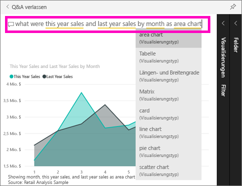

# Erste Schritte mit Power BI – Q&A

Manchmal ist die schnellste Möglichkeit, um eine Antwort auf Basis Ihrer Daten zu erhalten, eine Frage in natürlicher Sprache zu stellen.  In diesem Schnellstart lernen Sie zwei verschiedenen Methoden zum Erstellen der gleichen Visualisierung kennen: in einem Bericht und mithilfe einer Frage mit Q&A. Wir verwenden den Power BI-Dienst, der Vorgang ist jedoch mit Power BI Desktop fast der gleiche.

Zum Durchführen der Schritte müssen Sie einen Bericht verwenden, den Sie bearbeiten können. Deshalb verwenden wir eines der für Power BI verfügbaren Beispiele.

## Erstellen eines Visuals im Berichts-Editor

1. Wählen Sie in dem Power BI-Arbeitsbereich **Daten abrufen** \> **Besipiele** \> **Analysebeispiel für den Einzelhandel**  >  **Verbinden** aus.
   
2. Das Dashboard enthält eine Kachel mit Flächendiagramm für „Verkäufe im Vorjahr und Verkäufe im laufenden Jahr“.  Wählen Sie die Kachel. Wenn diese Kachel mit F&A erstellt wurde, wird die Kachel durch Auswählen von F&A geöffnet. Diese Kachel wurde jedoch in einem Bericht erstellt, sodass der Bericht die Seite öffnet, die die Visualisierung enthält.

    

1. Öffnen Sie den Bericht in der Bearbeitungsansicht, indem Sie **Bericht bearbeiten**auswählen.  Wenn Sie nicht der Besitzer eines Berichts sind, steht Ihnen die Option zum Öffnen des Berichts in der Bearbeitungsansicht nicht zur Verfügung.
   
    
4. Wählen Sie das Flächendiagramm und überprüfen Sie die Einstellungen im Bereich **Felder** .  Der Berichtersteller hat dieses Diagramm durch Auswahl dieser drei Werte (**Time > FiscalMonth**, **Sales > This Year Sales**, **Sales > Last Year Sales > Wert**) und durch Anordnen dieser Werte in den Bereichen **Achse** und **Werte** erstellt.
   
    

## Erstellen des gleichen Visuals mit Q&A

Wie gehen wir beim Erstellen des gleichen Liniendiagramms mithilfe von F&A vor?

1. Navigieren Sie zurück zum Dashboard des Analysebeispiels für den Einzelhandel.
2. Geben Sie in natürlicher Sprache etwa die folgende Frage in das Fragefeld ein:
   
   **Wie sieht der Umsatz in diesem und im letzten Jahr nach Monat als Flächendiagramm aus?**
   
   Wenn Sie eine Frage eingeben, wählt Q&A die optimale Visualisierung, um Ihre Antwort anzuzeigen. Wenn Sie die Frage ändern, wird die Visualisierung dynamisch angepasst. Darüber hinaus hilft Ihnen Q&A dabei, Ihre Frage mit Vorschlägen, automatischer Vervollständigung und Rechtschreibkorrekturen zu formatieren.
   
   Wenn Sie Ihre Frage eingegeben haben, ist das Ergebnis genau dasselbe Diagramm, das wir im Bericht gesehen haben.  Auf diese Weise funktioniert die Erstellung aber viel schneller!
   
   
3. In Q&A haben Sie, wie bei der Arbeit mit Berichten auch, Zugriff auf die Bereiche „Visualisierungen“, „Filter“ und „Felder“.  Öffnen Sie diese Bereiche, um Ihre Visualisierung weiter zu verbessern und zu ändern.
4. Um das Diagramm an Ihr Dashboard anzuheften, wählen Sie das Anheftsymbol. .

## Nächste Schritte
[Q&A in Power BI](consumer/end-user-q-and-a.md)

[Optimieren Ihrer Daten für Q&A in Power BI](service-prepare-data-for-q-and-a.md)

Weitere Fragen? [Wenden Sie sich an die Power BI-Community](http://community.powerbi.com/)

