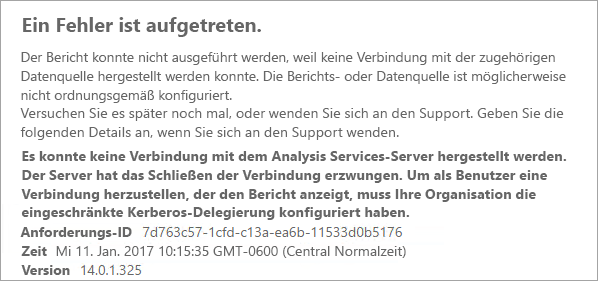
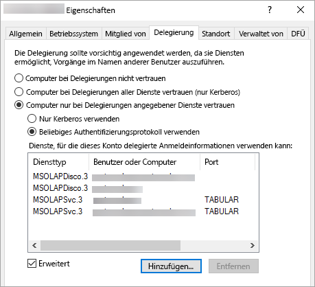

# <a name="configure-kerberos-to-use-power-bi-reports"></a>Konfigurieren der Kerberos-Authentifizierung zur Verwendung von Power BI-Berichten
<iframe width="640" height="360" src="https://www.youtube.com/embed/vCH8Fa3OpQ0?showinfo=0" frameborder="0" allowfullscreen></iframe>

Erfahren Sie, wie Ihren Berichtsserver in einer verteilten Umgebung für die Kerberos-Authentifizierung bei Datenquellen konfigurieren, die in Power BI-Berichten verwendet werden.

Power BI-Berichtsserver bietet die Möglichkeit zum Hosten von Power BI-Berichten. Ihr Berichtsserver unterstützt eine Vielzahl von Datenquellen. Der Schwerpunkt dieses Artikels liegt auf SQL Server Analysis Services. Sie können die hier beschriebenen Konzepte aber auch auf andere Datenquellen wie SQL Server anwenden.

Sie können Power BI-Berichtsserver, SQL Server und Analysis Services auf einem Computer installieren. Alles sollte ohne zusätzliche Konfiguration funktionieren. Diese Konfiguration eignet sich hervorragend für eine Testumgebung. Es können Fehler auftreten, wenn Sie diese Dienste auf verschiedenen Computern installiert haben, also in einer sog. verteilten Umgebung. In dieser Umgebung müssen Sie die Kerberos-Authentifizierung verwenden. Um diese zu implementieren, muss eine Konfiguration erfolgen. 

Insbesondere müssen Sie die eingeschränkte Delegierung konfigurieren. Möglicherweise ist Kerberos in Ihrer Umgebung konfiguriert, aber ggf. nicht für die eingeschränkte Delegierung.

## <a name="error-running-report"></a>Fehler bei der Berichtsausführung
Wenn Ihr Berichtsserver nicht ordnungsgemäß konfiguriert ist, wird möglicherweise der folgende Fehler angezeigt.

    Something went wrong.

    We couldn’t run the report because we couldn’t connect to its data source. The report or data source might not be configured correctly. 

In den technischen Details finden Sie die folgende Meldung.

    We couldn’t connect to the Analysis Services server. The server forcibly closed the connection. To connect as the user viewing the report, your organization must have configured Kerberos constrained delegation.



## <a name="configuring-kerberos-constrained-delegation"></a>Konfigurieren der eingeschränkten Kerberos-Delegierung
Es gibt mehrere Elemente, die konfiguriert werden müssen, damit die eingeschränkte Kerberos-Delegierung funktioniert. Dazu zählen Dienstprinzipalnamen (Service Principal Names, SPNs) und Delegierungseinstellungen für Dienstkonten.

> [!NOTE]
> Um SPNs und Delegierungseinstellungen konfigurieren zu können, müssen Sie ein Domänenadministrator sein.
> 
> 

Sie müssen Folgendes konfigurieren bzw. überprüfen.

1. Authentifizierungstyp in der Berichtsserverkonfiguration.
2. SPNs für das Dienstkonto des Berichtsservers.
3. SPNs für den SQL Analysis Services-Dienst.
4. SPNs für den SQL Server-Browserdienst auf dem Analysis Services-Computer. Dies gilt für nur benannte Instanzen.
5. Delegierungseinstellungen für das Dienstkonto des Berichtsservers.

## <a name="authentication-type-within-report-server-configuration"></a>Authentifizierungstyp in der Berichtsserverkonfiguration
Wir müssen den Authentifizierungstyp für den Berichtsserver konfigurieren, um die eingeschränkte Kerberos-Delegierung zuzulassen. Dies erfolgt in der Datei **rsreportserver.config**. Der Standardspeicherort dieser Datei ist `C:\Program Files\Microsoft Power BI Report Server\PBIRS\ReportServer`.

Wechseln Sie in der Datei „rsreportserver.config“ zum Abschnitt **Authentication/AuthenticationTypes**.

Wir möchten sicherstellen, dass „RSWindowsNegotiate“ in der Liste der Authentifizierungstypen als Erstes aufgeführt ist. Die Ansicht sollte ungefähr wie folgt aussehen.

```
<AuthenticationTypes>
    <RSWindowsNegotiate/>
    <RSWindowsNTLM/>
</AuthenticationTypes>
```

Wenn Sie die Konfigurationsdatei ändern mussten, müssen Sie den Berichtsserver beenden und neu starten, damit die Änderungen wirksam werden.

Weitere Informationen finden Sie unter [Konfigurieren der Windows-Authentifizierung für den Berichtsserver](https://docs.microsoft.com/sql/reporting-services/security/configure-windows-authentication-on-the-report-server).

## <a name="spns-for-the-report-server-service-account"></a>SPNs für das Dienstkonto des Berichtsservers
Als Nächstes müssen wir sicherstellen, dass der Berichtsserver über gültige SPNs verfügt. Dies basiert auf dem Dienstkonto, das für den Berichtsserver konfiguriert ist.

### <a name="virtual-service-account-or-network-service"></a>Virtuelles Dienstkonto oder Netzwerkdienst
Wenn der Berichtsserver für das virtuelle Dienstkonto oder das Konto „Netzwerkdienst“ konfiguriert ist, müssen Sie nichts tun. Diese befinden sich im Kontext des Computerkontos. Das Computerkonto weist standardmäßig SPNs des Typs HOST auf. Diese decken den HTTP-Dienst ab und werden vom Berichtsserver verwendet.

Wenn Sie einen virtuellen Servernamen verwenden, der nicht mit dem Computerkonto identisch ist, ist die Abdeckung durch die HOST-Einträge nicht ausreichend, weshalb Sie die SPNs für den Hostnamen des virtuellen Servers manuell hinzufügen müssen.

### <a name="domain-user-account"></a>Domänenbenutzerkonto
Wenn der Berichtsserver für das Verwenden eines Domänenbenutzerkontos konfiguriert ist, müssen Sie SPNs des Typs HTTP für dieses Konto manuell erstellen. Hierzu können Sie das Tool SetSPN im Funktionsumfang von Windows verwenden.

> [!NOTE]
> Sie benötigen Domänenadministratorrechte, um den SPN zu erstellen.
> 
> 

Es wird empfohlen, zwei SPNs zu erstellen. Einen mit dem NetBIOS-Namen und den anderen mit dem vollqualifizierten Domänennamen (FQDN). Der SPN hat folgendes Format.

    <Service>/<Host>:<port>

Power BI-Berichtsserver nutzt den Dienst „HTTP“. Für HTTP-SPNs listen Sie keinen Port auf. Der Dienst, an dem wir hier interessiert sind, ist HTTP. Der Host des SPN ist der Name, den Sie auch in einer URL verwenden. In der Regel ist dies der Computername. Wenn Sie sich hinter einem Lastenausgleich befinden, ist dies möglicherweise ein virtueller Name.

> [!NOTE]
> Sie können die URL überprüfen, indem Sie sich entweder ansehen, was Sie in die Adressleiste des Browsers eingeben, oder im Webportal auf der Registerkarte „URL“ einen Blick auf den Berichtsserver-Konfigurations-Manager werfen.
> 
> 

Wenn der Computername „ContosoRS“ lautet, werden folgende SPNs benötigt.

| Typ des SPN | SPN |
| --- | --- |
| Vollqualifizierter Domänennamen (FQDN) |HTTP/ContosoRS.contoso.com |
| NetBIOS |HTTP/ContosoRS |

### <a name="location-of-spn"></a>Angabe des SPN
Wofür geben Sie also den SPN an? Der SPN wird für das angegeben, was Sie als Dienstkonto verwenden. Wenn Sie „Virtuelles Dienstkonto“ oder „Netzwerkdienst“ verwenden, ist dies das Computerkonto. Wie bereits erwähnt, ist dies nur für eine virtuelle URL erforderlich. Wenn ein Domänenbenutzer das Dienstkonto des Berichtsservers verwendet wird, geben Sie den SPN für dieses Domänenbenutzerkonto an.

Wenn wir beispielsweise das Konto „Netzwerkdienst“ verwenden und der Computername „ContosoRS“ lautet, geben wir den SPN für „ContosoRS“ an.

Wenn wir das Domänenbenutzerkonto „RSService“ verwenden, geben wir den SPN für „RSService“ an.

### <a name="using-setspn-to-add-the-spn"></a>Verwenden von SetSPN zum Hinzufügen des SPN
Mit dem Tool SetSPN können wir den SPN hinzuzufügen. Wir befolgen das gleiche Beispiel wie oben mit dem Computerkonto und Domänenbenutzerkonto.

Das Angeben des SPN für ein Computerkonto, für sowohl den FQDN- als auch den NetBIOS-SPN, würde etwa wie folgt aussehen, wenn wir die virtuelle URL „contosoreports“ verwenden.

      Setspn -a HTTP/contosoreports.contoso.com ContosoRS
      Setspn -a HTTP/contosoreports ContosoRS

Das Angeben des SPN für ein Domänenbenutzerkonto (sowohl für den FQDN- als auch den NetBIOS-SPN) sieht wie in der folgenden Abbildung aus, wenn Sie den Computernamen als Host des SPN verwenden.

      Setspn -a HTTP/ContosoRS.contoso.com RSService
      Setspn -a HTTP/ContosoRS RSService

## <a name="spns-for-the-analysis-services-service"></a>SPNs für den SQL Analysis Services-Dienst
Die SPNs für Analysis Services sind ähnlich wie für Power BI-Berichtsserver. Das Format des SPN ist ein wenig anders, wenn Sie über eine benannte Instanz verfügen.

Für Analysis Services verwenden wir den Dienst „MSOLAPSvc.3“. Wir geben den Instanznamen für den Port des SPN an. Der Hostteil des SPN ist entweder der Computername oder virtuelle Name des Clusters.

Es folgt ein Beispiel eines SPN für Analysis Services.

| Typ | Format |
| --- | --- |
| Standardinstanz |MSOLAPSvc.3/ContosoAS.contoso.com<br>MSOLAPSvc.3/ContosoAS |
| Benannte Instanz |MSOLAPSvc.3/ContosoAS.contoso.com:INSTANCENAME<br>MSOLAPSvc.3/ContosoAS:INSTANCENAME |

Die Angabe des SPN ähnelt auch der Vorgehensweise bei Power BI-Berichtsserver. Sie basiert auf dem Dienstkonto.  Wenn Sie „Lokales System“ oder „Netzwerkdienst“ verwenden, befinden Sie sich im Kontext des Computerkontos. Wenn ein Domänenbenutzer für die Analysis Services-Instanz verwendet wird, geben Sie den SPN für dieses Domänenbenutzerkonto an.

### <a name="using-setspn-to-add-the-spn"></a>Verwenden von SetSPN zum Hinzufügen des SPN
Mit dem Tool SetSPN können wir den SPN hinzuzufügen. In diesem Beispiel lautet der Computername „ContosoAS“.

Das Angeben des SPN für ein Computerkonto, für sowohl den FQDN- als auch den NetBIOS-SPN, würde etwa wie folgt aussehen.

    Setspn -a MSOLAPSvc.3/ContosoAS.contoso.com ContosoAS
    Setspn -a MSOLAPSvc.3/ContosoAS ContosoAS

Das Angeben des SPN für ein Domänenbenutzerkonto (sowohl für den FQDN- als auch den NetBIOS-SPN) würde etwa wie folgt aussehen.

    Setspn -a MSOLAPSvc.3/ContosoAS.contoso.com OLAPService
    Setspn -a MSOLAPSvc.3/ContosoAS OLAPService

## <a name="spns-for-the-sql-browser-service"></a>SPN für den SQL Server-Browserdienst
Wenn Sie eine benannte Analysis Services-Instanz haben, benötigen Sie auch einen SPN für den SQL Server-Browserdienst. Dies gilt nur für Analysis Services.

Die SPNs für den SQL Server-Browserdienst sind ähnlich wie für Power BI-Berichtsserver.

Für den SQL Server-Browserdienst verwenden wir den Dienst „MSOLAPDisco.3“. Wir geben den Instanznamen für den Port des SPN an. Der Hostteil des SPN ist entweder der Computername oder virtuelle Name des Clusters.
Sie müssen nichts für den Instanznamen oder Port angeben.

Es folgt ein Beispiel eines SPN für Analysis Services.

    MSOLAPDisco.3/ContosoAS.contoso.com
    MSOLAPDisco.3/ContosoAS

Die Angabe des SPN ähnelt auch der Vorgehensweise bei Power BI-Berichtsserver. Der Unterschied besteht darin, dass SQL Server-Browserdienst immer unter dem Konto „Lokales System“ ausgeführt wird. Dies bedeutet, dass die SPNs stets für das Computerkonto angegeben werden. 

### <a name="using-setspn-to-add-the-spn"></a>Verwenden von SetSPN zum Hinzufügen des SPN
Mit dem Tool SetSPN können wir den SPN hinzuzufügen. In diesem Beispiel lautet der Computername „ContosoAS“.

Das Angeben des SPN für das Computerkonto, für sowohl den FQDN- als auch den NetBIOS-SPN, würde etwa wie folgt aussehen.

    Setspn -a MSOLAPDisco.3/ContosoAS.contoso.com ContosoAS
    Setspn -a MSOLAPDisco.3/ContosoAS ContosoAS

Weitere Informationen finden Sie unter [Ein SPN für den SQL Server-Browserdienst ist erforderlich](https://support.microsoft.com/kb/950599).

## <a name="delegation-settings-on-the-report-server-service-account"></a>Delegierungseinstellungen für das Dienstkonto des Berichtsservers
Zuletzt konfigurieren wir die Delegierungseinstellungen für das Dienstkonto des Berichtsservers. Es gibt verschiedene Tools, die Sie verwenden können, um diese Schritte auszuführen. Im Rahmen dieses Dokuments bleiben wir bei Active Directory-Benutzer und -Computer.

Öffnen Sie in Active Directory-Benutzer und -Computer die Eigenschaften des Dienstkontos des Berichtsservers. Dies ist entweder das Computerkonto (bei Verwenden von „Virtuelles Dienstkonto“ oder „Netzwerkdienst“) oder ein Domänenbenutzerkonto.

Wir konfigurieren die eingeschränkte Delegierung mit Protokollübertragung. Bei der eingeschränkten Delegierung müssen Sie explizit angeben, an welche Dienste die Delegierung erfolgen soll. Wir fügen sowohl den SPN des Analysis Services-Diensts als auch den SPN des SQL Server-Browserdiensts der Liste hinzu, an die Power BI-Berichtsserver delegieren kann.

1. Klicken Sie mit der rechten Maustaste auf das Dienstkonto des Berichtsservers, und wählen Sie **Eigenschaften** aus.
2. Wählen Sie die Registerkarte **Delegierung** aus.
3. Wählen Sie **Computer nur bei Delegierungen angegebener Dienste vertrauen** aus.
4. Wählen Sie dann **Beliebiges Authentifizierungsprotokoll verwenden** aus.
5. Klicken Sie unter der **Dienste, für die dieses Konto delegierte Anmeldeinformationen verwenden kann** auf **Hinzufügen**.
6. Wählen Sie im Dialogfeld „Neu“ **Benutzer oder Computer** aus.
7. Geben Sie das Dienstkonto für den Analysis Services-Dienst ein, und klicken Sie auf **OK**.
8. Wählen Sie den SPN aus, den Sie erstellt haben. Er beginnt mit `MSOLAPSvc.3`. Wenn Sie den FQDN- und den NetBIOS-SPN hinzugefügt haben, werden beide ausgewählt. Ggf. wird nur einer angezeigt.
9. Klicken Sie auf **OK**.  Der SPN sollte jetzt in der Liste angezeigt werden.
10. Wahlweise können Sie **Erweitert** auswählen, um den FQDN- und den NetBIOS-SPN in der Liste anzuzeigen.
11. Klicken Sie erneut auf **Hinzufügen**. Nun wird der SPN des SQL Server-Browserdiensts hinzugefügt.
12. Wählen Sie im Dialogfeld „Neu“ **Benutzer oder Computer** aus.
13. Geben Sie den Computernamen des Computers ein, auf dem sich der SQL Server-Browserdienst befindet, und klicken Sie auf **OK**.
14. Wählen Sie den SPN aus, den Sie erstellt haben. Er beginnt mit `MSOLAPDisco.3`. Wenn Sie den FQDN- und den NetBIOS-SPN hinzugefügt haben, werden beide ausgewählt. Ggf. wird nur einer angezeigt.
15. Klicken Sie auf **OK**. Das Dialogfeld sollte ähnlich wie das folgende aussehen, wenn Sie **Erweitert** aktiviert haben.
    
    
16. Klicken Sie auf **OK**.
17. Starten Sie Power BI-Berichtsserver neu.

## <a name="running-a-power-bi-report"></a>Ausführen eines Power BI-Berichts
Sobald die zuvor beschriebene Konfiguration vorhanden ist, sollte Ihr Bericht ordnungsgemäß angezeigt werden. 


Wenngleich diese Konfiguration in den meisten Fällen funktionieren sollte, kann für die Kerberos-Authentifizierung abhängig von Ihrer Umgebung eine andere Konfiguration nötig sein. Wenn der Bericht nicht geladen wird, sollten Sie den Domänenadministrator bitten, dies zu untersuchen, oder sich an den Support wenden.

## <a name="next-steps"></a>Nächste Schritte
[Administratorhandbuch](admin-handbook-overview.md)  
[Installieren von Power BI-Berichtsserver](install-report-server.md)  

Weitere Fragen? [Stellen Sie Ihre Frage in der Power BI-Community.](https://community.powerbi.com/)

