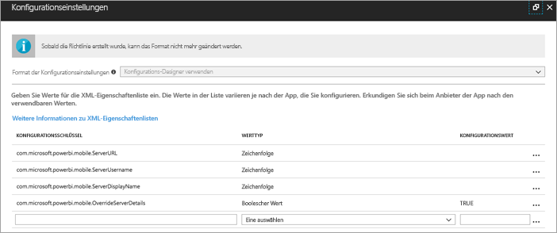
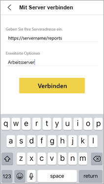

# Remotekonfiguration des Zugriffs der mobilen Power BI-App für iOS auf Berichtsserver

In diesem Artikel erfahren Sie, wie Sie das MDM-Tool Ihrer Organisation verwenden, um den Zugriff für mobile Power BI-App für iOS auf Berichtsserver zu konfigurieren. Für die Einrichtung erstellen IT-Administratoren eine Richtlinie für die App-Konfiguration mit den erforderlichen Informationen, die per Push an die App weitergeleitet werden sollen. 

 Anschließend können Benutzer der mobilen iOS-App für Power BI einfacher eine Verbindung mit dem Berichtsserver ihrer Organisation herstellen, da die Berichtsserververbindung bereits konfiguriert ist. 

## Erstellen der Richtlinie für die App-Konfiguration im MDM-Tool 

Dies sind die Schritte, die Sie als Administrator in Microsoft Intune befolgen, um die Richtlinie für die App-Konfiguration zu erstellen. Die Schritte und Erfahrungen beim Erstellen der Richtlinie für die App-Konfiguration unterscheiden sich womöglich in anderen MDM-Tools. 

1. Verbinden Sie Ihr MDM-Tool. 
2. Erstellen Sie einen Namen und eine neue Richtlinie für die App-Konfiguration. 
3. Wählen Sie aus, an welchen Benutzer diese Richtlinie für die App-Konfiguration verteilt wird. 
4. Erstellen Sie Schlüssel-Wert-Paare. 

In der folgenden Tabelle sind die Paare aufgeführt.

|Schlüssel  |Typ  |Beschreibung  |
|---------|---------|---------|
| com.microsoft.powerbi.mobile.ServerURL | Zeichenfolge | Berichtsserver-URL   Muss mit http/https beginnen |
| com.microsoft.powerbi.mobile.ServerUsername | Zeichenfolge | [Optional]   Der Benutzername, der zum Verbinden des Servers verwendet wird.   Wenn keiner vorhanden ist, fordert die App den Benutzer auf, den Benutzernamen für die Verbindung einzugeben.| 
| com.microsoft.powerbi.mobile.ServerDisplayName | Zeichenfolge | [Optional]   Der Standardwert ist „Berichtsserver“.   Ein Anzeigename, der in der App zur Darstellung des Servers verwendet wird | 
| com.microsoft.powerbi.mobile.OverrideServerDetails | Boolesch | Der Standardwert ist TRUE   Wenn der Standardwert auf TRUE festgelegt ist, wird jede Berichtsserverdefinition, die sich bereits auf dem mobilen Gerät befindet, außer Kraft gesetzt (vorhandene Server, die bereits konfiguriert sind, werden gelöscht).   Wenn die Außerkraftsetzung auf TRUE festgelegt ist, wird dadurch auch verhindert, dass der Benutzer diese Konfiguration entfernt.   Bei FALSE werden die mithilfe von Push übertragenen Werte hinzugefügt, und vorhandene Einstellungen werden beibehalten.   Wenn die gleiche Server-URL bereits in der mobilen App konfiguriert ist, behält die App diese Konfiguration bei und fordert den Benutzer nicht auf, sich neu für denselben Server zu authentifizieren. |

Unten sehen Sie ein Beispiel der Festlegung der Konfigurationsrichtlinie über Intune.

## Endbenutzer, die eine Verbindung mit einem Berichtsserver herstellen

Nachdem Sie die Richtlinie für die App-Konfiguration veröffentlicht haben, verfügen Benutzer und Geräte, die der Verteilungsliste angehören, die für diese Richtline definiert wurde, über die folgende Benutzeroberfläche, wenn die mobile Power BI-App für iOS gestartet wird. 

1. Den Benutzern wird eine Meldung angezeigt, die besagt, dass ihre mobile App mit einem Berichtsserver konfiguriert ist. Der Benutzer tippt dann auf **Anmelden**.

    

2.  Auf der Seite **Mit Server verbinden** sind die Berichtsserverdetails bereits ausgefüllt. Die Benutzer müssen auf **Verbinden** tippen.

    

3. Zur Authentifizierung müssen Benutzer ein Kennwort eingeben und anschließend auf **Anmelden** tippen. 

    

Sie können nun KPIs und Power BI-Berichte, die auf dem Berichtsserver gespeichert sind, anzeigen und mit diesen interagieren.

## Nächste Schritte
[Administratorübersicht](admin-handbook-overview.md)  
[Installieren von Power BI-Berichtsserver](install-report-server.md)  

Weitere Fragen? [Stellen Sie Ihre Frage in der Power BI-Community.](https://community.powerbi.com/)

