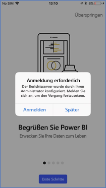

# Remotekonfiguration des Zugriffs der mobilen Power BI-App für iOS auf Berichtsserver

In diesem Artikel erfahren Sie, wie Sie das MDM-Tool Ihrer Organisation verwenden, um den Zugriff für mobile Power BI-App für iOS auf Berichtsserver zu konfigurieren. IT-Administratoren erstellen für die Konfiguration eine Richtlinie für die App-Konfiguration mit den erforderlichen Informationen, die per Push an die App weitergeleitet werden sollen. 

 Wenn die Berichtsserververbindung bereits konfiguriert ist, können Benutzer der mobilen iOS-App für Power BI einfacher eine Verbindung mit dem Berichtsserver ihrer Organisation herstellen. 

## Erstellen der Richtlinie für die App-Konfiguration im MDM-Tool 

Sie als Administrator müssen in Microsoft Intune die folgenden Schritte ausführen, um die Richtlinie für die App-Konfiguration zu erstellen. Die Schritte und Erfahrungen beim Erstellen der Richtlinie für die App-Konfiguration unterscheiden sich womöglich in anderen MDM-Tools. 

1. Verbinden Sie Ihr MDM-Tool. 
2. Erstellen Sie einen Namen und eine neue Richtlinie für die App-Konfiguration. 
3. Wählen Sie aus, an welchen Benutzer diese Richtlinie für die App-Konfiguration verteilt wird. 
4. Erstellen Sie Schlüssel-Wert-Paare. 

In der folgenden Tabelle sind die Paare aufgeführt.

|Schlüssel  |Typ  |Beschreibung  |
|---------|---------|---------|
| com.microsoft.powerbi.mobile.ServerURL | Zeichenfolge | Berichtsserver-URL   Muss mit http/https beginnen |
| com.microsoft.powerbi.mobile.ServerUsername | Zeichenfolge | [Optional]   Der Benutzername, der zum Verbinden des Servers verwendet wird.   Wenn keiner vorhanden ist, fordert die App den Benutzer auf, den Benutzernamen für die Verbindung einzugeben.| 
| com.microsoft.powerbi.mobile.ServerDisplayName | Zeichenfolge | [Optional]   Der Standardwert ist „Berichtsserver“.   Ein Anzeigename, der in der App zur Darstellung des Servers verwendet wird | 
| com.microsoft.powerbi.mobile.OverrideServerDetails | Boolescher Wert | Der Standardwert ist TRUE  Wenn der Wert TRUE festgelegt ist, werden sämtliche Berichtsserverdefinitionen überschrieben, die möglicherweise bereits auf dem mobilen Gerät gespeichert sind. Alle Server, die bereits konfiguriert wurden, werden gelöscht.   Wenn die Außerkraftsetzung auf TRUE festgelegt ist, wird dadurch auch verhindert, dass der Benutzer diese Konfiguration entfernt.   Bei FALSE werden die mithilfe von Push übertragenen Werte hinzugefügt, und vorhandene Einstellungen werden beibehalten.   Wenn dieselbe Server-URL bereits in der mobilen App konfiguriert ist, werden keine Änderungen an der Konfiguration durch die App vorgenommen. Die App fordert den Benutzer nicht dazu auf, für denselben Server erneut eine Authentifizierung durchzuführen. |

Unten sehen Sie ein Beispiel der Festlegung der Konfigurationsrichtlinie über Intune.

## Endbenutzer, die eine Verbindung mit einem Berichtsserver herstellen

 Angenommen, Sie veröffentlichen die Richtlinie für die App-Konfiguration für eine Verteilerliste. Wenn dann Benutzer und Geräte, die in dieser Liste aufgeführt sind, die mobile iOS-App starten, geschieht Folgendes. 

1. Den Benutzern wird eine Meldung angezeigt, die besagt, dass ihre mobile App mit einem Berichtsserver konfiguriert ist. Der Benutzer tippt dann auf **Anmelden**.

    

2.  Auf der Seite **Mit Server verbinden** sind die Berichtsserverdetails bereits ausgefüllt. Die Benutzer müssen auf **Verbinden** tippen.

    

3. Zur Authentifizierung müssen Benutzer ein Kennwort eingeben und anschließend auf **Anmelden** tippen. 

    

Sie können nun KPIs und Power BI-Berichte, die auf dem Berichtsserver gespeichert sind, anzeigen und mit diesen interagieren.

## Nächste Schritte
[Administratorübersicht](admin-handbook-overview.md)  
[Installieren von Power BI-Berichtsserver](install-report-server.md)  

Weitere Fragen? [Stellen Sie Ihre Frage in der Power BI-Community.](https://community.powerbi.com/)

