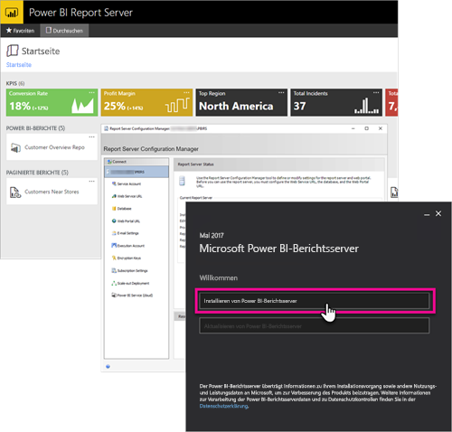

# Entwicklerhandbuch: Übersicht über Power BI-Berichtsserver

Willkommen beim Entwicklerhandbuch für Power BI-Berichtsserver, einem lokalen Speicherort zum Speichern und Verwalten Ihrer Power BI-, mobilen und paginierten Berichte.

In diesem Handbuch werden die Optionen behandelt, die Ihnen als Entwickler beim Arbeiten mit Power BI-Berichtsserver zur Verfügung stehen.

## Einbetten

Sie können jeden Bericht in Power BI-Berichtsserver innerhalb eines iFrame einbetten, indem Sie der URL den „QueryString“-Parameter `?rs:Embed=true` hinzufügen. Diese Vorgehensweise funktioniert mit Power BI-Berichten und auch anderen Berichtstypen.

### Berichts-Viewer-Steuerelement

Für paginierte Berichte können Sie das Berichts-Viewer-Steuerelement nutzen. Dadurch können Sie das Steuerelement innerhalb einer .NET-Windows oder -Webanwendung platzieren. Weitere Informationen finden Sie unter [Erste Schritte mit dem Berichts-Viewer-Steuerelement](https://docs.microsoft.com/sql/reporting-services/application-integration/integrating-reporting-services-using-reportviewer-controls-get-started).

## APIs

Sie haben mehrere API-Optionen für die Interaktion mit Power BI-Berichtsserver. Diese Vorgehensweise umfasst Folgendes:

* [REST-APIs](rest-api.md)
* [URL-Zugriff](https://docs.microsoft.com/sql/reporting-services/url-access-ssrs)
* [WMI-Anbieter](https://docs.microsoft.com/sql/reporting-services/wmi-provider-library-reference/reporting-services-wmi-provider-library-reference-ssrs)

Sie können auch die Open Source[-Hilfsprogramme für PowerShell](https://github.com/Microsoft/ReportingServicesTools) zum Verwalten Ihres Berichtsservers verwenden.

> [!NOTE]
> Die Hilfsprogramme für PowerShell unterstützen derzeit keine Power BI Desktop-Dateien (.pbix).

## Benutzerdefinierte Erweiterungen

Die Erweiterungsbibliothek umfasst verschiedene Klassen, Schnittstellen und Werttypen, die in Power BI-Berichtsserver enthalten sind. Diese Bibliothek bietet Zugriff auf Systemfunktionen und fungiert als Grundlage für die Microsoft .NET Framework-Anwendungen, mit denen Komponenten von Power BI-Berichtsserver erweitert werden können.

Es gibt mehrere Typen von Erweiterungen, die Sie erstellen können.

* Datenverarbeitungserweiterungen
* Übermittlungserweiterungen
* Renderingerweiterungen für paginierte Berichte
* Sicherheitserweiterungen

Weitere Informationen finden Sie unter [Erweiterungsbibliothek](https://docs.microsoft.com/sql/reporting-services/extensions/reporting-services-extension-library).

## Nächste Schritte

[Erste Schritte mit dem Berichts-Viewer-Steuerelement](https://docs.microsoft.com/sql/reporting-services/application-integration/integrating-reporting-services-using-reportviewer-controls-get-started)  
[Erstellen von Anwendungen mit dem Webdienst und .NET Framework](https://docs.microsoft.com/sql/reporting-services/report-server-web-service/net-framework/building-applications-using-the-web-service-and-the-net-framework)  
[URL-Zugriff](https://docs.microsoft.com/sql/reporting-services/url-access-ssrs)  
[Erweiterungsbibliothek](https://docs.microsoft.com/sql/reporting-services/extensions/reporting-services-extension-library)  
[WMI-Anbieter](https://docs.microsoft.com/sql/reporting-services/wmi-provider-library-reference/reporting-services-wmi-provider-library-reference-ssrs)

Weitere Fragen? [Stellen Sie Ihre Frage in der Power BI-Community.](https://community.powerbi.com/)