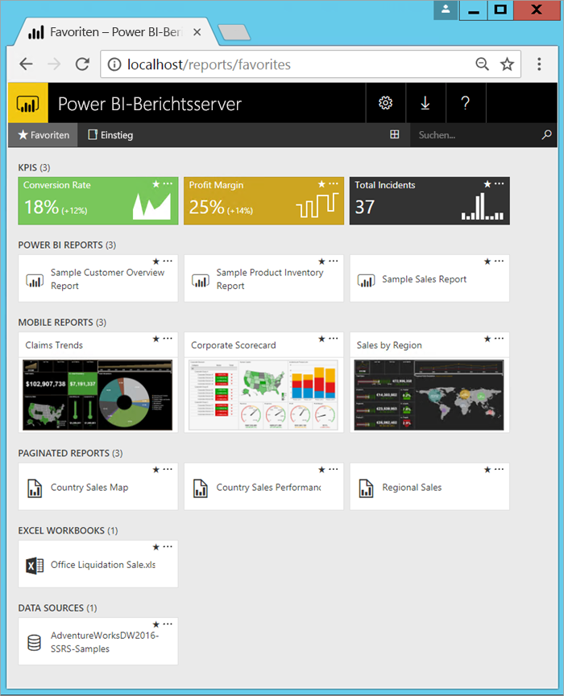

# Was ist der Power BI-Berichtsserver?

Der Power BI-Berichtsserver ist ein lokaler Berichtsserver mit einem Webportal, in dem Sie Berichte und KPIs anzeigen und verwalten, zusammen mit den Tools zum Erstellen von Power BI-Berichten, paginierten Berichten, mobilen Berichten und KPIs. Ihre Benutzer können auf unterschiedliche Weise auf diese Berichte zugreifen: Anzeige in einem Webbrowser bzw. auf einem mobilen Gerät oder als E-Mail in ihrem Posteingang.

## Vergleichen im Power BI-Berichtsserver 
Zwischen dem Power BI-Berichtsserver sowie SQL Server Reporting Services und Power BI-Onlinedienst gibt es Parallelen. Wie der Power BI-Dienst hostet der Power BI-Berichtsserver Power BI-Berichte (PBIX) und Excel-Dateien. Wie Reporting Services ist der Power BI-Berichtsserver lokal und hostet paginierte Berichte (RDL). Der Power BI-Berichtsserver ist eine Obermenge von Reporting Services: Alle Aufgaben, die Sie in Reporting Services durchführen können, und mehr können Sie mit dem Power BI-Berichtsserver durchführen, und darüber hinaus werden Power BI-Berichte unterstützt. Weitere Informationen finden Sie unter [Vergleich zwischen Power BI-Berichtsserver und Power BI-Dienst](compare-report-server-service.md).

## Lizenzieren des Power BI-Berichtsservers
Der Power BI-Berichtsserver ist über zwei verschiedene Lizenzen verfügbar: [Power BI Premium](../service-premium.md) und [SQL Server Enterprise Edition](https://www.microsoft.com/sql-server/sql-server-2017-editions) mit Software Assurance. Mit einer Power BI Premium-Lizenz können Sie eine hybride, gemischte Cloud/Lokal-Bereitstellung erstellen.  

> [!NOTE]
> Für Power BI Premium ist der Power BI-Berichtsserver nur mit P SKUs enthalten. Er ist nicht mit EM SKUs verfügbar.

## Webportal
Der Einstiegspunkt für den Power BI-Berichtsserver ist ein sicheres Webportal, das Sie in allen modernen Browsern anzeigen können. Hier können Sie auf alle Ihre Berichte und KPIs zugreifen. Der Inhalt des Webportals ist in einer herkömmlichen Ordnerhierarchie angeordnet. In Ihren Ordnern ist der Inhalt nach Typ gruppiert: Power BI-Berichte, mobile Berichte, paginierte Berichte, KPIs sowie Excel-Arbeitsmappen plus freigegebene Datasets und freigegebene Datenquellen, die als Bausteine für Ihre Berichte dienen. Sie können Favoriten markieren, um sie in einem einzelnen Ordner anzuzeigen. Und auch KPIs können Sie direkt im Webportal erstellen. 

Abhängig von Ihren Berechtigungen können Sie den Inhalt im Webportal verwalten. Sie können die Berichtsverarbeitung planen, bedarfsgesteuert auf Berichte zugreifen und veröffentlichte Berichte abonnieren. Sie können auch Ihr benutzerdefiniertes [Branding](https://docs.microsoft.com/sql/reporting-services/branding-the-web-portal) auf das Webportal anwenden. 

Weitere Informationen zum [Webportal (einheitlicher SSRS-Modus)](https://docs.microsoft.com/sql/reporting-services/web-portal-ssrs-native-mode).

## Power BI-Berichte
Sie erstellen Power BI-Berichte (PBIX) mit der für den Berichtsserver optimierten Version von Power BI Desktop. Anschließend veröffentlichen Sie sie und zeigen sie im Webportal in Ihrer Umgebung an.

Ein Power BI-Bericht stellt eine Ansicht eines Datenmodells aus verschiedenen Perspektiven dar, wobei die aus dem Datenmodell gewonnenen verschiedenen Ergebnisse und Erkenntnisse als Visualisierungen angezeigt werden.  Ein Bericht kann eine einzelne Visualisierung, aber auch mehrere mit Visualisierungen gefüllte Seiten enthalten. Je nach Ihrer Rolle können Sie Berichte lesen und durchsuchen oder sie für andere Benutzer erstellen.

Installieren Sie den [optimierten Power BI Desktop für den Power BI-Berichtsserver](quickstart-create-powerbi-report.md).

## Paginierte Berichte
Paginierte Berichte (RDL) sind Berichte im Dokumentstil mit Visualisierungen, in denen Tabellen horizontal und vertikal erweitert werden, um alle darin enthaltenen Daten anzuzeigen, nach Bedarf von Seite zu Seite. Dieses Format ist ideal zum Generieren zu druckender Dokumente mit festem Layout und perfektem Aussehen, wie z.B. PDF- und Word-Dateien.

Sie können mit dem [Berichts-Generator](https://docs.microsoft.com/sql/reporting-services/report-builder/report-builder-in-sql-server-2016) oder Berichts-Designer in [SQL Server Data Tools (SSDT)](https://docs.microsoft.com/sql/reporting-services/tools/reporting-services-in-sql-server-data-tools-ssdt) modern aussehende Berichte erstellen.

## Mobile Reporting Services-Berichte
Mobile Berichte stellen eine Verbindung mit lokalen Daten her und haben ein dynamisches Layout, das sich an verschiedene Geräte und die verschiedenen Möglichkeiten anpasst, diese zu halten. Sie erstellen Sie mit dem Publisher für mobile Berichte von Microsoft SQL Server.

Weitere Informationen zu [Mobile Reporting Services-Berichte](https://docs.microsoft.com/sql/reporting-services/mobile-reports/create-mobile-reports-with-sql-server-mobile-report-publisher). 

## Berichtsserver-Programmierfeatures
Nutzen Sie Programmierfeatures des Power BI-Berichtsservers zum Erweitern und Anpassen Ihrer Berichterstellungsfunktionen mithilfe von APIs für das Integrieren oder Erweitern der Daten- und Berichtsverarbeitung in benutzerdefinierten Anwendungen.

Weitere [Entwicklerdokumentation für Berichtsserver](https://docs.microsoft.com/sql/reporting-services/reporting-services-developer-documentation).

## Nächste Schritte
[Installieren von Power BI-Berichtsserver](install-report-server.md)  
[Herunterladen des Berichts-Generators](https://www.microsoft.com/download/details.aspx?id=53613)  

Weitere Fragen? [Stellen Sie Ihre Frage in der Power BI-Community.](https://community.powerbi.com/)

