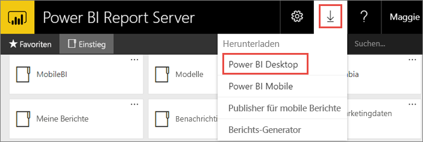
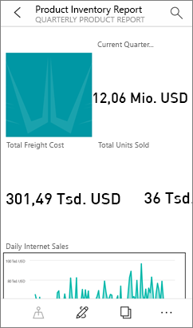

# Installieren von für Power BI-Berichtsserver optimiertem Power BI Desktop
Erfahren Sie mehr zum Installieren von für Power BI-Berichtsserver optimiertem Power BI Desktop.

Damit Sie Power BI-Berichte für Power BI-Berichtsserver erstellen können, müssen Sie die für Power BI-Berichtsserver optimierte Power BI Desktop-Version herunterladen und installieren. Diese Version unterscheidet sich von der Power BI Desktop-Version, die mit dem Power BI-Dienst verwendet wird. Beispielsweise enthält die Power BI Desktop-Version für den Power BI-Dienst Vorschaufeatures, die erst nach der Veröffentlichung in der Version für den Power BI-Berichtsserver verfügbar sind. Sie müssen diese Version verwenden, um sicherzustellen, dass der Berichtsserver mit einer bekannten Version der Berichte und des Modells interagieren kann. 

Power BI Desktop und das für Power BI-Berichtsserver optimierte Power BI Desktop können glücklicherweise parallel auf dem gleichen Computer installiert werden.

## Herunterladen und Installieren von Power BI Desktop

Die einfachste Möglichkeit, um sicherzustellen, dass Sie die aktuelle Version des für Power BI-Berichtsserver optimiertem Power BI Desktop verwenden, besteht darin, zunächst das Webportal des Berichtsservers aufzurufen.

1. Wählen Sie im Report Server Web-Portal die **herunterladen** Pfeil > **Power BI Desktop**.

    

    Sie können auch direkt [Microsoft Power BI Desktop](https://www.microsoft.com/en-us/download/details.aspx?id=57271) (optimiert für Power BI-Berichtsserver, August 2018) im Microsoft Download Center aufrufen.

2. Wählen Sie im Download Center **Download** aus.

3. Wählen Sie abhängig von Ihrem Computer eine der folgenden Versionen aus: 

    - **PBIDesktopRS.msi** (32-Bit-Version) oder

    - **PBIDesktopRS_x64.msi** (64-Bit-Version).

1. Nachdem Sie das Installationsprogramm heruntergeladen haben, führen Sie den Setup-Assistenten für Power BI Desktop (August 2018) aus.

2. Aktivieren Sie am Ende des Installationsvorgangs **Power BI Desktop jetzt starten**.
   
    Die App wird automatisch gestartet, sodass Sie gleich loslegen können.

## Überprüfen, ob Sie die richtige Version verwenden
Sie können überprüfen, ob Sie die richtige Power BI Desktop-Version verwenden, indem Sie einen Blick auf den Startbildschirm oder die Titelleiste in Power BI Desktop werfen. In der Titelleiste werden Monat und Jahr des Releases angegeben.

Die Power BI Desktop-Version für den Power BI-Dienst gibt Monat und Jahr nicht in der Titelleiste an.

## Zuordnung der Dateinamenerweiterung
Wenn Sie Power BI Desktop und für Power BI-Berichtsserver optimiertes Power BI Desktop auf demselben Computer installiert haben, weist die letzte Installation von Power BI Desktop die Dateizuordnung zu PBIX auf. Wenn Sie nun auf eine PBIX-Datei doppelklicken, wird die Power BI Desktop-Version gestartet, die zuletzt installiert wurde.

Wenn Sie Power BI Desktop bereits installiert hatten und dann für Power BI-Berichtsserver optimiertes Power BI Desktop installiert haben, werden alle PBIX-Dateien standardmäßig in für Power BI-Berichtsserver optimiertem Power BI Desktop geöffnet. Wenn Sie möchten, dass beim Öffnen von PBIX-Dateien standardmäßig Power BI Desktop gestartet wird, müssen Sie Power BI Desktop über den Power BI-Dienst erneut installieren.

Sie können immer zuerst die Version von Power BI Desktop öffnen, die Sie verwenden möchten. Öffnen Sie anschließend die Datei in Power BI Desktop.

Zum Bearbeiten eines Power BI-Berichts in Power BI-Berichtsserver oder Erstellen eines neuen Power BI-Berichts über das Webportal wird stets die richtige Version von Power BI Desktop geöffnet.

## Überlegungen und Einschränkungen
Power BI-Berichte in Power BI-Berichtsserver und im Power BI-Dienst (http://app.powerbi.com) sowie in den mobilen Power BI-Apps funktionieren fast identisch, wobei sich einige Features aber unterscheiden.

### In einem Browser
Power BI-Berichtsserver-Berichte unterstützen alle Visualisierungen, einschließlich:

* Benutzerdefinierte Visualisierungen

Power BI-Berichtsserver-Berichte unterstützen Folgendes nicht:

* Visuelle R-Elemente
* ArcGIS-Karten
* Brotkrümel
* Vorschaufeatures für Power BI Desktop

### In den mobilen Power BI-Apps
Power BI-Berichtsserver-Berichte unterstützen alle Grundfunktionen in den [mobilen Power BI-Apps](../consumer/mobile/mobile-apps-for-mobile-devices.md), einschließlich:

* [Berichtslayout für Smartphones](../desktop-create-phone-report.md): Sie können einen Bericht für die mobilen Power BI-Apps optimieren. Auf dem Mobiltelefon sind optimierte Berichte mit einem speziellen Symbol,  gekennzeichnet, und sie weisen ein besonderes Layout auf.
  
    

Die folgenden Funktionen werden von den Power BI-Berichtsserver-Berichten in den mobilen Power BI-Apps nicht unterstützt:

* Visuelle R-Elemente
* ArcGIS-Karten
* Benutzerdefinierte Visualisierungen
* Brotkrümel
* Geofilter oder Strichcodes

## Power BI Desktop für frühere Versionen von Power BI-Berichtsserver

Wenn Sie eine frühere Version des Berichtsservers verwenden, benötigen Sie die entsprechende Version von Power BI Desktop. Die beiden früheren Versionen sind:

- Microsoft Power BI Desktop ([optimiert für Power BI-Berichtsserver, Oktober 2017](https://www.microsoft.com/download/details.aspx?id=56136))
- Microsoft Power BI Desktop ([optimiert für Power BI-Berichtsserver, Juni 2017](https://www.microsoft.com/download/details.aspx?id=55330))

## Nächste Schritte
Nachdem Sie Power BI Desktop installiert haben, können Sie mit dem Erstellen von Power BI-Berichten beginnen.

[Erstellen eines Power BI-Berichts für Power BI-Berichtsserver](quickstart-create-powerbi-report.md)  
[Was ist der Power BI-Berichtsserver?](get-started.md)

Weitere Fragen? [Stellen Sie Ihre Frage in der Power BI-Community.](https://community.powerbi.com/)

