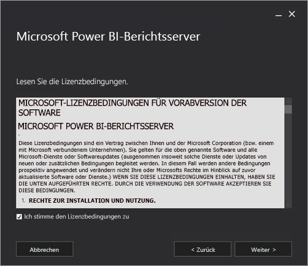
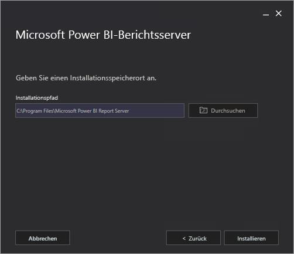
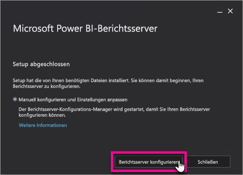
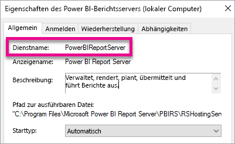

# Installieren von Power BI-Berichtsserver

Erfahren Sie, wie Power BI-Berichtsserver installiert wird.

 **Herunterladen** 

Um Power BI-Berichtsserver herunterzuladen, navigieren Sie zu [Lokale Berichterstellung mit Power BI-Berichtsserver](https://powerbi.microsoft.com/report-server/), und klicken Sie auf **Kostenlose Testversion herunterladen**. 

## Vorbereitung
Vor der Installation von Power BI-Berichtsserver wird empfohlen, dass Sie die [Hardware- und Softwareanforderungen für die Installation von Power BI-Berichtsserver](system-requirements.md) lesen.

 > [!IMPORTANT]
 > Während Sie den Power BI-Berichtsserver in einer Umgebung mit schreibgeschütztem Domänencontroller (RODC) installieren können, benötigt der Power BI-Berichtsserver Zugang zu einem Domänencontroller mit Lese-/Schreibzugriff, um wie vorgesehen zu funktionieren. Wenn der Power BI-Berichtsserver nur Zugang zu einem RODC hat, treten beim Verwalten des Diensts möglicherweise Fehlermeldungen auf.

### Product Key für den Power BI-Berichtsserver

#### Power BI Premium
Wenn Sie Power BI Premium erworben haben, haben Sie auf der Registerkarte **Premium-Einstellungen** im Power BI-Verwaltungsportal Zugriff auf den Product Key Ihres Power BI-Berichtsservers. Dieser steht nur globalen Administratoren oder Benutzern zur Verfügung, denen die Administratorrolle für den Power BI-Dienst zugewiesen wurde.

Wenn Sie auf **Power BI Report Server key** (Schlüssel für den Power BI-Berichtsserver) klicken, wird ein Dialogfeld mit Ihrem Product Key angezeigt. Diesen können Sie kopieren und bei der Installation verwenden.

#### SQL Server Enterprise Software Assurance (SA)
Wenn Sie über einen SQL Server Enterprise SA-Vertrag verfügen, können Sie Ihren Product Key im [Volume Licensing Service Center](https://www.microsoft.com/Licensing/servicecenter/) abrufen.

## Installieren eines Berichtsservers
Die Installation von Power BI-Berichtsserver selbst ist einfach. Zum Installieren der Dateien müssen nur einige Schritte ausgeführt werden.

Zum Zeitpunkt der Installation ist kein Server mit der SQL Server-Datenbank-Engine erforderlich. Sie müssen Reporting Services nach der Installation konfigurieren.

1. Bestimmen Sie den Speicherort der Datei „PowerBIReportServer.exe“, und starten Sie das Installationsprogramm.
2. Wählen Sie **Power BI-Berichtsserver installieren** aus.
   
    
3. Wählen Sie eine zu installierende Edition aus, und klicken Sie dann auf **Weiter**.
   
    
   
    Sie können im Dropdownmenü die Evaluierungs- oder die Developer-Edition auswählen.
   
    
   
    Andernfalls können Sie für den Server einen Product Key eingeben, den Sie entweder im Power BI-Dienst oder im Volume License Service Center abgerufen haben. Weitere Informationen zum Abrufen Ihres Product Keys finden Sie im Abschnitt [Vorbereitende Schritte](#before-you-begin).
4. Lesen und akzeptieren Sie die Lizenzbedingungen, und klicken Sie dann auf **Weiter**.
   
    
5. Es muss eine Datenbank-Engine zum Speichern der Berichtsserver-Datenbank zur Verfügung stehen. Klicken Sie auf **Weiter**, um nur den Berichtsserver zu installieren.
   
    
6. Geben Sie den Installationsspeicherort für den Berichtsserver an. Klicken Sie auf **Installieren**, um den Vorgang fortzusetzen.
   
    
   
    Der Standardpfad lautet „C:\Program Files\Microsoft Power BI Report Server“.

1. Wählen Sie nach erfolgreicher Installation **Berichtsserver konfigurieren** aus, um den Konfigurations-Manager für Reporting Services zu starten.
   
    

## Konfigurieren des Berichtsservers

Nach Auswahl von **Berichtsserver konfigurieren** beim Setup wird der Konfigurations-Manager für Reporting Services angezeigt. Weitere Informationen finden Sie unter [Konfigurations-Manager für Reporting Services](https://docs.microsoft.com/sql/reporting-services/install-windows/reporting-services-configuration-manager-native-mode).

Sie müssen zum Abschließen der ersten Konfiguration von Reporting Services [eine Berichtsserver-Datenbank erstellen](https://docs.microsoft.com/sql/reporting-services/install-windows/ssrs-report-server-create-a-report-server-database). Ein SQL Server-Datenbankserver ist erforderlich, um diesen Schritt abzuschließen.

### Erstellen einer Datenbank auf einem anderen Server
Wenn Sie die Berichtsserver-Datenbank auf einem Datenbankserver auf einem anderen Computer erstellen, müssen Sie das Dienstkonto für den Berichtsserver in Anmeldeinformationen ändern, die auf dem Datenbankserver erkannt werden. 

Standardmäßig verwendet der Berichtsserver das virtuelle Dienstkonto. Wenn Sie versuchen, eine Datenbank auf einem anderen Server zu erstellen, wird möglicherweise der folgenden Fehler zum Schritt „Anwenden von Verbindungsrechten“ angezeigt.

`System.Data.SqlClient.SqlException (0x80131904): Windows NT user or group '(null)' not found. Check the name again.`

Um diesen Fehler zu vermeiden, können Sie das Dienstkonto entweder in „Netzwerkdienst“ oder ein Domänenkonto ändern. Bei Ändern des Dienstkontos in „Netzwerkdienst“ gelten Rechte im Kontext des Computerkontos für den Berichtsserver.

Weitere Informationen finden Sie unter [Konfigurieren des Dienstkontos für den Berichtsserver](https://docs.microsoft.com/sql/reporting-services/install-windows/configure-the-report-server-service-account-ssrs-configuration-manager).

## Windows-Dienst
Ein Windows-Dienst wird als Teil der Installation erstellt. Dieser wird als **Power BI-Berichtsserver** angezeigt. Der Dienstname lautet **PowerBIReportServer**.

## Standardmäßige URL-Reservierungen
URL-Reservierungen bestehen aus einem Präfix, Hostnamen, Port und virtuellen Verzeichnis:

| Teil | Beschreibung |
| --- | --- |
| Präfix |Das Standardpräfix ist HTTP. Wenn Sie zuvor ein SSL-Zertifikat (Secure Sockets Layer) installiert haben, versucht Setup, URL-Reservierungen zu erstellen, die das Präfix HTTPS verwenden. |
| Hostname |Der Standardhostname ist ein Platzhalter (+). Er gibt an, dass der Berichtsserver alle HTTP-Anforderungen am vorgesehenen Port für alle Hostnamen akzeptiert, die in den Computer aufgelöst werden, einschließlich `http://<computername>/reportserver`, `http://localhost/reportserver` oder `http://<IPAddress>/reportserver.`. |
| Port |Der Standardport ist 80. Wenn Sie einen anderen Port als 80 verwenden, müssen Sie diesen explizit der URL hinzufügen, sobald Sie das Webportal in einem Browserfenster öffnen. |
| Virtuelles Verzeichnis |Standardmäßig werden virtuelle Verzeichnisse im Format „ReportServer“ für den Berichtsserver-Webdienst und „Reports“ für das Webportal erstellt. Für den Report Server-Webdienst heißt das standardmäßige virtuelle Verzeichnis **reportserver**. Für das Webportal heißt das standardmäßige virtuelle Verzeichnis **reports**. |

Ein Beispiel der vollständigen URL-Zeichenfolge kann folgendermaßen aussehen:

* `http://+:80/reportserver`: Ermöglicht den Zugriff auf den Berichtsserver.
* `http://+:80/reports`: Ermöglicht den Zugriff auf das Webportal.

## Firewall
Wenn Sie von einem Remotecomputer aus auf den Berichtsserver zugreifen möchten, stellen Sie sicher, dass Sie Firewallregeln konfiguriert haben, sofern eine Firewall vorhanden ist.

Sie müssen den TCP-Port öffnen, den Sie für Ihre Webdienst-URL und die Webportal-URL konfiguriert haben. Standardmäßig werden beide für TCP-Port 80 konfiguriert.

## Zusätzliche Konfiguration
* Informationen zum Konfigurieren der Integration in den Power BI-Dienst, damit Sie Berichtselemente an ein Power BI-Dashboard anheften können, finden Sie unter [Integrieren in den Power BI-Dienst](https://docs.microsoft.com/sql/reporting-services/install-windows/power-bi-report-server-integration-configuration-manager).
* Informationen zum Konfigurieren von E-Mail für die Abonnementverarbeitung finden Sie unter [E-Mail-Einstellungen](https://docs.microsoft.com/sql/reporting-services/install-windows/e-mail-settings-reporting-services-native-mode-configuration-manager) und [E-Mail-Übermittlung in Reporting Services](https://docs.microsoft.com/sql/reporting-services/subscriptions/e-mail-delivery-in-reporting-services).
* Informationen zum Konfigurieren des Webportals, damit Sie auf einem Berichtscomputer darauf zugreifen können, um Berichte anzuzeigen und zu verwalten, finden Sie unter [Konfigurieren einer Firewall für den Berichtsserverzugriff](https://docs.microsoft.com/sql/reporting-services/report-server/configure-a-firewall-for-report-server-access) und [Konfigurieren eines Berichtsservers für die Remoteverwaltung](https://docs.microsoft.com/sql/reporting-services/report-server/configure-a-report-server-for-remote-administration).

## Nächste Schritte
[Administratorübersicht](admin-handbook-overview.md)  
[Ermitteln des Product Key für den Berichtsserver](find-product-key.md)  
[Installieren von für Power BI-Berichtsserver optimiertem Power BI Desktop](install-powerbi-desktop.md)  
[Überprüfen einer Reporting Services-Installation](https://docs.microsoft.com/sql/reporting-services/install-windows/verify-a-reporting-services-installation)  
[Konfigurieren des Dienstkontos für den Berichtsserver](https://docs.microsoft.com/sql/reporting-services/install-windows/configure-the-report-server-service-account-ssrs-configuration-manager)  
[Konfigurieren von Berichtsserver-URLs](https://docs.microsoft.com/sql/reporting-services/install-windows/configure-report-server-urls-ssrs-configuration-manager)  
[Konfigurieren einer Verbindung mit der Berichtsserver-Datenbank](https://docs.microsoft.com/sql/reporting-services/install-windows/configure-a-report-server-database-connection-ssrs-configuration-manager)  
[Initialisieren eines Berichtsservers](https://docs.microsoft.com/sql/reporting-services/install-windows/ssrs-encryption-keys-initialize-a-report-server)  
[Konfigurieren von SSL-Verbindungen für einen Berichtsserver](https://docs.microsoft.com/sql/reporting-services/security/configure-ssl-connections-on-a-native-mode-report-server)  
[Konfigurieren von Windows-Dienstkonten und -Berechtigungen](https://docs.microsoft.com/sql/database-engine/configure-windows/configure-windows-service-accounts-and-permissions)  
[Browserunterstützung für Power BI-Berichtsserver](browser-support.md)

Weitere Fragen? [Stellen Sie Ihre Frage in der Power BI-Community.](https://community.powerbi.com/)

