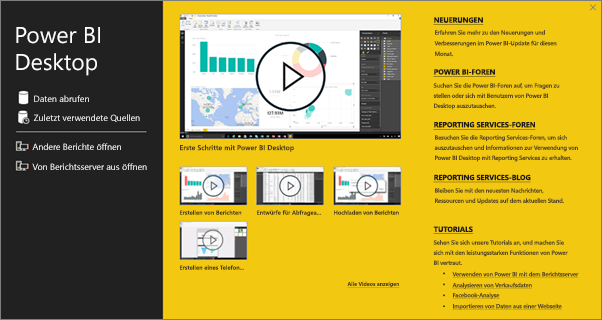

# Erstellen eines Power BI-Berichts für den Power BI-Berichtsserver
Sie können Power BI-Berichte lokal im Webportal von Power BI-Berichtsserver ebenso wie in der Cloud im Power BI-Dienst https://powerbi.com) speichern und verwalten. Sie erstellen und bearbeiten Berichte in Power BI Desktop und veröffentlichen sie im Webportal. Anschließend können Leser in Ihrer Organisation die Berichte in einem Browser oder einer mobilen Power BI-App auf einem Mobilgerät anzeigen.

Hier finden Sie vier einfache Schritte, um Ihnen den Einstieg zu erleichtern.

## Schritt 1: Installieren von für Power BI-Berichtsserver optimiertem Power BI Desktop

Wenn Sie bereits Power BI-Berichte in Power BI Desktop erstellt haben, ist das Erstellen von Power BI-Berichten für Power BI-Berichtsserver auch nicht mehr schwer. Wir empfehlen die Installation der Version von Power BI Desktop, die für Power BI-Berichtsserver optimiert ist, damit Sie sicher sein können, dass Server und App stets synchron sind. Es können beide Versionen von Power BI Desktop auf demselben Computer installiert sein.

1. Wählen Sie im Report Server Web-Portal die **herunterladen** Pfeil > **Power BI Desktop**.

    

    Sie können auch direkt [Microsoft Power BI Desktop](https://www.microsoft.com/download/details.aspx?id=57271) (optimiert für Power BI-Berichtsserver – August 2018) im Microsoft Download Center aufrufen.

2. Wählen Sie im Download Center **Download** aus.

3. Wählen Sie abhängig von Ihrem Computer eine der folgenden Versionen aus:

    - **PBIDesktopRS.msi** (32-Bit-Version) oder

    - **PBIDesktopRS_x64.msi** (64-Bit-Version).

4. Nachdem Sie das Installationsprogramm heruntergeladen haben, führen Sie den Setup-Assistenten für Power BI Desktop (August 2018) aus.

2. Aktivieren Sie am Ende des Installationsvorgangs **Power BI Desktop jetzt starten**.
   
    Die App wird automatisch gestartet, sodass Sie gleich loslegen können. Anhand des Texts „Power BI Desktop (August 2018)“ auf der Titelleiste erkennen Sie, dass Sie über die richtige Version verfügen.

    

3. Wenn Sie mit Power BI Desktop nicht vertraut sind, wird empfohlen, sich die Videos auf dem Begrüßungsbildschirm anzusehen.
   
    

## Schritt 2: Auswählen einer Datenquelle
Sie können Verbindungen mit einer Vielzahl von Datenquellen herstellen. Erfahren Sie mehr über das [Verbinden mit Datenquellen](connect-data-sources.md).

1. Klicken Sie auf dem Begrüßungsbildschirm auf **Daten abrufen**.
   
    Oder klicken Sie auf der Registerkarte **Start** auf **Daten abrufen**.
2. Wählen Sie Ihre Datenquelle (in diesem Beispiel **Analysis Services**) aus.
   
    
3. Füllen Sie **Server** und optional **Datenbank** aus. Stellen Sie sicher, dass **Live verbinden** ausgewählt ist, und klicken Sie auf **OK**.
   
    
4. Wählen Sie den Berichtsserver aus, auf dem Sie die Berichte speichern.
   
    

## Schritt 3: Entwerfen des Berichts
Hier ist Kreativität gefragt, denn Sie erstellen nun die Visuals zum Veranschaulichen Ihrer Daten.

Sie können z.B. ein Trichterdiagramm von Kunden und Gruppenwerten nach Jahreseinkommen erstellen.

1. Wählen Sie in **Visualisierungen** die Option **Trichterdiagramm** aus.
2. Ziehen Sie das zu zählende Feld in den Bereich **Werte**. Wenn es sich nicht um ein numerisches Feld handelt, wird es von Power BI Desktop automatisch als *Anzahl* des Werts angezeigt.
3. Ziehen Sie das Feld, anhand dessen gruppiert wird, in den Bereich **Gruppe**.

Erfahren Sie mehr über das [Entwerfen eines Power BI-Berichts](../desktop-report-view.md).

## Schritt 4: Speichern des Berichts auf dem Berichtsserver
Wenn Ihr Bericht fertig ist, speichern Sie ihn auf dem Power BI-Berichtsserver, den Sie in Schritt 2 ausgewählt haben.

1. Klicken Sie im Menü **Datei** auf **Speichern unter** > **Power BI-Berichtsserver**.
   
    
2. Jetzt können Sie ihn im Webportal anzeigen.
   
    

## Nächste Schritte
### Power BI Desktop
Power BI Desktop bietet zahlreiche nützliche Ressourcen zum Erstellen von Berichten. Dieser Link ist ein guter Ausgangspunkt.

* [Erste Schritte mit Power BI Desktop](../desktop-getting-started.md)
* Lernen mit Anleitungen: [Erste Schritte mit Power BI Desktop](../guided-learning/gettingdata.yml?tutorial-step=2)

### Power BI-Berichtsserver
* [Installieren von für Power BI-Berichtsserver optimiertem Power BI Desktop](install-powerbi-desktop.md)  
* [Was ist der Power BI-Berichtsserver?](get-started.md)  

Weitere Fragen? [Stellen Sie Ihre Frage in der Power BI-Community.](https://community.powerbi.com/)
