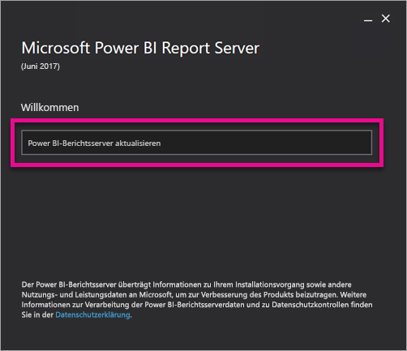
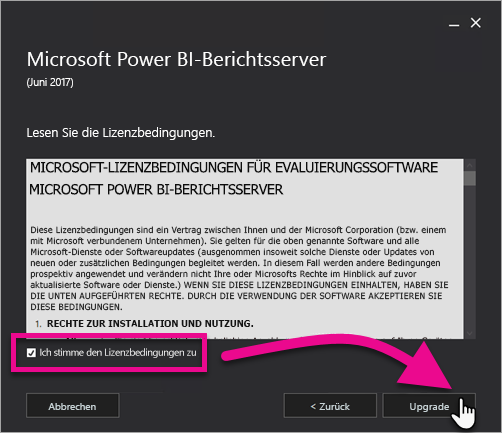

# Aktualisieren von Power BI-Berichtsserver
Erfahren Sie, wie Power BI-Berichtsserver aktualisiert wird.

 **Herunterladen** 

Um Power BI-Berichtsserver und Power BI Desktop mit Optimierung für Power BI-Berichtsserver herunterzuladen, navigieren Sie zu [Lokale Berichterstellung mit Power BI-Berichtsserver](https://powerbi.microsoft.com/report-server/).

## Vorbereitende Schritte
Bevor Sie ein Upgrade für einen Berichtsserver ausführen, empfehlen wir, die folgenden Schritte zum Sichern Ihres Berichtsservers auszuführen.

### Sichern der Verschlüsselungsschlüssel
Bei der erstmaligen Konfiguration einer Berichtsserverinstallation sollten Sie eine Sicherungskopie der Verschlüsselungsschlüssel erstellen. Ebenso sollten Sie bei jeder Änderung der Dienstkontoidentität oder jeder Umbenennung des Computers eine Sicherungskopie der Schüssel erstellen. Weitere Informationen finden Sie unter [Sichern und Wiederherstellen der Reporting Services-Verschlüsselungsschlüssel](https://docs.microsoft.com/sql/reporting-services/install-windows/ssrs-encryption-keys-back-up-and-restore-encryption-keys).

### Sichern der Berichtsserver-Datenbanken
Da es sich bei einem Berichtsserver um einen statusfreien Server handelt, sind alle Anwendungsdaten in den Datenbanken **reportserver** und **reportservertempdb** gespeichert, die auf einer Instanz eines SQL Server-Datenbankmoduls ausgeführt werden. Die Sicherung der Datenbanken **reportserver** und **reportservertempdb** kann mithilfe einer der unterstützten Methoden für das Sichern von SQL Server-Datenbanken erfolgen. Zu den für Berichtsserver-Datenbanken spezifischen Empfehlungen zählen die folgenden:

* Verwenden Sie das vollständige Wiederherstellungsmodell zum Sichern der **reportserver**-Datenbank.
* Verwenden Sie das einfache Wiederherstellungsmodell zum Sichern der **reportservertempdb**-Datenbank.
* Sie können für jede Datenbank verschiedene Sicherungszeitpläne verwenden. Der einzige Grund für das Sichern von **reportservertempdb** besteht darin, die Notwendigkeit einer Neuerstellung im Fall eines Hardwareausfalls zu vermeiden. Bei einem Hardwareausfall müssen die Daten in **reportservertempdb** nicht wiederhergestellt werden, Sie benötigen aber die Tabellenstruktur. Wenn Sie **reportservertempdb** verlieren, besteht die einzige Möglichkeit zu ihrer Wiederherstellung in der Neuerstellung der Berichtsserver-Datenbank. Wenn Sie **reportservertempdb** neu erstellen, muss sie den gleichen Namen wie die primäre Berichtsserver-Datenbank aufweisen.

Weitere Informationen zu Sicherung und Wiederherstellung von relationalen SQL Server-Datenbanken finden Sie unter [Sichern und Wiederherstellen von SQL Server-Datenbanken](https://docs.microsoft.com/sql/relational-databases/backup-restore/back-up-and-restore-of-sql-server-databases).

### Sichern der Konfigurationsdateien
Power BI-Berichtsserver verwendet Konfigurationsdateien zum Speichern von Anwendungseinstellungen. Sie sollten bei der Erstkonfiguration des Servers und nach jeder Bereitstellung von benutzerdefinierten Erweiterungen eine Sicherungskopie der Dateien erstellen. Folgende Dateien sollten gesichert werden:

* config.json
* RSHostingService.exe.config
* Rsreportserver.config
* Rssvrpolicy.config
* Reportingservicesservice.exe.config
* „Web.config“ für die ASP.NET-Anwendungen von Berichtsserver
* „Machine.config“ für ASP.NET

## Aktualisieren des Berichtsservers
Das Aktualisieren des Power BI-Berichtsservers ist einfach. Zum Installieren der Dateien müssen nur einige Schritte ausgeführt werden.

1. Bestimmen Sie den Speicherort der Datei „PowerBIReportServer.exe“, und starten Sie das Installationsprogramm.
2. Wählen Sie **Upgrade von Power BI-Berichtsserver ausführen** aus.
   
    
3. Lesen Sie die Lizenzbedingungen, stimmen Sie ihnen zu, und wählen Sie dann **Upgrade** aus.
   
    
4. Nach erfolgreichem Upgrade können Sie **Berichtsserver konfigurieren** auswählen, um den Konfigurations-Manager für Reporting Services zu starten, oder **Schließen**, um das Installationsprogramm zu beenden.
   
    

## Aktualisieren von Power BI Desktop
Nach der Aktualisierung des Berichtsservers sollten Sie sicherstellen, dass alle Autoren von Power BI-Berichten auf die Power BI Desktop-Version mit Optimierung für Power BI-Berichtsserver aktualisieren, die der Serverversion entspricht.

## Nächste Schritte
[Administratorhandbuch](admin-handbook-overview.md)  
[Installieren von für Power BI-Berichtsserver optimiertem Power BI Desktop](install-powerbi-desktop.md)  
[Überprüfen einer Reporting Services-Installation](https://docs.microsoft.com/sql/reporting-services/install-windows/verify-a-reporting-services-installation)  
[Konfigurieren des Dienstkontos für den Berichtsserver](https://docs.microsoft.com/sql/reporting-services/install-windows/configure-the-report-server-service-account-ssrs-configuration-manager)  
[Konfigurieren von Berichtsserver-URLs](https://docs.microsoft.com/sql/reporting-services/install-windows/configure-report-server-urls-ssrs-configuration-manager)  
[Konfigurieren einer Verbindung mit der Berichtsserver-Datenbank](https://docs.microsoft.com/sql/reporting-services/install-windows/configure-a-report-server-database-connection-ssrs-configuration-manager)  
[Initialisieren eines Berichtsservers](https://docs.microsoft.com/sql/reporting-services/install-windows/ssrs-encryption-keys-initialize-a-report-server)  
[Konfigurieren von SSL-Verbindungen für einen Berichtsserver](https://docs.microsoft.com/sql/reporting-services/security/configure-ssl-connections-on-a-native-mode-report-server)  
[Konfigurieren von Windows-Dienstkonten und -Berechtigungen](https://docs.microsoft.com/sql/database-engine/configure-windows/configure-windows-service-accounts-and-permissions)  
[Browserunterstützung für Power BI-Berichtsserver](browser-support.md)

Weitere Fragen? [Stellen Sie Ihre Frage in der Power BI-Community.](https://community.powerbi.com/)

