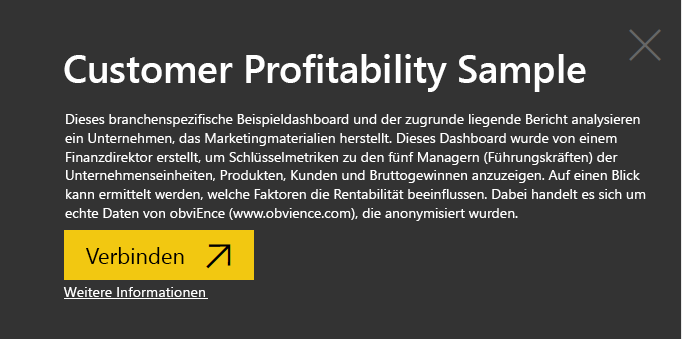
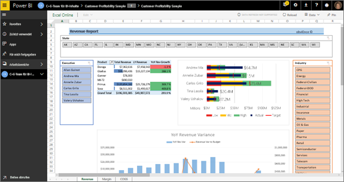
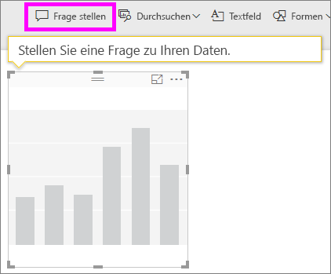
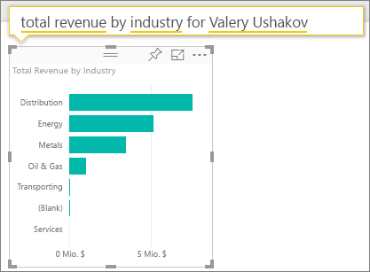
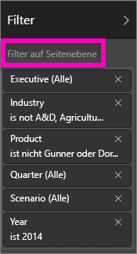
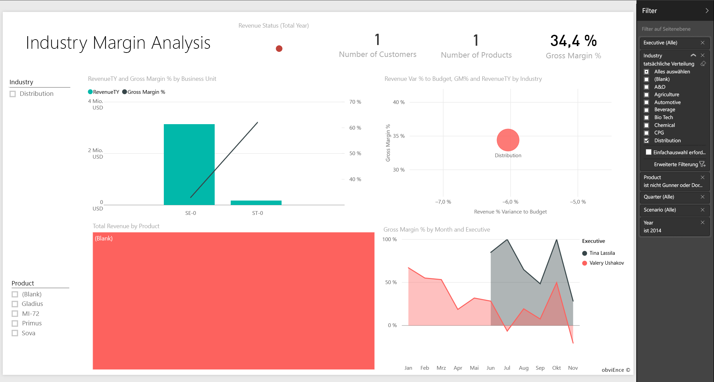
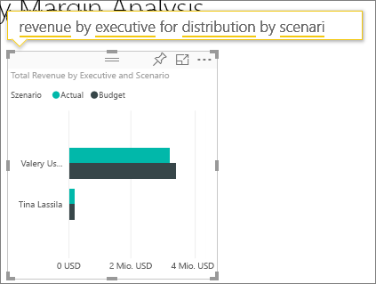

# Beispiel zur Kundenrentabilität für Power BI: Tour

## Tour durch das Beispiel zur Kundenrentabilität
Das Inhaltspaket „Beispiel zur Kundenrentabilität“ enthält ein Dashboard, einen Bericht und ein Dataset für ein Unternehmen, das Marketingmaterial herstellt. Dieses Dashboard wurde von einer Finanzdirektorin (CFO) erstellt, um die Metriken für ihre fünf Business Unit Manager (Führungskräfte), Produkte, Kunden und den Bruttogewinn verfolgen zu können. Sie sieht auf einen Blick, welche Faktoren sich auf die Rentabilität auswirken.

Dieses Beispiel ist Teil einer Reihe, die Ihnen die Verwendung von Power BI anhand geschäftsbezogener Daten, Berichte und Dashboards veranschaulicht. Hierbei handelt es sich um echte Daten von obviEnce ([www.obvience.com](http://www.obvience.com/)) in anonymisierter Form. Die Daten sind in verschiedenen Formaten verfügbar: Inhaltspaket/-App, Excel-Arbeitsmappe oder Power BI Desktop-PBIX-Datei. Informationen finden Sie unter [Beispieldatasets](sample-datasets.md).

## Voraussetzungen
Führen Sie hierzu die folgenden Schritte aus: Dieses Tutorial verwendet den Power BI-Dienst und das Beispielinhaltspaket „Kundenrentabilität“.  Da die Benutzeroberflächen sich sehr ähneln, können Sie das Tutorial auch mit Power BI Desktop und der PBIX-Beispieldatei nachvollziehen. Im Folgenden finden Sie die Anweisungen zum Herstellen einer Verbindung mit dem Inhaltspaket und der PBIX-Datei.

### Abrufen des Inhaltspakets für dieses Beispiel

1. Öffnen Sie den Power BI-Dienst (app.powerbi.com), und melden Sie sich an.
2. Wählen Sie in der linken unteren Ecke **Daten abrufen** aus.

    
3. Wählen Sie auf der daraufhin angezeigten Seite „Daten abrufen“ das Symbol **Beispiele** aus.

   
4. Wählen Sie das **Beispiel zur Kundenrentabilität** aus, und wählen Sie dann **Verbinden**.  

   
5. Das Inhaltspaket wird in Power BI importiert, und dem aktuellen Arbeitsbereich werden ein neues Dashboard, ein neuer Bericht und ein neues Dataset hinzugefügt. Die neuen Inhalte sind mit einem gelben Sternchen markiert. Verwenden Sie die Beispiele, um einen Testlauf von Power BI auszuführen.  

   

### Abrufen der PBIX-Datei für dieses Beispiel

Alternativ können Sie das Beispiel als PBIX-Datei herunterladen, ein für Power BI Desktop entworfenes Dateiformat.
[Beispiel zur Kundenrentabilität](http://download.microsoft.com/download/6/A/9/6A93FD6E-CBA5-40BD-B42E-4DCAE8CDD059/Customer Profitability Sample PBIX.pbix)

### Abrufen der Excel-Arbeitsmappe für dieses Beispiel

Wenn Sie sich die Datenquelle für dieses Beispiel ansehen möchten, dieses steht auch als [(Excel-Arbeitsmappe)](http://go.microsoft.com/fwlink/?LinkId=529781) zur Verfügung. Die Arbeitsmappe enthält Power View-Blätter, die Sie anzeigen und ändern können. Wenn Sie die Rohdaten anzeigen möchten, wählen Sie **Power Pivot > Verwalten** aus.

## Welche Erkenntnisse gewinnen wir über unser Dashboard?

Suchen Sie unter **Mein Arbeitsbereich** das Dashboard für das Beispiel zur Kundenrentabilität:

### Unternehmensweite Dashboardkacheln
1. Öffnen Sie das Dashboard im Power BI-Dienst. Auf den Dashboardkacheln erhält die Finanzdirektorin einen groben Überblick über die Metriken des Unternehmens, die für sie wichtig sind.  Wenn sie etwas Interessantes sieht, kann sie eine Kachel auswählen, um einen genaueren Blick auf die Daten zu werfen.

2. Sehen Sie sich die Kacheln auf der linken Seite des Dashboards an.

    

- Der Bruttogewinn des Unternehmens beträgt 42,5 %.
- Es hat 80 Kunden.
- Es verkauft fünf verschiedene Produkte.
- Die geringste Umsatzabweichung vom Budget in Prozent war im Februar, gefolgt von der höchsten Abweichung im März.
- Die meisten Einnahmen stammen aus den Regionen „Osten“ und „Norden“. Der Bruttogewinn hat zu keinem Zeitpunkt das Budget überschritten, wobei die Punkte „ER-0“ und „MA-0“ einer weiteren Untersuchung bedürfen.
- Der Gesamtumsatz für das Jahr liegt nahe an der Budgetvorgabe.

### Managerspezifische Dashboardkacheln
Die Kacheln auf der rechten Seite des Dashboard zeigen eine Scorecard für das Team an. Die Finanzdirektorin muss die Aktivitäten ihrer Manager verfolgen können, und über diese Kacheln erhält sie einen ersten Überblick über den Gewinn (unter Verwendung des Bruttogewinns in %). Falls der Trend für den Bruttogewinn in % für einen Manager ungewöhnlich ist, kann sie dies näher untersuchen.

- Alle Führungskräfte, mit Ausnahme von Carlos, haben ihre Vertriebsziele bereits übertroffen. Carlos tatsächliche Verkaufszahlen sind allerdings die höchsten.
- Der Bruttogewinn in % von Annelie ist am niedrigsten, aber es ist ein kontinuierlicher Anstieg seit März zu erkennen.
- Der Bruttogewinn in % von Valery ist dagegen erheblich gefallen.
- Und Andrew hatte ein wechselhaftes Jahr.

## Erkunden der zugrunde liegenden Daten auf dem Dashboard
Auf diesem Dashboard befinden sich Kacheln, die mit einem Bericht und einer Excel-Arbeitsmappe verknüpft sind.

### Öffnen der Excel Online-Datenquelle
Zwei Kacheln auf dem Dashboard, „Target vs Actual“ und „Year Over Year Revenue Growth“, wurden aus einer Excel-Arbeitsmappe angeheftet. Wenn Sie eine dieser Kacheln auswählen, öffnet Power BI die Datenquelle, in diesem Fall Excel Online.

1. Wählen Sie eine der aus Excel angehefteten Kacheln aus. Excel Online wird im Power BI-Dienst geöffnet.
2. Beachten Sie, dass diese Arbeitsmappe drei Registerkarten mit Daten enthält. Öffnen Sie „Revenue“.
3. Nun sehen wir uns an, warum Carlos sein Ziel noch nicht erreicht hat.  
    a. Wählen Sie aus der Liste „Führungskraft“ den Eintrag **Carlos Grilo**.   
    b. Die erste PivotTable-Ansicht informiert darüber, dass der Umsatz von Carlos für sein Top-Produkt Primus 152 % geringer ist als im letzten Jahr. Das YoY-Diagramm zeigt, dass er in den meisten Monaten das Budget unterschreitet.  

    

    

4. Erkunden Sie die Daten weiter. Wenn Sie etwas Interessantes finden, wählen Sie das Symbol **Anheften**  in der rechten oberen Ecke, um diese Informationen [an ein Dashboard anzuheften](service-dashboard-pin-tile-from-excel.md).

5. Verwenden Sie den Pfeil „Zurück“ in Ihrem Browser, um zum Dashboard zurückzukehren.

### Öffnen des zugrunde liegenden Power BI-Berichts
Die meisten Kacheln im Beispieldashboard für die Kundenrentabilität wurden aus dem zugrunde liegenden Beispielbericht der Kundenrentabilität angeheftet.

1. Wählen Sie eine dieser Kacheln aus, um den Bericht in der Leseansicht zu öffnen.

2. Der Bericht umfasst drei Seiten. Jede Registerkarte des Berichts entspricht einer Seite.

    

    * Auf der Seite „Team Scorecard“ werden die Leistung der fünf Manager und ihre Umsatzdaten aufgeführt.
    * Auf der Seite „Industry Margin Analysis“ wird die Rentabilität im Vergleich zur gesamten Branche analysiert.
    * Auf der Seite „Executive Scorecard“ wird eine für Cortana formatierte Ansicht der Daten der einzelnen Manager geboten.

### Seite „Team-Scorecard“

Wir sehen uns nun zwei Teammitglieder genauer an und ermitteln, welche Erkenntnisse wir gewinnen können. Wählen Sie links im Datenschnitt den Namen „Andrew“ aus, um die Berichtsseite zu filtern und nur Daten für Andrew anzuzeigen.

* Um schnell einen Blick auf den KPI zu werfen, sehen Sie sich den **Umsatzstatus** von Andrew an – er ist grün. Er erzielt gute Ergebnisse.
* Im Flächendiagramm „Umsatzabweichung in % vom Budget nach Monat“ ist zu sehen, dass Andrew bis auf einen Einbruch im Februar insgesamt gute Ergebnisse erzielt. Seine wichtigste Region ist „Osten“, und er bearbeitet 49 Kunden und fünf (von sieben) Produkten. Sein Bruttogewinn in % ist nicht der höchste und nicht der niedrigste.
* Unter „Jahresumsatz und Umsatzabweichung in % vom Budget nach Monat“ wird ein kontinuierlicher und gleichmäßiger Gewinnverlauf angezeigt. Wenn Sie filtern, indem Sie im Treemap-Diagramm für die Region auf das Quadrat für **Mitte** klicken, erkennen Sie aber, dass Andrew nur im März und nur in Indiana über Umsatz verfügt. Ist dies Absicht, oder handelt es sich um etwas, das näher untersucht werden sollte?

Jetzt machen wir mit Valery weiter. Wählen Sie im Datenschnitt den Namen „Valery“ aus, um die Berichtsseite zu filtern und nur Daten für Valery anzuzeigen.  

* Beachten Sie den roten KPI-Hinweis für **Jahresumsatzstatus**. Dies sollte auf jeden Fall näher untersucht werden.
* Die Umsatzabweichung gibt ebenfalls Anlass zur Sorge, denn sie erreicht ihre Umsatzmargen nicht.
* Valery hat nur neun Kunden, bearbeitet nur zwei Produkte und arbeitet fast ausschließlich mit Kunden im Norden zusammen. Diese Art der Spezialisierung könnte eine Erklärung für die großen Schwankungen in ihren Metriken sein.
* Wenn Sie das Quadrat **Norden** im Treemap-Diagramm auswählen, erkennen Sie, dass der Bruttogewinn von Valery im Norden mit ihrer Gesamtmarge übereinstimmt.
* Die Auswahl der anderen Quadrate für die **Region** führt zu einem interessanten Ergebnis: der Bruttogewinn in Prozent schwankt zwischen 23 % und 79 %, und die Umsatzzahlen sind in allen Regionen – mit Ausnahme des Nordens – stark saisonabhängig.

Forschen Sie weiter, um herauszufinden, warum im Bereich von Valery keine gute Leistung erzielt wird. Sehen Sie sich die Regionen, die anderen Geschäftseinheiten und die nächste Seite des Berichts an: „Analyse der Branchenmarge“.

### Analyse der Branchenmarge
Auf dieser Berichtsseite wird ein anderes Segment der Daten bereitgestellt. Es geht um den Bruttogewinn der gesamten Branche, unterteilt nach Segment. Die Finanzdirektorin verwendet diese Seite, um Metriken des Unternehmens und der Geschäftseinheiten mit Branchenmetriken zu vergleichen und so Trends und Auswirkungen auf die Rentabilität erklären zu können. Vielleicht fragen Sie sich, warum das Flächendiagramm „Bruttogewinn nach Monat und Managername“ auf dieser Seite angeordnet ist, obwohl es eher für das Team gilt. Der Grund ist, dass wir die Seite hiermit nach Business Unit Manager filtern können.  

Inwiefern variiert die Rentabilität nach der Branche? Wie lassen sich die Produkte und Kunden nach Branche unterteilen? Wählen Sie oben links eine oder mehrere Branchen aus. (Beginnen Sie mit den Verbrauchsgütern (CPG).) Wählen Sie das Radierersymbol aus, um den Filter zu löschen.

Im Blasendiagramm sucht die Finanzdirektorin nach den größten Blasen, da sich diese am stärksten auf den Umsatz auswirken. Wenn Sie die Seite nach Manager filtern, indem Sie im Flächendiagramm auf den jeweiligen Namen klicken, können Sie die Beiträge der Manager nach Branchensegment sehen.

* Der Einflussbereich von Andrew reicht über viele verschiedene Branchensegmente und weist starke Abweichungen beim Bruttogewinn in % (meist positiv) und bei der Abweichung in % auf.
* Das Diagramm von Annelie ist ähnlich. Die Ausnahme ist, dass sie nur eine Handvoll Branchensegmente abdeckt und dass der Schwerpunkt auf dem Segment „Behörden“ und dem Produkt „Gladius“ liegt.
* Bei Carlos liegt der Schwerpunkt eindeutig auf dem Segment „Dienstleistungen“, und der Gewinn ist gut. Er hat die Abweichung in % für das Segment „Hightech“ stark verbessert und im neuen Segment „Industrie“ gegenüber dem Budget ein hervorragendes Ergebnis erzielt.
* Tina bearbeitet eine Handvoll Segmente und verfügt über den höchsten Bruttogewinn in %, aber an den zumeist kleinen Blasen ist erkennbar, dass ihr Beitrag zum Gesamtergebnis des Unternehmens sehr gering ist.
* Valery, die nur für ein Produkt verantwortlich ist, bearbeitet nur fünf Branchensegmente. Ihr Brancheneinfluss ist saisonabhängig, aber es ergibt sich immer eine große Blase. Dies deutet auf einen signifikanten Beitrag zum Gesamtergebnis des Unternehmens hin. Beruht die negative Leistung auf der Branche?

### Executive Scorecard
Diese Seite wird als Antwortkarte für Cortana formatiert. Weitere Informationen finden Sie unter [Erstellen von Antwortkarten für Cortana](service-cortana-answer-cards.md).

## Näheres Untersuchen der Daten durch Stellen von Fragen mit Q&A
Für die Analyse wäre es hilfreich zu ermitteln, in welcher Branche Valery den höchsten Umsatz erzielt. Hierfür verwenden wir Q&A.

1. Öffnen Sie den Bericht in der Bearbeitungsansicht, indem Sie **Bericht bearbeiten**auswählen. Die Bearbeitungsansicht ist nur verfügbar, wenn Sie den Bericht „besitzen“. Dies wird manchmal als **Erstellermodus** bezeichnet. Wenn der Bericht stattdessen für Sie freigegeben wurde, können Sie ihn nicht in der Bearbeitungsansicht öffnen.

2.  Wählen Sie in der oberen Menüleiste die Option **Frage stellen** aus, um das Q&A-Feld zu öffnen.

    

3. Geben Sie **Gesamtumsatz nach Branche für Valery**ein. Sie sehen, wie die Visualisierung beim Eingeben der Frage aktualisiert wird.

    

   Die Distribution ist der größte Umsatzbereich für Valery.

### Nähere Untersuchung durch das Hinzufügen von Filtern
Wir sehen uns die Branche *Distribution* an.  

1. Öffnen Sie die Berichtsseite „Analyse der Branchenmarge“.
2. Erweitern Sie den Filterbereich auf der rechten Seite, ohne eine der Visualisierungen auf der Berichtsseite auszuwählen (wenn der Bereich nicht bereits erweitert ist). Im Filterbereich sollten nur Filter auf Seitenebene angezeigt werden.  

   
3. Suchen Sie den Filter für **Branche**, und wählen Sie den Pfeil, um die Liste zu erweitern. Fügen wir nun einen Seitenfilter für die Branche „Distribution“ hinzu. Heben Sie zunächst die gesamte Auswahl auf, indem Sie das Kontrollkästchen **Alles auswählen** deaktivieren. Wählen Sie dann nur **Distribution** aus.  

   
4. Im Flächendiagramm „Bruttogewinn nach Monat und Managername“ sehen wir, dass nur Valery und Tina Kunden aus dieser Branche haben und dass Valery für diese Branche nur von Juni bis November tätig war.   
5. Wählen Sie in der Legende des Flächendiagramms „Bruttogewinn nach Monat und Managername“ zuerst **Tina** und dann **Valery** aus. Beachten Sie, dass der Anteil von „Gesamtumsatz nach Produkt“ im Vergleich zu Valery sehr gering ist.
6. Verwenden Sie den Q&A-Bereich, um nach dem **Gesamtumsatz für Distribution nach Szenario und Führungskraft** zu fragen.  

     

    Auf ähnliche Weise können wir andere Branchen untersuchen und den visuellen Elementen sogar Kunden hinzufügen, um nach Gründen für die Leistung von Valery zu suchen.

Dies ist eine Umgebung, in der Sie sicher experimentieren können. Sie können sich immer noch entscheiden, Ihre Änderungen nicht zu speichern. Wenn Sie sie speichern, können Sie immer wieder zu **Daten abrufen** zurückkehren, um ein neues Exemplar dieses Beispiels herunterzuladen.

Alternativ können Sie [nur das Dataset (Excel-Arbeitsmappe) für dieses Beispiel herunterladen](http://go.microsoft.com/fwlink/?LinkId=529781).

## Nächste Schritte: Herstellen der Verbindung mit Ihren Daten
Wir hoffen, diese Tour hat Ihnen gezeigt, wie Power BI-Dashboards, Q&A und Berichte Ihnen Einblicke in Kundendaten geben können. Es ist jetzt an Ihnen – stellen Sie Verbindungen mit Ihren eigenen Daten her. Mit Power BI können Sie Verbindungen zu einer Vielzahl von Datenquellen herstellen. Weitere Informationen zum [Einstieg in Power BI](service-get-started.md).

[Zurück zu den Beispielen in Power BI](sample-datasets.md)  
