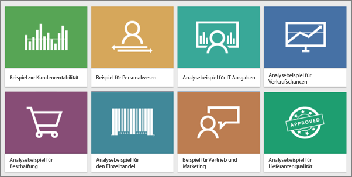
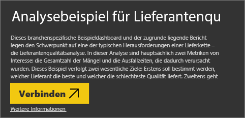
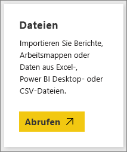
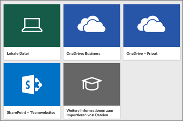
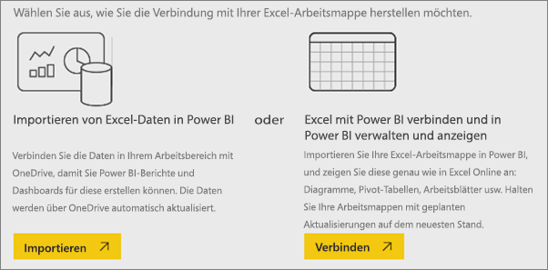
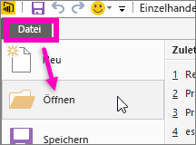

# Welche Beispieldaten sind für die Verwendung mit Power BI verfügbar?
Angenommen, Sie sind mit Power BI noch nicht vertraut und möchten es ausprobieren, haben jedoch keine Daten.  Oder vielleicht haben Sie ein Dataset, fürchten jedoch, das Dataset zu beschädigen, da Sie mit Power BI (noch) nicht vertraut sind?

Kein Grund zur Beunruhigung! obviEnce ([www.obvience.com](http://www.obvience.com/)) und Microsoft haben Beispiele für Sie erstellt, die Sie verwenden können, bis Sie sich mit Power BI besser auskennen.  Die Daten sind anonymisiert und stellen verschiedene Branchen dar: Finanzindustrie, Personalwesen, Vertrieb und weitere Branchen. Bei der Lektüre unserer Onlinedokumentation finden Sie Tutorials und Beispielanwendungen, in denen eben diese Beispiele verwendet werden, was bedeutet, dass Sie die Beispielanwendungen nachvollziehen können.      

   

Jedes dieser Beispiele ist in verschiedenen Formaten verfügbar: als Inhaltspaket, als einzelne Excel-Arbeitsmappe und als PBIX-Datei. Wenn Sie nicht wissen, worum es sich bei diesen Dingen handelt oder wie Sie sie sich beschaffen können – kein Problem. Alles wird im Verlauf dieses Artikels erläutert. Wir haben zudem für jedes Beispiel eine *Tour* erstellt. Dabei handelt es sich um einen Artikel, der Ihnen die Geschichte hinter dem Beispiel erzählt und Sie durch verschiedene Szenarien führt. Beispielsweise kann es sich bei einem Szenario um das Beantworten von Fragen für Ihren Vorgesetzten handeln, bei einem anderen um das Erlangen von Informationen über das Wettbewerberumfeld oder um das Erstellen von Berichten und Dashboards, die freigegeben werden sollen oder um das Erläutern einer Umstellung des Geschäfts.   

Lesen Sie jedoch erst die folgenden rechtlichen Hinweise zur Verwendung der Beispiele, bevor wir beginnen. Anschließend stellen wir die Beispiele vor und zeigen Ihnen, wie Sie sie verwenden.   

## Nutzungsleitfäden für die Excel-Beispielsarbeitsmappen für Power BI
Lesen Sie diese Informationen, bevor Sie die Power BI-Beispiele verwenden.

©2015 Microsoft Corporation. Alle Rechte vorbehalten. Die Dokumente und Arbeitsmappen werden „wie besehen“ bereitgestellt. Die in diesen Arbeitsmappen angegebenen Informationen und Ansichten, einschließlich der URLs und anderer Verweise auf Internetwebsites, können ohne vorherige Ankündigung geändert werden. Sie tragen das mit der Nutzung verbundene Risiko. Einige Beispiele dienen nur Illustrationszwecken und sind frei erfunden. Reale Bezüge sind weder beabsichtigt noch erwünscht. Microsoft übernimmt hinsichtlich der hier bereitgestellten Informationen keine Gewährleistungen, seien sie ausdrücklich oder konkludent.

Die Arbeitsmappen übertragen Ihnen keine Rechte am geistigem Eigentum eines beliebigen Microsoft-Produkts. Sie können die Arbeitsmappe zu internen Referenzzwecken kopieren und verwenden.

Die Arbeitsmappen und zugehörigen Daten werden von obviEnce bereitgestellt. [www.obvience.com](http://www.obvience.com)

ObviEnce ist ein unabhängiger Softwareanbieter und eine Unternehmensschmiede für geistiges Eigentum, die sich auf Microsoft Business Intelligence konzentriert. ObviEnce arbeitet eng mit Microsoft zusammen, um eine entsprechende Vordenkerrolle zu übernehmen und bewährte Methoden zum Fördern und Bereitstellen von Microsoft Business Intelligence-Lösungen zu entwickeln.

Die Arbeitsmappen und Daten sind Eigentum der obviEnce, LLC und wurden ausschließlich zum Zweck der Veranschaulichung der Power BI-Funktionen mit Branchenbeispieldaten freigegeben.

Jede Verwendung der Arbeitsmappen und/oder Daten muss die oben genannte Zuordnung enthalten (die sich auch auf dem Informationsblatt befindet, das jeder Arbeitsmappe beiliegt). Den Arbeitsmappen und allen Visualisierungen muss der folgende Urheberrechtshinweis beiliegen: obviEnce ©.

Wenn Sie auf einen der nachfolgenden Links klicken, um die Excel-Arbeitsmappendateien oder PBIX-Dateien herunterzuladen, stimmen Sie den oben genannten Nutzungsbedingungen zu.

## Verfügbare Beispiele
Es sind acht Beispiele verfügbar, die Sie verwenden können.  Jedes stellt eine andere Branche dar.

### Beispiel zur Kundenrentabilität  
[Tour durch das Beispiel zur Kundenrentabilität](sample-customer-profitability.md)

Dieses Branchenbeispiel analysiert die Schlüsselmetriken eines CFO für seine leitenden Mitarbeiter, Produkte und Kunden. Sie können untersuchen, welche Faktoren Einfluss auf die Rentabilität Ihres Unternehmens haben.

### Beispiel für das Personalwesen  
[Tour durch das Beispiel für das Personalwesen](sample-human-resources.md)

Dieses Branchenbeispiel konzentriert sich auf die Einstellungsstrategie eines Unternehmens durch die Analyse von Neueinstellungen, aktiven Mitarbeitern und Mitarbeitern, die das Unternehmen verlassen haben.  Durch Untersuchen der Daten finden Sie Trends bei freiwilligem Ausscheiden und Verzerrungen in der Einstellungsstrategie.

### Analysebeispiel für IT-Ausgaben 
[Tour durch das Analysebeispiel zu IT-Investitionen](sample-it-spend.md)

In diesem Branchenbeispiel analysieren wir die geplanten gegenüber den tatsächlichen Kosten der IT-Abteilung eines Unternehmens. Dieser Vergleich hilft uns, zu verstehen, wie gut das Unternehmen auf Jahressicht geplant hat und welche Bereiche große Abweichungen gegenüber dem Plan aufwiesen. Das Unternehmen aus dem Beispiel durchläuft einen jährlichen Planungszyklus und erstellt dann quartalsweise eine neueste Schätzung (Latest Estimate, LE), um die Änderungen an den IT-Ausgaben im Verlauf des Geschäftsjahrs zu analysieren.

### Opportunity Analysis sample  
[Tour durch das Analysebeispiel zu Opportunity](sample-opportunity-analysis.md)

In diesem Branchenbeispiel wird der Vertriebskanal eines Softwareunternehmens erkundet. Vertriebsleiter überwachen ihre direkten und Partnervertriebskanäle durch Nachverfolgen von Opportunitys und Umsatz nach Region, Auftragsvolumen und Kanal.

### Beispiel für die Beschaffungsanalyse  
[Tour durch das Analysebeispiel zur Beschaffung](sample-procurement.md)

Dieses Branchenbeispiel analysiert die Schlüsselmetriken eines CFO für seine leitenden Mitarbeiter, Produkte und Kunden. Sie können untersuchen, welche Faktoren Einfluss auf die Rentabilität Ihres Unternehmens haben.

### Analysebeispiel für den Einzelhandel  
[Tour durch das Analysebeispiel für den Einzelhandel](sample-retail-analysis.md)

Dieses Branchenbeispiel analysiert Umsatzdaten des Einzelhandels von Artikeln, die in verschiedenen Läden und Bezirken verkauft wurden. Die Metriken vergleichen die Leistung dieses Jahres mit der des letzten Jahres in den folgenden Bereichen: Umsatz, Einheiten, Bruttogewinn und Varianz sowie Analyse neuer Läden.

### Beispiel für Vertrieb und Marketing  
[Tour durch das Beispiel für Vertrieb und Marketing](sample-sales-and-marketing.md)

Dieses Branchenbeispiel analysiert das Fertigungsunternehmen VanArsdel Ltd. Es ermöglicht dem Chief Marketing Officer, die Branche und den Marktanteil von VanArsdel zu beobachten.  Indem Sie das Beispiel untersuchen, können Sie den Marktanteil, das Produktvolumen, die Umsätze und die Stimmungslage für das Unternehmen ermitteln.

### Beispiel für die Analyse der Lieferantenqualität  
[Tour durch das Beispiel für die Analyse der Lieferantenqualität](sample-supplier-quality.md)

Dieses Branchenbeispiel legt den Schwerpunkt auf eine der typischen Herausforderungen einer Lieferkette – die Lieferantenqualitätsanalyse. In dieser Analyse sind hauptsächlich zwei Metriken von Interesse: die Gesamtzahl der Defekte und die Ausfallzeiten, die durch diese Defekte verursacht wurden. Das Beispiel verfolgt zwei Hauptziele: Identifizieren der im Hinblick auf die Qualität besten und schlechtesten Lieferanten und Ermitteln der Fertigungsstätten, die beim Aufspüren und Zurückweisen von Fehlern am besten abschneiden, um die Ausfallzeiten zu minimieren.

Jetzt wissen Sie, was verfügbar ist. Erfahren Sie jetzt, wie Sie sich diese Beispiele beschaffen.  

## Erhalten der Beispiele
Wie Sie weiter oben gelesen haben, sind die Beispiele in verschiedenen Formaten verfügbar: als Inhaltspakete, Excel-Arbeitsmappen und PBIX-Dateien. Im Folgenden wird beschrieben, wie Sie die einzelnen Formate verwenden. Wir beginnen mit den Inhaltspaketen.

## Die Power BI-Beispiele als Inhaltspakete
Inhaltspakete sind das einzige Beispielformat, das innerhalb von Power BI verfügbar ist. Sie müssen Power BI nicht verlassen, um Inhaltspakete zu suchen. Ein Inhaltspaket ist im Wesentlichen eine Zusammenstellung von einem oder mehreren Dashboards, Datasets und Berichten, die von jemandem erstellt wurden und im Power BI-Dienst verwendet werden können. Personen erstellen Inhaltspakete, um sie für Kollegen freizugeben. Jedes Power BI-Beispielinhaltspaket enthält ein Dataset, einen Bericht und ein Dashboard.  Für Power BI Desktop sind keine Inhaltspakete verfügbar. Wenn Sie weitere Informationen zu Inhaltspaketen erhalten möchten, lesen Sie [Einführung in organisationsbezogene Inhaltspakete in Power BI](service-organizational-content-pack-introduction.md).

### Abrufen und Öffnen eines Beispielinhaltspakets im Power BI-Dienst
1. Öffnen Sie den Power BI-Dienst („app.powerbi.com“), und melden Sie sich an.
2. Wählen Sie in der linken unteren Ecke **Daten abrufen** aus.

    
3. Wählen Sie auf der daraufhin angezeigten Seite „Daten abrufen“ das Symbol **Beispiele** aus.

   
4. Wählen Sie eines der Beispiele aus, um eine Beschreibung dieses Beispiels zu öffnen. Wählen Sie dann **Verbinden** aus.  

   
5. Das Inhaltspaket wird in Power BI importiert, und dem aktuellen Arbeitsbereich werden ein neues Dashboard, ein neuer Bericht und ein neues Dataset hinzugefügt. Die neuen Inhalte sind mit einem gelben Sternchen markiert. Verwenden Sie die Beispiele, um einen Testlauf von Power BI auszuführen.  

   

Da Sie jetzt über Daten verfügen, können Sie mit den nächsten Schritten fortfahren.  Probieren Sie mithilfe der Beispielinhaltspakete einige unserer Tutorials aus, oder öffnen Sie einfach den Power BI-Dienst, und machen Sie sich damit vertraut.

## Die Power BI-Beispiele als Excel-Dateien
Jedes der Beispielinhaltspakete ist auch als Excel-Arbeitsmappe verfügbar. Die Excel-Arbeitsmappen sind für die Verwendung im Power BI-Dienst vorgesehen.  

1. Laden Sie die Dateien mithilfe der nachstehenden Links einzeln herunter, oder [laden Sie eine ZIP-Datei mit allen Beispieldateien herunter](http://go.microsoft.com/fwlink/?LinkId=535020). Als erfahrener Benutzer möchten Sie möglicherweise die Excel-Arbeitsmappen herunterladen, um die Datenmodelle zu untersuchen oder zu bearbeiten.

   * [Analysebeispiel für den Einzelhandel](http://go.microsoft.com/fwlink/?LinkId=529778)
   * [Analysebeispiel für Lieferantenqualität](http://go.microsoft.com/fwlink/?LinkId=529779)
   * [Beispiel für das Personalwesen](http://go.microsoft.com/fwlink/?LinkId=529780)
   * [Beispiel zur Kundenrentabilität](http://go.microsoft.com/fwlink/?LinkId=529781)
   * [Beispiel zur Nachverfolgung von Verkaufschancen](http://go.microsoft.com/fwlink/?LinkId=529782)
   * [Analysebeispiel für IT-Ausgaben](http://go.microsoft.com/fwlink/?LinkId=529783)
   * [Analysebeispiel für Beschaffung](http://go.microsoft.com/fwlink/?LinkId=529784)
   * [Beispiel für Vertrieb und Marketing](http://go.microsoft.com/fwlink/?LinkId=529785)
2. Speichern Sie die heruntergeladene Datei. Es ist wichtig, wo Sie die Datei speichern.

   *  **Lokal**: Wenn Sie Ihre Datei auf einem lokalen Laufwerk Ihres Computers oder an einem anderen Speicherort in Ihrer Organisation speichern, können Sie Ihre Datei über Power BI in Power BI importieren. In Wahrheit verbleibt Ihre Datei aber auf Ihrem lokalen Laufwerk. Die Datei wird also eigentlich gar nicht in Power BI importiert. Tatsächlich wird ein neues Dataset auf Ihrer Power BI-Website erstellt. Daraufhin werden Daten und ggf. das Datenmodell in das Dataset geladen. Wenn Ihre Datei Berichte enthält, werden diese auf Ihrer Power BI-Website unter „Berichte“ angezeigt.
   *  **OneDrive – Geschäftlich**: Wenn Sie OneDrive for Business verwenden, können Sie sich mit demselben Konto auch bei Power BI anmelden. So synchronisieren Sie Ihre Arbeit in Excel, Power BI oder einer CSV-Datei mit den Datasets, Berichten und Dashboards in Power BI am effizientesten. Da sich sowohl Power BI als auch OneDrive in der Cloud befinden, verbindet sich Power BI etwa einmal in der Stunde mit Ihrer Datei in OneDrive. Wenn Änderungen gefunden werden, werden Ihre Dataset, Berichte und Dashboards in Power BI automatisch aktualisiert.
   *  **OneDrive – Persönlich**: Wenn Sie Ihre Dateien in Ihrem eigenen OneDrive-Konto speichern, erhalten Sie dennoch viele der Vorteile, die Ihnen OneDrive for Business bieten würde. Der Hauptunterschied besteht darin, dass Sie sich beim ersten Verknüpfen mit Ihrer Datei, mit Ihrem Microsoft-Konto bei OneDrive anmelden müssen (mit „Daten abrufen“ > „Dateien“ > „OneDrive – Persönlich“). Normalerweise sind Ihr Microsoft- und Ihr Power BI-Konto nicht identisch. Stellen Sie bei der OneDrive-Anmeldung mithilfe Ihres Microsoft Kontos sicher, dass Sie die Option „Angemeldet bleiben“ aktiviert haben. Auf diese Weise ist Power BI in der Lage, sich etwa einmal die Stunde mit Ihrer Datei zu verbinden und sicherzustellen, dass Ihr Dataset in Power BI synchronisiert ist.
   *  **SharePoint-Teamwebsites**: Das Speichern der Power BI-Dateien in SharePoint-Teamwebsites erfolgt auf ähnliche Weise wie das Speichern in OneDrive for Business. Der größte Unterschied besteht im Herstellen der Verknüpfung zur Datei aus Power BI. Sie können eine URL angeben oder eine Verknüpfung mit einem Stammordner erstellen.
3. Öffnen Sie den Power BI-Dienst („app.powerbi.com“), und melden Sie sich an.

   > [!TIP]
   > Jetzt sollten Sie ein neues Dashboard erstellen und nach der Datei benennen, die Sie importieren möchten.  Andernfalls wird beim Importieren des Excel-Datasets kein neues nach dem Beispiel benanntes Dashboard erstellt, sondern dem derzeit geöffneten Dashboard wird eine Kachel hinzugefügt. Durch Auswählen dieser Kachel gelangen Sie zum Bericht für das Dataset. Dies ist kein großes Problem, da Sie jederzeit später ein neues Dashboard erstellen können. Sie ersparen sich jedoch einen oder zwei Schritte, wenn Sie mit einem neuen Dashboard beginnen.
   >
   >
4. Wählen Sie in der linken unteren Ecke **Daten abrufen** aus.

    
5. Wählen Sie auf der daraufhin angezeigten Seite „Daten abrufen“ **Dateien > Abrufen** aus.

     
6. Navigieren Sie zu dem Verzeichnis, in dem Sie das heruntergeladene Beispiel gespeichert haben.

   
7. Wählen Sie die Datei aus, in diesem Fall **Procurement Analysis Sample.xlsx**, die auf OneDrive for Business gespeichert wurde, und wählen Sie **Verbinden**.

   
8. Wählen Sie, ob die Daten importiert werden soll oder ob die Arbeitsmappe in Power BI importiert und genau wie in Excel Online angezeigt werden soll.

    
9. Wenn Sie **Importieren** auswählen, wird die Beispielarbeitsmappe in Power BI importiert und als neues Dataset mit dem Namen **Analysebeispiel für Beschaffung** hinzugefügt.  Wenn die Arbeitsmappe Power View-Blätter, -Tabellen oder -Bereiche oder ein Datenmodell enthält, wird von Power BI auch ein Bericht (mit dem gleichen Namen) erstellt. Und wenn Sie noch kein Dashboard geöffnet haben, wird ein neues Dashboard erstellt. (Wenn beim Klicken auf **Daten abrufen** ein Dashboard geöffnet war, wird auf diesem Dashboard eine neue leere Kachel angezeigt.  Durch Klicken auf diese Kachel gelangen Sie zu dem Bericht für das Dataset, das Sie gerade hinzugefügt haben). Der neue Inhalt wird nach dem Beispiel benannt und mit einem gelben Sternchen markiert.
10. Wenn der Bildschirm **Ihr Dataset steht bereit** angezeigt wird, wählen Sie **Dataset anzeigen** oder **Schnelleinblicke**  aus, oder verwenden Sie einfach die linke Power BI-Navigationsleiste, um den zugehörigen Bericht oder das zugehörige Dashboard zu suchen und zu öffnen.  

     

### (Optional) Anzeigen der Excel-Beispiele in Excel
Möchten Sie wissen, wie die Daten in einer Excel-Arbeitsmappe in Power BI-Datasets und -Berichte konvertiert werden? Durch das Öffnen der Excel-Beispiele ***in Excel*** und Erkunden der Arbeitsblätter erhalten Sie einige Antworten.

* Wenn Sie eine Beispielarbeitsmappe zum ersten Mal in Excel öffnen, werden möglicherweise zwei Warnungen angezeigt. Die erste Warnung besagt, dass die Arbeitsmappe in der geschützten Ansicht angezeigt wird. Wählen Sie **Bearbeitung aktivieren**aus. Die zweite Warnung besagt möglicherweise, dass die Arbeitsmappe externe Datenverbindungen aufweist. Wählen Sie **Inhalt aktivieren**aus.
* Jede Arbeitsmappe enthält mehrere Tabellen. Da alle diese Excel-Beispiele mindestens ein Power View-Blatt mit Visualisierungen enthalten, erhalten Sie beim Importieren der Excel-Datei in Power BI ein Dataset **und** einen Bericht.

   Sie müssen möglicherweise das [Power View-Add-In aktivieren](https://support.office.com/article/Create-a-Power-View-sheet-in-Excel-2013-B23D768D-7586-47FE-97BD-89B80967A405#__toc328591957).
* Wo sind nun die eigentlichen Daten? Sie befinden sich im PowerPivot-Datenmodell. Wählen Sie zum Anzeigen der Daten auf der Registerkarte **PowerPivot** **Datenmodell verwalten** aus.

    Wird die Registerkarte „PowerPivot“ nicht angezeigt? [Aktivieren Sie das Power Pivot-Add-In](https://support.office.com/article/Start-Power-Pivot-in-Microsoft-Excel-2013-add-in-A891A66D-36E3-43FC-81E8-FC4798F39EA8).
* Die Registerkarte „Info“ enthält Informationen zu obviEnce, dem Unternehmen, das das Beispiel erstellt hat.

## Die Power BI-Beispiele als PBIX-Dateien
Jedes der Beispielinhaltspakete ist auch als PBIX-Datei von Power BI verfügbar. Die PBIX-Dateien sind für die Verwendung mit Power BI Desktop vorgesehen.  

1. Laden Sie mithilfe der folgenden Links die Dateien einzeln herunter. Wenn Sie auf die Links klicken, wird die jeweilige Datei automatisch im Ordner „Downloads“ gespeichert. 

   * [PBIX-Datei zum Analysebeispiel für den Einzelhandel](http://download.microsoft.com/download/9/6/D/96DDC2FF-2568-491D-AAFA-AFDD6F763AE3/Retail%20Analysis%20Sample%20PBIX.pbix)
   * [PBIX-Datei zum Analysebeispiel für Lieferantenqualität](http://download.microsoft.com/download/8/C/6/8C661638-C102-4C04-992E-9EA56A5D319B/Supplier-Quality-Analysis-Sample-PBIX.pbix)
   <!-- Previous link doesn't work -->
   * [PBIX-Datei zu Human Resources Sample](http://download.microsoft.com/download/6/9/5/69503155-05A5-483E-829A-F7B5F3DD5D27/Human%20Resources%20Sample%20PBIX.pbix)
   * [PBIX-Datei zum Beispiel zur Kundenrentabilität](http://download.microsoft.com/download/6/A/9/6A93FD6E-CBA5-40BD-B42E-4DCAE8CDD059/Customer%20Profitability%20Sample%20PBIX.pbix)
   * [PBIX-Datei zum Beispiel zur Nachverfolgung von Verkaufschancen](http://download.microsoft.com/download/9/1/5/915ABCFA-7125-4D85-A7BD-05645BD95BD8/Opportunity%20Analysis%20Sample%20PBIX.pbix)
   * [PBIX-Datei zum Analysebeispiel für IT-Ausgaben](http://download.microsoft.com/download/E/9/8/E98CEB6D-CEBB-41CF-BA2B-1A1D61B27D87/IT%20Spend%20Analysis%20Sample%20PBIX.pbix)
   * [PBIX-Datei zum Analysebeispiel für Beschaffung](http://download.microsoft.com/download/D/5/3/D5390069-F723-413B-8D27-5888500516EB/Procurement%20Analysis%20Sample%20PBIX.pbix)
   * [PBIX-Datei zum Beispiel für Vertrieb und Marketing](http://download.microsoft.com/download/9/7/6/9767913A-29DB-40CF-8944-9AC2BC940C53/Sales%20and%20Marketing%20Sample%20PBIX.pbix)

1. Wählen Sie in Power BI Desktop **Datei > Öffnen** aus, und navigieren Sie zu dem Verzeichnis, in dem Sie die PBIX-Beispieldatei gespeichert haben.

   
4. Wählen Sie die PBIX-Datei aus, um sie in Power BI Desktop zu öffnen.

## Nächste Schritte
[Power BI – Grundkonzepte](consumer/end-user-basic-concepts.md)

[Tutorial: Die Power BI-Beispiele](sample-tutorial-connect-to-the-samples.md)

[Datenquellen für Power BI](service-get-data.md)

Weitere Fragen? [Wenden Sie sich an die Power BI-Community](http://community.powerbi.com/)
