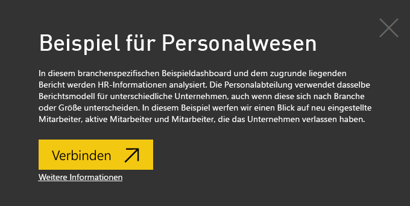
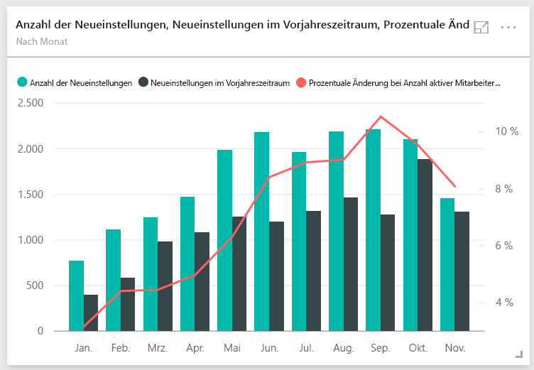
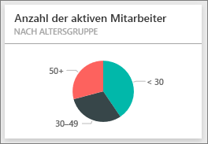
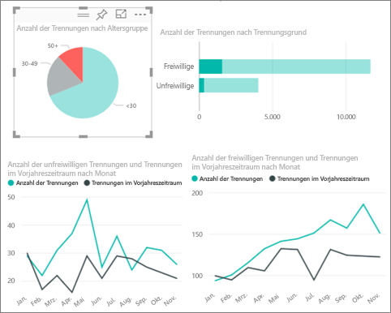
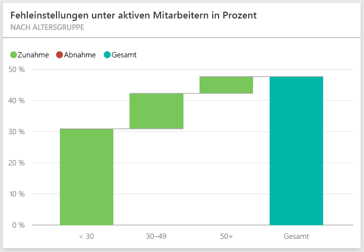
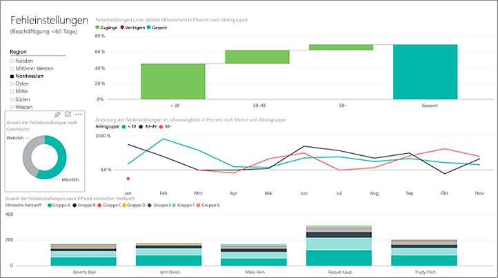
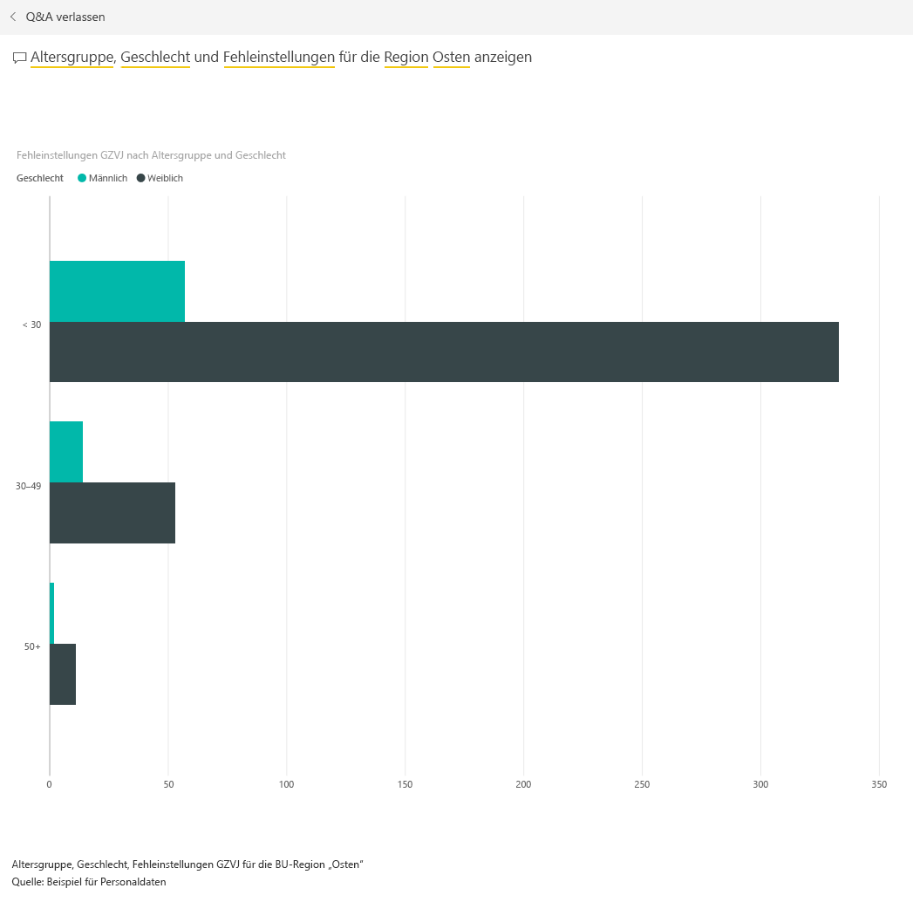

# Beispiel für Personalwesen für Power BI: Übersicht

## Übersicht über das Beispiel für das Personalwesen
Die Personalabteilung verwendet dasselbe Berichtsmodell für unterschiedliche Unternehmen, auch wenn diese sich nach Branche oder Größe unterscheiden. In diesem Beispiel werfen wir einen Blick auf neu eingestellte Mitarbeiter, aktive Mitarbeiter und Mitarbeiter, die das Unternehmen verlassen haben. Es wird versucht, Trends bei der Personalgewinnungsstrategie zu ermitteln. Hauptsächlich sollen folgende Erkenntnisse gewonnen werden:

* Wen wir einstellen
* Tendenzen unserer Personalgewinnungsstrategie
* Trends bei freiwilligem Ausscheiden

Dieses Beispiel ist Teil einer Reihe, die Ihnen die Verwendung von Power BI anhand geschäftsbezogener Daten, Berichte und Dashboards veranschaulicht. Hierbei handelt es sich um echte Daten von obviEnce ([www.obvience.com](http://www.obvience.com/)) in anonymisierter Form. Die Daten sind in verschiedenen Formaten verfügbar: Inhaltspaket/-App, Excel-Arbeitsmappe oder Power BI Desktop-PBIX-Datei. Weitere Informationen finden Sie unter [Beispieldatasets](sample-datasets.md).

## Voraussetzungen

 Bevor Sie das Beispiel verwenden können, müssen Sie es zunächst als [Inhaltspaket](https://docs.microsoft.com/power-bi/sample-human-resources#get-the-content-pack-for-this-sample), [PBIX-Datei](http://download.microsoft.com/download/6/9/5/69503155-05A5-483E-829A-F7B5F3DD5D27/Human%20Resources%20Sample%20PBIX.pbix) oder [Excel-Arbeitsmappe](http://go.microsoft.com/fwlink/?LinkId=529780) herunterladen.

### Abrufen des Inhaltspakets für dieses Beispiel

1. Öffnen Sie den Power BI-Dienst (app.powerbi.com), und melden Sie sich an.
2. Wählen Sie in der linken unteren Ecke **Daten abrufen** aus.
   
    
3. Wählen Sie auf der daraufhin angezeigten Seite „Daten abrufen“ das Symbol **Beispiele** aus.
   
   
4. Wählen Sie das **Beispiel für das Personalwesen** aus, und wählen Sie dann **Verbinden**.  
   
   
5. Das Inhaltspaket wird in Power BI importiert, und dem aktuellen Arbeitsbereich werden ein neues Dashboard, ein neuer Bericht und ein neues Dataset hinzugefügt. Die neuen Inhalte sind mit einem gelben Sternchen markiert. 
   
   
  
### Abrufen der PBIX-Datei für dieses Beispiel

Alternativ können Sie das Beispiel als PBIX-Datei herunterladen, ein für Power BI Desktop entworfenes Dateiformat. 

 * [PBIX-Datei zu Human Resources Sample](http://download.microsoft.com/download/6/9/5/69503155-05A5-483E-829A-F7B5F3DD5D27/Human%20Resources%20Sample%20PBIX.pbix)

### Abrufen der Excel-Arbeitsmappe für dieses Beispiel
Alternativ können Sie [nur das Dataset (Excel-Arbeitsmappe) für dieses Beispiel herunterladen](http://go.microsoft.com/fwlink/?LinkId=529780). Die Arbeitsmappe enthält Power View-Blätter, die Sie anzeigen und ändern können. Wenn Sie die Rohdaten anzeigen möchten, wählen Sie **Power Pivot > Verwalten** aus.

## Neue Mitarbeiter
Betrachten wir zunächst die Neueinstellungen.

1. Wählen Sie im Arbeitsbereich die Registerkarte **Dashboards**, und öffnen Sie das Dashboard „Personalwesen“.
2. Wählen Sie im Dashboard die Kachel **Anzahl der Neueinstellungen, Neueinstellungen im gleichen Zeitraum des Vorjahres, % Veränderung der Aktiven im Jahresvergleich** **Nach Monat** aus.  
     

   Der Beispielbericht „Personalwesen“ wird auf der Seite **Neueinstellungen** geöffnet.  

   

Beachten Sie Folgendes:

* Das Kombinationsdiagramm **Anzahl der Neueinstellungen, Neueinstellungen GZVJ und % Aktive im Jahresvergleich – Veränderung nach Monat** zeigt, dass wir in jedem Monat des laufenden Jahres mehr Mitarbeiter als im Vorjahr eingestellt haben – in einigen Monaten erheblich mehr Mitarbeiter.
* Beachten Sie im Kombinationsdiagramm **Anzahl der Neueinstellungen und Anzahl der aktiven Mitarbeiter nach Region und ethnischer Gruppe**, dass wir weniger Personen im Bereich **Osten** einstellen.
* Das Wasserfalldiagramm **Neueinstellungen im Jahresvergleich, Abw. nach Altersgruppe** zeigt, dass wir vor allem jüngere Menschen einstellen. Dies kann daran liegen, dass die Stellen häufig Teilzeitstellen sind.
* Das Kreisdiagramm **Anzahl der Neueinstellungen nach Geschlecht** zeigt eine ziemlich gleichmäßige Verteilung.

Können Sie noch weitere Erkenntnisse gewinnen? Beispielsweise eine Region, in der die Verteilung beim Geschlecht nicht gleichmäßig ist? Wählen Sie in den Diagrammen die verschiedenen Altersgruppen und Geschlechter aus, um die Beziehungen zwischen Alter, Geschlecht, Region und ethnischer Gruppe zu untersuchen.

Wählen Sie den Namen des Dashboards aus der oberen Navigationsleiste aus, um zum Dashboard zurückzukehren.

## Vergleichen der derzeit aktiven und ehemaligen Mitarbeiter
Wir sehen uns die Daten für die derzeit aktiven Mitarbeiter und die Mitarbeiter an, die nicht mehr für das Unternehmen arbeiten.

Wählen Sie auf dem Dashboard die Kachel **Anzahl der aktiven Mitarbeiter nach Altersgruppen** aus.  

Der Beispielbericht „Personalwesen“ wird auf der Seite **Aktive Mitarbeiter i. Vgl. zu Trennungen** geöffnet.  

**Interessante Elemente:**

* In den Kombinationsdiagrammen auf der linken Seite wird die Veränderung Jahr über Jahr für aktive und ausgeschiedene Mitarbeiter angezeigt. Aufgrund von vermehrten Einstellungen haben wir in diesem Jahr mehr aktive Mitarbeiter, aber auch mehr ausgeschiedene Mitarbeiter als im letzten Jahr.
* Im August hatten wir im Vergleich zu den anderen Monaten mehr ausgeschiedene Mitarbeiter. Wählen Sie die verschiedenen Altersgruppen, Geschlechter oder Regionen aus, um festzustellen, ob Ausreißer vorhanden sind.
* Wenn wir uns die Kreisdiagramme ansehen, fällt auf, dass in Bezug auf die aktiven Mitarbeiter nach Geschlecht und Altersgruppe eine relativ gleichmäßige Verteilung besteht. Wählen Sie verschiedene Altersgruppen aus, um die Geschlechtsverteilung nach Alter anzuzeigen. Liegt für jede Altersgruppe eine gleichmäßige Verteilung nach Geschlecht vor?

## Gründe für das Ausscheiden
Wir sehen uns den Bericht in der Bearbeitungsansicht an. Wählen Sie in der oberen linken Ecke **Bericht bearbeiten** aus.

Ändern Sie die Kreisdiagramme so, dass keine Daten für aktive Mitarbeiter, sondern für ausgeschiedene Mitarbeiter angezeigt werden.

1. Wählen Sie das Kreisdiagramm **Anzahl der aktiven Mitarbeiter nach Altersgruppen** aus.
2. Wählen Sie unter **Felder** den Pfeil neben **Mitarbeiter** aus, um die Mitarbeitertabelle zu erweitern. Deaktivieren Sie das Kontrollkästchen neben **Anzahl der aktiven Mitarbeiter**, um das Feld zu entfernen.
3. Aktivieren Sie in der Tabelle „Mitarbeiter“ das Kontrollkästchen neben **Anzahl der Ausgeschiedenen** , um dieses Element dem Feld **Werte** in der Feldquelle hinzuzufügen.
4. Aktivieren Sie im Zeichenbereich für den Bericht im Balkendiagramm **Anzahl der Trennungen nach Trennungsgrund** den Balken **Freiwillig**. Dies hebt in den anderen Visualisierungen im Bericht die Personen hervor, die freiwillig ausgeschieden sind.
5. Klicken Sie im Kreisdiagramm „Anzahl der Trennungen nach Altersgruppe“ auf das Segment „50+“.

   Sehen Sie sich unten rechts das Liniendiagramm „Ausscheiden nach Grund“ an. Dieses Diagramm wird gefiltert, um freiwillig ausgeschiedene Mitarbeiter anzuzeigen.  
   

   Erkennen Sie den Trend in der Altersgruppe 50+? In der zweiten Jahreshälfte scheiden vermehrt Mitarbeiter mit mehr als 50 Jahren freiwillig aus. Dies ist ein Bereich, der anhand von weiteren Daten genauer untersucht werden kann.
6. Sie können die gleichen Schritte auch für das Kreisdiagramm **Anzahl der aktiven Mitarbeiter nach Geschlecht** ausführen und es von aktiven Mitarbeiter in Trennungen ändern. Sehen Sie sich die Daten zum freiwilligen Ausscheiden nach Geschlecht an, um nach weiteren Erkenntnissen zu suchen.
7. Klicken Sie in der oberen Navigationsleiste auf **Power BI** , um zum Dashboard zurückzukehren. Wenn Sie möchten, können Sie die Änderungen speichern, die Sie am Bericht vorgenommen haben.

## Fehleinstellungen
Als Letztes untersuchen wir den Bereich der Fehleinstellungen. Bei Fehleinstellungen geht es um Mitarbeiter, die weniger als 60 Tage im Unternehmen tätig waren. Wir stellen Mitarbeiter schnell ein. Stellen wir auch gute Kandidaten ein?

1. Wählen Sie die Dashboardkachel **Fehleinstellungen in % aktiver Mitarbeiter nach Altersgruppe** aus. Der Bericht wird auf Seite 3, „Fehleinstellungen“, geöffnet.

     
2. Aktivieren Sie im Slicer „Region“ auf der linken Seite das Kontrollkästchen **Nordwesten** und das Segment **Männlich** im Ringdiagramm „Anzahl der Fehleinstellungen nach Geschlecht“.  Sehen Sie sich die anderen Diagramme auf der Seite „Fehleinstellungen“ an. Es sind mehr männliche als weibliche Fehleinstellungen und viele Fehleinstellungen in der Gruppe A erkennbar.
     
3. Wenn Sie sich das Ringdiagramm **Fehleinstellungen nach Geschlecht** ansehen und durch den Datenschnitt **Region** klicken, sehen Sie, dass „Osten“ die einzige Region mit mehr weiblichen als männlichen Fehleinstellungen ist.  
4. Wählen Sie den Namen des Dashboards aus der oberen Navigationsleiste aus, um zum Dashboard zurückzukehren.

## Stellen einer Frage im Feld für Fragen und Antworten
Das [Q&A-Fragefeld](power-bi-tutorial-q-and-a.md) ist der Ort, an dem Sie eine natürlichsprachliche Frage eingeben können. Q&A erkennt die eingegebenen Wörter und schließt, wo in Ihrem Dataset eine Antwort zu finden ist.

1. Klicken Sie in das Q&A-Fragefeld. Beachten Sie, dass das Q&A-Feld bereits Vorschläge enthält, noch bevor Sie mit der Eingabe beginnen:

   
2. Sie können einen dieser Vorschläge auswählen oder eingeben: **Altersgruppe, Geschlecht und Fehleinstellungen im gleichen Vorjahreszeitraum für Region Osten anzeigen**.  

   

   Beachten Sie, dass die meisten der weiblichen Fehleinstellungen jünger als 30 Jahre sind.

Dies ist eine Umgebung, in der Sie sicher experimentieren können. Sie können sich immer noch entscheiden, Ihre Änderungen nicht zu speichern. Wenn Sie sie speichern, können Sie immer wieder zu **Daten abrufen** zurückkehren, um ein neues Exemplar dieses Beispiels herunterzuladen.

## Nächste Schritte: Herstellen einer Verbindung mit den Daten
Wir hoffen, diese Tour hat Ihnen gezeigt, wie Power BI-Dashboards, das Fragen und Antworten-Modul und Berichte Ihnen Einblicke in Personaldaten geben können. Es ist jetzt an Ihnen – stellen Sie Verbindungen mit Ihren eigenen Daten her. Mit Power BI können Sie Verbindungen zu einer Vielzahl von Datenquellen herstellen. Weitere Informationen zum [Einstieg in Power BI](service-get-started.md).  
