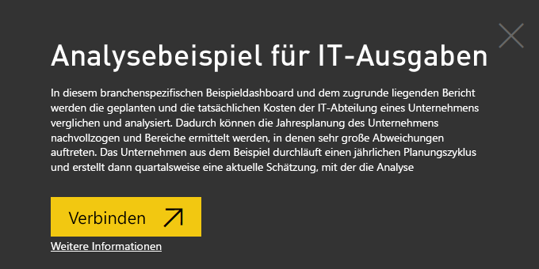
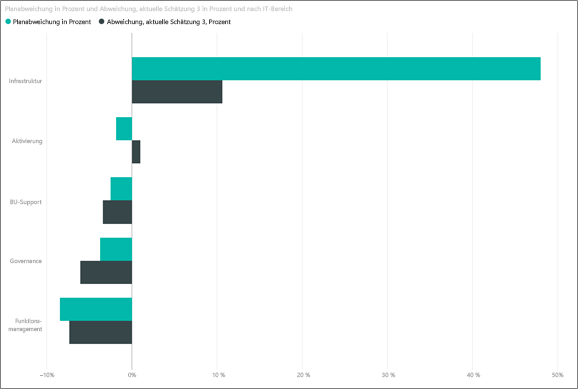

# Analysebeispiel für IT-Investitionen für Power BI: Übersicht

## Übersicht über das Analysebeispiel für IT-Ausgaben
Das Beispielinhaltspaket für die IT-Investitionsanalyse (Dashboard, Bericht und Dataset) analysiert die geplanten gegenüber den tatsächlichen Kosten einer IT-Abteilung. Dieser Vergleich hilft uns, zu verstehen, wie gut das Unternehmen auf Jahressicht geplant hat und welche Bereiche große Abweichungen gegenüber dem Plan aufwiesen. Das Unternehmen aus dem Beispiel durchläuft einen jährlichen Planungszyklus und erstellt dann quartalsweise eine neueste Schätzung (Latest Estimate, LE), um die Änderungen an den IT-Ausgaben im Verlauf des Geschäftsjahrs zu analysieren.

Dieses Beispiel ist Teil einer Reihe, die Ihnen die Verwendung von Power BI anhand geschäftsbezogener Daten, Berichte und Dashboards zeigt. Es wurde mit echten Daten von [obviEnce](http://www.obvience.com/) erstellt, die anonymisiert wurden. Die Daten sind in verschiedenen Formaten verfügbar: Inhaltspaket/-App, Power BI Desktop-PBIX-Datei oder Excel-Arbeitsmappe. Weitere Informationen finden Sie unter [Welche Beispieldaten sind für die Verwendung mit Power BI verfügbar?](sample-datasets.md). 

In diesem Tutorial werden der Power BI-Dienst und das Inhaltspaket Analysebeispiel für IT-Ausgaben verwendet. Da die Benutzeroberflächen sich sehr ähneln, können Sie das Tutorial auch mit Power BI Desktop und der PBIX-Beispieldatei durchführen.

## Voraussetzungen

 Bevor Sie das Beispiel verwenden können, müssen Sie es zunächst als [Inhaltspaket](#get-the-content-pack-for-this-sample), [PBIX-Datei](#get-the-pbix-file-for-this-sample) oder [Excel-Arbeitsmappe](#get-the-excel-workbook-for-this-sample) herunterladen.

### Abrufen des Inhaltspakets für dieses Beispiel

1. Öffnen Sie den Power BI-Dienst (app.powerbi.com), melden Sie sich an, und öffnen Sie den Arbeitsbereich, in dem Sie das Beispiel speichern möchten.

2. Wählen Sie in der linken unteren Ecke **Daten abrufen** aus.
   
   
3. Klicken Sie auf der daraufhin angezeigten Seite **Daten abrufen** auf **Beispiele**.
   
4. Wählen Sie **Analysebeispiel für IT-Ausgaben** aus, und wählen Sie dann **Verbinden**.  
  
   
   
5. Das Inhaltspaket wird in Power BI importiert, und dem aktuellen Arbeitsbereich werden ein neues Dashboard, ein neuer Bericht und ein neues Dataset hinzugefügt.
   
   
  
### Abrufen der PBIX-Datei für dieses Beispiel

Alternativ können Sie das Analysebeispiel für IT-Ausgaben als [PBIX-Datei](http://download.microsoft.com/download/E/9/8/E98CEB6D-CEBB-41CF-BA2B-1A1D61B27D87/IT%20Spend%20Analysis%20Sample%20PBIX.pbix) herunterladen, ein für Power BI Desktop entworfenes Dateiformat.

### Abrufen der Excel-Arbeitsmappe für dieses Beispiel

Wenn Sie sich die Datenquelle für dieses Beispiel ansehen möchten, dieses steht auch als [Excel-Arbeitsmappe](http://go.microsoft.com/fwlink/?LinkId=529783) zur Verfügung. Die Arbeitsmappe enthält Power View-Blätter, die Sie anzeigen und ändern können. Aktivieren Sie die Add-Ins für die Datenanalyse, um die Rohdaten anzuzeigen, und klicken Sie dann auf **Power Pivot > Verwalten**. Weitere Informationen zum Aktivieren der Add-Ins für Power View und Power Pivot finden Sie unter [Anzeigen der Excel-Beispiele in Excel](sample-datasets.md#optional-take-a-look-at-the-excel-samples-from-inside-excel-itself).

## Dashboard zum Analysebeispiel für IT-Ausgaben
Die beiden numerischen Kacheln links auf dem Dashboard, **Planabweichung in Prozent** und **Abweichung, aktuelle Schätzung 3, Prozent**, geben uns einen Überblick darüber, wie wir uns im Vergleich zum Plan und zur Schätzung des letzten Quartals (LE3 = Latest Estimate Quarter 3) geschlagen haben. Insgesamt liegen wir etwa 6% neben dem Plan. Betrachten wir die Ursache für diese Abweichung: Wann, wo und in welcher Kategorie?

## Seite „YTD IT Spend Trend Analysis“ (Analyse des IT-Ausgabentrends seit Jahresbeginn)
Wenn Sie die Kachel **Var Plan % by Sales Region** (Planabweichung % nach Verkaufsregion) im Dashboard auswählen, gelangen Sie zur Seite **YTD IT Spend Trend Analysis** (Analyse des IT-Ausgabentrends seit Jahresbeginn) des Berichts Analysebeispiel für IT-Ausgaben. Wir sehen auf einen Blick, dass wir eine positive Abweichung in den USA und Europa und eine negative Abweichung in Kanada, Lateinamerika und Australien haben. Die USA hatten etwa 6% +LE-Abweichung und Australien etwa 7% -LE-Abweichung.

Aber Schlüsse nur aus einem Blick auf dieses Diagramm zu ziehen, kann in die Irre führen. Wir müssen die tatsächlichen Dollarbeträge ansehen, um die Dinge im Zusammenhang zu verstehen.

1. Wählen Sie im Diagramm **Var Plan % by Sales Region** (Planabweichung in Prozent nach Verkaufsregion) die Option **Aus and NZ** (Australien und Neuseeland) aus, und beobachten Sie das Diagramm **Var Plan by IT Area** (Planabweichung nach IT-Bereich).

   
2. Wählen Sie jetzt **USA**aus. Beachten Sie, dass Australien und Neuseeland im Vergleich zu den USA einen sehr kleinen Teil unserer Gesamtausgaben ausmachen.

    Nun untersuchen wir, welche Kategorie in den USA die Abweichung verursacht.

## Fragen an die Daten stellen
1. Wählen Sie in der oberen Navigationsleiste **Analysebeispiel für IT-Ausgaben** aus, um zum Beispieldashboard zurückzukehren.
2. Wählen Sie **Stellen Sie eine Frage zu Ihren Daten** aus.
3. Wählen Sie in der Liste **Questions to get you started** (Fragen, um Ihnen den Einstieg zu erleichtern) auf der linken Seite die Option **what is the plan by IT area** (Plan nach IT-Bereich) aus.

   

4. Löschen Sie im Q&A-Feld den vorherigen Eintrag, und geben Sie *show IT areas, var plan % and var le3 % bar chart* (Balkendiagramm für IT-Bereiche, Planabweichung in Prozent und Abweichung letzte Schätzung des 3. Quartals in Prozent anzeigen) ein.

   

   Im ersten IT-Bereich, **Infrastructure** (Infrastruktur), hat sich der Prozentsatz zwischen der ursprünglichen Planabweichung und der Planabweichung der letzten Schätzung drastisch verschoben.

## Seite „YTD Spend by Cost Elements“ (Ausgaben seit Jahresbeginn nach Kostenelementen)

1. Kehren Sie zum Dashboard zurück, und sehen Sie sich die Dashboardkachel **Planabweichung in Prozent, aktuelle Schätzung der Varianz in Prozent (Quartal 3)** an.

   

   Beachten Sie, dass der Bereich „Infrastruktur“ durch eine große positive Abweichung vom Plan auffällt.

1. Wählen Sie diese Kachel aus, um den Bericht zu öffnen, und zeigen Sie die Seite **YTD Spend by Cost Elements** (Ausgaben seit Jahresbeginn nach Kostenelementen) an.
2. Wählen Sie den Balken **Infrastructure** (Infrastruktur) im Diagramm **Var Plan % and Var LE3 % by IT Area** (Planabweichung in Prozent und Abweichung, aktuelle Schätzung 3 in Prozent und nach IT-Bereich) unten rechts aus, und beobachten Sie die Werte der Abweichung gegenüber dem Plan in **Var Plan % by Sales Region** (Planabweichung in Prozent nach Verkaufsregion) unten links.

    
3. Wählen Sie nun jeden Namen im Datenschnitt **Cost Element Group** (Kostenelementgruppe) aus, um das Kostenelement mit der größten Abweichung zu finden.
4. Wählen Sie, während **Other** (Sonstige) ausgewählt ist, **Infrastructure** (Infrastruktur) im Datenschnitt **IT Area** (IT-Bereich) aus, und wählen Sie Unterbereiche im Datenschnitt **IT Sub Area** (IT-Unterbereich) aus, um den Unterbereich mit der größten Abweichung zu finden.  

   Beachten Sie die große Abweichung für **Networking**. Offenbar hat sich das Unternehmen entschieden, seinen Mitarbeitern Telefondienste als Bonus zu geben, obwohl diese Entscheidung nicht vorgesehen war.

## Seite „Analyse der Planabweichung“

1. Wählen Sie die Registerkarte **Analyse der Planabweichung** am unteren Rand der Seite aus.

2. Wählen Sie im Diagramm **Planabweichung und Planabweichung in Prozent nach Geschäftsbereich** auf der linken Seite die Säule **Infrastruktur** aus, um die Infrastrukturgeschäftsbereich-Werte auf dem Rest der Seite hervorzuheben.

    

   Beachten Sie im Diagramm **Planabweichung in Prozent nach Monat und Geschäftsbereich**, dass im Februar eine positive Abweichung des Infrastrukturgeschäftsbereichs begonnen hat. Beachten Sie außerdem, wie der Planabweichungswert für diesen Geschäftsbereich im Vergleich mit allen anderen Geschäftsbereichen nach Ländern variiert. 

3. Verwenden Sie die Datenschnitte **IT-Bereich** und **IT-Unterbereich** auf der rechten Seite, um die Werte auf dem Rest der Seite zu filtern und die Daten zu untersuchen. 

## Bearbeiten des Berichts
Wählen Sie in der oberen linken Ecke **Bericht bearbeiten** aus, und führen Sie die Untersuchung in der Bearbeitungsansicht fort:

* Sehen Sie sich an, wie die Seiten erstellt werden, die Felder in jedem Diagramm und die Filter auf den Seiten.
* Fügen Sie auf der Grundlage der gleichen Daten Seiten und Diagramme hinzu.
* Ändern Sie für jedes Diagramm den Visualisierungstyp.
* Heften Sie Diagramme Ihres Interesses an Ihr Dashboard.

In dieser Umgebung können Sie sicher experimentieren, da Sie die Änderungen nicht speichern müssen. Wenn Sie sie speichern, können Sie jederzeit wieder auf **Daten abrufen** klicken, um ein neues Exemplar dieses Beispiels herunterzuladen.

## Nächste Schritte: Herstellen einer Verbindung mit den Daten
Wir hoffen, diese Tour hat Ihnen gezeigt, wie Power BI-Dashboards, das Fragen und Antworten-Modul und Berichte Ihnen Einblicke in Daten zu IT-Investitionen geben können. Jetzt liegt es an Ihnen – stellen Sie Verbindungen mit Ihren eigenen Daten her. Mit Power BI können Sie Verbindungen mit einer Vielzahl von Datenquellen herstellen. Weitere Informationen finden Sie unter [Erste Schritte mit dem Power BI-Dienst](service-get-started.md).
