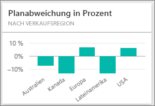
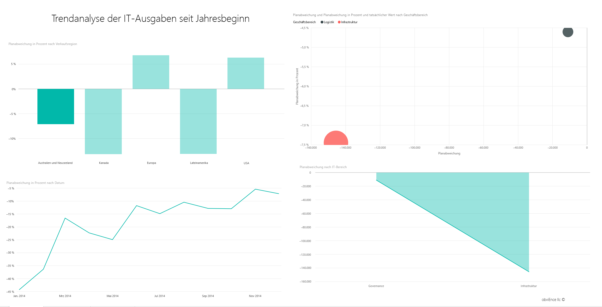
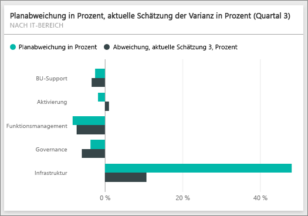

# Analysebeispiel für IT-Investitionen für Power BI: Tour

## Übersicht über das Analysebeispiel für IT-Ausgaben
Das [Inhaltspaket](service-organizational-content-pack-introduction.md) für die IT-Investitionsanalyse (Dashboard, Bericht und Dataset) analysiert die geplanten gegenüber den tatsächlichen Kosten einer IT-Abteilung. Dieser Vergleich hilft uns, zu verstehen, wie gut das Unternehmen auf Jahressicht geplant hat und welche Bereiche große Abweichungen gegenüber dem Plan aufwiesen. Das Unternehmen aus dem Beispiel durchläuft einen jährlichen Planungszyklus und erstellt dann quartalsweise eine neueste Schätzung (Latest Estimate, LE), um die Änderungen an den IT-Investitionen im Verlauf des Geschäftsjahrs zu analysieren.

Dieses Beispiel ist Teil einer Reihe, die Ihnen die Verwendung von Power BI anhand geschäftsbezogener Daten, Berichte und Dashboards veranschaulicht. Dabei handelt es sich um echte Daten von obviEnce (<http://obvience.com/>), die anonymisiert wurden.

## Voraussetzungen

 Bevor Sie das Beispiel verwenden können, müssen Sie es zunächst als [Inhaltspaket](https://docs.microsoft.com/en-us/power-bi/sample-it-spend#get-the-content-pack-for-this-sample), [PBIX-Datei](http://download.microsoft.com/download/E/9/8/E98CEB6D-CEBB-41CF-BA2B-1A1D61B27D87/IT Spend Analysis Sample PBIX.pbix) oder [Excel-Arbeitsmappe](http://go.microsoft.com/fwlink/?LinkId=529783) herunterladen.

### Abrufen des Inhaltspakets für dieses Beispiel

1. Öffnen Sie den Power BI-Dienst (app.powerbi.com), und melden Sie sich an.
2. Wählen Sie in der linken unteren Ecke **Daten abrufen** aus.
   
    
3. Wählen Sie auf der daraufhin angezeigten Seite „Daten abrufen“ das Symbol **Beispiele** aus.
   
   
4. Wählen Sie das **Analysebeispiel für IT-Ausgaben** aus, und wählen Sie dann **Verbinden**.  
  
   
   
5. Das Inhaltspaket wird in Power BI importiert, und dem aktuellen Arbeitsbereich werden ein neues Dashboard, ein neuer Bericht und ein neues Dataset hinzugefügt. Die neuen Inhalte sind mit einem gelben Sternchen markiert. 
   
   
  
### Abrufen der PBIX-Datei für dieses Beispiel

Alternativ können Sie das Beispiel als PBIX-Datei herunterladen, ein für Power BI Desktop entworfenes Dateiformat. 

 * [Analysebeispiel für IT-Ausgaben](http://download.microsoft.com/download/E/9/8/E98CEB6D-CEBB-41CF-BA2B-1A1D61B27D87/IT%20Spend%20Analysis%20Sample%20PBIX.pbix)

### Abrufen der Excel-Arbeitsmappe für dieses Beispiel
Alternativ können Sie [nur das Dataset (Excel-Arbeitsmappe) für dieses Beispiel herunterladen](http://go.microsoft.com/fwlink/?LinkId=529783). Die Arbeitsmappe enthält Power View-Blätter, die Sie anzeigen und ändern können. Wenn Sie die Rohdaten anzeigen möchten, wählen Sie **Power Pivot > Verwalten** aus.

## Dashboard zum Analysebeispiel für IT-Investitionen
Die beiden numerischen Kacheln auf dem Dashboard, **Var Plan %** und **Variance Latest Estimate % Quarter 3**, geben uns einen Überblick darüber, wie wir uns im Vergleich zum Plan und zur Schätzung des letzten Quartals (LE3 = Latest Estimate Quarter 3) geschlagen haben. Insgesamt liegen wir etwa 6 % neben dem Plan. Betrachten wir die Ursache für diese Abweichung – wann, wo und in welcher Kategorie?

## Seite „YTD IT Spend Trend Analysis“
Durch Auswählen der Kachel **Var Plan % nach Region Sales** im Dashboard gelangen Sie zur Seite „IT Spend Trend Analysis“ des Analysebeispielberichts für IT-Investitionen. Wir sehen auf einen Blick, dass wir eine positive Abweichung in den USA und Europa und eine negative Abweichung in Kanada, Lateinamerika und Australien haben. Die USA hatten etwa 6 % +LE-Abweichung und Australien etwa 7 % -LE-Abweichung.

Aber Schlüsse nur aus einem Blick auf dieses Diagramm zu ziehen, kann in die Irre führen. Wir müssen die tatsächlichen Dollarbeträge ansehen, um die Dinge im Zusammenhang zu verstehen.

1. Wählen Sie im Diagramm „Var Plan % by Sales Region“ die Option **Aus und NZ** aus, und beobachten Sie das Diagramm „Var Plan by IT Area“.

   
2. Wählen Sie jetzt **USA**aus. Sie verstehen es sicher – Australien stellt einen relativ kleinen Teil der Gesamtinvestitionen dar, gemessen an den USA.

    Also haben wir das Problem auf die USA eingegrenzt, wie jetzt weiter? Untersuchen wir, welche Kategorie in den USA die Abweichung verursacht.

## Fragen an die Daten stellen
1. Wählen Sie in der oberen Navigationsleiste **Analysebeispiel für IT-Ausgaben** aus, um zu den Dashboards zurückzukehren.
2. Geben Sie im Fragefeld „show IT areas, var plan % and var le3 % bar chart“ ein.

   

   Im ersten IT-Bereich, **Infrastructure**, hat sich der Prozentsatz zwischen dem ursprünglichen Abweichungsplan und dem Abweichungsplan der letzten Schätzung drastisch verschoben.

## Seite „YTD Spend by Cost Elements“
Kehren Sie zum Dashboard zurück, und sehen Sie sich die Kachel **Var Plan %, Var LE3%** im Dashboard.

„Infrastructure“ springt mit einer riesigen positiven Abweichung gegenüber dem Plan hervor.

1. Klicken Sie auf diese Kachel, um zur Seite „YTD Spend by Cost Elements“ des Analysebeispielberichts für IT-Investitionen zu gelangen.
2. Klicken Sie auf den Balken **Infrastructure** im Diagramm „Var Plan % and Var LE3 % by IT Area“ unten links, und beobachten Sie die Abweichung gegenüber dem Plan in „Var Plan % by Sales Region“ auf der linken Seite.

    
3. Klicken Sie auf den Namen jeder einzelnen Kostenelementgruppe im Datenschnitt, um das Kostenelement mit einer großen Abweichung zu finden.
4. Klicken Sie unter „IT Area“ auf **Infrastructure** , während **Other** ausgewählt ist, und klicken Sie auf die Teilbereiche im Datenschnitt „IT Sub Area“, um den Teilbereich mit der größten Abweichung zu finden.  

   Wir sehen eine riesige Abweichung in **Networking**.

   Offenbar hat sich das Unternehmen entschieden, seinen Mitarbeitern Telefondienste als Bonus zu geben, diese Entscheidung war jedoch nicht vorgesehen.

## Seite „Plan Variance Analysis“
Klicken Sie, während Sie noch im Bericht sind, auf die Registerkarte „Plan Variance Analysis“ unten im Bericht, um zu Seite 3 des Berichts zu gelangen.

Klicken Sie im Kombinationsdiagramm „Var Plan, and Var Plan % by Business Area“ auf der linken Seite auf die Spalte „Infrastructure“, um die Werte für die Infrastruktur auf dem Rest der Seite hervorzuheben.

Beachten Sie, dass im Diagramm „Var plan% by Month and Business Area“ die Infrastruktur um Februar herum erstmals eine positive Abweichung zeigt, die sich seither wachsend fortsetzt. Beachten Sie außerdem, wie sich die Abweichung gegenüber dem geplanten Wert nach Ländern unterscheidet, gemessen am Wert für alle Geschäftsfelder. Verwenden Sie die Datenschnitte „IT Area“ und „IT Sub Areas“ auf der rechten Seite, um die Werte auf dem Rest der Seite zu filtern, statt sie hervorzuheben. Klicken Sie auf die verschiedenen IT-Bereiche rechts, um die Daten auf andere Weise zu untersuchen. Sie können außerdem auf die IT-Teilbereiche klicken und die Abweichung auf dieser Ebene anzeigen.

## Bearbeiten des Berichts
Klicken Sie in der oberen linken Ecke auf **Bericht bearbeiten** , und führen Sie die Untersuchung in der Bearbeitungsansicht fort.

* Sehen Sie sich an, wie die Seiten erstellt werden – die Felder in jedem Diagramm, die Filter auf der Seite.
* Fügen Sie auf der Grundlage der gleichen Daten Seiten und Diagramme hinzu.
* Ändern Sie für jedes Diagramm den Visualisierungstyp.
* Heften Sie sie an Ihr Dashboard an.

Dies ist eine Umgebung, in der Sie sicher experimentieren können. Sie können sich immer noch entscheiden, Ihre Änderungen nicht zu speichern. Wenn Sie sie aber speichern, können Sie immer wieder zu „Daten abrufen“ zurückkehren, um ein neues Exemplar dieses Beispiels herunterzuladen.

## Nächste Schritte: Herstellen der Verbindung mit Ihren Daten
Wir hoffen, diese Tour hat Ihnen gezeigt, wie Power BI-Dashboards, das Fragen und Antworten-Modul und Berichte Ihnen Einblicke in Daten zu IT-Investitionen geben können. Es ist jetzt an Ihnen – stellen Sie Verbindungen mit Ihren eigenen Daten her. Mit Power BI können Sie Verbindungen zu einer Vielzahl von Datenquellen herstellen. Weitere Informationen zum [Einstieg in Power BI](service-get-started.md).
