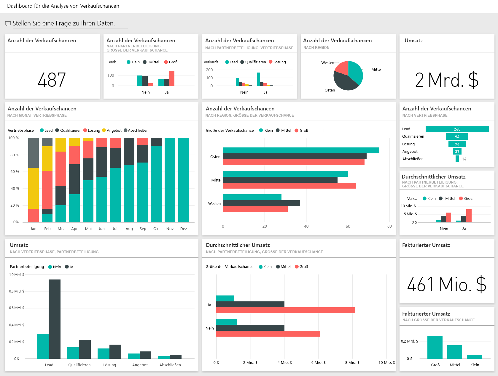
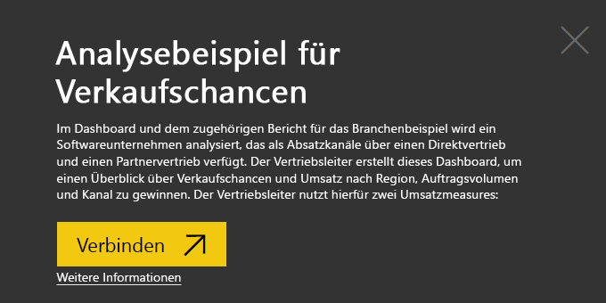
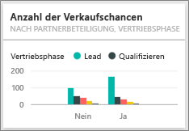

# Analysebeispiel für Verkaufschancen für Power BI: Tour

## Übersicht über das Beispiel einer Opportunityanalyse
Das **Beispiel einer Opportunityanalyse** enthält ein Dashboard (und den dazugehörigen Bericht) für ein Softwareunternehmen, das über zwei Vertriebskanäle verfügt: *Direkt* und *Partner*. Der Vertriebsleiter erstellt dieses Dashboard, um Verkaufschancen und Umsatz nach Region, Auftragsvolumen und Kanal zu verfolgen.

Der Vertriebsleiter nutzt hierfür zwei Umsatzmeasures:

* **Umsatz:** Dies ist die Schätzung eines Vertriebsmitarbeiters zum Umsatz.
* **Fakturierter Umsatz:** Wird als „Umsatz x Wahrscheinlichkeit in Prozent“ berechnet und im Allgemeinen als genauere Voraussage des tatsächlichen Umsatzes angesehen. Die Wahrscheinlichkeit wird über die aktuelle ***Verkaufsphase*** des Auftrags ermittelt.
  * Lead – 10 %  
  * Qualifizierung – 20 %  
  * Lösung – 40 %  
  * Angebot – 60 %  
  * Abschluss – 80 %

  

Dieses Beispiel ist Teil einer Reihe, die Ihnen die Verwendung von Power BI anhand geschäftsbezogener Daten, Berichte und Dashboards veranschaulicht. Hierbei handelt es sich um echte Daten von obviEnce ([www.obvience.com](http://www.obvience.com/)) in anonymisierter Form.

## Voraussetzungen

 Bevor Sie das Beispiel verwenden können, müssen Sie es zunächst als [Inhaltspaket](https://docs.microsoft.com/en-us/power-bi/sample-opportunity-analysis#get-the-content-pack-for-this-sample), [PBIX-Datei](http://download.microsoft.com/download/9/1/5/915ABCFA-7125-4D85-A7BD-05645BD95BD8/Opportunity Analysis Sample PBIX.pbix) oder [Excel-Arbeitsmappe](http://go.microsoft.com/fwlink/?LinkId=529782) herunterladen.

### Abrufen des Inhaltspakets für dieses Beispiel

1. Öffnen Sie den Power BI-Dienst (app.powerbi.com), und melden Sie sich an.
2. Wählen Sie in der linken unteren Ecke **Daten abrufen** aus.
   
    
3. Wählen Sie auf der daraufhin angezeigten Seite „Daten abrufen“ das Symbol **Beispiele** aus.
   
   
4. Wählen Sie das **Beispiel einer Opportunityanalyse** aus, und wählen Sie dann **Verbinden**.  
  
   
   
5. Das Inhaltspaket wird in Power BI importiert, und dem aktuellen Arbeitsbereich werden ein neues Dashboard, ein neuer Bericht und ein neues Dataset hinzugefügt. Die neuen Inhalte sind mit einem gelben Sternchen markiert. 
   
   
  
### Abrufen der PBIX-Datei für dieses Beispiel

Alternativ können Sie das Beispiel als PBIX-Datei herunterladen, ein für Power BI Desktop entworfenes Dateiformat. 

 * [Beispiel einer Opportunityanalyse](http://download.microsoft.com/download/9/1/5/915ABCFA-7125-4D85-A7BD-05645BD95BD8/Opportunity%20Analysis%20Sample%20PBIX.pbix)

### Abrufen der Excel-Arbeitsmappe für dieses Beispiel
Alternativ können Sie [nur das Dataset (Excel-Arbeitsmappe) für dieses Beispiel herunterladen](http://go.microsoft.com/fwlink/?LinkId=529782). Die Arbeitsmappe enthält Power View-Blätter, die Sie anzeigen und ändern können. Wenn Sie die Rohdaten anzeigen möchten, wählen Sie **Power Pivot > Verwalten** aus.

## Welche Erkenntnisse gewinnen wir über unser Dashboard?
Unsere Vertriebsleiterin hat ein Dashboard erstellt, um diese für sie wichtigen Metriken zu verfolgen. Wenn sie etwas Interessantes sieht, kann sie eine Kachel auswählen, um einen genaueren Blick auf die Daten zu werfen.

1. Der Umsatz des Unternehmens beträgt 2 Milliarden US-Dollar, und der fakturierte Umsatz beträgt 461 Millionen US-Dollar.
2. Die Anzahl der Verkaufschancen und der Umsatz folgen einem vertrauten Trichtermuster, wobei sich die Summen in jeder nachfolgenden Phase verringern.
3. Die meisten Verkaufschancen liegen für die Region „Osten“ vor.
4. Mit den größeren Verkaufschancen wird mehr Umsatz als mit den mittleren oder kleinen Verkaufschancen generiert.
5. Mit großen Partneraufträgen wird mehr Umsatz generiert: durchschnittlich 8 Millionen US-Dollar gegenüber 6 Millionen US-Dollar für Direktverkäufe.

Da der Aufwand zum Gewinnen eines Auftrags unabhängig davon gleich ist, ob er als groß, mittel oder klein klassifiziert ist, sollten sich die Mitarbeiter des Unternehmens die Daten genau ansehen, um mehr Informationen zu großen Verkaufschancen zu erhalten.

Wählen Sie die Kachel **Verkaufschancenanzahl nach Partnerbeteiligung und Verkaufsphase** , um Seite 1 des Berichts zu öffnen.  

## Untersuchen der Seiten des Berichts
### Seite 1 des Berichts hat den Titel „Verkaufschancenanzahl – Übersicht“.

* „Osten“ ist in Bezug auf die Verkaufschancenanzahl unsere größte Region.  
* Wählen Sie jede Region im Kreisdiagramm nacheinander aus, um die Seite zu filtern. Für jede Region verfolgen die Partnerunternehmen erheblich mehr große Verkaufschancen.   
* Im Säulendiagramm „Verkaufschancenanzahl nach Partnerbeteiligung und Verkaufschancengröße“ ist deutlich zu sehen, dass die meisten großen Verkaufschancen über Partnerbeteiligung verfügen und dass dies für kleinere und mittlere Verkaufschancen häufiger nicht der Fall ist.
* Wählen Sie die einzelnen Verkaufsphasen im Balkendiagramm unten links, um den Unterschied für die Anzahl in den Regionen anzuzeigen. Sie erkennen, dass alle drei Regionen in den Phasen „Lösung“, „Angebot“ und „Abschluss“ eine ähnliche Anzahl aufweisen, obwohl „Osten“ die größte Region in Bezug auf die Anzahl darstellt. Dies bedeutet, dass wir in den Regionen „Mitte“ und „Westen“ prozentual mehr Abschlüsse erzielen.

### Seite 2 unseres Berichts hat den Titel „Umsatzübersicht“.
Auf dieser Seite werden die Daten auf ähnliche Weise dargestellt, jedoch nicht bezogen auf die Anzahl, sondern aus Sicht des Umsatzes.  

* „Osten“ ist nicht nur bezogen auf die Verkaufschancenanzahl unsere größte Region, sondern auch beim Umsatz.  
* Das Filtern nach Partnerbeteiligung (wählen Sie **Ja** in der Legende oben rechts) ergibt einen Umsatz von 1,5 Milliarden US-Dollar bzw. 294 Millionen US-Dollar. Vergleichen Sie dies mit 644 Milliarden US-Dollar und 166 Millionen US-Dollar für den Umsatz ohne Partnerbeteiligung.  
* Der durchschnittliche Umsatz für Großkunden ist höher (8 Mio.), wenn es sich um eine Verkaufschance mit Partnerbeteiligung handelt, gegenüber 6 Mio. für Aufträge ohne Partnerbeteiligung.  
* Bei Aufträgen mit Partnerbeteiligung ist der durchschnittliche Umsatz für große Verkaufschancen fast doppelt so hoch wie bei Verkaufschancen mittlerer Größe (4 Mio.).  
* Der durchschnittliche Umsatz für kleine und mittlere Unternehmen ist sowohl für Aufträge mit als auch ohne Partnerbeteiligung vergleichbar.   

Es wird deutlich, dass unsere Partnerunternehmen beim Verkauf an Kunden erfolgreicher sind.  Es scheint sinnvoll zu sein, mehr Aufträge über unsere Partnerunternehmen abzuwickeln.

### Seite 3 unseres Berichts hat den Titel „Anzahl nach Region und Phase“.
Auf dieser Seite werden ähnliche Daten angezeigt, die hier jedoch nach Region und Phase aufgeschlüsselt sind.  

* Wenn Sie nach „Osten“ filtern (wählen Sie im Kreisdiagramm **Osten** ), wird deutlich, dass die Verkaufschancen im Osten nahezu gleich auf Aufträge mit und ohne Partnerbeteiligung aufgeteilt sind.
* Große Verkaufschancen kommen am häufigsten in der Region „Mitte“ vor, kleine Verkaufschancen kommen am häufigsten in der Region „Osten“ vor, und mittlere Verkaufschancen kommen am häufigsten in der Region „Westen“ vor.

### Seite 4 des Berichts hat den Titel „Bevorstehende Verkaufschancen“.
Wir suchen wieder nach ähnlichen Faktoren, dieses Mal jedoch bezogen auf Datum bzw. Uhrzeit.  

Unsere Finanzdirektorin verwendet diese Seite, um die Arbeitslast zu verwalten. Sie kann richtig planen, indem sie sich die Umsatzchancen nach Verkaufsphase und Monat ansieht.

* Der durchschnittliche Umsatz hat für die Phase „Abschluss“ den höchsten Wert. Das Abschließen dieser Aufträge hat die höchste Priorität.
* Wenn Sie nach Monat filtern (wählen Sie den Monatsnamen im linken Datenschnitt), wird deutlich, dass der Januar über einen hohen Anteil großer Aufträge in der Phase „Abschluss“ mit einem fakturierten Umsatz in Höhe von 75 Mio. verfügt. Der Februar enthält dagegen zumeist mittelgroße Aufträge in den Phasen „Lösung“ und „Angebot“.
* Im Allgemeinen schwanken die Zahlen des fakturierten Umsatzes je nach Verkaufsphase, Anzahl der Verkaufschancen und Auftragsgröße. Fügen Sie Filter für diese Faktoren hinzu (mit dem Filterbereich auf der rechten Seite), um weitere Erkenntnisse zu gewinnen.

Dies ist eine Umgebung, in der Sie sicher experimentieren können. Sie können sich immer noch entscheiden, Ihre Änderungen nicht zu speichern. Wenn Sie sie speichern, können Sie immer wieder zu **Daten abrufen** zurückkehren, um ein neues Exemplar dieses Beispiels herunterzuladen.

## Nächste Schritte: Herstellen der Verbindung mit Ihren Daten
Wir hoffen, diese Tour hat Ihnen gezeigt, wie Power BI-Dashboards, das Fragen und Antworten-Modul und Berichte Ihnen Einblicke in Daten zur Nachverfolgung von Verkaufschancen geben können. Es ist jetzt an Ihnen – stellen Sie Verbindungen mit Ihren eigenen Daten her. Mit Power BI können Sie Verbindungen zu einer Vielzahl von Datenquellen herstellen. Weitere Informationen zum [Einstieg in Power BI](service-get-started.md).

[Beispiele herunterladen](sample-datasets.md)  
