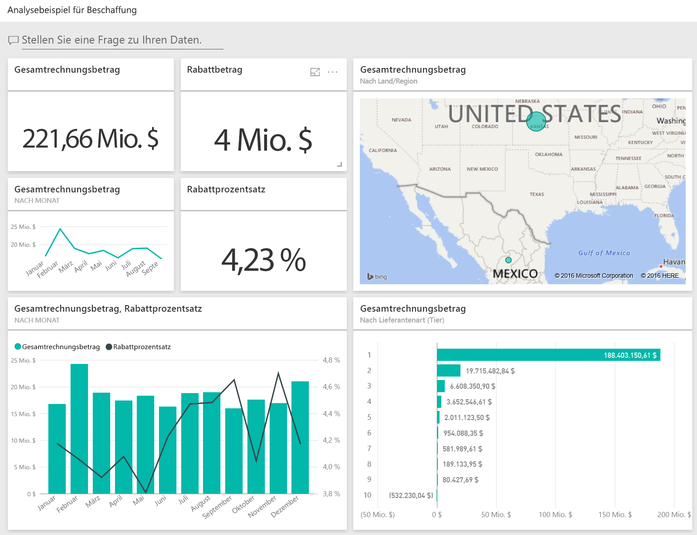
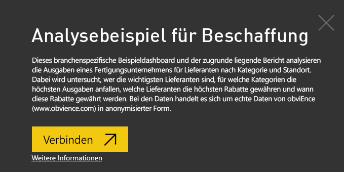
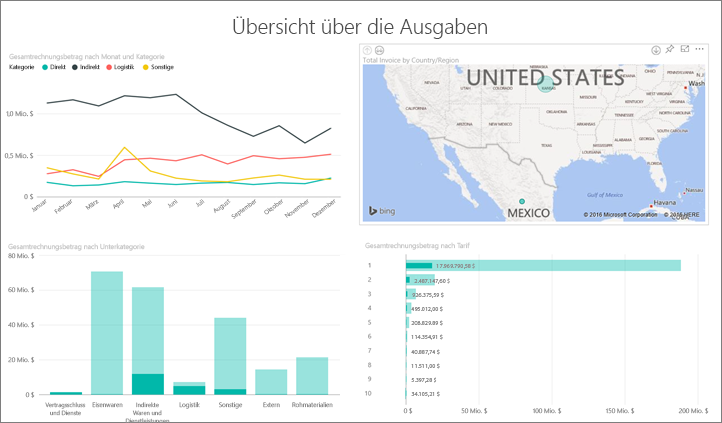
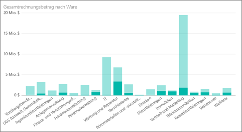
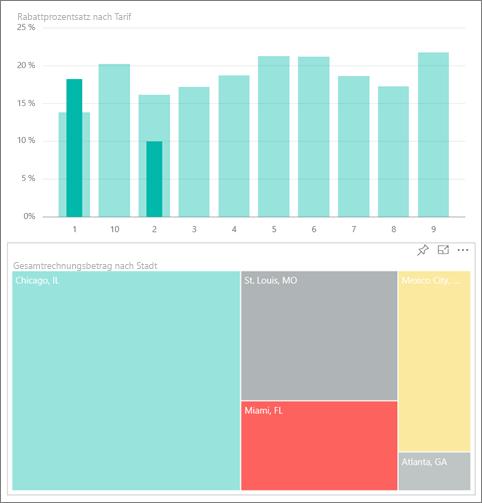
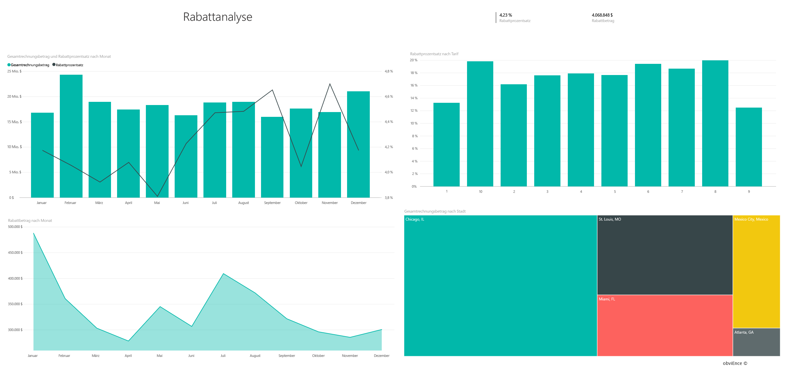
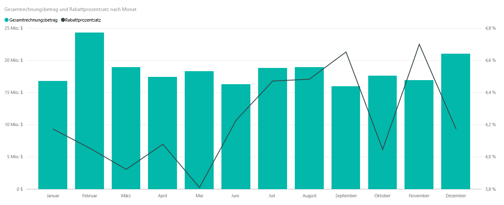
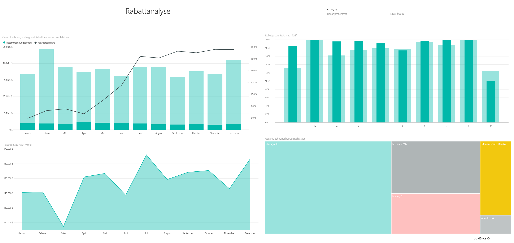

# Analysebeispiel für Beschaffung für Power BI: Übersicht

## Übersicht über das Analysebeispiel für Beschaffung
Dieses branchenspezifische Beispiel-Dashboard und der zugrunde liegende Bericht analysieren die Ausgaben eines Fertigungsunternehmens nach Kategorie und Standort. In diesem Beispiel untersuchen wir die folgenden Bereiche:

* Wer sind die Top-Lieferanten?
* Für welche Kategorien haben wir am meisten ausgegeben?
* Welche Lieferanten geben uns den größten Rabatt und wann?

Dieses Beispiel ist Teil einer Reihe, die Ihnen die Verwendung von Power BI anhand geschäftsbezogener Daten, Berichte und Dashboards veranschaulicht. Hierbei handelt es sich um echte Daten von obviEnce ([www.obvience.com](http://www.obvience.com/)) in anonymisierter Form.

## Voraussetzungen

 Bevor Sie das Beispiel verwenden können, müssen Sie es zunächst als [Inhaltspaket](https://docs.microsoft.com/power-bi/sample-procurement#get-the-content-pack-for-this-sample), [PBIX-Datei](http://download.microsoft.com/download/D/5/3/D5390069-F723-413B-8D27-5888500516EB/Procurement%20Analysis%20Sample%20PBIX.pbix) oder [Excel-Arbeitsmappe](http://go.microsoft.com/fwlink/?LinkId=529784) herunterladen.

### Abrufen des Inhaltspakets für dieses Beispiel

1. Öffnen Sie den Power BI-Dienst (app.powerbi.com), und melden Sie sich an.
2. Wählen Sie in der linken unteren Ecke **Daten abrufen** aus.
   
    
3. Wählen Sie auf der daraufhin angezeigten Seite „Daten abrufen“ das Symbol **Beispiele** aus.
   
   
4. Wählen Sie das **Analysebeispiel für Beschaffung** aus, und wählen Sie dann **Verbinden**.  
  
   
   
5. Das Inhaltspaket wird in Power BI importiert, und dem aktuellen Arbeitsbereich werden ein neues Dashboard, ein neuer Bericht und ein neues Dataset hinzugefügt. Die neuen Inhalte sind mit einem gelben Sternchen markiert. 
   
   
  
### Abrufen der PBIX-Datei für dieses Beispiel

Alternativ können Sie das Beispiel als PBIX-Datei herunterladen, ein für Power BI Desktop entworfenes Dateiformat. 

 * [Analysebeispiel für Beschaffung](http://download.microsoft.com/download/D/5/3/D5390069-F723-413B-8D27-5888500516EB/Procurement%20Analysis%20Sample%20PBIX.pbix)

### Abrufen der Excel-Arbeitsmappe für dieses Beispiel
Alternativ können Sie [nur das Dataset (Excel-Arbeitsmappe) für dieses Beispiel herunterladen](http://go.microsoft.com/fwlink/?LinkId=529784). Die Arbeitsmappe enthält Power View-Blätter, die Sie anzeigen und ändern können. Wenn Sie die Rohdaten anzeigen möchten, wählen Sie **Power Pivot > Verwalten** aus.

## Ausgabentrends
Zuerst sehen wir uns Trends bei den Ausgaben nach Kategorie und Standort an.  

1. Öffnen Sie in Ihrem Arbeitsbereich die Registerkarte **Dashboards**, und wählen Sie das Dashboard „Beschaffungsanalyse“ aus.
2. Wählen Sie die Dashboardkachel **Gesamtrechnung nach Land/Region**. Die Seite „Ausgabenübersicht“ des Berichts „Analysebeispiel für Beschaffung“ wird geöffnet.

    

Beachten Sie die folgenden Punkte:

* Im Liniendiagramm **Gesamtrechnung nach Monat und Kategorie**: Die Ausgaben sind für die Kategorie **Direkt** relativ konstant, **Logistik** weist eine Spitze im Dezember auf, und **Sonstige** weist eine Spitze im Februar auf.
* In der Karte **Gesamtrechnung nach Land/Region**: Die meisten Ausgaben fallen in den USA.
* Im Säulendiagramm **Gesamtrechnung nach Unterkategorie**: **Hardware** und **Indirekte Waren und Dienstleistungen** sind die Kategorien mit den höchsten Ausgaben.
* Im Balkendiagramm „Gesamtrechnung nach Ebene“: Unser Kerngeschäft erfolgt mit unseren Lieferanten der Ebene-1 (Top 10). Dies ist für eine bessere Verwaltung der Lieferantenbeziehungen hilfreich.

## Ausgaben in Mexiko
Sehen wir uns die Ausgabenbereiche für Mexiko an:

1. Wählen Sie im Kreisdiagramm die Blase **Mexiko** aus. Sie sehen, dass im Säulendiagramm „Gesamtrechnung nach Unterkategorie“ der größte Teil in der Unterkategorie **Indirekte Waren und Dienstleistungen** anfällt.

   
2. Führen Sie einen Drilldown in die Spalte **Indirekte Waren und Dienstleistungen** aus:

   * Wählen Sie in der oberen rechten Ecke des Diagramms den Drilldownpfeil  aus.
   * Wählen Sie die Spalte **Indirekte Waren und Dienstleistungen** aus.

      Der bei weitem größte Ausgabenposten in dieser Kategoriezusammenfassung ist Vertrieb und Marketing.
   * Wählen Sie in der Karte erneut **Mexiko** aus.

      Der größte Ausgabenposten in Mexiko ist Wartung und Reparatur.

      
3. Wählen Sie den Aufwärtspfeil in der oberen linken Ecke des Diagramms aus, um wieder eine Ebene nach oben zu wechseln.
4. Wählen Sie den Pfeil erneut aus, um den Drilldown zu deaktivieren.  
5. Wählen Sie in der oberen Navigationsleiste **Power BI** aus, um zu Ihrem Arbeitsbereich zurückzukehren.

## Auswerten verschiedener Städte
Wir können Hervorhebung verwenden, um verschiedene Städte auszuwerten.

1. Wählen Sie die Dashboardkachel **Gesamtrechnung, Rabatt in % nach Monat**aus. Der Bericht wird auf der Seite „Rabattanalyse“ geöffnet.
2. Wählen Sie die verschiedenen Städte in der Treemap **Gesamtumsatz nach Stadt** aus, um den Vergleich anzuzeigen. Fast alle Rechnungen in Miami beziehen sich auf Lieferanten der Ebene 1.

   

## Lieferantenrabatte
Wir sehen uns auch die Rabatte an, die von Lieferanten angeboten werden, und die Zeiträume, in denen wir die meisten Rabatte erhalten.

Insbesondere interessieren folgende Fragen:

* Unterscheiden sich Rabatte von Monat zu Monat, oder werden in jedem Monat die gleichen Rabatte gewährt?
* Werden in einigen Städten höhere Rabatte als in anderen eingeräumt?

### Rabatt nach Monat
Wenn wir uns das Kombinationsdiagramm **Gesamtrechnung und Rabatt in % nach Monat** ansehen, wird deutlich, dass **Februar** der Monat mit dem höchsten Wert und **September** der Monat mit dem geringsten Aufkommen ist. Jetzt sehen wir uns die Prozentwerte der Rabatte in diesen Monaten an.
Sie sehen, dass sich der Rabatt verringert, wenn das Volumen ansteigt, und dass sich der Rabatt erhöht, wenn das Volumen sinkt. Je mehr wir den Rabatt benötigen, desto schlechter wird das Angebot.

### Rabatt nach Stadt
Wir können uns auch den Rabatt nach Stadt ansehen. Wählen Sie im Treemap-Diagramm die einzelnen Städte aus. Sie sehen dann, wie sich die anderen Diagramme ändern.

* Für St. Louis, MO gab es bei der Gesamtrechnung im Februar eine große Spitze und einen Einbruch bei den Einsparungen durch Rabatte im April.
* Mexico City, Mexico verfügt über den höchsten Rabatt in Prozent (11,05 %), und Atlanta, GA über den niedrigsten Rabatt in Prozent (0,08 %).

### Bearbeiten des Berichts
Wählen Sie in der oberen linken Ecke **Bericht bearbeiten** aus, und führen Sie die Untersuchung in der Bearbeitungsansicht fort.

* Sehen Sie sich an, wie die Seiten aufgebaut sind.
* Fügen Sie auf der Grundlage der gleichen Daten Seiten und Diagramme hinzu.
* Ändern Sie die Visualisierung für ein Diagramm, indem Sie beispielsweise das Treemap-Diagramm in ein Ringdiagramm ändern.
* Heften Sie sie an Ihr Dashboard an.

Dies ist eine Umgebung, in der Sie sicher experimentieren können. Sie können sich immer noch entscheiden, Ihre Änderungen nicht zu speichern. Wenn Sie sie speichern, können Sie immer wieder zu **Daten abrufen** zurückkehren, um ein neues Exemplar dieses Beispiels herunterzuladen.

## Nächste Schritte: Herstellen einer Verbindung mit den Daten
Wir hoffen, diese Tour hat Ihnen gezeigt, wie Power BI-Dashboards und -Berichte Ihnen Einblicke in Beschaffungsdaten geben können. Es ist jetzt an Ihnen – stellen Sie Verbindungen mit Ihren eigenen Daten her. Mit Power BI können Sie Verbindungen zu einer Vielzahl von Datenquellen herstellen. Weitere Informationen zum [Einstieg in Power BI](service-get-started.md).
