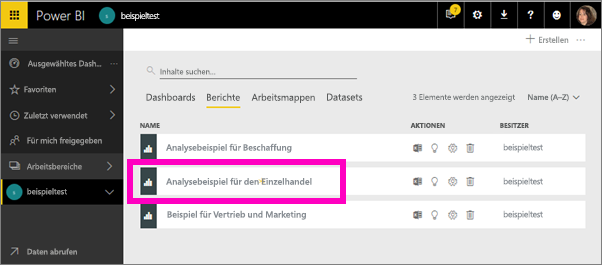
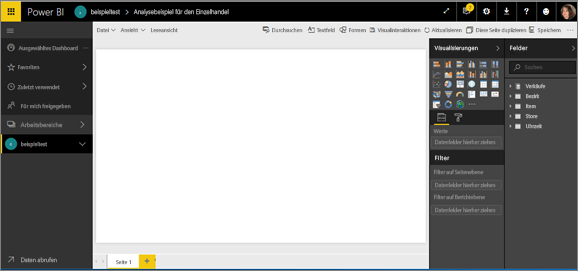
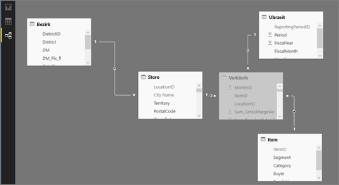

# Die Power BI-Beispiele

Es wird empfohlen, mit dem Artikel [Beispieldatasets für Power BI](sample-datasets.md) zu beginnen. In diesem Artikel erfahren Sie alles über die Beispiele: wie Sie sie erhalten, wo Sie sie speichern und wie Sie sie verwenden, sowie einige der Geschichten, die jedes Beispiel erzählen kann. Kehren Sie dann zu diesem Tutorial zurück, nachdem Sie die Grundlagen verstanden haben.   

### Voraussetzungen
Die Beispiele sind für den Power BI-Dienst und für Power BI Desktop verfügbar. Wir verwenden das Analysebeispiel für den Einzelhandel.

Das in diesem Tutorial verwendete Beispielinhaltspaket zur *Einzelhandelsanalyse* besteht aus einem Dashboard, einem Bericht und einem Dataset.
Um sich mit diesem speziellen Inhaltspaket und seinem Szenario vertraut zu machen, sollten Sie zunächst [eine Tour durch das Analysebeispiel für Einzelhandel unternehmen](sample-retail-analysis.md).

## Über dieses Tutorial
Dieses Tutorial beschreibt Folgendes: 
- Importieren eines Beispielinhaltspakets, Hinzufügen des Pakets zum Power BI-Dienst und Öffnen der Inhalte. Ein *Inhaltspaket* ist ein Beispieltyp, in dem das Dataset mit einem Dashboard und einem Bericht gebündelt ist. 
-  Öffnen einer PBIX-Beispieldatei in Power BI Desktop.

## Beispiele und Power BI-Dienst

1. Öffnen Sie den Power BI-Dienst („app.powerbi.com“), und melden Sie sich an.
2. Wählen Sie unten im linken Navigationsbereich **Daten abrufen** aus. Wenn **Daten abrufen** nicht angezeigt wird, erweitern Sie den Navigationsbereich, indem Sie  auswählen.
   
   
5. Wählen Sie **Beispiele**aus.  
   
   
6. Wählen Sie das *Analysebeispiel für Einzelhandel* aus, und wählen Sie dann **Verbinden**.   
   
   

## Was genau wurde importiert?
Wenn Sie für die Beispielinhaltspakete **Verbinden** auswählen, wird eine Kopie des betreffenden Inhaltspakets in Power BI importiert und in der Cloud gespeichert. Da die Person, die das Inhaltspaket erstellt hat, ein Dataset, einen Bericht und ein Dashboard in das Paket eingeschlossen hat, erhalten Sie diese, wenn Sie auf **Verbinden** klicken. 

1. Das neue Dashboard wird in Power BI erstellt und auf der Registerkarte **Dashboards** aufgeführt. Das gelbe Sternchen gibt an, dass es neu ist.
   
   
2. Öffnen Sie die Registerkarte **Berichte**.  Hier wird ein neuer Bericht mit dem Namen *Analysebeispiel für Einzelhandel* angezeigt.
   
   
   
   Und sehen Sie sich die Registerkarte **Datasets** an.  Auf dieser befindet sich ebenfalls ein neues Dataset.
   
   

## Untersuchen der neuen Inhalte
Untersuchen Sie jetzt selbstständig das Dashboard, das Dataset und den Bericht. Es gibt viele verschiedene Möglichkeiten, zu den Dashboards, Berichten und Datasets zu navigieren. Nachfolgend wird nur eine dieser vielen Möglichkeiten beschrieben.  

> [!TIP]
> Wünschen Sie zunächst ein wenig Unterstützung?  Die [Tour durch das Analysebeispiel für Einzelhandel](sample-retail-analysis.md) bietet Ihnen eine exemplarische Vorgehensweise in einzelnen Schritten für dieses Beispiel.
> 
> 

1. Navigieren Sie zurück zur Registerkarte **Dashboards**, und wählen Sie das Dashboard *Analysebeispiel für Einzelhandel* aus, um es zu öffnen.    
   
   
2. Das Dashboard wird geöffnet.  Es enthält eine Vielzahl von Visualisierungskacheln.
   
   
3. Wählen Sie eine der Kacheln aus, um den zugrunde liegenden Bericht zu öffnen.  In diesem Beispiel wählen wir das Flächendiagramm (in der vorherigen Abbildung rosa umrandet) aus. Der Bericht wird mit der Seite geöffnet, die dieses Flächendiagramm enthält.
   
    
   
   > [!NOTE]
   > Wenn die Kachel mit [Power BI Q&A](power-bi-q-and-a.md) erstellt wird, wird stattdessen die Seite „Q&A“ geöffnet. Wenn die Kachel [aus Excel angeheftet](service-dashboard-pin-tile-from-excel.md) wurde, wird Excel Online in Power BI geöffnet.
   > 
   > 
1. Auf der Registerkarte **Datasets** haben Sie mehrere Möglichkeiten, das Dataset zu untersuchen.  Sie können es nicht öffnen und alle Zeilen und Spalten anzeigen (wie dies in Power BI Desktop oder in Excel möglich ist).  Wenn eine Person ein Inhaltspaket für Kollegen freigibt, möchte diese Person normalerweise die Informationen freigeben, ihren Kollegen jedoch keinen direkten Zugriff auf die Daten gewähren. Dies bedeutet jedoch nicht, dass Sie das Dataset nicht erkunden können.  
   
   
   
   * Eine der Möglichkeiten zum Erkunden des Datasets besteht darin, Visualisierungen und Berichte von Grund auf neu zu erstellen.  Wählen Sie das Symbol „Diagramm“  aus, um das Dataset im Berichtsbearbeitungsmodus zu öffnen.
     
       
   * Eine weitere Möglichkeit zum Erkunden des Datasets ist das Ausführen von [Schnelleinblicken](service-insights.md). Wählen Sie die Auslassungspunkte (...) und dann **Einblicke erhalten** aus. Wenn die Einblicke bereit sind, wählen Sie **Einblicke anzeigen** aus.
     
       

## Beispiele und Power BI Desktop 
Wenn Sie die PBIX-Beispieldatei zum ersten Mal öffnen, wird sie in der Berichtsansicht angezeigt, in der Sie beliebig viele Berichtsseiten mit Visualisierungen erkunden, erstellen und bearbeiten können. Die Berichtsansicht bietet in etwa den gleichen Funktionsumfang wie die Bearbeitungsansicht für Berichte im Power BI-Dienst. Sie können Visualisierungen verschieben, kopieren, einfügen, zusammenführen usw.

Der Unterschied besteht darin, dass Sie in Power BI Desktop mit Ihren Abfragen und Ihrem Modell arbeiten können, sodass Ihre Daten optimale Einblicke in Ihre Berichte ermöglichen. Sie können die Power BI Desktop-Datei dann jederzeit entweder auf dem lokalen Laufwerk oder in der Cloud speichern.

1. Öffnen Sie die [PBIX-Datei mit dem Analysebeispiel für den Einzelhandel](http://download.microsoft.com/download/9/6/D/96DDC2FF-2568-491D-AAFA-AFDD6F763AE3/Retail%20Analysis%20Sample%20PBIX.pbix) in Power BI Desktop. 

    

1. Die Datei wird in der Berichtsansicht geöffnet. Sehen Sie die vier Registerkarten im unteren Bereich des Berichts-Editors? Dies bedeutet, dass dieser Bericht vier Seiten umfasst und die Seite „Neue Filialen“ derzeit ausgewählt ist. 

    .

3. Detaillierte Informationen zum Berichts-Editor finden Sie unter [Berichts-Editor – Verschaffen Sie sich einen Überblick](service-the-report-editor-take-a-tour.md).

## Was genau wurde importiert?
Wenn Sie die PBIX-Beispieldatei in Desktop öffnen, importiert Power BI eine Kopie dieser Daten und in speichert sie in der Cloud. In Desktop haben Sie Zugriff auf den Bericht ***und das zugrunde liegende Dataset***. Wenn die Daten geladen sind, versucht Power BI Desktop, Beziehungen zu finden und zu erstellen.  

1. Wechseln Sie mithilfe des Tabellensymbols  zur [Datenansicht](desktop-data-view.md).
 
    

    Die Datenansicht hilft Ihnen beim Überprüfen, Untersuchen und Verstehen von Daten im Power BI Desktop-Modell. Sie unterscheidet sich von der Anzeige von Tabellen, Spalten und Daten im Abfrage-Editor. In der Datenansicht sehen Sie die Daten, nachdem sie in das Modell geladen wurden.

    Wenn Sie Ihre Daten modellieren, möchten Sie möglicherweise sehen, was tatsächlich in einer Tabelle oder Spalte vorhanden ist, ohne eine Visualisierung im Berichtszeichenbereich zu erstellen, und zwar häufig bis auf Zeilenebene. Dies ist besonders dann der Fall, wenn Sie Measures und berechnete Spalten erstellen oder einen Datentyp oder die Datenkategorie identifizieren müssen.

1. Wechseln Sie mithilfe des Symbols  zur [Beziehungsansicht](desktop-relationship-view.md).
 
    

    Die Beziehungsansicht zeigt alle Tabellen, Spalten und Beziehungen in Ihrem Modell an. Hier können Sie Beziehungen anzeigen, ändern und erstellen.

## Untersuchen der neuen Inhalte
Erkunden Sie das Dashboard, die Beziehungen und den Bericht jetzt selbst. Hilfe für den Einstieg finden Sie unter [Erste Schritte mit Power BI Desktop](desktop-getting-started.md).    

## Nächste Schritte
[Power BI – Grundkonzepte](service-basic-concepts.md)

[Beispiele für den Power BI-Dienst](sample-datasets.md)

[Datenquellen für Power BI](service-get-data.md)

Weitere Fragen? [Wenden Sie sich an die Power BI-Community](http://community.powerbi.com/)

