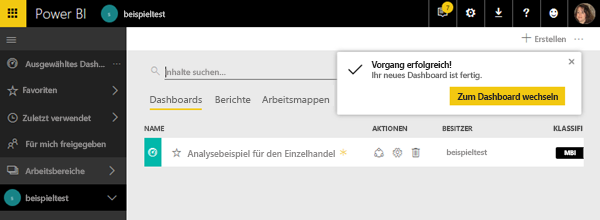
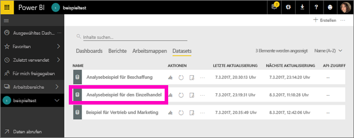
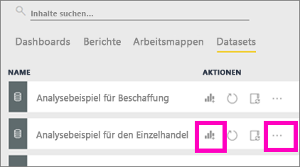

# Die Power BI-Beispiele – Tutorial
<!-- Shared newnav Include -->
[!INCLUDE [newnavbydefault](./includes/newnavbydefault.md)]

Es wird empfohlen, mit dem Artikel [Beispieldatasets für Power BI](sample-datasets.md) zu beginnen. In diesem Artikel erfahren Sie alles über die Beispiele: wie Sie sie erhalten, wo Sie sie speichern und wie Sie sie verwenden, sowie einige der Geschichten, die jedes Beispiel erzählen kann. Kehren Sie dann zu diesem Tutorial zurück, nachdem Sie die Grundlagen verstanden haben.   

## Über dieses Tutorial
In diesem Tutorial erfahren Sie, wie Sie die Beispielinhaltspakete importieren, sie dem Power BI-Dienst hinzufügen und die Inhalte öffnen. Ein *Inhaltspaket* ist ein Beispieltyp, in dem das Dataset mit einem Dashboard und einem Bericht gebündelt ist. Die Inhaltspakete stehen in Power BI über die Funktion **Daten abrufen**zur Verfügung.

> [!NOTE]
> Dieses Tutorial bezieht sich auf den Power BI-Dienst und nicht auf Power BI-Desktop.
> 
> 

Das in diesem Tutorial verwendete Beispielinhaltspaket zur *Einzelhandelsanalyse* besteht aus einem Dashboard, einem Bericht und einem Dataset.
Um sich mit diesem speziellen Inhaltspaket und seinem Szenario vertraut zu machen, sollten Sie zunächst [eine Tour durch das Analysebeispiel für Einzelhandel unternehmen](sample-retail-analysis.md).

## Abrufen von Daten (in diesem Fall Abrufen eines Beispielinhaltspakets)
1. Öffnen Sie den Power BI-Dienst („app.powerbi.com“), und melden Sie sich an.
2. Wählen Sie einen Arbeitsbereich aus, und erstellen Sie ein neues Dashboard.  
   
    
3. Benennen Sie es mit **Analysebeispiel für Einzelhandel**.
   
   
4. Wählen Sie unten im linken Navigationsbereich **Daten abrufen** aus. Wenn **Daten abrufen** nicht angezeigt wird, erweitern Sie den Navigationsbereich, indem Sie  auswählen.
   
   
5. Wählen Sie **Beispiele**aus.  
   
   
6. Wählen Sie das *Analysebeispiel für Einzelhandel* aus, und wählen Sie dann **Verbinden**.   
   
   

## Was genau wurde importiert?
Wenn Sie für die Beispielinhaltspakete **Verbinden** auswählen, wird eine Kopie des betreffenden Inhaltspakets in Power BI importiert und in der Cloud gespeichert. Da die Person, die das Inhaltspaket erstellt hat, ein Dataset, einen Bericht und ein Dashboard in das Paket eingeschlossen hat, erhalten Sie diese, wenn Sie auf **Verbinden** klicken.

1. Das neue Dashboard wird in Power BI erstellt und auf der Registerkarte **Dashboards** aufgeführt. Das gelbe Sternchen gibt an, dass es neu ist.
   
   
2. Öffnen Sie die Registerkarte **Berichte**.  Hier wird ein neuer Bericht mit dem Namen *Analysebeispiel für Einzelhandel* angezeigt.
   
   
   
   Und sehen Sie sich die Registerkarte **Datasets** an.  Auf dieser befindet sich ebenfalls ein neues Dataset.
   
   

## Untersuchen der neuen Inhalte
Untersuchen Sie jetzt selbstständig das Dashboard, das Dataset und den Bericht. Es gibt viele verschiedene Möglichkeiten, zu den Dashboards, Berichten und Datasets zu navigieren. Nachfolgend wird nur eine dieser vielen Möglichkeiten beschrieben.  

> [!TIP]
> Wünschen Sie zunächst ein wenig Unterstützung?  Die [Tour durch das Analysebeispiel für Einzelhandel](sample-retail-analysis.md) bietet Ihnen eine exemplarische Vorgehensweise in einzelnen Schritten für dieses Beispiel.
> 
> 

1. Navigieren Sie zurück zur Registerkarte **Dashboards**, und wählen Sie das Dashboard *Analysebeispiel für Einzelhandel* aus, um es zu öffnen.    
   
   
2. Das Dashboard wird geöffnet.  Es enthält eine Vielzahl von Visualisierungskacheln.
   
   
3. Wählen Sie eine der Kacheln aus, um den zugrunde liegenden Bericht zu öffnen.  In diesem Beispiel wählen wir das Flächendiagramm (in der vorherigen Abbildung rosa umrandet) aus. Der Bericht wird mit der Seite geöffnet, die dieses Flächendiagramm enthält.
   
    
   
   > [!NOTE]
   > Wenn die Kachel mit [Power BI Q&A](service-q-and-a.md) erstellt wird, wird stattdessen die Seite „Q&A“ geöffnet.
   > 
   > 
4. Auf der Registerkarte **Datasets** haben Sie mehrere Möglichkeiten, das Dataset zu untersuchen.  Sie können es nicht öffnen und alle Zeilen und Spalten anzeigen (wie dies in Power BI Desktop oder in Excel möglich ist).  Wenn eine Person ein Inhaltspaket für Kollegen freigibt, möchte diese Person normalerweise die Informationen freigeben, ihren Kollegen jedoch keinen direkten Zugriff auf die Daten gewähren. Dies bedeutet jedoch nicht, dass Sie das Dataset nicht erkunden können.  
   
   
   
   * Eine der Möglichkeiten zum Erkunden des Datasets besteht darin, Visualisierungen und Berichte von Grund auf neu zu erstellen.  Wählen Sie das Symbol „Diagramm“  aus, um das Dataset im Berichtsbearbeitungsmodus zu öffnen.
     
       
   * Eine weitere Möglichkeit zum Erkunden des Datasets ist das Ausführen von [Schnelleinblicken](service-insights.md). Wählen Sie die Auslassungspunkte (...) und dann **Einblicke erhalten** aus. Wenn die Einblicke bereit sind, wählen Sie **Einblicke anzeigen** aus.
     
       

## Nächste Schritte
[Power BI – Grundkonzepte](service-basic-concepts.md)

[Beispiele für den Power BI-Dienst](sample-datasets.md)

[Datenquellen für Power BI](service-get-data.md)

Weitere Fragen? [Wenden Sie sich an die Power BI-Community](http://community.powerbi.com/)

