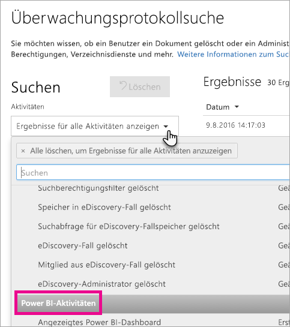
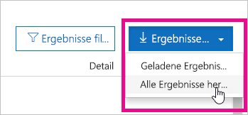

# <a name="using-auditing-within-your-organization"></a>Verwenden von Überwachung in der Organisation

Es kann wichtig sein zu wissen, wer welche Aktion für welches Element im Power BI-Mandanten ausführt. Dies kann Ihrer Organisation bei der Einhaltung von Anforderungen helfen, was beispielsweise die Einhaltung gesetzlicher Bestimmungen und die Dokumentverwaltung betrifft. Verwenden Sie Power BI-Überwachung, um von Benutzern ausgeführte Aktionen wie „Bericht anzeigen“ und „Dashboard anzeigen“ zu überwachen. Sie können die Überwachung nicht dazu verwenden, Berechtigungen zu überwachen.

Sie arbeiten mit der Überwachung im Office 365 Security & Compliance Center oder verwenden PowerShell. Beide Optionen werden in diesem Artikel beschrieben. Sie können die Überwachungsdaten nach Datumsbereich, Benutzer, Dashboard, Bericht, Dataset und Aktivitätstyp filtern. Sie können die Aktivitäten auch als CSV-Datei (durch Trennzeichen getrennte Datei) herunterladen, um die Analyse offline durchzuführen.

## <a name="requirements"></a>Anforderungen

Die folgenden Anforderungen müssen erfüllt sein, um auf Überwachungsprotokolle zugreifen zu können:

- Für den Zugriff auf den Überwachungsbereich des Office 365 Security & Compliance Center benötigen Sie eine Exchange Online-Lizenz (in Office 365 Enterprise E3- und E5-Abonnements enthalten).

- Sie müssen globaler Administrator sein oder die Exchange-Administratorrolle besitzen, die den Zugriff auf das Überwachungsprotokoll ermöglicht. Exchange-Administratorrollen werden über das Exchange Admin Center gesteuert. Weitere Informationen finden Sie unter [Berechtigungen in Exchange Online](/exchange/permissions-exo/permissions-exo/).

- Wenn Sie Zugriff auf das Überwachungsprotokoll haben, aber kein globaler Administrator oder Power BI-Dienst-Administrator sind, haben Sie keinen Zugriff auf das Power BI-Verwaltungsportal. In diesem Fall müssen Sie einen direkten Link zum [Office 365 Security & Compliance Center](https://sip.protection.office.com/#/unifiedauditlog) abrufen.

- Um die Power BI-Überwachungsprotokolle in Ihrem Mandanten anzuzeigen, ist mindestens eine Exchange-Postfachlizenz im Mandanten erforderlich.

## <a name="accessing-your-audit-logs"></a>Zugriff auf Überwachungsprotokolle

Um auf Protokolle zuzugreifen, stellen Sie zunächst sicher, dass die Protokollierung in Power BI aktiviert ist. Weitere Informationen finden Sie unter [Überwachungsprotokolle](service-admin-portal.md#audit-logs) in der Dokumentation zum Verwaltungsportal. Es kann bis zu 48 Stunden nach der Aktivierung der Überwachung dauern, bis Sie Überwachungsdaten einsehen können. Wenn Sie nicht umgehend Daten sehen, überprüfen Sie die Überwachungsprotokolle später noch einmal. Es kann zu einer ähnlichen Verzögerung kommen, nachdem Ihnen die Leseberechtigung für Überwachungsprotokolle erteilt wurde und bis Sie die Protokolle ansehen können.

Die Power BI-Überwachungsprotokolle sind direkt über das [Office 365 Security & Compliance Center](https://sip.protection.office.com/#/unifiedauditlog) verfügbar. Es steht auch ein Link aus dem Power BI-Verwaltungsportal zur Verfügung:

1. Wählen Sie rechts oben in Power BI das **Zahnradsymbol** und dann **Verwaltungsportal** aus.

   

1. Wählen Sie **Azure-Überwachungsprotokolle** aus.

1. Wählen Sie **Zum O365 Admin Center wechseln** aus.

   

Damit Nicht-Administratorkonten auf das Überwachungsprotokoll zugreifen können, müssen Sie Berechtigungen im Exchange Online Admin Center zuweisen. Sie können z. B. einen Benutzer einer vorhandenen Rollengruppe wie „Organisationsverwaltung“ zuweisen oder eine neue Rollengruppe mit der Rolle „Überwachungsprotokolle“ erstellen. Weitere Informationen finden Sie unter [Berechtigungen in Exchange Online](/exchange/permissions-exo/permissions-exo/).

## <a name="search-only-power-bi-activities"></a>Nur nach Power BI-Aktivitäten suchen

Sie können die Ergebnisse mithilfe dieser Schritte auf Power BI-Aktivitäten einschränken. Eine Liste der Aktivitäten finden Sie in der [Liste der Aktivitäten, die von Power BI überwacht werden](#list-of-activities-audited-by-power-bi) weiter unten in diesem Artikel.

1. Wählen Sie auf der Seite **Überwachungsprotokollsuche** unter **Suche** die Dropdownliste für **Aktivitäten** aus.

2. Wählen Sie **Power BI-Aktivitäten** aus.

   

3. Klicken oder tippen Sie auf eine beliebige Stelle neben dem Auswahlfeld, um es zu schließen.

Bei Suchvorgängen werden jetzt ausschließlich Power BI-Aktivitäten berücksichtigt.

## <a name="search-the-audit-logs-by-date"></a>Überwachungsprotokolle nach Datum durchsuchen

Sie können die Protokolle mit den Feldern für das **Startdatum** und das **Enddatum** nach Datumsbereichen durchsuchen. Standardmäßig ist der Datumsbereich auf die letzten sieben Tage festgelegt. Datum und Uhrzeit werden in koordinierter Weltzeit (UTC) angezeigt. Der Datumsbereich kann maximal 90 Tage umfassen. 

Wenn der ausgewählte Datumsbereich größer als 90 Tage ist, wird ein Fehler angezeigt. Wenn Sie den maximalen Datumsbereich von 90 Tagen verwenden, wählen Sie die aktuelle Uhrzeit als **Startdatum** aus. Andernfalls erhalten Sie die Fehlermeldung, dass das Startdatum vor dem Enddatum liegt. Wenn Sie die Überwachung innerhalb der letzten 90 Tage aktiviert haben, kann der Datumsbereich nicht vor dem Datum beginnen, an dem die Überwachung aktiviert wurde.


## <a name="search-the-audit-logs-by-users"></a>Überwachungsprotokolle nach Benutzern durchsuchen

Sie können nach Einträgen im Überwachungsprotokoll suchen, die Aktivitäten bestimmter Benutzer betreffen. Geben Sie zu diesem Zweck mindestens einen Benutzernamen in das Feld **Benutzer** ein. Der Benutzername sieht wie eine E-Mail-Adresse aus. Es handelt such um das Konto, mit dem sich Benutzer bei Power BI anmelden. Lassen Sie dieses Feld leer, um Einträge für alle Benutzer (und Dienstkonten) in Ihrer Organisation abzurufen.


## <a name="view-search-results"></a>Anzeigen der Suchergebnisse

Nachdem Sie **Suche** ausgewählt haben, werden die Suchergebnisse geladen und nach wenigen Augenblicken unter **Ergebnisse** angezeigt. Dann wird auch die Anzahl der Ergebnisse angegeben. Es werden maximal 1.000 Ereignisse angezeigt. Wenn mehr als 1.000 Ereignisse den Suchkriterien entsprechen, werden die 1.000 neuesten Ereignisse angezeigt.

### <a name="view-the-main-results"></a>Anzeigen der wichtigsten Ergebnisse

Der Bereich **Ergebnisse** enthält die folgenden Informationen für jedes von der Suche zurückgegebene Ereignis. Wählen Sie unter **Ergebnisse** eine Spaltenüberschrift aus, um die Ergebnisse zu sortieren.

| **Spalte** | **Definition** |
| --- | --- |
| Datum (Date) |Datum und Uhrzeit des Ereignisses (im UTC-Format). |
| IP-Adresse |Die IP-Adresse des während der Erfassung verwendeten Geräts. Die IP-Adresse wird als IPv4- oder IPv6-Adresse angezeigt. |
| User |Der Benutzer (oder das Dienstkonto), der die Aktion ausgeführt hat, die das Ereignis ausgelöst hat. |
| Activity |Die Aktivität, die vom Benutzer ausgeführt wurde. Dieser Wert entspricht den Aktivitäten, die Sie in der Dropdownliste **Aktivitäten** ausgewählt haben. Bei Ereignissen aus dem Überwachungsprotokoll für Exchange-Administratoren ist der Wert in dieser Spalte ein Exchange-Cmdlet. |
| Item |Das Objekt, das durch die entsprechende Aktivität erstellt oder verändert wurde. Dies ist beispielsweise eine Datei, die angezeigt oder geändert wurde, oder ein Benutzerkonto, das aktualisiert wurde. Nicht alle Aktivitäten verfügen über einen Wert in dieser Spalte. |
| Detail |Weitere Details zu einer Aktivität. Auch hier besitzen nicht alle Aktivitäten einen Wert. |

### <a name="view-the-details-for-an-event"></a>Anzeigen von Ereignisdetails

Sie können weitere Details zu einem Ereignis anzeigen, indem Sie auf den Ereignisdatensatz in der Liste der Suchergebnisse klicken. Es wird eine Seite **Details** angezeigt, die die detaillierten Eigenschaften aus dem Ereignisdatensatz enthält. Welche Eigenschaften angezeigt werden, hängt von dem Office 365-Dienst ab, bei dessen Verwendung das Ereignis aufgetreten ist. 

Um diese Details anzuzeigen, wählen Sie **Weitere Informationen** aus. Alle Power BI-Einträge weisen einen Wert von 20 für die RecordType-Eigenschaft auf. Informationen zu weiteren Eigenschaften finden Sie unter [Detaillierte Eigenschaften im Überwachungsprotokoll](/office365/securitycompliance/detailed-properties-in-the-office-365-audit-log/).

   

## <a name="export-search-results"></a>Exportieren der Suchergebnisse

Um das Power BI-Überwachungsprotokoll in eine CSV-Datei zu exportieren, gehen Sie wie folgt vor.

1. Wählen Sie **Ergebnisse exportieren** aus.

1. Wählen Sie entweder **Geladene Ergebnisse speichern** oder **Alle Ergebnisse herunterladen** aus.

    

## <a name="use-powershell-to-search-audit-logs"></a>Verwenden von PowerShell zum Suchen nach Überwachungsprotokollen

Sie können auch mit PowerShell basierend auf Ihrer Anmeldung auf die Überwachungsprotokolle zugreifen. Das folgende Beispiel zeigt, wie Sie den Befehl [Search-UnifiedAuditLog](/powershell/module/exchange/policy-and-compliance-audit/search-unifiedauditlog?view=exchange-ps/) verwenden, um Power BI-Überwachungsprotokolleinträge abzurufen.

Damit der Befehl [New-PSSession](/powershell/module/microsoft.powershell.core/new-pssession/) verwendet werden kann, muss Ihrem Konto eine Exchange Online-Lizenz zugewiesen sein, und Sie benötigen Zugriff auf das Überwachungsprotokoll für Ihren Mandanten. Weitere Informationen zum Verbinden mit Exchange Online finden Sie unter [Herstellen einer Verbindung mit Exchange Online mithilfe der Remote-PowerShell](/powershell/exchange/exchange-online/connect-to-exchange-online-powershell/connect-to-exchange-online-powershell/).

```powershell
Set-ExecutionPolicy RemoteSigned

$UserCredential = Get-Credential

$Session = New-PSSession -ConfigurationName Microsoft.Exchange -ConnectionUri https://outlook.office365.com/powershell-liveid/ -Credential $UserCredential -Authentication Basic -AllowRedirection

Import-PSSession $Session
Search-UnifiedAuditLog -StartDate 9/11/2018 -EndDate 9/15/2018 -RecordType PowerBI -ResultSize 1000 | Format-Table | More
```

Ein weiteres Beispiel für die Verwendung von PowerShell mit Überwachungsprotokollen finden Sie unter [Verwenden des Power BI-Überwachungsprotokolls und von PowerShell zum Zuweisen von Power BI Pro-Lizenzen](https://powerbi.microsoft.com/blog/using-power-bi-audit-log-and-powershell-to-assign-power-bi-pro-licenses/).

## <a name="activities-audited-by-power-bi"></a>Von Power BI überwachte Aktivitäten

Die folgenden Aktivitäten werden von Power BI überwacht.

* AddDatasourceToGateway
* AddGroupMembers
* AnalyzedByExternalApplication
* AnalyzeInExcel
* AttachDataflowStorageAccount
* BindToGateway
* ChangeCapacityState
* ChangeGatewayAdministrators
* ChangeGatewayDatasourceUsers
* CreateApp
* CreateDashboard
* CreateDataflow
* CreateDataflow
* CreateEmailSubscription
* CreateFolder
* CreateGateway
* CreateGroup
* CreateOrgApp
* CreateReport
* DeleteComment
* DeleteDashboard
* DeleteDataflow
* DeleteDataset
* DeleteEmailSubscription
* DeleteFolder
* DeleteGateway
* DeleteGroup
* DeleteGroupMembers
* DeleteOrgApp
* DeleteReport
* DownloadReport
* EditDataset
* EditReport
* ExportDataflow
* ExportReport
* ExportTile
* GenerateDataflowSasToken
* GenerateEmbedToken
* GetDatasources
* Importieren
* InstallApp
* MigrateWorkspaceIntoCapacity
* OptInForProTrial
* PostComment
* PrintDashboard
* PrintReport
* PublishToWebReport
* RefreshDataset
* RemoveDatasourceFromGateway
* RemoveWorkspacesFromCapacity
* RenameDashboard
* SetAllConnections
* SetScheduledRefresh
* SetScheduledRefreshOnDataflow
* ShareDashboard
* ShareReport
* TakeOverDataset
* TakeOverDataset
* UnpublishApp
* UpdateApp
* UpdateCapacityAdmins
* UpdateCapacityDisplayName
* UpdateCapacityResourceGovernanceSettings
* UpdateCapacityUsersAssignment
* UpdatedAdminFeatureSwitch
* UpdateDataflow
* UpdateDatasetParameters
* UpdateDatasourceCredentials
* UpdateDatasources
* UpdateEmailSubscription
* UpdateFolder
* UpdateFolderAccess
* ViewDashboard
* ViewDataflow
* ViewReport
* ViewTile
* ViewUsageMetrics

## <a name="next-steps"></a>Nächste Schritte

[Was ist die Power BI-Verwaltung?](service-admin-administering-power-bi-in-your-organization.md)  

[Power BI-Verwaltungsportal](service-admin-portal.md)  

Weitere Fragen? [Stellen Sie Ihre Frage in der Power BI-Community.](http://community.powerbi.com/)
