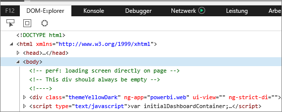
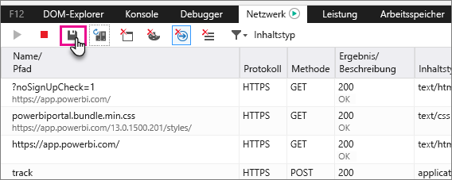

# Erfassen von zusätzlichen Diagnoseinformationen für Power BI

Dieser Artikel enthält Anweisungen für die manuelle Erfassung von zusätzlichen Diagnoseinformationen aus dem Power BI-Web-Client.

1. Navigieren Sie zu [Power BI](https://app.powerbi.com) mit Microsoft Edge oder InternetExplorer.

1. Drücken Sie **F12** zu den Microsoft Edge-Entwicklertools zu öffnen.

   

1. Wählen Sie die Registerkarte **Network** (Netzwerk) aus. Es wird der Datenverkehr aufgelistet, der bereits erfasst wurde.

   

    Sie können:

    * Navigieren Sie im Fenster, und reproduzieren Sie ggf. vorhandene Probleme, die Sie möglicherweise stoßen.

    * Ausblenden und Anzeigen des Entwicklers Fenster zu einem beliebigen Zeitpunkt während der Sitzung durch Drücken von F12.

1. Sie können das rote Quadrat auf auswählen, um die Profilerstellungssitzung zu beenden, die **Netzwerk** Registerkarte des Entwicklers tools Bereich.

   

1. Wählen Sie das Diskettensymbol, um die Daten als HTTP-Archiv (HAR)-Datei zu exportieren.

   

1. Geben Sie einen Dateinamen ein, und speichern Sie die HAR-Datei.

    Die HAR-Datei enthält alle Informationen über netzwerkanforderungen zwischen dem Browserfenster und Power BI einschließlich:

    * Die Aktivitäts-IDs für jede Anforderung.

    * Der genaue Zeitstempel für jede Anforderung.

    * Alle Fehlerinformationen, die an den Client zurückgegeben wird.

    Diese Ablaufverfolgung enthält außerdem die Daten, die zum Füllen der auf dem Bildschirm angezeigten visuellen Objekte verwendet werden.

1. Sie können die HAR-Datei angeben, um die Überprüfung zu unterstützen.

Weitere Fragen? [Stellen Sie Ihre Frage in der Power BI-Community.](http://community.powerbi.com/)
