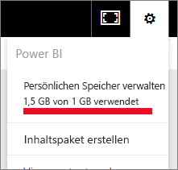

# Verwalten des Datenspeichers in Power BI-Arbeitsbereichen

Hier erfahren Sie, wie Sie den Datenspeicher in Ihrem individuellen Arbeitsbereich oder in Ihrem App-Arbeitsbereich verwalten, um sicherzustellen, dass Sie weiterhin Berichte und Datasets veröffentlichen können.

Benutzer- und App-Arbeitsbereiche weisen jeweils eigene Datenkapazitäten auf:

* Alle Benutzer verfügen über maximal 10 GB Datenspeicher.
* Benutzer mit einer Power BI Pro-Lizenz können App-Arbeitsbereiche mit jeweils maximal 10 GB Datenspeicher erstellen.
* In einer Premium-Kapazität wird ein App-Arbeitsbereich nicht auf den Speicher eines Power BI Pro-Benutzers angerechnet.

Auf Mandantenebene darf der gesamte genutzte Datenspeicher für alle Pro-Benutzer und App-Arbeitsbereiche im Mandanten 10 GB pro Pro-Benutzer nicht überschreiten.

Informieren Sie sich über weitere Funktionen des [Power BI-Preismodells](https://powerbi.microsoft.com/pricing).

Ihr Datenspeicher umfasst die eigenen Datasets und Excel-Berichte sowie die Elemente, die andere Benutzer für Sie freigegeben haben. Datasets sind alle Datenquellen, die Sie hochgeladen haben oder mit denen eine Verbindung hergestellt wurde. Zu diesen Datenquellen zählen die Dateien in Power BI Desktop und die von Ihnen verwendeten Excel-Arbeitsmappen. Folgende Elemente sind ebenfalls in der Datenkapazität enthalten:

* Excel-Bereiche, die an Dashboards angeheftet sind.
* Lokale Reporting Services-Visualisierungen, die an Power BI-Dashboards angeheftet sind.
* Hochgeladene Bilder.

Die Größe des freigegebenen Dashboards hängt von den angehefteten Elementen ab. Wenn Sie beispielsweise Elemente aus zwei Berichten anheften, die auf zwei verschiedenen Datasets basieren, wird die Größe von beiden Datasets bestimmt.

<a name="manage"/>

## Verwalten Ihrer eigenen Elemente

Prüfen Sie den in Ihrem Power BI-Konto genutzten Datenspeicher, und verwalten Sie das Konto.

1. Um den eigenen Speicher zu verwalten, wechseln Sie im linken Navigationsbereich zu **Mein Arbeitsbereich**.
   
    
2. Wählen Sie das Zahnradsymbol  in der rechten oberen Ecke \> **Persönlichen Speicher verwalten** aus.
   
    Die obere Leiste zeigt, wie viel Ihres Speicherlimits Sie verwendet haben.
   
    
   
    Die Datasets und Berichte werden auf zwei Registerkarten unterteilt:
   
    **In meinem Besitz:** Sie haben diese Berichte und Datasets in Ihr Power BI-Konto hochgeladen, darunter Dienstdatasets wie Salesforce und Dynamics CRM.  
    **Im Besitz anderer Benutzer:** Andere Benutzer haben diese Berichte und Datasets für Sie freigegeben.
1. Wählen Sie das Papierkorbsymbol aus, um ein Dataset oder einen Bericht zu löschen .

Bedenken Sie, dass Sie oder andere Benutzer über Berichte und Dashboards verfügen können, die auf einem Dataset basieren. Wenn Sie das Dataset löschen, funktionieren diese Berichte und Dashboards nicht mehr.

## Verwalten Ihres App-Arbeitsbereichs
1. Wählen Sie den Pfeil neben **Arbeitsbereiche** \> Name des App-Arbeitsbereichs aus.
   
    
2. Wählen Sie das Zahnradsymbol  in der rechten oberen Ecke \> **Gruppenspeicher verwalten** aus.
   
    Die obere Leiste zeigt, wie viel des Speicherlimits der Gruppe verwendet wurde.
   
    
   
    Die Datasets und Berichte werden auf zwei Registerkarten unterteilt:
   
    **In unserem Besitz:** Sie oder ein anderer Benutzer haben diese Berichte und Datasets in das Power BI-Konto der Gruppe hochgeladen, darunter Dienstdatasets wie Salesforce und Dynamics CRM.
    **Im Besitz anderer Benutzer:** Andere Benutzer haben diese Berichte und Datasets für Ihre Gruppe freigegeben.
3. Wählen Sie das Papierkorbsymbol aus, um ein Dataset oder einen Bericht zu löschen .
   
   > [!NOTE]
   > Jedes Mitglied eines App-Arbeitsbereichs, das über Bearbeitungsberechtigungen verfügt, ist zum Löschen von Datasets und Berichten im App-Arbeitsbereich berechtigt.
   > 
   > 

Bedenken Sie, dass Sie oder andere Benutzer in der Gruppe über Berichte und Dashboards verfügen können, die auf einem Dataset basieren. Wenn Sie das Dataset löschen, funktionieren diese Berichte und Dashboards nicht mehr.

## Dataset-Beschränkungen
Es besteht eine Beschränkung von 1 GB pro Dataset, das in Power BI importiert wird. Wenn Sie sich für die Excel-Benutzeroberfläche entschieden haben, anstatt die Daten zu importieren, beträgt die Obergrenze für das Dataset 250 MB.

## Was geschieht, wenn Sie einen Grenzwert erreichen?
Wenn Sie den Grenzwert der Datenkapazität erreichen, werden entsprechende Hinweise des Diensts angezeigt. 

Wenn Sie das Zahnradsymbol auswählen, sehen Sie einen roten Balken, der angibt, dass Sie Ihren Grenzwert der Datenkapazität überschritten haben.

Dieser Grenzwert wird auch unter **Persönlichen Speicher verwalten** angezeigt.

 

 Wenn Sie versuchen, eine Aktion auszuführen, bei der einer der Grenzwerte erreicht wird, wird Ihnen eine entsprechende Meldung angezeigt. Sie können Ihren Speicher [verwalten](#manage), um die Speichermenge zu verringern und den Grenzwert zu unterschreiten.

 

 Weitere Fragen? [Stellen Sie Ihre Frage in der Power BI-Community.](http://community.powerbi.com/)

