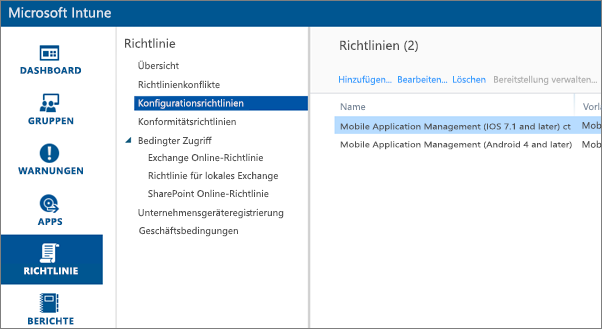
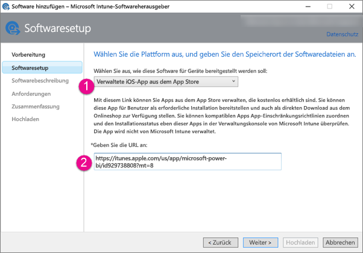
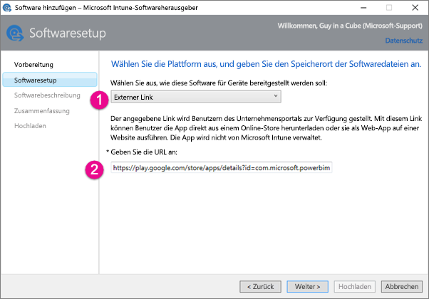
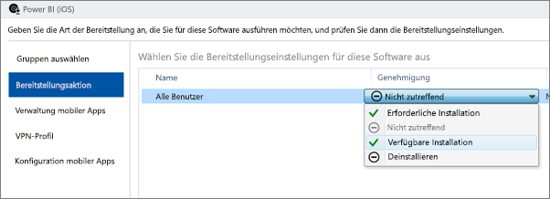
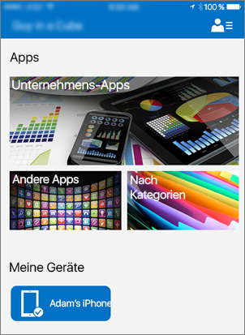

# Konfigurieren mobiler Apps mit Microsoft Intune

Microsoft Intune ermöglicht Organisationen das Verwalten von Geräten und Anwendungen. Die mobilen Power BI-Anwendungen für iOS und Android lassen sich in Intune integrieren. Dank dieser Integration können Sie die Anwendung auf Ihren Geräten verwalten und die Sicherheit kontrollieren. Über Konfigurationsrichtlinien können Sie Aktivitäten steuern, wie z.B. die folgenden: Anfordern einer Zugriffs-PIN, Festlegen der Verarbeitung von Daten durch die Anwendung und sogar Verschlüsseln von Anwendungsdaten, wenn die App nicht genutzt wird.

## Allgemeine Konfiguration für die Mobilgerätverwaltung

In diesem Artikel wird davon ausgegangen, dass Intune ordnungsgemäß konfiguriert ist und Geräte bei Intune registriert sind. Der Artikel ist nicht als vollständiger Konfigurationsleitfaden für Microsoft Intune gedacht. Weitere Informationen zu Intune finden Sie unter [Was ist Intune?](/intune/introduction-intune/).

Microsoft Intune und die Mobilgerätverwaltung (Mobile Device Management, MDM) in Office 365 können parallel genutzt werden. Wenn Sie MDM verwenden, wird das Gerät als bei MDM registriert angezeigt, steht aber zur Verwaltung in Intune zur Verfügung.

> [!NOTE]
> Nachdem Sie Intune konfiguriert haben, wird die Datenaktualisierung im Hintergrund für die mobile Power BI-App auf Ihrem iOS- oder Android-App deaktiviert. Power BI aktualisiert die Daten über den Power BI-Dienst im Web, wenn Sie die App aufrufen.

## Schritt 1: Abrufen der URL für die Anwendung

Bevor wir die Anwendung in Intune erstellen, müssen wir die URLs der Apps abrufen. Für iOS erfolgt dies über iTunes. Für Android können Sie die URL von der mobilen Power BI-Seite abrufen.

Speichern Sie die URL, da Sie sie benötigen, wenn wir die Anwendung erstellen.

### Abrufen der URL für iOS

Die App-URL für iOS müssen wir aus iTunes abrufen.

1. Öffnen Sie iTunes.

1. Suchen Sie nach *Power BI*.

1. **Microsoft Power BI** sollte unter **iPhone-Apps** und **iPad-Apps**aufgeführt sein. Sie können beide Varianten verwenden, da Sie die gleiche URL erhalten.

1. Wählen Sie die Dropdownliste **Abrufen** und dann **Link kopieren**aus.

    

Die URL sollte ungefähr wie folgt aussehen: *https://itunes.apple.com/us/app/microsoft-power-bi/id929738808?mt=8*.

### Abrufen der URL für Android

Sie können die URL zu Google Play von der [Website von Power BI Mobile](https://powerbi.microsoft.com/mobile/) abrufen. Klicken Sie auf **Von Google Play herunterladen**, um zur Seite der App zu gelangen. Kopieren Sie die URL aus der Adressleiste des Browsers. Die URL sollte ungefähr wie folgt aussehen: *https://play.google.com/store/apps/details?id=com.microsoft.powerbim*.

## Schritt 2: Erstellen einer Richtlinie für die Verwaltung mobiler Anwendungen

Die Richtlinie für die Verwaltung mobiler Anwendungen ermöglicht Ihnen das Erzwingen von Einstellungen, z. B. einer Zugriffs-PIN. Sie können eine im Intune-Portal erstellen.

Sie können zunächst die Anwendung oder die Richtlinie erstellen. Die Reihenfolge des Hinzufügens spielt keine Rolle. Beide müssen vorhanden sein, damit der Bereitstellungsschritt erfolgen kann.

1. Wählen Sie im Intune-Portal **Richtlinie** > **Konfigurationsrichtlinien** aus.

    

1. Wählen Sie **Hinzufügen**aus.

1. Unter **Software** können Sie die Mobilgeräteverwaltung (MDM) entweder für Android oder iOS auswählen. Für den Schnelleinstieg können Sie **Richtlinie mit den empfohlenen Einstellungen erstellen**  auswählen. Sie können auch eine benutzerdefinierte Richtlinie erstellen.

1. Bearbeiten Sie die Richtlinie, indem Sie die gewünschten Einschränkungen für die Anwendung konfigurieren.

## Schritt 3: Erstellen der Anwendung

Die Anwendung ist ein Verweis oder Paket, der/das für die Bereitstellung in Intune gespeichert wird. Wir müssen eine Anwendung erstellen und auf die App-URL verweisen, die wir von Google Play oder iTunes erhalten haben.

Sie können zunächst die Anwendung oder die Richtlinie erstellen. Die Reihenfolge des Hinzufügens spielt keine Rolle. Beide müssen vorhanden sein, damit der Bereitstellungsschritt erfolgen kann.

1. Wählen Sie im Intune-Portal im linken Menü **Apps** aus.

1. Wählen Sie **App hinzufügen**aus. Hierdurch wird die Anwendung **Software hinzufügen** gestartet.

### Erstellen für iOS

1. Wählen Sie in der Dropdownliste **Verwaltete iOS-App aus dem App Store** aus.

1. Geben Sie die App-URL ein, die wir in [Schritt 1](#step-1-get-the-URL-for-the-application) erhalten haben, und wählen Sie **Weiter** aus.

    

1. Füllen Sie die Felder **Herausgeber**, **Name** und **Beschreibung**aus. Sie können optional ein **Symbol**bereitstellen. Die **Kategorie** ist für die Unternehmensportal-App gedacht. Sobald Sie fertig sind, wählen Sie **Weiter**aus.

1. Sie können entscheiden, ob Sie die Anwendung als **Alle** (Standard), **iPad** oder **iPhone**veröffentlichen möchten. **Alle** wird standardmäßig angezeigt und funktioniert für beide Gerätetypen. Die URL der Power BI-App ist für iPhone und iPad identisch. Wählen Sie **Weiter**aus.

1. Wählen Sie **Hochladen**aus.

1. Wenn die App in der Liste nicht angezeigt wird, aktualisieren Sie die Seite: Wechseln Sie zu **Übersicht** und dann erneut zu **Apps**.

    

### Erstellen für Android

1. Wählen Sie in der Dropdownliste **Externer Link** aus.

1. Geben Sie die App-URL ein, die wir in [Schritt 1](#step-1-get-the-URL-for-the-application) erhalten haben, und wählen Sie **Weiter** aus.

    

1. Füllen Sie die Felder **Herausgeber**, **Name** und **Beschreibung**aus. Sie können optional ein **Symbol**bereitstellen. Die **Kategorie** ist für die Unternehmensportal-App gedacht. Sobald Sie fertig sind, wählen Sie **Weiter**aus.

1. Wählen Sie **Hochladen**aus.

1. Wenn die App in der Liste nicht angezeigt wird, aktualisieren Sie die Seite: Wechseln Sie zu **Übersicht** und dann erneut zu **Apps**.

    

## Schritt 4: Bereitstellen der Anwendung

Nachdem Sie die Anwendung hinzugefügt haben, müssen Sie sie bereitstellen, damit sie Endbenutzern zur Verfügung steht. In diesem Schritt stellen Sie die Bindung mit der Richtlinie her, die Sie mit der App erstellt haben.

### Bereitstellen für iOS

1. Wählen Sie auf dem Bildschirm „Apps“ die App aus. Wählen Sie dann den Link **Bereitstellung verwalten** aus.

    

1. Auf dem Bildschirm **Gruppen auswählen** können Sie wählen, welchen Gruppen Sie diese App bereitstellen möchten. Wählen Sie **Weiter**aus.

1. Auf dem Bildschirm **Bereitstellungsaktion** können Sie wählen, wie Sie diese App bereitstellen möchten. Bei Auswahl von **Verfügbare Installation**oder **Erforderliche Installation**wird die App Benutzern für eine bedarfsabhängige Installation im Unternehmensportal zur Verfügung gestellt. Wenn Sie Ihre Auswahl getroffen haben, wählen Sie **Weiter**aus.

    

1. Auf dem Bildschirm **Mobile App-Verwaltung** können Sie die Verwaltungsrichtlinie für mobile Apps auswählen, die wir in [Schritt 2](#step-2-create-a-mobile-application-management-policy) erstellt haben. Falls dies die einzige verfügbare iOS-Richtlinie ist, wird sie standardmäßig ausgewählt. Wählen Sie **Weiter**aus.

    

1. Auf dem Bildschirm **VPN-Profil** können Sie eine Richtlinie auswählen, falls es eine für Ihre Organisation gibt. Der Standardwert lautet **Keine**. Wählen Sie **Weiter**aus.

1. Auf dem Bildschirm **Mobile App-Konfiguration** können Sie eine **App-Konfigurationsrichtlinie** auswählen, sofern Sie eine erstellt haben. Der Standardwert lautet **Keine**. Dies ist nicht erforderlich. Wählen Sie **Fertig stellen**aus.

Nachdem Sie die App bereitgestellt haben, sollte auf der Seite „Apps“ für „Bereitgestellt“ **Ja** angezeigt werden.

### Bereitstellen für Android

1. Wählen Sie auf dem Bildschirm „Apps“ die App aus. Wählen Sie dann den Link **Bereitstellung verwalten** aus.

    
1. Auf dem Bildschirm **Gruppen auswählen** können Sie wählen, welchen Gruppen Sie diese App bereitstellen möchten. Wählen Sie **Weiter**aus.

1. Auf dem Bildschirm **Bereitstellungsaktion** können Sie wählen, wie Sie diese App bereitstellen möchten. Bei Auswahl von **Verfügbare Installation**oder **Erforderliche Installation**wird die App Benutzern für eine bedarfsabhängige Installation im Unternehmensportal zur Verfügung gestellt. Wenn Sie Ihre Auswahl getroffen haben, wählen Sie **Weiter**aus.

    

1. Auf dem Bildschirm **Mobile App-Verwaltung** können Sie die Verwaltungsrichtlinie für mobile Apps auswählen, die wir in [Schritt 2](#step-2-create-a-mobile-application-management-policy) erstellt haben. Falls dies die einzige verfügbare Android-Richtlinie ist, wird sie standardmäßig ausgewählt. Wählen Sie **Fertig stellen**aus.

    

Nachdem Sie die App bereitgestellt haben, sollte auf der Seite „Apps“ für „Bereitgestellt“ **Ja** angezeigt werden.

## Schritt 5: Installieren der Anwendung auf einem Gerät

Sie installieren die Anwendung über die *Unternehmensportal*-App. Wenn Sie das Unternehmensportal nicht installiert haben, können Sie es über den App Store für entweder die iOS- oder die Android-Plattform abrufen. Sie melden sich mit den Anmeldeinformationen Ihrer Organisation am Unternehmensportal an.

1. Öffnen Sie die Unternehmensportal-App.

1. Wenn die Power BI-App nicht als empfohlene App angezeigt wird, wählen Sie **Unternehmens-Apps**aus.

    

1. Wählen Sie die Power BI-App aus, die Sie bereitgestellt haben.

    

1. Wählen Sie **Installieren**aus.

    

1. Wenn Sie iOS nutzen, wird die App per Push für Sie übertragen. Wählen Sie im Dialogfeld „Push“ **Installieren** aus.

    

1. Nachdem die App installiert wurde, wird sie als **Von Ihrem Unternehmen verwaltet** angezeigt. Wenn Sie in der Richtlinie den Zugriff per PIN aktiviert haben, wird Folgendes angezeigt.

    

## Nächste Schritte

[Konfigurieren und Bereitstellen von Richtlinien zur Verwaltung mobiler Anwendungen in der Microsoft Intune-Konsole](/intune/app-protection-policies/)  

[Power BI-Apps für mobile Geräte](consumer/mobile/mobile-apps-for-mobile-devices.md)  

Weitere Fragen? [Stellen Sie Ihre Frage in der Power BI-Community.](http://community.powerbi.com/)  