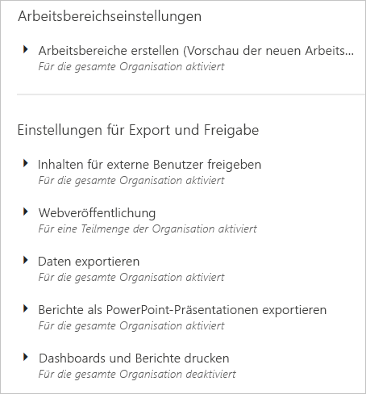
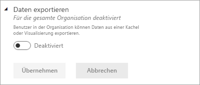
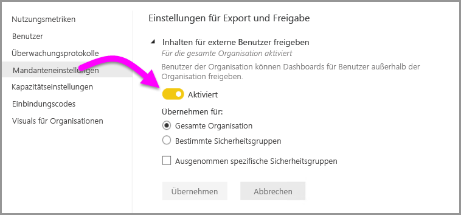
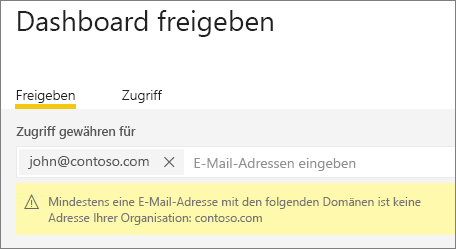
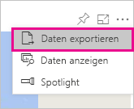
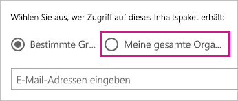
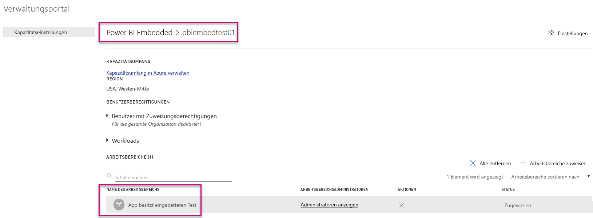
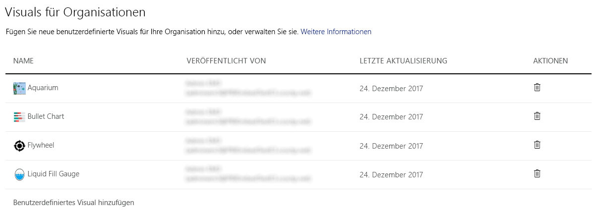
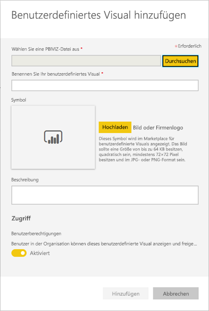

# Power BI-Verwaltungsportal

Das Verwaltungsportal ermöglicht die Mandantenverwaltung von Power BI in Ihrer Organisation. Es enthält Elemente wie z. B. Nutzungsmetriken und Zugriff auf das Office 365 Admin Center und die Einstellungen.

Die Mandantenverwaltung von Power BI für Ihr Unternehmen erfolgt über das Power BI-Verwaltungsportal. Auf das Verwaltungsportal können alle Benutzer zugreifen, die globale Administratoren in Office 365 sind oder der Power BI-Dienstadministratorrolle zugewiesen wurden. Weitere Informationen zur Power BI-Dienstadministratorrolle finden Sie unter [Grundlegendes zur Power BI-Administratorrolle](service-admin-role.md).

Für alle Benutzer wird unter dem Zahnradsymbol das **Verwaltungsportal** angezeigt. Ein Benutzer ohne Administratorrechte sieht nur den Abschnitt **Premium-Einstellungen** und nur die Kapazitäten, für die er Verwaltungsberechtigungen besitzt.

## Gewusst wie: Anzeigen des Verwaltungsportals

Ihr Konto muss in Office 365 oder Azure Active Directory als **Globaler Administrator** markiert oder der Power BI-Dienstadministratorrolle zugewiesen sein, damit Sie Zugriff auf das Power BI-Verwaltungsportal erhalten. Weitere Informationen zur Power BI-Dienstadministratorrolle finden Sie unter [Grundlegendes zur Power BI-Administratorrolle](service-admin-role.md). Führen Sie zum Zugreifen auf das Power BI-Verwaltungsportal die folgenden Schritte aus.

1. Wählen Sie das Zahnradsymbol für die Einstellungen oben rechts im Power BI-Dienst aus.
2. Wählen Sie **Verwaltungsportal** aus.

Innerhalb des Portals gibt es sechs Registerkarten. Diese werden nachfolgend beschrieben.

* [Nutzungsmetriken](#usage-metrics)
* [Benutzer](#users)
* [Überwachungsprotokolle](#audit-logs)
* [Mandanteneinstellungen](#tenant-settings)
* [Premium-Einstellungen](#premium-settings)
* [Einbindungscodes](#embed-codes)
* [Visuals für Organisationen](#Organization-visuals)

## Nutzungsmetriken
Die erste Registerkarte im Verwaltungsportal heißt **Nutzungsmetriken**. Der Bericht zu den Nutzungsmetriken erlaubt Ihnen das Überwachen der Nutzung in Power BI für Ihre Organisation. Außerdem können Sie darüber feststellen, welche Benutzer und Gruppen in Power BI für Ihre Organisation am aktivsten sind.

> [!NOTE]
> Beim ersten Zugriff auf das Dashboard oder beim Anzeigen des Dashboards nach einem längeren Zeitraum wird zunächst wahrscheinlich ein Ladebildschirm angezeigt, während das Dashboard geladen wird.

Nachdem das Dashboard geladen wurde, werden zwei Abschnitte mit Kacheln angezeigt. Der erste Abschnitt enthält Nutzungsdaten für einzelne Benutzer, und der zweite Abschnitt enthält ähnliche Informationen für die Gruppen in Ihrer Organisation.

Im Folgenden sehen Sie, was in den einzelnen Kacheln angezeigt wird:

* Anzahl der verschiedenen Dashboards, Berichte und Datasets im Arbeitsbereich eines Benutzers
  
    

* Das am häufigsten verwendete Dashboard nach Anzahl von Benutzern, die darauf zugreifen können. Wenn Sie z. B. ein Dashboard für drei Benutzer freigegeben haben und dieses auch einem Inhaltspaket hinzugefügt haben, mit dem zwei andere Benutzer verbunden sind, beträgt die Anzahl 6 (1 + 3 + 2).
  
    

* Der beliebteste Inhalt, mit dem Benutzer Verbindungen herstellen. Dies kann alles sein, worauf Benutzer durch den Vorgang zum Abrufen von Daten zugreifen können, z. B. SaaS-Pakete, organisationsbezogene Inhaltspakete, Dateien oder Datenbanken.
  
    

* Eine Ansicht der aktivsten Benutzer basierend auf der Anzahl von Dashboards. Dies können von den Benutzern selbst erstellte Dashboards sein, aber auch Dashboards, die für sie freigegeben wurden.
  
    

* Eine Ansicht der aktivsten Benutzer basierend auf der Anzahl von Berichten
  
    

Der zweite Abschnitt zeigt dieselben Informationen basierend auf Gruppen an. So können Sie sehen, welche Gruppen in Ihrer Organisation besonders aktiv sind und welche Art von Informationen sie verwenden.

Mit diesen Informationen erhalten Sie wichtige Einblicke in die Verwendung von Power BI in Ihrer Organisation. Außerdem können Sie sehr schnell ermitteln, welche Benutzer und Gruppen in Ihrer Organisation besonders aktiv sind.

## Benutzer

Die zweite Registerkarte im Verwaltungsportal ist **Benutzer verwalten**. Die Benutzerverwaltung für Power BI erfolgt im Office 365 Admin Center. Über diesen Bereich erreichen Sie sehr schnell die Bereiche zum Verwalten von Benutzern, Administratoren und Gruppen in Office 365.

Wenn Sie auf **Zum O365 Admin Center wechseln** klicken, gelangen Sie direkt zur Startseite von Office 365 Admin Center, auf der Sie die Benutzer Ihres Mandanten verwalten können.

## Überwachungsprotokolle

Die dritte Registerkarte im Verwaltungsportal ist **Überwachungsprotokolle**. Die Protokolle sind im Office 365 Security & Compliance Center gespeichert. Über diesen Abschnitt können Sie schnell auf diesen Bereich in Office 365 zugreifen.

Weitere Informationen zu Überwachungsprotokollen finden Sie unter [Überwachen von Power BI in Ihrer Organisation](service-admin-auditing.md).

## Mandanteneinstellungen

Die dritte Registerkarte im Verwaltungsportal ist **Mandanteneinstellungen**. Über die Mandanteneinstellungen können Sie besser steuern, welche Features in Ihrer Organisation zur Verfügung gestellt werden. Wenn Sie über vertrauliche Daten verfügen, die geschützt werden müssen, sind möglicherweise einige unserer Features für Ihre Organisation nicht sinnvoll, oder Sie können ein bestimmtes Feature nur für eine bestimmte Gruppe verfügbar machen. Sie können diese Funktion in diesem Fall in Ihrem Mandanten deaktivieren.

> [!NOTE]
> Es dauert bis zu zehn Minuten, bis die Einstellung für alle Benutzer in Ihrem Mandanten wirksam werden.

Einstellungen können drei Zustände aufweisen:

* **Für die gesamte Organisation deaktiviert:** Sie können ein Feature deaktivieren und festlegen, sodass es nicht von Benutzern verwendet werden kann.

    

* **Für die gesamte Organisation aktiviert:** Sie können ein Feature für die gesamte Organisation aktivieren, sodass alle Benutzer Zugriff auf dieses Feature haben.

    

* **Für eine Teilmenge der Organisation aktiviert:** Sie können ein Feature auch für einen Teil Ihrer Organisation aktivieren. Dies kann auf unterschiedliche Weise erfolgen. Sie können das Feature für die gesamte Organisation mit Ausnahme einer bestimmten Gruppe von Benutzern aktivieren.

    

    Sie können auch das Feature nur für eine bestimmte Gruppe von Benutzern aktivieren und außerdem für eine Gruppe von Benutzern deaktivieren. So stellen Sie sicher, dass bestimmte Benutzer keinen Zugriff auf das Feature haben, auch wenn sie Mitglied der Gruppe sind, für die der Zugriff aktiviert ist.

    

Die nächsten Abschnitte bieten einen Überblick über die verschiedenen Arten von Mandanteneinstellungen.

## Arbeitsbereichseinstellungen

### Erstellen von Arbeitsbereichen (Vorschau)
Benutzer in der Organisation können App-Arbeitsbereiche erstellen, um gemeinsam an Dashboards, Berichten und anderen Inhalten zu arbeiten.

Weitere Informationen finden Sie unter [Erstellen der neuen Arbeitsbereiche](service-create-the-new-workspaces.md).

## Einstellungen für Export und Freigabe

### Freigeben von Inhalten für externe Benutzer

Benutzer in der Organisation können Dashboards für Benutzer außerhalb der Organisation freigeben.

Hier sehen Sie die Meldung, die bei der Freigabe für einen externen Benutzer angezeigt wird.

### Im Web veröffentlichen

Benutzer in der Organisation können Berichte im Web veröffentlichen. [Weitere Informationen](service-publish-to-web.md)

Den Benutzer werden in der Benutzeroberfläche unterschiedliche Optionen angezeigt, abhängig von der Einstellung zum Veröffentlichen im Web.

|Ausgewählt |Für die gesamte Organisation aktiviert |Für die gesamte Organisation deaktiviert |Bestimmte Sicherheitsgruppen   |
|---------|---------|---------|---------|
|**Im Web veröffentlichen** im Menü **Datei** des Berichts.|Für alle aktiviert|Nicht für alle sichtbar|Nur für autorisierte Benutzer oder Gruppen sichtbar|
|**Einbindungscodes verwalten** unter **Einstellungen**|Für alle aktiviert|Für alle aktiviert|Für alle aktiviert  Option * **Löschen** nur für autorisierte Benutzer oder Gruppen * **Codes abrufen** für alle aktiviert|
|**Einbindungscodes** im Verwaltungsportal|Es wird einer der folgenden Statuswerte angezeigt: * Aktiv * Nicht unterstützt * Blockiert|Angezeigter Status **Deaktiviert**|Es wird einer der folgenden Statuswerte angezeigt: * Aktiv * Nicht unterstützt * Blockiert  Wenn ein Benutzer gemäß den Mandanteneinstellungen nicht autorisiert ist, wird als Status **Verletzt** angezeigt.|
|Vorhandene veröffentlichte Berichte|Alle aktiviert|Alle deaktiviert|Berichte werden weiterhin für alle gerendert.|

### Daten exportieren

Benutzer in der Organisation können Daten aus einer Kachel oder Visualisierung exportieren. [Weitere Informationen](consumer/end-user-export-data.md)

> [!NOTE]
> Durch das Deaktivieren von **Daten exportieren** wird zudem verhindert, dass Benutzer das Feature **In Excel analysieren** sowie die Liveverbindung des Power BI-Diensts verwenden können.

### Berichte als PowerPoint-Präsentationen exportieren

Benutzer in der Organisation können Power BI-Berichte als PowerPoint-Dateien exportieren. [Weitere Informationen](consumer/end-user-powerpoint.md)

### Drucken von Dashboards und Berichten

Benutzer in der Organisation können Dashboards und Berichte drucken. [Weitere Informationen](consumer/end-user-print.md)

## Inhaltspaketeinstellungen

### Inhaltspakete für gesamte Organisation veröffentlichen

Benutzer in der Organisation können Inhaltspakete in der gesamten Organisation veröffentlichen.

### Erstellen von Vorlagenpaketen mit Organisationsinhalten

Benutzer in der Organisation können Vorlageninhaltspakete erstellen, die Datasets verwenden, die auf einer Datenquelle in Power BI Desktop basieren.

### Apps mittels Push an Endbenutzer übertragen

Ihr Mandantenadministrator kann die Fähigkeit, Apps mithilfe von Push zu übertragen, in den **Mandanteneinstellungen** aktivieren.

   

Sie können die Einstellung in **Aktiviert** ändern und anschließend angeben, wer diese Funktion nutzen kann (die gesamte Organisation oder bestimmte Sicherheitsgruppen).

> [!NOTE]
> Bedenken Sie, dass es einige Zeit dauern kann, bis Änderungen an den Mandanteneinstellungen in Kraft treten.

Weitere Informationen finden Sie unter [Push apps (Übertragen von Apps mithilfe von Push)](consumer/end-user-create-apps.md#how-to-install-an-app-automatically-for-end-users).

## Integrationseinstellungen

### Stellen von Fragen zu Daten mithilfe von Cortana

Benutzer in der Organisation können mithilfe von Cortana Fragen zu ihren Daten stellen.

> [!NOTE]
> Diese Einstellung gilt für die gesamte Organisation und kann nicht auf bestimmte Gruppen beschränkt werden.

### Verwenden von In Excel analysieren mit lokalen Datasets

Benutzer in der Organisation können Excel verwenden, um lokale Power BI-Datasets anzuzeigen und mit ihnen zu interagieren. [Weitere Informationen](service-analyze-in-excel.md)

> [!NOTE]
> Durch das Deaktivieren von **Daten exportieren** wird außerdem verhindert, dass Benutzer das Feature **In Excel analysieren** verwenden.

### Verwenden von ArcGIS Maps for Power BI

Benutzer in der Organisation können die Visualisierung ArcGIS Maps for Power BI von Esri verwenden. [Weitere Informationen](power-bi-visualization-arcgis.md)

### Verwenden der globalen Suche für Power BI (Vorschau)

Benutzer in der Organisation können externe Suchfeatures verwenden, die auf Azure Search basieren. Benutzer können beispielsweise Cortana zum Abrufen wichtiger Informationen direkt aus Power BI-Dashboards und -Berichten verwenden. [Weitere Informationen](service-cortana-intro.md)

## Einstellungen für benutzerdefinierte Visuals

### Aktivieren benutzerdefinierter Visuals für die gesamte Organisation

Benutzer in der Organisation können mit benutzerdefinierten Visuals interagieren und diese freigeben. [Weitere Informationen](power-bi-custom-visuals.md)

> [!NOTE]
> Diese Einstellung gilt für die gesamte Organisation und kann nicht auf bestimmte Gruppen beschränkt werden.

## Einstellungen für R-Visualisierungen

### Mit visuellen R-Elementen interagieren und diese freigeben

Benutzer in der Organisation können mit visuellen Elementen, die mit R-Skripts erstellt wurden, interagieren und diese freigeben. [Weitere Informationen](visuals/service-r-visuals.md)

> [!NOTE]
> Diese Einstellung gilt für die gesamte Organisation und kann nicht auf bestimmte Gruppen beschränkt werden.

## Überwachungs- und Nutzungseinstellungen

### Überwachungsprotokolle für interne Aktivitätsüberwachung und Compliance erstellen

Benutzer in der Organisation können Aktionen überwachen, die in Power BI von anderen Benutzern in der Organisation ausgeführt werden. [Weitere Informationen](service-admin-auditing.md)

Diese Einstellung muss aktiviert sein, damit Überwachungsprotokolleinträge aufgezeichnet werden. Es kann bis zu 48 Stunden nach der Aktivierung der Überwachung dauern, bis Sie Überwachungsdaten einsehen können. Wenn Sie nicht umgehend Daten sehen, überprüfen Sie die Überwachungsprotokolle später noch einmal. Es kann zu einer ähnlichen Verzögerung kommen, nachdem Ihnen die Leseberechtigung für Überwachungsprotokolle erteilt wurde und bis Sie die Protokolle ansehen können.

> [!NOTE]
> Diese Einstellung gilt für die gesamte Organisation und kann nicht auf bestimmte Gruppen beschränkt werden.

### Nutzungsmetriken für Inhaltsersteller
Benutzer in der Organisation können Nutzungsmetriken für von ihnen erstellte Dashboards und Berichte anzeigen. [Weitere Informationen](service-usage-metrics.md).

Sie können die Einstellung in **Aktiviert** ändern und anschließend angeben, wer Nutzungsmetriken sehen kann (die gesamte Organisation oder bestimmte Sicherheitsgruppen).

> [!NOTE]
> Bedenken Sie, dass es einige Zeit dauern kann, bis Änderungen an den Mandanteneinstellungen in Kraft treten.

### Benutzerspezifische Daten in Nutzungsmetriken für Inhaltsersteller
Nutzungsmetriken für Inhaltsersteller machen Anzeigenamen und E-Mail-Adressen von Benutzern verfügbar, die auf Inhalte zugreifen. [Weitere Informationen](service-usage-metrics.md).

Sie können die Einstellung in **Aktiviert** ändern und anschließend angeben, wer Anzeigenamen und E-Mail-Adressen in den Nutzungsmetriken sehen kann (die gesamte Organisation oder bestimmte Sicherheitsgruppen).

Die benutzerspezifischen Daten sind standardmäßig für die Nutzungsmetriken aktiviert, und die Kontoinformationen vom Ersteller des Inhalts sind im Bericht zu den Nutzungsmetriken enthalten. Wenn Sie diese Informationen für einige oder alle Benutzer nicht miteinbeziehen möchten, deaktivieren Sie das Feature für angegebene Sicherheitsgruppen oder eine gesamte Organisation. Die Kontoinformationen werden im Bericht dann als *Unnamed* (Unbenannt) angezeigt.

> [!NOTE]
> Bedenken Sie, dass es einige Zeit dauern kann, bis Änderungen an den Mandanteneinstellungen in Kraft treten.

## Dashboardeinstellungen

### Datenklassifizierung für Dashboards

Benutzer in der Organisation können Dashboards mit Klassifizierungen markieren, die Dashboardsicherheitsstufen angeben. [Weitere Informationen](service-data-classification.md)

> [!NOTE]
> Diese Einstellung gilt für die gesamte Organisation und kann nicht auf bestimmte Gruppen beschränkt werden.

## Entwicklereinstellungen

### Inhalt in Apps einbetten

Benutzer in der Organisation können Power BI-Dashboards und -Berichte in SaaS-Anwendungen (Software as a Service) einbetten. Ist diese Einstellung deaktiviert, können Benutzer die REST-APIs nicht dazu verwenden, um Power BI-Inhalt in ihre Anwendungen einzubetten.

## Kapazitätseinstellungen

### Premium-Einstellungen

Über die Registerkarte „Premium-Einstellungen“ können Sie jede Power BI Premium-Kapazität (EM- oder P-SKU) verwalten, die für Ihre Organisation erworben wurde. Alle Benutzer in Ihrer Organisation sehen die Registerkarte „Premium-Einstellungen“, können deren Inhalt aber nur anzeigen, wenn sie entweder als **Kapazitätsadministrator** oder als Benutzer mit Zuweisungsberechtigungen konfiguriert sind. Hat ein Benutzer keine Berechtigungen, wird die folgende Meldung angezeigt.

Weitere Informationen zum Verwalten von Premium-Einstellungen finden Sie unter [Verwalten von Power BI Premium](service-admin-premium-manage.md).

### Power BI Embedded-Einstellungen

Auf der Registerkarte „Power BI Embedded-Einstellungen“ können Sie die Power BI Embedded-Kapazitäten (A-SKU) anzeigen, die Sie für Ihren Kunden erworben haben. Da es nur möglich ist, A-SKUs von Azure zu erwerben, können Sie [verwaltete Embedded-Kapazitäten in Azure](developer/azure-pbie-create-capacity.md) über das **Azure-Portal** verwalten.

Weitere Informationen zum Verwalten von Power BI Embedded-Einstellungen (A-SKU) finden Sie unter [Was ist Power BI Embedded?](developer/azure-pbie-what-is-power-bi-embedded.md).

## Einbindungscodes

Als Administrator können Sie die Einbindungscodes anzeigen, die für Ihren Mandanten generiert werden. Als Aktionen können Sie den Bericht anzeigen und den Einbindungscode löschen, um ihn zu widerrufen.

## Visuals für Organisationen

Durch die Registerkarte „organization visuals“ (Visuals für Organisationen) können Sie benutzerdefinierte Visuals innerhalb Ihrer Organisation bereitstellen und verwalten. Somit können Sie proprietäre benutzerdefinierte Visuals einfach in der Organisation bereitstellen, damit Berichtsautoren diese einfach ermitteln und direkt von Power BI Desktop in ihre Berichte importieren können.

Die Seite zeigt alle benutzerdefinierten Visuals an, die derzeit im Repository der Organisation bereitgestellt werden.

### Hinzufügen eines neuen benutzerdefinierten Visuals

Klicken Sie auf **Benutzerdefiniertes Visual hinzufügen**, um ein neues benutzerdefiniertes Visual zur Liste hinzuzufügen.

> [!WARNING]
> Ein benutzerdefiniertes Visual kann Code mit Sicherheits- oder Datenschutzrisiken enthalten. Stellen Sie sicher, dass Sie dem Autor und der Quelle des benutzerdefinierten Visuals vertrauen können, bevor Sie dieses im Repository der Organisation bereitstellen.

Füllen Sie folgende Felder aus:

* Auswählen einer PBIVIZ-Datei (erforderlich): Wählen Sie eine benutzerdefinierte Visualdatei für den Upload aus. Nur benutzerdefinierte Visuals mit API-Versionsangabe werden unterstützt (lesen Sie hier nach, was dies bedeutet).

Bevor Sie ein benutzerdefiniertes Visual hochladen, sollten Sie dieses auf Sicherheit und Datenschutz überprüfen, um sicherzustellen, dass das Visual die Standards Ihrer Organisation erfüllt. Holen Sie weitere Informationen zur Sicherheit von benutzerdefinierten Visuals ein.

* Benennen Ihrer benutzerdefinierten Visuals (erforderlich): Geben Sie dem Visual einen kurzen Titel, damit die Benutzer von Power BI Desktop dessen Zweck leichter nachvollziehen können.

* Symbol (erforderlich): Die Symboldatei, die in der Benutzeroberfläche von Power BI Desktop angezeigt wird.

* Beschreibung: eine kurze Beschreibung des Visuals, um den Benutzern zusätzlichen Kontext bereitzustellen

Klicken Sie auf „Anwenden“, um die Uploadanforderung zu initiieren. Wenn der Upload erfolgreich ist, wird das neue Element in der Liste angezeigt. Ist der Vorgang nicht erfolgreich, erhalten Sie eine entsprechende Fehlermeldung.

### Löschen eines benutzerdefinierten Visuals aus der Liste

Klicken Sie auf das Papierkorbsymbol, um das Visual dauerhaft aus dem Repository zu löschen.
Wichtig: Der Löschvorgang ist nicht umkehrbar. Sobald das Visual gelöscht wurde, wird es in vorhandenen Berichten nicht mehr gerendert. Wenn Sie dasselbe Visual erneut hochladen, ersetzt dieses nicht das vorherige Visual, das gelöscht wurde. Die Benutzer können das neue Visual importieren und die Instanz ersetzen, die in ihren Berichten vorhanden ist.

### Deaktivieren eines benutzerdefinierten Visuals in der Liste

Um das Visual im Organisationsspeicher zu deaktivieren, wählen Sie das Zahnradsymbol aus. Deaktivieren Sie das benutzerdefinierte Visual im Abschnitt **Zugriff**.

Nachdem Sie das Visual deaktiviert haben, wird es in vorhandenen Berichten nicht mehr gerendert, und es wird die nachstehende Fehlermeldung angezeigt.

*Dieses benutzerdefinierte Visual ist nicht mehr verfügbar. Wenden Sie sich an Ihren Administrator, um Einzelheiten zu erfahren.*

Visuals, für die ein Lesezeichen festgelegt wurde, funktionieren jedoch weiterhin.

Power BI Desktop-Benutzer müssen die Anwendung nach einem Update oder einer Administratoränderung neu starten oder den Browser im Power BI-Dienst aktualisieren, um die Aktualisierungen anzuzeigen.

### Aktualisieren eines Visuals

Wenn Sie ein Visual im Repository aktualisieren möchten, weil es eine neue Version des Visuals gibt (z.B. Fehlerkorrekturen, neue Funktionen usw.), wählen Sie das Symbol **Aktualisieren**, und laden Sie die neue Datei hoch. Stellen Sie sicher, dass die Visual-ID unverändert bleibt. Die neue Datei ersetzt die vorherige Datei für alle Berichte in der gesamten Organisation. Wenn jedoch die neue Version des Visuals irgendeine Verwendung oder Datenstruktur der vorherigen Version des Visuals beeinträchtigen könnte, ersetzen Sie die vorherige Version nicht. Stattdessen sollten Sie einen neuen Eintrag für die neue Version des Visuals erstellen. Fügen Sie beispielsweise eine neue Versionsnummer (Version X.X) zum Titel des neuen gelisteten Visuals hinzu. Auf diese Weise wird deutlich, dass es sich nur um das gleiche Visual mit einer aktualisierten Versionsnummer handelt, sodass die Funktionalität bestehender Berichte nicht beeinträchtigt wird. Stellen Sie erneut sicher, dass die Visual-ID unverändert bleibt. Wenn die Benutzer das Repository der Organisation das nächste Mal über Power BI Desktop verwenden, können sie die neue Version importieren. Sie werden in diesem Fall aufgefordert, die aktuelle Version zu ersetzen, die sich im Bericht befindet.

## Nächste Schritte

[Grundlegendes zur Power BI-Administratorrolle](service-admin-role.md)  
[Überwachen von Power BI in Ihrer Organisation](service-admin-auditing.md)  
[Verwalten von Power BI Premium](service-admin-premium-manage.md)  
[Verwalten von Power BI in Ihrer Organisation](service-admin-administering-power-bi-in-your-organization.md)  

Weitere Fragen? [Stellen Sie Ihre Frage in der Power BI-Community.](http://community.powerbi.com/)
