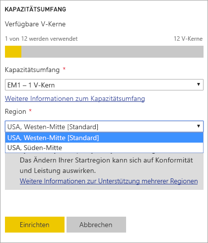
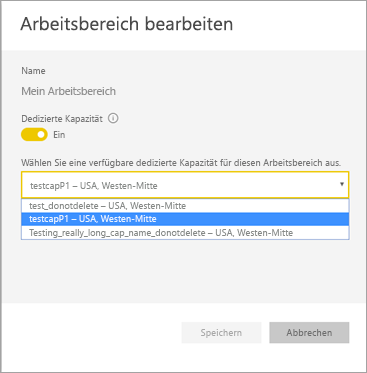

# Multi-Geo-Unterstützung für Power BI Premium (Vorschau)

Multi-Geo ist ein Power BI Premium-Feature, das multinationale Kunden bei der Erfüllung von regionalen, branchenspezifischen oder organisationsbezogenen Data Residency-Anforderungen unterstützt. Als Power BI Premium-Kunde können Sie Inhalte für Rechenzentren in anderen Regionen als der ursprünglichen Region des Power BI-Mandanten bereitstellen. Eine geografische Region (Geografie) kann mehr als eine Region umfassen. Die USA sind z.B. eine geografische Region und „USA, Westen-Mitte“ und „USA, Süden-Mitte“ Regionen innerhalb der USA. Außerdem können Sie Inhalte für eine der folgenden geografischen Regionen bereitstellen:

- USA
- Canada
- United Kingdom
- Brazil
- Europa
- Japan
- India
- Asien-Pazifik
- Australia

Multi-Geo ist nicht für Power BI Deutschland, Power BI China (betrieben von 21Vianet) oder Power BI für die US-Regierung verfügbar.

Multi-Geo steht ab sofort auch in Power BI Embedded zur Verfügung. Weitere Informationen finden Sie unter [Multi-Geo-Unterstützung in Power BI Embedded (Vorschau)](developer/embedded-multi-geo.md).

## Verwendung von Multi-Geo

Aktivieren Sie für die Verwendung der neuen Funktionen Multi-Geo, indem Sie eine andere Region als die Standardregion aus der Dropdownliste auswählen.  Jede verfügbare Kapazität zeigt die Region an, in der sie sich zurzeit befindet, z.B. **USA, Westen-Mitte**.

Nachdem Sie die Kapazität erstellt haben, verbleibt sie in dieser Region und die Inhalte aller erstellten Arbeitsbereiche werden in dieser Region gespeichert. Auf der Seite mit den Arbeitsbereichseinstellungen können Sie über die Dropdownliste Arbeitsbereiche von einer Region zu einer anderen migrieren.

Diese Meldung wird angezeigt, um die Änderung zu bestätigen.

Die Gatewayanmeldeinformationen müssen bei der Migration gegenwärtig nicht zurückgesetzt werden.  Nachdem sie in der Region der Premium-Kapazität gespeichert wurden, müssen Sie sie bei der Migration zurückzusetzen.

Bei der Migration tritt bei bestimmten Vorgängen möglicherweise ein Fehler auf, wie etwa beim Veröffentlichen neuer Datasets oder bei geplanten Datenaktualisierungen.  

Die folgenden Elemente werden in der Premium-Region gespeichert, sofern Multi-Geo aktiviert ist:

- Modelle (ABF-Dateien) für Import- und DirectQuery-Datasets
- Abfragecache
- R-Grafiken

Diese Elemente bleiben in der ursprünglichen Region des Mandanten:

- Pushdatasets
- Excel-Arbeitsmappen
- Dashboard-/Berichtsmetadaten, z.B. Kachelnamen, Kachelabfragen
- Service Busse für Gatewayabfragen oder geplante Aktualisierungsaufträge
- Berechtigungen
- Datasetanmeldeinformationen

## Anzeigen von Kapazitätsregionen

Im Verwaltungsportal können Sie alle Kapazitäten für Ihren Power BI-Mandanten und die Regionen anzeigen, in denen sie sich aktuell befinden.

 

## Ändern der Region für vorhandene Inhalte

Wenn Sie die Region für vorhandene Inhalte ändern müssen, stehen Ihnen zwei Optionen zur Verfügung.

- Erstellen Sie eine zweite Kapazität, und verschieben Sie Arbeitsbereiche. Bei freigegebenen Benutzern treten keine Ausfallzeiten auf, solange der Mandant über zusätzliche virtuelle Kerne verfügt.
- Wenn die Erstellung einer zweiten Kapazität nicht infrage kommt, können Sie den Inhalt vorübergehend in eine gemeinsam genutzte Kapazität der Premium-Kapazität verschieben. Zusätzliche virtuelle Kerne sind nicht erforderlich, aber bei freigegebenen Benutzern treten Ausfallzeiten auf.

## Verschieben von Inhalten aus Multi-Geo  

Sie haben zwei Möglichkeiten, Arbeitsbereiche aus der Multi-Geo-Kapazität zu entfernen:

- Löschen Sie die aktuelle Kapazität, in der sich der Arbeitsbereich befindet.  Dadurch wird der Arbeitsbereich wieder in die gemeinsam genutzte Kapazität in der ursprünglichen Region verschoben.
- Migrieren Sie einzelne Arbeitsbereiche wieder zur Premium-Kapazität, die sich in dem Mandanten in der ursprünglichen Region befindet.

## Einschränkungen und Überlegungen

- Vergewissern Sie sich, dass Sie bei Verschiebungen zwischen Regionen alle unternehmensspezifischen und gesetzlichen Complianceanforderungen erfüllen, bevor Sie eine Datenübertragung initiieren.
- Eine zwischengespeicherte Abfrage, die sich in einer weit entfernten Region befindet, verbleibt in dieser Region im Ruhezustand. Allerdings werden andere in Übertragung begriffene Daten möglicherweise zwischen mehreren geografischen Regionen hin und her verschoben.
- Beim Verschieben von Daten aus einer Region in eine andere in einer Multi-Geo-Umgebung können die Quelldaten bis zu 30 Tage lang in der Region verbleiben, von der aus die Daten verschoben wurden. In diesem Zeitraum haben Benutzer keinen Zugriff auf diese. Nach Ablauf der 30 Tage werden sie aus dieser Region entfernt und gelöscht.
- Multi-Geo führt in der Regel nicht zur Leistungssteigerung. Für das Laden von Berichten und Dashboards sind weiterhin Anforderungen an die ursprüngliche Region für Metadaten erforderlich.
- Das [Dataflows](service-dataflows-overview.md)-Feature (Vorschauversion) wird aktuell für Multi-Geo nicht unterstützt.

## Nächste Schritte

- [Was ist Microsoft Power BI Premium Was ist das?](service-premium.md)
- [Multi-Geo für Power BI Embedded-Kapazitäten](developer/embedded-multi-geo.md)

Weitere Fragen? [Stellen Sie Ihre Frage in der Power BI-Community.](http://community.powerbi.com/)
