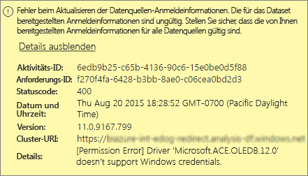
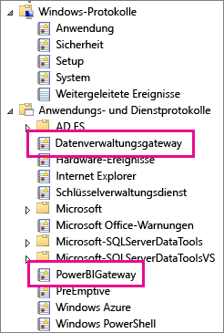
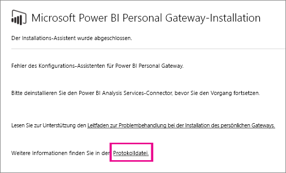

# Problembehandlung für Power BI Gateway – Personal
In den folgenden Abschnitten wechseln Sie über einige häufig auftretende Probleme, die Sie stoßen können, wenn Sie die Power BI Gateway-Personal verwenden.

> [!NOTE]
> Die aktuelle Version des Gateways für den persönlichen Gebrauch ist das **lokale Datengateway (Personal)**. Aktualisieren Sie Ihre Installation mit dieser Version.
> 
> 

## Aktualisieren auf die neueste Version
Viele Probleme können auftreten, wenn die gatewayversion veraltet ist.  Es ist allgemein empfohlen, stellen Sie sicher, dass Sie die neueste Version verwenden. Wenn Sie das Gateway einen Monat oder länger nicht aktualisiert haben, sollten Sie die neueste Version des Gateways installieren. Prüfen Sie, ob Sie das Problem reproduzieren können.

## Installation
**Personal Gateway ist 64-Bit-** – Wenn Ihr Computer die 32-Bit ist, können nicht Sie personal Gateway installieren. Das Betriebssystem muss 64-Bit-Version sein. Eine 64-Bit-Version von Windows zu installieren, oder Installieren von personal Gateway auf einem 64-Bit-Computer.

**Fehler bei Personal Gateway als Dienst zu installieren, auch wenn Sie ein lokaler Administrator für den Computer sind** -Installation kann fehlschlagen, wenn der Benutzer Mitglied der Gruppe zu lokalen Administratoren des Computers ist, aber die Gruppenrichtlinie nicht als Anmeldung dieses Benutzernamens ermöglichen eine -Dienst. Stellen Sie sicher, dass die Gruppenrichtlinie einen Benutzer, die als Dienst anmelden können, im Moment. Wir arbeiten an einer Korrektur für dieses Problem. [Weitere Informationen](https://technet.microsoft.com/library/cc739424.aspx)

**Timeout beim Vorgang** : Diese Meldung ist häufig auf, wenn der Computer (physischer Computer oder VM), auf dem Sie personal Gateway installieren, über einen Einzelkernprozessor verfügt. Schließen Sie eventuell geöffnete Anwendungen, deaktivieren Sie alle nicht benötigten Prozesse, und versuchen Sie die Installation erneut.

**Data Management Gateway, oder Analysis Services Connector kann nicht auf demselben Computer wie personal Gateway installiert werden** – Wenn bereits ein Analysis Services Connector oder Datenverwaltungsgateway installiert ist, müssen Sie zuerst den Connector deinstallieren oder Das Gateway. Versuchen Sie dann das personal Gateway installieren.

> [!NOTE]
> Wenn Sie während der Installation ein Fehler auftritt, bieten die Setupprotokolle Informationen, damit Sie das Problem zu beheben. Weitere Informationen finden Sie unter [Setupprotokolle](#SetupLogs).
> 
> 

 **Proxykonfiguration** möglicherweise Probleme beim Konfigurieren des persönlichen Gateways aus, wenn für Ihre Umgebung ein Proxy erforderlich angezeigt. Weitere Informationen zum Konfigurieren von Proxyinformationen finden Sie unter [Konfigurieren von Proxyeinstellungen für Power BI-Gateways](service-gateway-proxy.md).

## Zeitplanaktualisierung
**Fehler: Die in der Cloud gespeicherten Anmeldeinformationen sind nicht vorhanden.**

Sie erhalten diesen Fehler in den Einstellungen für \<Dataset\> , wenn Sie eine zeitplanaktualisierung geplante haben, und klicken Sie dann deinstalliert und neu das personal Gateway installiert. Bei der Deinstallation eines personal Gateways werden die Datenquellen-Anmeldeinformationen für ein Dataset, die für die Aktualisierung konfiguriert wurden, wird von Power BI-Dienst entfernt.

**Lösung:** Navigieren Sie in Power BI zu den Aktualisierungseinstellungen für ein Dataset. Datenquellen verwalten, wählen Sie für eine beliebige Datenquelle mit einem Fehler **Anmeldeinformationen bearbeiten** und melden Sie sich an die Datenquelle erneut.

**Fehler: Die für das Dataset bereitgestellten Anmeldeinformationen sind ungültig. Aktualisieren Sie die Anmeldeinformationen mithilfe einer Aktualisierung oder im Dialogfeld „Datenquelleneinstellungen“, um fortzufahren.**

**Lösung**: Wenn Sie eine Nachricht bezüglich Anmeldeinformationen erhalten, könnte Folgendes zutreffen:

* Stellen Sie sicher, dass die Benutzernamen und Kennwörtern zum Anmelden bei Datenquellen auf dem neuesten Stand sind. Navigieren Sie in Power BI zu den Aktualisierungseinstellungen für das Dataset. Wählen Sie Datenquellen verwalten **Anmeldeinformationen bearbeiten** um die Anmeldeinformationen für die Datenquelle zu aktualisieren.
* Mashups zwischen einer clouddatenquelle und einer lokalen Quelle, in einer einzelnen Abfrage, nicht im persönlichen Gateway aktualisieren, wenn eine der Quellen OAuth als Authentifizierungsmethode verwendet wird. Ein Beispiel für dieses Problem ist ein Mashup zwischen CRM Online und einer lokalen SQL Server. Das Mashup schlägt fehl, da es sich bei CRM Online OAuth erfordert.
  
  Dieser Fehler ist ein bekanntes Problem, und es wird derzeit untersucht. Um das Problem zu umgehen, müssen Sie eine separate Abfrage für die cloudquelle und die lokale Datenquelle. Dann verwendet eine Zusammenführung, oder fügen Sie die Abfrage aus, um diese zu kombinieren.

**Fehler: Nicht unterstützte Datenquelle.**

**Lösung:** Wenn in den Einstellungen für die Zeitplanaktualisierung eine Nachricht zu einer nicht unterstützten Datenquelle angezeigt wird, kann das Folgendes bedeuten: 

* Für die Aktualisierung in Power BI die Datenquelle wird derzeit nicht unterstützt. 
* Die Excel-Arbeitsmappe enthält kein Datenmodell, sondern nur Arbeitsblattdaten. Power BI unterstützt die Aktualisierung zurzeit nur, wenn die hochgeladene Excel-Arbeitsmappe ein Datenmodell enthält. Achten Sie beim Importieren von Daten in Excel mithilfe von Power Query darauf, die Option zum Laden von Daten in ein Datenmodell zu aktivieren. Diese Option stellt sicher, dass die Daten in ein Datenmodell importiert werden. 

**Fehler: [Konnte nicht zum Kombinieren von Daten] &lt;Abfrageteil&gt;/&lt;... &gt; / &lt;... &gt; greift auf Datenquellen mit Sicherheitsstufen, die nicht zusammen verwendet werden können. Erstellen Sie diese Datenkombination neu.**

**Lösung**: Dieser Fehler wird aufgrund der Einschränkungen der Datenschutzstufe und die Typen von Datenquellen, die Sie verwenden.

**Fehler: Datenquellenfehler: Der Wert „\[Tabelle\]“ kann nicht in den Typ „Tabelle“ konvertiert werden.**

**Lösung**: Dieser Fehler wird aufgrund der Einschränkungen der Datenschutzstufe und die Typen von Datenquellen, die Sie verwenden.

**Fehler: Für diese Zeile ist nicht ausreichend Platz vorhanden.**

Dieser Fehler tritt auf, wenn Sie eine einzelne Zeile größer als 4 MB groß sein. Suchen Sie die Zeile aus der Datenquelle, und versuchen Sie, sie herauszufiltern oder verringern Sie die Größe für diese Zeile.

## Datenquellen
**Fehlender Datenanbieter** – das personal Gateway ist nur für 64-Bit-Version. Auf demselben Computer, auf dem Personal Gateway installiert ist, muss eine 64-Bit-Version der Datenanbieter installiert sein. Wenn beispielsweise die Datenquelle im Dataset Microsoft Access ist, müssen Sie den 64-Bit-ACE-Anbieter auf demselben Computer wie Personal Gateway installieren.  

>[!NOTE]
>Wenn Sie die 32-Bit-Version Excel verfügen, können nicht Sie keinen 64-Bit-Version-ACE-Anbieter auf dem gleichen Computer installieren.

**Windows-Authentifizierung wird für Access-Datenbanken nicht unterstützt** – Power BI unterstützt zurzeit für Access-Datenbanken nur „anonym“. Wir arbeiten daran, zum Aktivieren der Windows-Authentifizierung für Access-Datenbank.

**Anmeldefehler beim Eingeben von Anmeldeinformationen für eine Datenquelle** – Wenn Sie einen Fehler wie diesen erhalten, wenn Sie Windows-Anmeldeinformationen für eine Datenquelle eingeben, Sie können möglicherweise weiterhin auf einer älteren Version von personal Gateway. [Installieren Sie die neueste Version von Power BI Gateway – Personal](https://powerbi.microsoft.com/gateway/).

  

**Fehler: Anmeldefehler beim Auswählen von Windows-Authentifizierung für eine Datenquelle, die ACE OLEDB verwendet** – Wenn beim Eingeben von Datenquellen-Anmeldeinformationen für eine Datenquelle, die den ACE-OLEDB-Anbieter verwendet, dieser Fehler angezeigt wird:

Powerbi unterstützt derzeit keine Windows-Authentifizierung für eine Datenquelle, die ACE-OLEDB-Anbieter verwendet.

**Lösung:** Um diesen Fehler zu umgehen, können Sie auswählen **anonyme Authentifizierung**. Für ältere ACE-OLEDB-Anbieter sind anonyme Anmeldeinformationen auf Windows-Anmeldeinformationen.

## Kachelaktualisierung
Wenn Sie einen Fehler mit dashboardkacheln aktualisieren erhalten, finden Sie im folgenden Artikel.

[Problembehandlung für Kachelfehler](refresh-troubleshooting-tile-errors.md)

## Tools zur Problembehandlung
### Verlauf aktualisieren
**Verlauf aktualisieren** können Sie sehen, welche Fehler aufgetreten sind, und bietet nützliche Daten, wenn Sie eine Supportanfrage erstellen müssen. Sie können sowohl geplante als auch bei Bedarf Aktualisierungen anzeigen. Hier ist, wie Sie zum Abrufen der **Verlauf der Datenaktualisierung**.

1. Wählen Sie im Power BI-Navigationsbereich in **Datasets** für das Dataset &gt; Menü öffnen &gt;**Aktualisierung planen** aus.
   
1. In **Einstellungen für...** Option **Verlauf der Datenaktualisierung**.  
   
   
   

### Ereignisprotokolle
Mehrere Ereignisprotokolle können Informationen bereitstellen. Die ersten beiden, **Data Management Gateway** und **PowerBIGateway**, vorhanden sind, wenn Sie Administrator auf dem Computer sind.  Wenn Sie kein Administrator noch, und Sie Personal Gateway verwenden, sehen Sie die Protokolleinträge im Protokoll der **Anwendung** Protokoll.

Die Protokolle **Datenverwaltungsgateway** und **PowerBIGateway** befinden sich unter **Anwendungs- und Dienstprotokolle**.

### Ablaufverfolgung mit Fiddler
[Fiddler](http://www.telerik.com/fiddler) ist ein kostenloses Tool von Telerik, mit dem HTTP-Verkehr überwacht werden kann. Sie sehen, dass die Kommunikation mit Power BI-Dienst auf dem Clientcomputer. Diese Kommunikation möglicherweise Fehler und andere zugehörige Informationen angezeigt.

### Setupprotokolle
Wenn die **Personal Gateway**, Fehler bei der Installation, sehen Sie einen Link zum Anzeigen des Setupprotokolls eingeblendet. Der Setup-Protokoll können Sie Details zum Fehler anzeigen. Diese Protokolle sind Windows-Installationsprotokolle, auch bekannt als MSI-Protokolle. Sie können recht komplex und schwierig zu lesen sein. In der Regel wird der resultierende Fehler befindet sich unten, aber das Ermitteln der Ursache des Fehlers ist nicht trivial. Es könnte sich dabei um das Ergebnis von Fehlern in einem anderen Protokoll oder das Ergebnis eines Fehlers weiter oben im Protokoll handeln.

Oder wechseln Sie zu Ihrem **Ordner "Temp"** (% Temp%) und suchen Sie nach Dateien, die mit beginnen **Power\_BI\_**.

> [!NOTE]
> Wenn Sie auf „%temp%“ zugreifen, gelangen Sie unter Umständen in einen Unterordner von „temp“. Die **Power\_BI\_**  Dateien befinden sich im Stammverzeichnis des temp-Verzeichnisses.  Sie müssen also ggf. ein oder zwei Ebenen nach oben navigieren.
> 
> 

## Nächste Schritte
[Konfigurieren von Proxyeinstellungen für Power BI-Gateways](service-gateway-proxy.md)  
[Datenaktualisierung](refresh-data.md)  
[Power BI Gateway – Personal](service-gateway-personal-mode.md)  
[Problembehandlung für Kachelfehler](refresh-troubleshooting-tile-errors.md)  
[Problembehandlung beim lokalen Datengateway](service-gateway-onprem-tshoot.md)  
Weitere Fragen? [Wenden Sie sich an die Power BI-Community](http://community.powerbi.com/)

