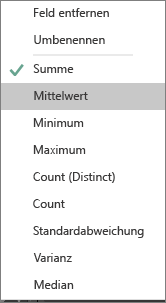
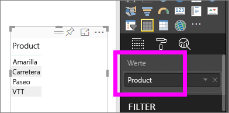
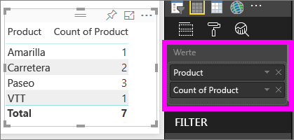

# Arbeiten Sie mit Aggregate (Summe, Durchschnitt, usw.) in Power BI-Dienst

## Was ist ein Aggregat?

Unter Umständen möchten Sie Werte in Ihren Daten mathematisch miteinander kombinieren. Die mathematische Operation möglicherweise Summe, Durchschnitt, maximal, Anzahl und So weiter. Wenn Sie Werte in Ihren Daten kombinieren, heißt es *aggregieren*. Das Ergebnis dieser mathematischen Operation ist ein *Aggregat*.

Wenn im Power BI-Dienst und Power BI Desktop Visualisierungen erstellt werden, können dabei Daten aggregiert werden. Häufig handelt es sich bei dem Aggregat bereits um die benötigten Werte, in anderen Fällen möchten Sie die Werte aber vielleicht auch auf andere Weise aggregieren,  z.B. mit einer Summe anstelle eines Durchschnittswerts. Es gibt mehrere Möglichkeiten zum Verwalten und ändern das Aggregat, für die, das Power BI in einer Visualisierung verwendet.

Zunächst sehen wir uns ein an Daten *Typen* , da der Typ der Daten bestimmt, ob und wie Power BI aggregieren.

## Datentypen

Die meisten Datasets enthalten mehr als einen Datentyp. Auf der untersten Ebene, die Daten sind numerische oder es ist nicht verfügbar. Powerbi kann numerische Daten, die über eine Summe, Mittelwert, Anzahl, Mindestwert, Varianz und vieles mehr aggregieren. Der Dienst kann sogar Textdaten, häufig bezeichnet aggregieren *kategorische* Daten. Wenn Sie versuchen, ein kategorisches Feld aggregiert wird, indem Sie diesen in einem rein numerischen Bucket wie **Werte** oder **QuickInfos**, Power BI die Vorkommen der einzelnen Kategorien oder die eindeutigen Vorkommen der einzelnen wird die Kategorie. Bestimmte Arten von Daten, wie Datumsangaben, haben einige eigene aggregatsoptionen: früheste, letzte, erste und letzte.

Betrachten Sie folgendes Beispiel:

- **Units Sold** und **Manufacturing Price** sind Spalten mit numerischen Daten.

- **Segment**, **Country**, **Product**, **Month** und **Month Name** enthalten Kategoriedaten.

   

Beim Erstellen einer Visualisierung in Power BI wird der Dienst numerische Felder aggregieren (der Standardwert ist *Summe*) über ein Kategoriefeld.  Z. B. "verkaufte Einheiten ***nach Produkt***", "verkaufte Einheiten ***nach Monat***" und "Manufacturing Price ***nach Segment***". Powerbi bezieht sich auf einige numerische Felder als **Measures**. Es ist einfach, die Measures im Power BI-Berichts-Editor – Identifizieren der **Felder** Liste zeigt die Measures mit dem Symbol "∑" neben dem Namen. Finden Sie unter [Berichts-Editor... Tour durch](service-the-report-editor-take-a-tour.md) für Weitere Informationen.

## Warum funktionieren Aggregate nicht wie ich mir das vorstelle?

Arbeiten mit Aggregaten in Power BI kann Service kann verwirrend sein. Vielleicht haben Sie ein numerisches Feld aus, und Power BI lässt keine Änderung die Aggregation. Oder haben Sie ein Feld (beispielsweise ein Jahr), das nicht aggregiert werden soll, sondern für das Sie lediglich die Anzahl von Vorkommen ermitteln möchten?

Normalerweise ist das zugrunde liegende Problem der Field-Definition im Dataset. Vielleicht der Besitzer des Datasets das Feld als Text definiert, und, erläutert, warum Power BI nicht die Summe oder durchschnittlich. [Die Kategorisierung eines Felds kann allerdings nur vom Besitzer des Datasets geändert werden.](desktop-measures.md) Wenn Sie über Besitzerberechtigungen auf das Dataset, das in Desktop oder das Programm verwendet zum Erstellen des Datasets (z. B. Excel), verfügen können Sie also dieses Problem beheben. Andernfalls müssen Sie den Besitzer des Datasets um Hilfe bitten.  

Es gibt einen spezieller Abschnitt am Ende dieses Artikels [ **und Problembehandlungsinformationen**](#considerations-and-troubleshooting). Er bietet Tipps und Anleitungen. Wenn Sie Ihre Antwort gibt es nicht finden, Posten Sie Ihre Frage auf die [Power BI-Community-Forum](http://community.powerbi.com). Sie erhalten eine schnelle Antwort direkt aus Power BI-Team.

## Ändern, wie ein numerisches Feld aggregiert wird

Angenommen, Sie haben ein Diagramm, in dem die verkauften Einheiten für verschiedene Produkte addiert werden. Sie benötigen aber den Mittelwert.

1. Erstellen Sie eine **gruppiertes Säulendiagramm** , die ein Measure und eine Kategorie verwendet. In diesem Beispiel verwenden wir „Units Sold by Product“.  Power BI erstellt standardmäßig ein Diagramm, das die verkauften Einheiten addiert (Ziehen Sie das Measure in die **Wert** auch) für jedes Produkt (Ziehen Sie die Kategorie in der **Achse** gut).

   

1. In der **Visualisierungen** Bereich mit der rechten Maustaste in des Measures, und wählen Sie den Aggregattyp, die Sie benötigen. In diesem Fall wählen wir **durchschnittliche**. Wenn Sie die Aggregation nicht angezeigt wird, Sie benötigen, finden Sie die [ **und Problembehandlungsinformationen** ](#considerations-and-troubleshooting) Abschnitt.

   

   > [!NOTE]
   > In der Dropdownliste verfügbaren Optionen variieren je nach 1) für das ausgewählte Feld aus, und (2) die Möglichkeit der Besitzer des Datasets kategorisiert dieses Feld.

1. Die Visualisierung wird nun mit einem Durchschnittswert aggregiert.

   

## Möglichkeiten zum Aggregieren von Daten

Hier sind einige der Optionen aufgeführt, die möglicherweise zum Aggregieren eines Felds zur Verfügung stehen:

- **Nicht zusammenfassen**. Diese Option ausgewählt ist wird Power BI jeden Wert in diesem Feld separat behandelt und nicht diese zusammenfassen. Verwenden Sie diese Option, wenn Sie eine Spalte mit numerische IDs verfügen, die die Summe der Dienst sollte nicht.

- **Summe**. Mit dieser Option werden alle Werte in diesem Feld addiert.

- **Mittelwert**. Ermittelt den arithmetischen Mittelwert der Werte.

- **Minimum**. Zeigt den kleinsten Wert.

- **Maximum**. Zeigt den größten Wert.

- **Anzahl (ohne Leerstellen)** . Zählt die Anzahl der Werte in diesem Feld, die nicht leer sind.

- **Anzahl (diskret)** . Mit dieser Option wird die Anzahl der verschiedenen Werte in diesem Feld gezählt.

- **Standardabweichung**.

- **Varianz.**

- **Median**.  Zeigt den Medianwert (mittlerer Wert) an. Dieser Wert hat die gleiche Anzahl von Werten über und unter sich.  Wenn 2 Mediane vorhanden sind, erstellt Power BI einen Durchschnittswert.

Die Daten:

| Land | Menge |
|:--- |:--- |
| USA |100 |
| VEREINIGTES KÖNIGREICH |150 |
| Kanada |100 |
| Deutschland |125 |
| Frankreich | |
| Japan |125 |
| Australien |150 |

führen zu folgenden Ergebnissen:

- **Nicht zusammenfassen:** Jeder Wert wird separat dargestellt.

- **Summe:** 750

- **Durschnitt:** 125

- **Maximum:**  150

- **Minimum:** 100

- **Anzahl (ohne Leerstellen):** 6

- **Anzahl (diskret):** 4

- **Standardabweichung:** 20,4124145...

- **Varianz:** 416,666...

- **Median:** 125

## Erstellen eines Aggregats mit einem Kategoriefeld (Text)

Sie können auch nicht numerische Felder aggregieren. Wenn beispielsweise ein Feld mit Produktnamen vorhanden ist, können Sie es als Wert hinzufügen und dafür **Anzahl**, **Diskrete Anzahl**, **Erste** oder **Letzter** festlegen.

1. Ziehen Sie die **Produkt** in die **Werte** gut. Die **Werte** wird auch für numerische Felder in der Regel verwendet. Powerbi erkennt, dass dieses Feld ist ein Textfeld, wird das Aggregat auf **nicht zusammenfassen**, und bietet Ihnen eine einspaltige Tabelle.

   

1. Wenn Sie die Aggregation von der Standardeinstellung ändern **nicht zusammenfassen** zu **Anzahl (diskrete)** , zählt Power BI die Anzahl der verschiedenen Produkte. In diesem Fall stehen vier.
  
   

1. Und wenn Sie die Aggregation in **Anzahl**ändern, zählt Power BI die Gesamtanzahl. In diesem Fall stehen sieben Einträge für **Produkt**.

   

1. Ziehen Sie das gleiche Feld (in diesem Fall **Produkt**) in der **Werte** gut, und die Standardaggregation **nicht zusammenfassen**, gliedert Power BI die Anzahl von das Produkt.

   

## Zu beachtende Aspekte und Problembehandlung

F:  Warum ist die Option **Nicht zusammenfassen** nicht verfügbar?

A:  Das ausgewählte Feld ist wahrscheinlich ein berechnetes oder erweitertes Measure, das in Excel oder [Power BI Desktop](desktop-measures.md) erstellt wurde. Jedes berechnete Measure verfügt über eine eigene hartcodierte Formel. Sie können die Aggregation, die Power BI verwendet, nicht ändern. Wenn es sich z.B. um eine Summe handelt, muss es eine Summe bleiben. Die **Felder** zeigen *berechnete Measures* mit dem Rechnersymbol gekennzeichnet.

F:  Mein Feld **ist** numerisch. Warum stehen mir nur die Optionen **Anzahl** und **Diskrete Anzahl** zur Verfügung?

A1:  Wahrscheinlich ist, dass der Besitzer des Datasets *nicht* das Feld als Zahl klassifiziert. Angenommen, ein Dataset verfügt über eine **Jahr** Feld Besitzer des Datasets kann den Wert als Text kategorisiert. Es ist wahrscheinlicher, dass es sich bei Power BI berücksichtigt werden die **Jahr** Feld (z. B. Anzahl der 1974 geborenen Personen). Es ist weniger wahrscheinlich, dass Power BI wird die Summe oder durchschnittlich. Wenn Sie der Besitzer sind, können Sie das Dataset in Power BI Desktop öffnen und Verwenden der **Modellierung** Tab, um den Datentyp ändern.

A2: Wenn das Feld einem Rechnersymbol gekennzeichnet ist, dies ist eine *berechnetes Measure*. Jedes berechnete Measure verfügt über eine eigene hartcodierte Formel, die nur der Besitzer des Datasets ändern können. Die Power BI verwendeten Berechnung kann es sich um eine einfache Aggregation wie einen Mittelwert oder Summe sein. Es kann auch sein, etwas komplizierter wie "prozentualer Anteil an einer übergeordneten Kategorie" oder "laufende Summe seit des Jahres starten". Powerbi ist nicht wechseln, Summe und Mittelwert für die Ergebnisse. Stattdessen wird es einfach neu berechnen (unter Verwendung der hartcodierten Formel) für jeden Datenpunkt.

A3:  Eine weitere Möglichkeit: Sie haben das Feld in einem *Bucket* platziert, in dem nur Kategoriewerte zulässig sind.  In diesem Fall stehen nur die Optionen „Count“ und „Distinct Count“ zur Verfügung.

A4:  Und eine vierte Möglichkeit ist, dass Sie das Feld wird für eine Achse verwendet. Auf der Achse eines Balkendiagramms zeigt Power BI beispielsweise jeweils einen Balken pro eindeutigem Wert an. Die Feldwerte werden also überhaupt nicht aggregiert.

>[!NOTE]
>Eine Ausnahme sind Punktdiagramme, bei denen aggregierte Werte für die X- und Y-Achse *erforderlich* sind.

F:  Warum kann ich keine Textfelder für SSAS-Datenquellen (SSAS = SQL Server Analysis Services) aggregieren?

A:  Liveverbindungen mit mehrdimensionalen SSAS-Modellen lassen keine clientseitigen Aggregationen zu. Zu diesen zählen „first“, „last“, „avg“, „min“, „max“ und „sum“.

F:  Ich habe ein Punktdiagramm und möchte *nicht*, dass mein Feld aggregiert wird.  Wie kann ich das erreichen?

A:  Fügen Sie das Feld dem Bucket **Details** (und nicht den Buckets für die X- oder Y-Achse) hinzu.

F:  Wenn ich ein numerisches Feld einer Visualisierung hinzufüge, wird bei den meisten standardmäßig eine Summe gebildet, bei einigen wird hingegen standardmäßig ein Mittelwert gebildet, die Anzahl ermittelt oder eine andere Aggregation verwendet.  Warum ist die standardmäßige Aggregation nicht immer gleich?

A:  Besitzer von Datasets können die standardzusammenfassung individuell für jedes Feld festlegen. Wenn Sie Besitzer eines Datasets sind, ändern Sie die standardzusammenfassung auf der **Modellierung** Registerkarte von Power BI Desktop.

F:  Ich bin Besitzer eines Datasets und möchte sicherstellen, dass ein Feld nicht aggregiert wird.

A:  Legen Sie in Power BI Desktop auf der Registerkarte **Modellierung** die Option **Datentyp** auf **Text** fest.

F:  Ich sehe nicht **nicht zusammenfassen** als Option im Dropdown-Liste.

A:  Entfernen Sie das Feld, und fügen Sie es anschließend wieder hinzu.

Weitere Fragen? [Wenden Sie sich an die Power BI-Community](http://community.powerbi.com/)