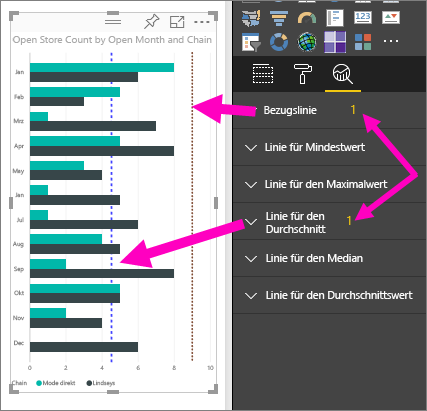
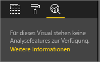

# Analysebereich im Power BI-Dienst
Mit dem Bereich **Analyse** im **Power BI-Dienst** können Sie Visualisierungen dynamische *Bezugslinien* hinzufügen und wichtige Trends und Erkenntnisse identifizieren.

> [!NOTE]
> Der Bereich **Analyse** wird nur angezeigt, wenn Sie im Zeichenbereich ein Visual auswählen.
> 
> 

## Verwendung des Bereichs „Analyse“
Mithilfe des Bereichs **Analyse** können Sie die folgenden Arten von dynamischen Bezugslinien erstellen (wobei nicht alle Linien für alle Visualisierungstypen verfügbar sind):

* Bezugslinie für X-Achse
* Bezugslinie für Y-Achse
* Linie für Mindestwert
* Linie für Maximalwert
* Durchschnittslinie
* Linie für Medianwert
* Linie für Perzentil

In den folgenden Abschnitten erfahren Sie, wie Sie den Bereich **Analyse** und die dynamischen Bezugslinien in Ihren Visualisierungen verwenden können.

Um die für eine Visualisierung verfügbaren dynamischen Bezugslinien anzuzeigen, führen Sie die folgenden Schritte aus:

1. Wählen Sie eine Visualisierung aus, oder erstellen Sie eine Visualisierung. Wählen Sie dann das Symbol **Analyse** im Bereich **Visualisierungen** aus.
2. Wählen Sie für die gewünschte Linie den Pfeil nach unten aus, um die entsprechenden Optionen zu erweitern. In diesem Fall entscheiden wir uns für die **Durchschnittslinie**.
   
   
3. Um eine neue Linie zu erstellen, wählen Sie **+ Hinzufügen** aus. Dann können Sie der Linie einen Namen geben, indem Sie auf das Textfeld doppelklicken und dann den Namen eingeben.
   
   Für jede Linie steht eine Reihe an Optionen zur Verfügung, z.B. *Farbe*, *Transparenz*, *Stil* und *Position* (relativ zu den Datenelementen der Visualisierung). Sie können auch festlegen, ob die Bezeichnung angezeigt werden soll. Vor allem können Sie bestimmen, auf welchem **Measure** der Visualisierung die Linie basieren soll. Wählen Sie dazu das Dropdownfeld **Measure** aus, das automatisch mit den Datenelementen der Visualisierung ausgefüllt wird. In diesem Fall entscheiden wir uns für *Open store count* (Anzahl geöffneter Stores) als Measure, geben als Bezeichnung *Avg # Open Stores* (Durchschnittsanzahl geöffnete Stores) ein und passen einige weitere Optionen an (siehe unten).
   
   
4. Wenn die Datenbezeichnung angezeigt werden soll, aktivieren Sie diese Option mit dem Schieberegler **Datenbeschriftung**. Dadurch wird eine Reihe an weiteren Optionen für die Datenbeschriftung angezeigt.
5. Beachten Sie die Zahl, die neben dem Element **Durchschnittslinie** im Bereich **Analyse** angezeigt wird. Dieser Wert steht für die Anzahl der in Ihrer Visualisierung verwendeten dynamischen Linien und verrät auch, von welchem Typ diese sind. Wenn wir eine **Bezugslinie** als Ziel für die Store-Anzahl 9 hinzufügen, wird im Bereich **Analyse** angezeigt, dass nun auch eine **Bezugslinie** im Visual verwendet wird.
   
   
   
   Wenn Ihre Visualisierung keine dynamischen Bezugslinien verwenden kann (hier eine Visualisierung vom Typ **Karte**), sehen Sie das Folgende, wenn Sie den Bereich **Analyse** aufrufen.
   
   

Sie können viele interessante Einblicke gewinnen, wenn Sie mithilfe des Bereichs **Analyse** dynamische Bezugslinien erstellen.

Wir arbeiten an der Umsetzung weiterer Features und Funktionen, u.a. daran, dynamische Bezugslinien für mehr Visualisierungen verfügbar zu machen. Es gibt also regelmäßig Neues zu entdecken.

## Einschränkungen
Die Möglichkeit zum Verwenden von dynamischen Bezugslinien ist abhängig vom verwendeten visuellen Element. Die folgende Liste zeigt, welche dynamischen Linien zurzeit für welche visuellen Objekte verfügbar sind:

Dynamische Linien sind für die folgenden visuellen Elemente in vollem Umfang verfügbar:

* Flächendiagramm
* Liniendiagramm
* Punktdiagramm
* Gruppiertes Säulendiagramm
* Gruppiertes Balkendiagramm

Für die folgenden visuellen Elemente kann nur eine *Bezugslinie* aus dem Bereich **Analyse** verwendet werden:

* Gestapelte Fläche
* Gestapelter Balken
* Gestapelte Säule
* Gestapelter Balken (100 %)
* Gestapelte Säule (100 %)

Für die folgenden visuellen Elemente ist die einzige Option zurzeit eine *Trendlinie*:

* Nicht gestapelte Linie
* Gruppiertes Säulendiagramm

Außerdem können für nicht kartesische visuelle Elemente zurzeit keine dynamischen Linien im Bereich **Analyse** anwendet werden, z. B.:

* Matrix
* Kreisdiagramm
* Ringdiagramm
* Tabelle (Table)

## Nächste Schritte
[Analysebereich in Power BI Desktop](desktop-analytics-pane.md)

Weitere Fragen? [Wenden Sie sich an die Power BI-Community](http://community.powerbi.com/)

