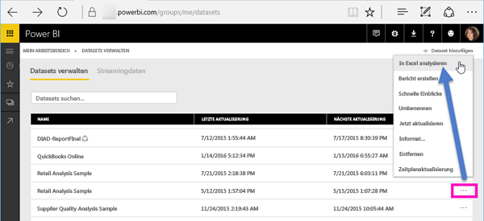
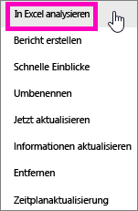
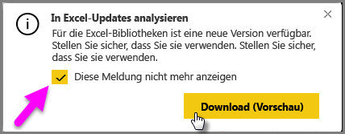
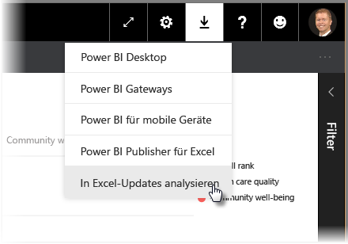
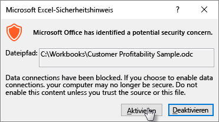
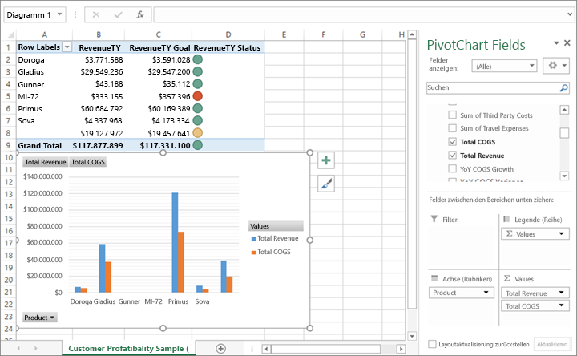

# In Excel analysieren
Es gibt Situationen, in denen Sie zum Anzeigen von und Interagieren mit einem Datenset aus Power BI Excel verwenden möchten. Mit **In Excel analysieren** können Sie genau dies tun. Greifen Sie in Excel basierend auf dem in Power BI existierenden Dataset auf PivotTable-, Diagramm- und Datenschnitt-Features in Excel zu.

## Anforderungen
Es gibt diverse Anforderungen für die Verwendung von **In Excel analysieren**:

* **In Excel analysieren** wird für Microsoft Excel 2010 SP1 und höher unterstützt.
* Excel-PivotTables unterstützen keine Drag & Drop-Aggregation von numerischen Feldern. Ihr Dataset in Power BI *muss über vordefinierte Measures verfügen*.
* In einigen Organisationen gelten möglicherweise Gruppenrichtlinienregeln, durch die eine Installation der erforderlichen Updates für **In Excel analysieren** für Excel verhindert wird. Wenn Sie die Updates nicht installieren können, wenden Sie sich an Ihren Administrator.
* **In Excel analysieren** erfordert eine Pro-Lizenz. Weitere Informationen zu den funktionellen Unterschieden zwischen den Lizenztypen finden Sie unter [Power BI-Features nach Lizenztyp](service-features-license-type.md). 

## Funktionsweise
Wenn Sie **In Excel analysieren** im Menü mit den Auslassungszeichen (...) auswählen, das mit einem Dataset oder Bericht in **Power BI** verknüpft ist, erstellt Power BI eine ODC-Datei und lädt diese vom Browser auf Ihrem Computer herunter.

Sobald Sie die Datei in Excel öffnen, sehen Sie eine leere **PivotTable** und die Liste **Felder** mit allen Tabellen, Feldern und Measures aus dem Power BI-Dataset. Sie können PivotTables und Diagramme erstellen und das Dataset wie bei Verwendung eines lokalen Dataset in Excel analysieren.

Die ODC-Datei verfügt über eine MSOLAP-Verbindungszeichenfolge, mit der eine Verbindung mit Ihrem Dataset in Power BI hergestellt wird. Wenn Sie Daten analysieren oder verwenden, fragt Excel das Dataset in Power BI ab. Die Ergebnisse werden an Excel zurückgegeben. Wenn das Dataset über DirectQuery mit einer Live-Datenquelle verbunden ist, fragt Power BI die Datenquelle ab und gibt das Ergebnis an Excel zurück.

**In Excel analysieren** ist für Datasets und Berichte sehr hilfreich, die eine Verbindung mit Datenbanken vom Typ *Analysis Services tabellarisch* oder mit *multidimensionalen* Datenbanken herstellen, sowie für Power BI Desktop-Dateien oder Excel-Arbeitsmappen mit Datenmodellen, für die mithilfe von DAX (Data Analysis Expressions) Modellmeasures erstellt werden.

## Erste Schritte mit „In Excel analysieren“
Wählen Sie in Power BI das Menü mit den Auslassungspunkten (...) neben einem Bericht oder Dataset und anschließend **In Excel analysieren** aus.

### Installieren von Excel-Updates
Bei der ersten Verwendung von **In Excel analysieren**, müssen Sie in den Excel-Bibliotheken Updates installieren. Sie werden aufgefordert, Excel-Updates herunterzuladen und auszuführen (wodurch die Installation des Windows-Installationspakets *SQL_AS_OLEDDB.msi* ausgelöst wird). Über dieses Paket wird der **Microsoft AS OLE DB-Anbieter für SQL Server 2016 RC0 (Vorschau)** installiert.

> [!NOTE]
> Aktivieren Sie **Diese Meldung nicht mehr anzeigen** im Dialogfeld **Excel-Updates installieren**. Sie müssen das Update nur einmal installieren.
> 
> 

Wenn Sie die Excel-Updates für **In Excel analysieren** erneut installieren müssen, können Sie das Update über das Symbol **Herunterladen** in Power BI wie in der folgenden Abbildung dargestellt herunterladen.

### Melden Sie sich bei Power BI an.
Auch wenn Sie bereits in Ihrem Browser bei Power BI angemeldet sind, werden Sie möglicherweise aufgefordert, sich mit Ihrem Power BI-Konto bei Power BI anzumelden, wenn Sie eine neue ODC-Datei das erste Mal in Excel öffnen. Dadurch wird die Verbindung zwischen Excel und Power BI authentifiziert.

### Benutzer mit mehreren Konten für Power BI
Bei Benutzern mit mehreren Power BI-Konten kann es vorkommen, dass sie mit einem Konto bei Power BI angemeldet sind, aber das für „In Excel analysieren“ verwendete Konto, das Zugriff auf das Dataset hat, ein anderes Konto ist. In diesen Fällen erhalten Sie möglicherweise die Fehlermeldung **Unzulässig** oder können sich nicht anmelden, um auf ein Dataset zuzugreifen, das in einer Arbeitsmappe für „In Excel analysieren“ verwendet wird.

Sie erhalten die Möglichkeit, sich erneut anzumelden. Zu diesem Zeitpunkt können Sie sich bei dem Power BI-Konto anmelden, das Zugriff auf das für „In Excel analysieren“ verwendete Dataset hat. Sie können auch auf der Registerkarte **Power BI** des Menübands in Excel **Profil** auswählen. Dadurch wird ermittelt, mit welchem Konto Sie derzeit angemeldet sind. Außerdem wird ein Link zum Abmelden angezeigt (um sich anschließend bei einem anderen Konto anzumelden).

### Aktivieren von Datenverbindungen
Zum Analysieren Ihrer Power BI-Daten werden Sie aufgefordert, den Dateinamen und den Pfad für die ODC-Datei zu überprüfen. Wählen Sie dann **Aktivieren** aus.

> [!NOTE]
> Administratoren für Power BI-Mandanten können im *Power BI-Verwaltungsportal* die Verwendung von **In Excel analysieren** mit lokalen Datasets, die in AS-Datenbanken (Analysis Services) gespeichert sind, deaktivieren. Wenn diese Option deaktiviert ist, ist **In Excel analysieren** für AS-Datenbanken deaktiviert, jedoch kann die Funktion weiterhin für andere Datasets verwendet werden.
> 
> 

## Trotzdem analysieren
Nachdem Excel nun geöffnet wurde und Sie eine leere PivotTable haben, können Sie mit dem Power BI-Dataset unterschiedlichste Analysen durchführen. Wie bei anderen lokalen Arbeitsmappen können Sie mit „In Excel analysieren“ PivotTables und Diagramme erstellen, Daten aus anderen Quellen hinzufügen und mehr. Sie können auch verschiedene Arbeitsblätter mit unterschiedlichen Ansichten Ihrer Daten erstellen.

> [!NOTE]
> Denken Sie daran, dass bei Verwenden von **In Excel analysieren** alle Detaildaten für jeden Benutzer verfügbar gemacht werden, der eine Berechtigung für das Dataset hat.
> 
> 

## Speichern
Sie können die mit dem Power BI-Dataset verbundene Arbeitsmappe wie jede andere Arbeitsmappe speichern. Allerdings haben Sie nicht die Möglichkeit, die Arbeitsmappe zu veröffentlichen oder in Power BI zurück zu importieren, da Sie nur Arbeitsmappen veröffentlichen oder in Power BI importieren dürfen, die über Daten in Tabellen oder ein Datenmodell verfügen. Da die neue Arbeitsmappe einfach mit dem Dataset in Power BI verbunden ist, würden Sie sich bei einer Veröffentlichung oder einem Import in Power BI im Kreis drehen.

## Freigeben
Nachdem die Arbeitsmappe gespeichert wurde, können Sie sie für andere Power BI-Benutzer in Ihrer Organisation freigeben.

Wenn Sie die Arbeitsmappe für andere Benutzer freigegeben haben, sehen diese die PivotTables und Daten in der Form, in der die Arbeitsmappe zuletzt gespeichert wurde. Dies ist möglicherweise nicht die aktuelle Version der Daten. Um die neueste Version der Daten anzuzeigen, müssen Benutzer im Menüband **Daten** auf die Schaltfläche **Aktualisieren** klicken. Da die Arbeitsmappe zudem eine Verbindung zu einem Dataset in Power BI herstellt, müssen sich Benutzer, die versuchen, die Arbeitsmappe zu aktualisieren, bei Power BI anmelden und die Excel-Updates beim ersten Update-Versuch mit dieser Methode installieren.

Da Benutzer das Dataset aktualisieren müssen und dies in Excel Online nicht für externe Verbindungen unterstützt wird, wird für solche Benutzer empfohlen, die Arbeitsmappe in der Desktopversion von Excel auf ihrem Computer zu öffnen.

## Problembehandlung
Es kann bei der Verwendung von „In Excel analysieren“ vorkommen, dass ein unerwartetes Ergebnis auftritt oder eine Funktion nicht wie erwartet funktioniert. [Diese Seite enthält Lösungen für häufige Probleme bei der Verwendung von „In Excel analysieren“.](desktop-troubleshooting-analyze-in-excel.md)