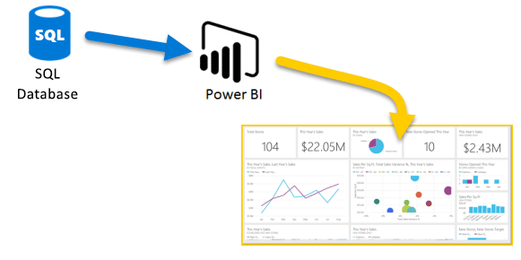

# Azure und Power BI
Mit **Azure** -Diensten und **Power BI**können Sie Ihre für die Datenverarbeitung aufgewendete Arbeit in Analysen und Berichte überführen, die in Echtzeit Einblicke in Ihre Geschäftsabläufe bieten. Ob Ihre Datenverarbeitung cloudbasiert oder lokal erfolgt, einfach oder komplex ist, aus einer einzelnen Quelle stammt oder massiv skaliert ist, auf Bestandsdaten basiert oder Daten in Echtzeit erfasst werden – Azure und Power BI verfügen immanent über die erforderliche Konnektivität und Integration, um Ihren Business Intelligence-Bemühungen Leben einzuhauchen.

In Power BI steht eine Vielzahl von Azure-Verbindungen zur Verfügung, und die Business Intelligence-Lösungen, die Sie mit diesen Diensten erstellen können, sind so vielfältig wir Ihr Unternehmen. Sie können eine Verbindung mit einer einzelnen Azure-Datenquelle oder gleich mit einer Handvoll herstellen und dann Ihre Daten modellieren und eingrenzen, um benutzerdefinierte Berichte zu erstellen.

### Azure SQL-Datenbank und Power BI
Sie können mit einer einfachen Verbindung zu einer Azure SQL-Datenbank beginnen und Berichte erstellen, um Ihren Geschäftsfortschritt zu überwachen. Mithilfe von [Power BI Desktop](desktop-getting-started.md) können Sie Berichte erstellen, die Trends und Key Performance Indicators ausweisen, die Ihr Unternehmen nach vorn bringen.

Ihnen steht eine Vielzahl weiterer Ressourcen mit Information über [Azure SQL-Datenbank](http://azure.microsoft.com/services/sql-database/) zur Verfügung.

### Sie können Ihre Clouddaten transformieren, modellieren und zusammenführen
Haben Sie ziemlich komplexe Daten aus Datenquellen jeder Art? Kein Problem. Mit **Power BI Desktop** und Azure-Diensten sind Verbindungen nur ein Tippen im Dialogfeld **Daten abrufen** entfernt. Innerhalb einer Abfrage können Sie Verbindungen mit Ihrer **Azure SQL-Datenbank**, Ihrer **Azure HDInsight** -Datenquelle und Ihrem **Azure-BLOB-Speicher** (oder **Azure-Tabellenspeicher**) herstellen, dann aus jeder nur die benötigten Teilmengen auswählen und von dort ausgehend weiter einschränken.

Sie können außerdem verschiedene Berichte für verschiedene Zielgruppen erstellen, auf der Grundlage der gleichen Datenverbindungen und sogar der gleichen Abfrage. Erstellen Sie einfach eine neue Berichtsseite, passen Sie Ihre Visualisierungen für die einzelnen Zielgruppen an, und freuen Sie sich am Informationsfluss im Unternehmen.

Weitere Informationen finden Sie in den folgenden Ressourcen:

* [Azure SQL-Datenbank](http://azure.microsoft.com/services/sql-database/)
* [Azure HDInsight](http://azure.microsoft.com/services/hdinsight/)
* [Azure Storage](http://azure.microsoft.com/services/storage/) (Blob Storage und Table Storage)

### Gewinnen Sie an Komplexität (und Vorsprung) mit Azure Services und Power BI
Mit Azure und Power BI können Sie sich so weit ausdehnen, wie Sie es benötigen. Nutzen Sie Datenverarbeitung aus vielen Quellen, setzen Sie Echtzeitsysteme in großem Umfang ein, verwenden Sie [Stream Analytics](http://azure.microsoft.com/services/stream-analytics/) und [Event Hubs](http://azure.microsoft.com/services/event-hubs/), und fügen Sie Ihre verschiedenen SaaS-Dienste in Business Intelligence-Berichten zusammen, die Ihrem Unternehmen ein klares Profil geben.

### Verbinden Sie Ihre App-Daten mithilfe von Power BI-APIs
Mithilfe von Power BI können Sie auch Einblick in vorhandene Apps gewinnen. Mit der Power BI-API können Anwendungsentwickler ganze Datensets programmgesteuert an Power BI senden. Benötigen Sie kontinuierliche Updates? Mit den Power BI-APIs können Entwickler Ihnen Datenaktualisierungen in Echtzeit senden, um Ihnen schnell zum Einstieg zu verhelfen, und Sie anschließend auf Azure Stream Analytics umstellen, wenn es sich für den wachsenden Umfang lohnt.

Viele Informationen zu den Power BI-APIs finden Sie im [Power BI-Entwicklerportal](http://dev.powerbi.com). Darüber hinaus können Sie im [Power BI-Entwicklerblog](http://blogs.msdn.com/powerbidev) erfahren, wie sich andere in Programmen mit Power BI befassen. Es gibt auch eine Seite, die sich ganz mit dem [Einstieg in die Power BI-Entwicklung](https://msdn.microsoft.com/library/dn889824.aspx) befasst.

### Was können Sie mit Azure und Power BI erreichen?
Es gibt alle möglichen Szenarien für die Kombination aus **Azure** und **Power BI** – die Möglichkeiten und Chancen sind so einzigartig wie Ihr Unternehmen. Weitere Informationen zu **Azure-Diensten** finden Sie auf dieser [Übersichtsseite](http://go.microsoft.com/fwlink/?LinkId=535031&clcid=0x409), die **Szenarios zur Datenanalyse mithilfe von Azure** beschreibt, und erfahren Sie, wie Sie Ihre Datenquellen in Intelligence konvertieren, die Ihr Unternehmen voranbringt.

