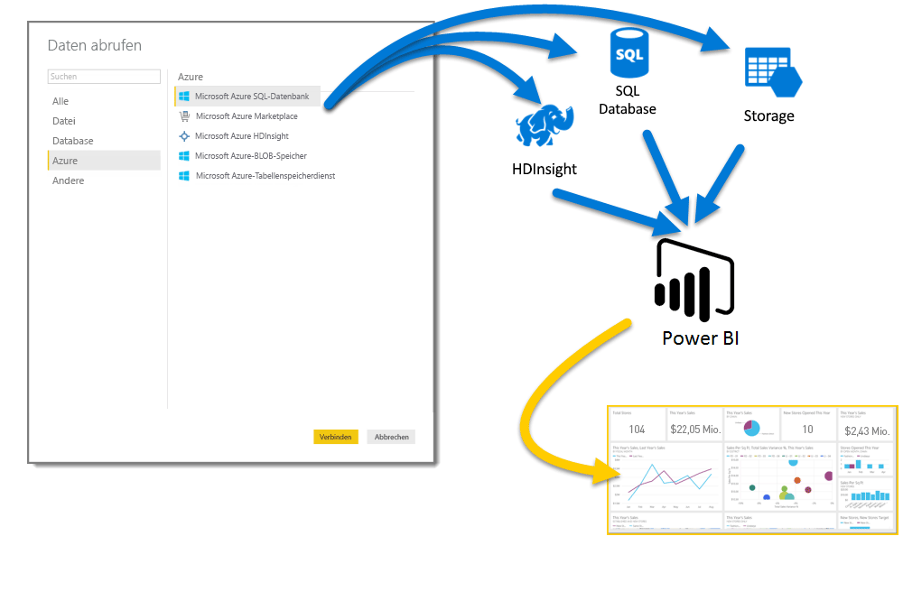
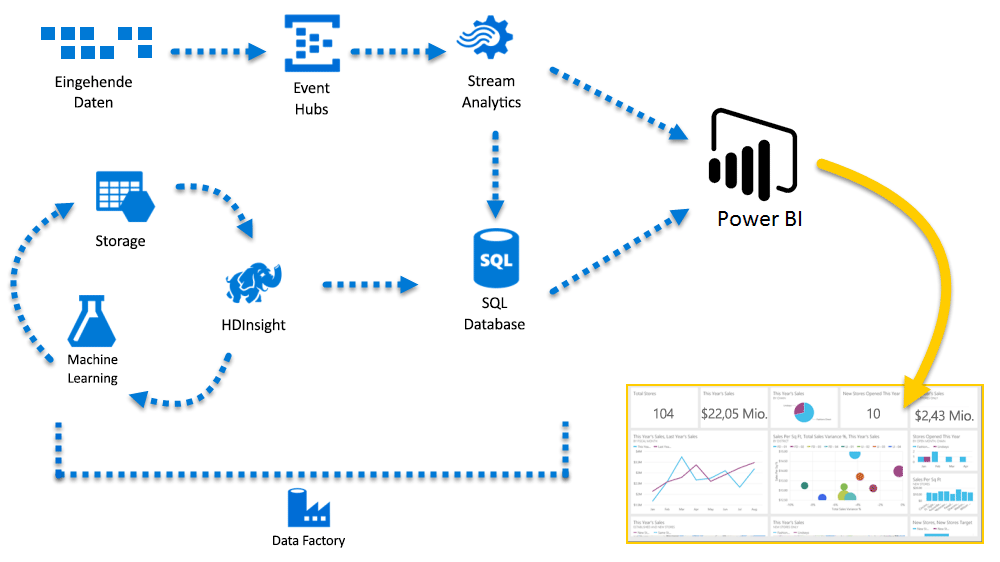

# Azure und Power BI

Mit **Azure** -Diensten und **Power BI**können Sie Ihre für die Datenverarbeitung aufgewendete Arbeit in Analysen und Berichte überführen, die in Echtzeit Einblicke in Ihre Geschäftsabläufe bieten. Ob Ihre Datenverarbeitung cloudbasiert oder lokal erfolgt, einfach oder komplex ist, aus einer einzelnen Quelle stammt oder massiv skaliert ist, auf Bestandsdaten oder Echtzeitdaten basiert – Azure und Power BI verfügen immanent über die erforderliche Konnektivität und Integration, um Ihren Business Intelligence-Bemühungen Leben einzuhauchen.

In Power BI steht eine Vielzahl von Azure-Verbindungen zur Verfügung, und die Business Intelligence-Lösungen, die Sie mit diesen Diensten erstellen können, sind so vielfältig wir Ihr Unternehmen. Sie können eine Verbindung mit einer einzelnen Azure-Datenquelle oder gleich mit einer Handvoll herstellen und dann Ihre Daten modellieren und eingrenzen, um benutzerdefinierte Berichte zu erstellen.

## Azure SQL-Datenbank und Power BI

Sie können mit einer einfachen Verbindung zu einer Azure SQL-Datenbank beginnen und Berichte erstellen, um Ihren Geschäftsfortschritt zu überwachen. Mithilfe von [Power BI Desktop](desktop-getting-started.md) können Sie Berichte erstellen, die Trends und Key Performance Indicators ausweisen, die Ihr Unternehmen nach vorn bringen.

Ihnen steht eine Vielzahl weiterer Ressourcen mit Information über [Azure SQL-Datenbank](http://azure.microsoft.com/services/sql-database/) zur Verfügung.

## Sie können Ihre Clouddaten transformieren, modellieren und zusammenführen

Haben Sie ziemlich komplexe Daten aus Datenquellen jeder Art? Kein Problem. Mit **Power BI Desktop** und Azure-Diensten sind Verbindungen nur ein Tippen im Dialogfeld **Daten abrufen** entfernt. Innerhalb einer Abfrage können Sie Verbindungen mit Ihrer **Azure SQL-Datenbank**, Ihrer **Azure HDInsight** -Datenquelle und Ihrem **Azure-BLOB-Speicher** (oder **Azure-Tabellenspeicher**) herstellen, dann aus jeder nur die benötigten Teilmengen auswählen und von dort ausgehend weiter einschränken.

Sie können außerdem verschiedene Berichte für verschiedene Zielgruppen erstellen, auf der Grundlage der gleichen Datenverbindungen und sogar der gleichen Abfrage. Erstellen Sie einfach eine neue Berichtsseite, passen Sie Ihre Visualisierungen für die einzelnen Zielgruppen an, und freuen Sie sich am Informationsfluss im Unternehmen.

Weitere Informationen finden Sie in den folgenden Ressourcen:

* [Azure SQL-Datenbank](http://azure.microsoft.com/services/sql-database/)
* [Azure HDInsight](http://azure.microsoft.com/services/hdinsight/)
* [Azure Storage](http://azure.microsoft.com/services/storage/) (Blob Storage und Table Storage)

## Gewinnen Sie an Komplexität (und Vorsprung) mit Azure Services und Power BI

Mit Azure und Power BI können Sie sich so weit ausdehnen, wie Sie es benötigen. Nutzen Sie Datenverarbeitung aus vielen Quellen, setzen Sie Echtzeitsysteme in großem Umfang ein, verwenden Sie [Stream Analytics](http://azure.microsoft.com/services/stream-analytics/) und [Event Hubs](http://azure.microsoft.com/services/event-hubs/), und fügen Sie Ihre verschiedenen SaaS-Dienste in Business Intelligence-Berichten zusammen, die Ihrem Unternehmen ein klares Profil geben.

## Kontexteinblicke mit Power BI Embedded-Analysen

Betten Sie eindrucksvolle interaktive Datenvisualisierungen in Anwendungen, Websites, Portale usw. ein, um Ihre Geschäftsdaten optimal zu nutzen. Mit [Power BI Embedded als Ressource in Azure](https://azure.microsoft.com/services/power-bi-embedded/) können Sie interaktive Berichte und Dashboards einfach einbetten, damit Ihre Benutzer von konsistenten und hochpräzisen Umgebungen auf allen Geräten profitieren.  Mit der Kombination aus Power BI und eingebetteten Analysen gewinnen Sie aus Daten Wissen und erhalten aus Einblicken handlungsrelevante Informationen, die Sie in Taten umsetzen können.  Darüber hinaus können Sie den Wert von Power BI und Azure erweitern, indem Sie Analysen in die [internen Anwendungen und Portale Ihrer Organisation](https://powerbi.microsoft.com/en-us/developers/embedded-analytics/organization/) einbetten.

Viele Informationen zu den Power BI-APIs finden Sie im [Power BI-Entwicklerportal](http://dev.powerbi.com).

Weitere Informationen finden Sie unter [Welche Möglichkeiten bietet Power BI Entwicklern?](developer/what-can-you-do.md).

## Einbetten von Power BI-Daten in Ihre App

Betten Sie eindrucksvolle interaktive Datenvisualisierungen in Anwendungen, Websites, Portalen usw. ein, um Ihre Geschäftsdaten im Kontext darzustellen. Mit [Power BI Embedded in Azure](https://azure.microsoft.com/services/power-bi-embedded/) können Sie interaktive Berichte und Dashboards einfach einbetten, damit Ihre Benutzer von konsistenten und hochpräzisen Umgebungen auf allen Geräten profitieren.

## Was können Sie mit Azure und Power BI erreichen?

Es gibt alle möglichen Szenarien für die Kombination aus **Azure** und **Power BI** – die Möglichkeiten und Chancen sind so einzigartig wie Ihr Unternehmen. Weitere Informationen zu **Azure-Diensten** finden Sie auf dieser [Übersichtsseite](https://docs.microsoft.com/azure/machine-learning/team-data-science-process/plan-your-environment), die **Szenarios zur Datenanalyse mithilfe von Azure** beschreibt, und erfahren Sie, wie Sie Ihre Datenquellen in Intelligence konvertieren, die Ihr Unternehmen voranbringt.