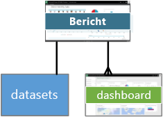
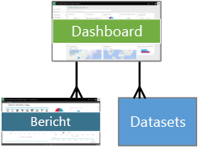
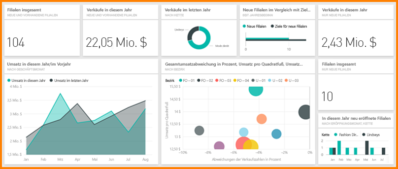

# Power BI – Grundkonzepte des Power BI-Diensts
<!-- Shared newnav Include -->
[!INCLUDE [newnavbydefault](./includes/newnavbydefault.md)]

In diesem Artikel wird davon ausgegangen, dass Sie sich bereits [für Power BI registriert](service-self-service-signup-for-power-bi.md) und [Daten hinzugefügt](service-get-data.md) haben.

Wenn Sie den Power BI-Dienst öffnen, wird ein ***Dashboard*** angezeigt. Dashboards unterscheiden den Power BI-Dienst von Power BI Desktop.

Die wichtigsten Funktionen der Benutzeroberfläche des Power BI-Diensts:

1. Navigationsleiste
2. Dashboard mit Kacheln
3. Fragenfeld für Fragen und Antworten (F&A)
4. Schaltflächen für Hilfe und Feedback
5. Dashboardtitel
6. Office 365-App-Startfeld
7. Startseiten-Schaltfläche für Power BI
8. Zusätzliche Dashboard-Aktionen

Dies wird später näher erläutert. Zunächst werden einige Grundkonzepte von Power BI besprochen.

Sie können sich auch erst dieses Video ansehen und dann den Rest des Artikels lesen.  In diesem Video gibt Will einen Überblick über den Power BI-Dienst und erklärt die grundlegenden Konzepte.

<iframe width="560" height="315" src="https://www.youtube.com/embed/B2vd4MQrz4M" frameborder="0" allowfullscreen></iframe>

## Power BI-Konzepte
Die drei wichtigsten Grundkomponenten von Power BI sind: ***Dashboards***, ***Berichte*** und ***Datasets***. Sie können keine Dashboards oder Berichte ohne Daten erstellen (es können zwar leere Dashboards und Berichte verwendet werden, aber das erscheint wenig sinnvoll). Beginnen wir also mit **Datasets**.

## Datasets
Ein *Dataset* ist eine Sammlung von Daten, die Sie *importieren* oder mit denen Sie eine *Verbindung herstellen*. In Power BI können Sie Verbindungen mit allen Arten von Datasets herstellen, sie importieren und zentral anordnen.  

In der Navigationsleiste werden die Datasets, mit denen Sie eine Verbindung hergestellt und die sie importiert haben, unter der Überschrift **Datasets** aufgelistet. Jedes aufgelistete Dataset stellt eine einzelne Datenquelle dar, z. B. eine Excel-Arbeitsmappe auf OneDrive oder ein lokales tabellarisches SSAS-Dataset oder ein Salesforce-Dataset. Es werden viele verschiedene Datenquellen unterstützt, zu denen beständig neue Datenquellen hinzugefügt werden. [Hier finden Sie eine Liste der Datasettypen, die mit Power BI verwendet werden können](service-get-data.md).

**EIN** Dataset...

* kann immer wieder verwendet werden.
* kann in vielen verschiedenen Berichten verwendet werden.
* Visualisierungen dieses einen Datasets können auf vielen verschiedenen Dashboards angezeigt werden.
  
  

Wählen Sie **Daten abrufen** (am unteren Rand der Navigationsleiste) oder das Plussymbol (neben der Überschrift **Datasets**) aus, um die [Verbindung mit einem Dataset herzustellen oder es zu importieren](service-get-data.md). Befolgen Sie die Anweisungen zum Herstellen einer Verbindung mit der jeweiligen Quelle bzw. zum Importieren, und fügen Sie das Dataset zum Arbeitsbereich hinzu. Neue Datasets werden in der linken Navigationsleiste aufgeführt und mit einem gelben Sternchen markiert. Das zugrunde liegende Dataset wird durch Ihre Arbeit in Power BI nicht verändert.

Wenn Sie [zu einem ***App Arbeitsbereich*** gehören](service-collaborate-power-bi-workspace.md), sind Datasets, die von einem Arbeitsbereichsmitglied hinzugefügt wurden, für die anderen Arbeitsbereichsmitglieder verfügbar.

Datasets können aktualisiert, umbenannt, untersucht, zum Erstellen von Berichten verwendet und entfernt werden. Wählen Sie ein Dataset aus, um es zu untersuchen. Tatsächlich öffnen Sie das Dataset im Berichts-Editor, wo Sie beginnen können, die Daten zu untersuchen und Visualisierungen zu erstellen. Fahren wir also mit dem nächsten Thema fort – Berichte.

### Ausführliche Infos:
* [Power BI Premium – Beschreibung](service-premium.md)
* [Abrufen von Daten in Power BI](service-get-data.md)
* [Beispieldatasets und Inhaltspakete für Power BI](sample-datasets.md)

## Berichte
Bei einem Power BI-Bericht handelt es sich um eine oder mehrere Seiten mit Visualisierungen (Diagramme und Grafiken wie Liniendiagramme, Kreisdiagramme, Treemaps usw.). Visualisierungen werden auch als ***visuelle Elemente*** bezeichnet. Alle Visualisierungen in einem Bericht stammen aus einem einzelnen Dataset. Berichte können in Power BI von Grund auf neu erstellt werden. Ebenso können sie mit Dashboards importiert werden, die Kollegen für Sie freigeben. Zudem können Berichte erstellt werden, wenn Sie eine Verbindung mit Datasets aus Excel, Power BI Desktop, Datenbanken, SaaS-Anwendungen und [Inhaltspaketen](service-organizational-content-pack-introduction.md) herstellen.  Wenn Sie z. B. eine Verbindung mit einer Excel-Arbeitsmappe herstellen, die Power View-Tabellen enthält, dann erstellt Power BI einen Bericht auf Basis dieser Tabellen. Und wenn Sie eine Verbindung mit einer SaaS-Anwendung herstellen, wird ein vorgefertigter Bericht von Power BI importiert.

Es gibt zwei Modi, um Berichte anzuzeigen und mit ihnen zu interagieren: [Leseansicht](service-report-open-in-reading-view.md) und [Bearbeitungsansicht](service-interact-with-a-report-in-editing-view.md).  Nur der Ersteller des Berichtes, die Mitbesitzer und die Personen, denen die entsprechende Berechtigung erteilt wurde, haben in der ***Bearbeitungsansicht*** des Berichts Zugriff auf alle Untersuchungs-, Entwurfs-, Erstellungs- und Freigabefunktionen. Die Personen, für die der Bericht freigegeben wird, können den Bericht in der ***Leseansicht*** untersuchen und mit ihm interagieren.   

Ihre Berichte werden im Navigationsbereich unter der Überschrift **Berichte** aufgelistet. Jeder aufgeführte Bericht stellt mindestens eine Seite mit Visualisierungen dar, die auf einem zugrunde liegenden Dataset basieren. Wählen Sie einen Bericht einfach aus, um ihn zu öffnen. Der Bericht wird standardmäßig zunächst in der Leseansicht geöffnet.  Wählen Sie einfach **Bericht bearbeiten** aus, um den Bericht in der Bearbeitungsansicht zu öffnen (falls Sie über die erforderlichen Berechtigungen verfügen).  Wenn ein freigegebenes Dashboard Berichte enthält, wird der in der Navigationsleiste aufgeführte Bericht NICHT aufgelistet. Öffnen Sie stattdessen freigegebene Berichte direkt über das freigegebene Dashboard, indem Sie eine Dashboardkachel (darüber später mehr) auswählen.

**EIN** Bericht...

* kann mehreren Dashboards zugeordnet werden (die von diesem Bericht angehefteten Kacheln können auf mehrere Dashboards angezeigt werden).
* kann mithilfe der Daten aus einem Dataset erstellt werden. (Eine geringfügige Ausnahme ist, dass Power BI Desktop mehrere Datasets zu einem einzelnen Bericht zusammenfassen kann, der in Power BI importierbar ist).
  
  

## Dashboards
Ein *Dashboard* ist ein von Ihnen oder einem Kollegen erstelltes Objekt, das gemeinsam genutzt wird. Es handelt sich um einen einzelnen Zeichenbereich, der keine, eine oder mehrere Kacheln und Widgets enthält. Jede Kachel zeigt eine einzelne [Visualisierung](power-bi-report-visualizations.md) an, die aus einem Dataset erstellt wurde und an das Dashboard angeheftet ist. Es gibt viele Möglichkeiten, dem Dashboard Kacheln hinzuzufügen – zu viele, um sie in diesem Übersichtsthema zu behandeln. Weitere Informationen finden Sie unter [Dashboardkacheln in Power BI](service-dashboard-tiles.md). 

Ihre Dashboards werden in der Navigationsleiste unter der Überschrift **Dashboards** aufgelistet. „Ihre Dashboards“ bedeutet, dass Sie Zugriff auf sie haben, und nicht unbedingt, dass Sie sie erstellt haben. Jedes Dashboard stellt eine angepasste Ansicht einer Teilmenge der zugrunde liegenden Datasets dar.  Wenn Sie der Besitzer des Dashboards sind, haben Sie auch Zugriff auf das oder die zugrunde liegenden Datasets. Diese werden in der Navigationsleiste unter **Datasets** angezeigt.  Wenn das Dashboard für Sie freigegeben wurde, wird neben ihm ein Freigabesymbol  angezeigt. Abhängig davon, wie es freigegeben wurde, werden die zugrunde liegenden Datasets, die in der Navigationsleiste aufgeführt sind, für Sie angezeigt.

> [!NOTE]
> Kacheln und das Anheften werden unter der Überschrift „Dashboard mit Kacheln“ weiter unten ausführlicher beschrieben.
> 
> 

**EIN** Dashboard...

* kann Visualisierungen von verschiedenen Datasets anzeigen.
* kann Visualisierungen von verschiedenen Berichten anzeigen.
* kann Visualisierungen anzeigen, die aus anderen Tools (z.B. Excel) angeheftet wurden.
  
  

### Ausführliche Infos:
**Ein Dashboard [kann von Grund auf neu erstellt werden](service-dashboard-create.md)**: Erstellen Sie ein neues leeres Dashboard, und rufen Sie anschließend einige Daten ab. 

**Sie (oder ein Kollege) können ein Dashboard erstellen und es [freigeben](service-share-dashboards.md)**: Wenn Sie die Einladung annehmen, wird das freigegebene Dashboard (sowie die zugehörigen Berichte und Datasets) zur Navigationsleiste hinzugefügt. Power BI Pro ist sowohl für Freigeben eines Dashboards als auch Anzeigen eines freigegebenen Dashboards erforderlich.

**Gelegentlich werden Dashboards mit dem Dataset importiert oder dann erstellt, wenn Sie die Verbindung mit dem Dataset herstellen**. Der Assistent **Daten abrufen** für Salesforce fragt Sie z. B., ob Sie die Erstellung eines Dashboards und/oder Berichts aus dem Dataset benötigen. 

**Warum werden Dashboards erstellt?**  Hier sind nur einige der Gründe:

* Sie können auf einen Blick alle Informationen erkennen, die zum Treffen von Entscheidungen erforderlich sind.
* Sie können die wichtigsten unternehmensbezogenen Informationen überwachen.
* Sie können sicherstellen, dass sich alle Kollegen auf derselben Seite befinden und dabei dieselben Informationen anzeigen und verwenden.
* Sie können die Integrität eines Geschäfts, Produkts, Unternehmensbereichs oder einer Marketingkampagne usw. überwachen.
* Sie können eine personalisierte Ansicht eines umfangreicheren Dashboards erstellen, das alle für Sie erforderlichen Metriken enthält.

## Mein Arbeitsbereich
Wir sind zum Power BI-Dashboard und -Arbeitsbereich zurückgekehrt. Sehen wir uns jetzt die einzelnen Komponenten an, aus denen die Startseite für den Power BI-Dienst besteht.

### 1. **Navigationsleiste**
Verwenden Sie die Navigationsleiste, um zwischen den Grundkomponenten von Power BI zu wechseln: Dashboards, Berichte und Datasets.  

  

* Wählen Sie **Daten abrufen** aus, um [Datasets, Berichte und Dashboards zu Power BI hinzuzufügen](service-get-data.md).
* Mit dem Symbol  erweitern und reduzieren Sie die Navigationsleiste.
* Verwenden Sie **Suchen** , um bestimmte Elemente in der Navigationsleiste zu suchen.
* Klicken Sie auf das Plussymbol , um ein neues Dashboard zu erstellen oder ein neues Dataset abzurufen.
* Die aufgelisteten **Dashboards, Berichte** und **Datasets** stehen für Sie zur Verwendung bereit.  Freigegebene Dashboards sind schreibgeschützt und zeigen das Freigabesymbol  an.
* Dashboard-, Berichts- und Datasetnamen entsprechen in der Regel dem Namen der zugrunde liegenden Datasetdatei. Diese können jedoch [umbenannt](service-rename.md) werden.
* Klicken Sie mit der rechten Maustaste auf ein Dashboard, einen Bericht oder ein Dataset, um das Kontextmenü anzuzeigen. 
  
  

Einfaches Klicken

* auf eine Spaltenüberschrift, um sie zu reduzieren oder zu erweitern
* auf ein Dashboard, um es anzuzeigen
* auf einen Bericht, um ihn in der Leseansicht zu öffnen
* auf ein Dataset, um es zu untersuchen

### 2. **Dashboard mit Kacheln**
Dashboards bestehen aus [Kacheln](service-dashboard-tiles.md).  Kacheln werden in der Bearbeitungsansicht, Q&A und anderen Dashboards für Berichte erstellt und können aus Excel, SSRS usw. angeheftet werden. Ein besonderer Kacheltyp namens [Widget](service-dashboard-add-widget.md) wird dem Dashboard direkt hinzugefügt. Die auf einem Dashboard angezeigten Kacheln wurden vom Ersteller/Besitzer eines Berichts eigens dort abgelegt.  Das Hinzufügen einer Kachel zu einem Dashboard wird als *anheften* bezeichnet.

Weitere Informationen finden Sie unter **Dashboards** (oben).

### 3. **Fragenfeld für Fragen und Antworten (F&A)**
Eine Möglichkeit zum Untersuchen der Daten besteht darin, eine Frage zu stellen, um über den Bereich für Fragen und Antworten von Power BI eine Antwort in Form einer Visualisierung zu erhalten. Der Bereich für Fragen und Antworten kann nicht zum Hinzufügen von Inhalten zu einem Bericht verwendet werden, lediglich zum Hinzufügen von Inhalten in Form von Kacheln zu Dashboards.

Der Bereich für Fragen und Antworten sucht im Dataset bzw. in Datasets, die mit dem Dashboard verbunden sind, nach Antworten.  Bei einem verbundenen Dataset handelt es sich um ein Dataset, für das mindestens eine Kachel an dieses Dashboard angeheftet ist.

Sobald Sie mit der Eingabe einer Frage beginnen, gelangen Sie zur Seite für Fragen und Antworten (F&A). Während der Eingabe unterstützt Sie der Bereich für Fragen und Antworten mithilfe von Umformulierungen, AutoAusfüllen, Vorschlägen usw. dabei, die richtige Frage zu stellen und die beste Antwort zu finden. Wenn Sie eine Visualisierung (Antwort) gefunden haben, die Ihnen gefällt, fügen Sie diese einfach zum Dashboard hinzu. Weitere Informationen finden Sie unter [Fragen und Antworten in Power BI](service-q-and-a.md).

### 4. **Vollbildmodus, Benachrichtigungen, Einstellungen, Downloads, Hilfe und Feedback**
Die Symbole in der oberen rechten Ecke sind Ihre Ressourcen für Einstellungen, Benachrichtigungen, Downloads, zum Öffnen der Hilfe und zum Senden von Feedback an das Power BI-Team. Wählen Sie den doppelten Pfeil aus, um das Dashboard im **Vollbildmodus** zu öffnen.  

### 5. **Dashboardtitel** (bezeichnet das aktive Dashboard)
Es ist nicht immer einfach zu ermitteln, welches Dashboard aktiv ist.  Der Dashboardtitel wird in der Dashboardansicht, auf der Seite für Fragen und Antworten, in der Bearbeitungs- und Leseansicht für Berichte sowie beim Öffnen eines Datasets angezeigt.   

### 6. **Office 365-App-Startfeld**
Das App-Startfeld soll Ihnen dabei helfen, zu Ihren Office 365-Apps zu gelangen.

### 7. **Power BI-Startseite**
Durch Auswahl dieser Option kehren Sie zu dem Dashboard zurück, das Sie zuletzt angezeigt haben.

   

### 8. **Optionen**
Dieser Teil des Arbeitsbereichs enthält Symbole für die Interaktion mit dem Dashboard.  Neben **Kachel hinzufügen**, **Favorit** und **Freigeben** werden Optionen zum Duplizieren, Drucken und Aktualisieren des Dashboards und weitere Optionen angezeigt, wenn Sie die Auslassungszeichen auswählen.

   

## Nächste Schritte
[Erste Schritte mit Power BI](service-get-started.md)  
[Power BI-Videos](videos.md)  
[Power BI Premium – Beschreibung](service-premium.md)

Weitere Fragen? [Stellen Sie Ihre Frage in der Power BI-Community.](http://community.powerbi.com/)

