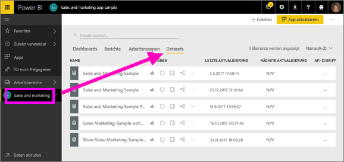
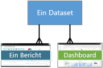
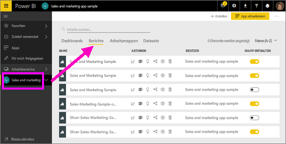
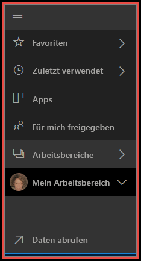

# Power BI – Grundkonzepte des Power BI-Diensts

In diesem Artikel wird davon ausgegangen, dass Sie sich bereits [für den Power BI-Dienst registriert](service-self-service-signup-for-power-bi.md) und [Daten hinzugefügt](service-get-data.md) haben.

Wenn Sie den Power BI-Dienst öffnen, wird ein ***Dashboard*** angezeigt. Dashboards unterscheiden den Power BI-Dienst von Power BI Desktop.

Die wichtigsten Funktionen der Benutzeroberfläche des Power BI-Diensts:

1. Navigationsbereich (linker Navigationsbereich)
2. Zeichenbereich (in diesem Fall Dashboard mit Kacheln)
3. Fragenfeld für Fragen und Antworten (F&A)
4. Symbolschaltflächen, einschließlich Hilfe und Feedback
5. Dashboardtitel (Navigationspfad oder Breadcrumbs)
6. Office 365-App-Startfeld
7. Power BI-Schaltfläche „Start“
8. Beschriftete Symbolschaltflächen

Dies wird später näher erläutert. Zunächst werden einige Grundkonzepte von Power BI besprochen.

Sie können sich auch erst dieses Video ansehen und dann den Rest des Artikels lesen.  In diesem Video gibt Will einen Überblick über den Power BI-Dienst und erklärt die grundlegenden Konzepte.

<iframe width="560" height="315" src="https://www.youtube.com/embed/B2vd4MQrz4M" frameborder="0" allowfullscreen></iframe>

## Power BI-Konzepte
Die vier wichtigsten Grundkomponenten von Power BI sind: ***Dashboards***, ***Berichte***, ***Arbeitsmappen*** und ***Datasets***. Diese sind in ***Arbeitsbereichen*** angeordnet. Zunächst sollen Arbeitsbereiche erläutert werden, bevor die vier anderen Grundkomponenten näher betrachtet werden. 

## Arbeitsbereiche
Arbeitsbereiche sind Container für Dashboards, Berichte, Arbeitsmappen und Datasets in Power BI. Es gibt zwei Typen von Arbeitsbereichen: *Mein Arbeitsbereich* und App-Arbeitsbereiche. Was genau ist eine *App*? Eine Power BI-*App* ist eine Sammlung von Dashboards und Berichten, die erstellt wurden, um Schlüsselmetriken für Ihre Organisation bereitzustellen. Apps sind interaktiv, können jedoch nicht bearbeitet werden. 

- *Mein Arbeitsbereich* ist der persönliche Arbeitsbereich jedes Power BI-Kunden, in dem sie ihre Inhalte bearbeiten. Nur Sie haben Zugriff auf Ihren „Mein Arbeitsbereich“. Wenn Sie Ihre Inhalte freigeben möchten, haben Sie verschiedene Möglichkeiten: Erstellen Sie einen App-Arbeitsbereich, in dem Sie Inhalte zu einer *App* zusammenfassen und anderen in Ihrer Organisation zur Verfügung stellen, oder erstellen Sie einen App-Arbeitsbereich und gewähren Sie Kollegen Zugriff auf diesen Arbeitsbereich, damit Sie dort Freigaben erstellen und gemeinsam daran arbeiten können.     
-  *App-Arbeitsbereiche* werden für die Zusammenarbeit und die Freigabe von Inhalten für Kollegen verwendet. Darüber sind hinaus werden hier Apps für Ihre Organisation erstellt, veröffentlicht und verwaltet. Betrachten Sie sie als eine Art Bereitstellungsraum und Container für Ihre Inhalte, die eine Power BI-App bilden. Sie können Ihren App-Arbeitsbereichen Kollegen hinzufügen und gemeinsam an Dashboards, Berichten, Arbeitsmappen und Datasets arbeiten. Alle Mitglieder des App-Arbeitsbereichs benötigen Power BI Pro-Lizenzen, für App-Anwender (Kollegen, die Zugriff auf die Apps haben) sind Pro-Lizenzen jedoch nicht zwingend erforderlich.  

Weitere Informationen finden Sie im Abschnitt **Freigeben Ihrer Arbeit** des Inhaltsverzeichnisses ab dem Thema [Wie kann ich Dashboards und Berichte freigeben?](service-how-to-collaborate-distribute-dashboards-reports.md)

Nun zu den Grundkomponenten von Power BI. Sie können keine Dashboards oder Berichte ohne Daten erstellen (es können zwar leere Dashboards und Berichte verwendet werden, aber das erscheint wenig sinnvoll). Beginnen wir also mit **Datasets**.

## Datasets
Ein *Dataset* ist eine Sammlung von Daten, die Sie *importieren* oder mit denen Sie eine *Verbindung herstellen*. In Power BI können Sie Verbindungen mit allen Arten von Datasets herstellen, sie importieren und zentral anordnen.  

Datasets sind *Arbeitsbereichen* zugeordnet, und ein einzelnes Dataset kann Teil mehrerer Arbeitsbereiche sein. Wenn Sie einen Arbeitsbereich öffnen, werden die zugeordneten Datasets auf der Registerkarte **Datasets** aufgeführt. Jedes aufgelistete Dataset stellt eine einzelne Datenquelle dar, z. B. eine Excel-Arbeitsmappe auf OneDrive oder ein lokales tabellarisches SSAS-Dataset oder ein Salesforce-Dataset. Es werden viele verschiedene Datenquellen unterstützt, zu denen beständig neue Datenquellen hinzugefügt werden. [Hier finden Sie eine Liste der Datasettypen, die mit Power BI verwendet werden können](service-get-data.md).

Im folgenden Beispiel ist die App „Vertrieb und Marketing“ ausgewählt, und es wurde auf die Registerkarte **Datasets** geklickt.

**EIN** Dataset...

* kann beliebig oft in einem oder mehreren verschiedenen Arbeitsbereichen verwendet werden.
* kann in vielen verschiedenen Berichten verwendet werden.
* Visualisierungen dieses einen Datasets können auf vielen verschiedenen Dashboards angezeigt werden.
  
  

Wählen Sie **Daten abrufen** (am unteren Rand der linken Navigationsleiste) oder wählen Sie **+ Erstellen > Datasets** (in der rechten oberen Ecke) aus, um die [Verbindung mit einem Dataset herzustellen oder es zu importieren](service-get-data.md). Befolgen Sie die Anweisungen zum Herstellen einer Verbindung mit der jeweiligen Quelle bzw. zum Importieren, und fügen Sie das Dataset dem aktiven Arbeitsbereich hinzu. Neue Datasets werden mit einem gelben Sternchen markiert. Das zugrunde liegende Dataset wird durch Ihre Arbeit in Power BI nicht verändert.

Wenn Sie [zu einem ***App Arbeitsbereich*** gehören](service-collaborate-power-bi-workspace.md), sind Datasets, die von einem Arbeitsbereichsmitglied hinzugefügt wurden, für die anderen Arbeitsbereichsmitglieder verfügbar.

Datasets können aktualisiert, umbenannt, untersucht und entfernt werden. Verwenden Sie ein Dataset, um einen völlig neuen Bericht zu erstellen, oder führen Sie [Schnelleinblicke](service-insights.md) aus.  Wählen Sie **Verwandte Inhalte anzeigen**, um zu erfahren, welche Berichte und Dashboards ein Dataset bereits verwenden. Wählen Sie ein Dataset aus, um es zu untersuchen. Tatsächlich öffnen Sie das Dataset im Berichts-Editor, wo Sie beginnen können, die Daten zu untersuchen und Visualisierungen zu erstellen. Fahren wir also mit dem nächsten Thema fort – Berichte.

### Weiterführende Themen
* [Power BI Premium – Beschreibung](service-premium.md)
* [Abrufen von Daten in Power BI](service-get-data.md)
* [Beispieldatasets für Power BI](sample-datasets.md)

## Berichte
Bei einem Power BI-Bericht handelt es sich um eine oder mehrere Seiten mit Visualisierungen (Diagramme und Grafiken wie Liniendiagramme, Kreisdiagramme, Treemaps usw.). Visualisierungen werden auch als ***visuelle Elemente*** bezeichnet. Alle Visualisierungen in einem Bericht stammen aus einem einzelnen Dataset. Berichte können in Power BI von Grund auf neu erstellt werden. Ebenso können sie mit Dashboards importiert werden, die Kollegen für Sie freigeben. Zudem können Berichte erstellt werden, wenn Sie eine Verbindung mit Datasets aus Excel, Power BI Desktop, Datenbanken, SaaS-Anwendungen und [Apps](service-get-data.md) herstellen.  Wenn Sie z. B. eine Verbindung mit einer Excel-Arbeitsmappe herstellen, die Power View-Tabellen enthält, dann erstellt Power BI einen Bericht auf Basis dieser Tabellen. Und wenn Sie eine Verbindung mit einer SaaS-Anwendung herstellen, wird ein vorgefertigter Bericht von Power BI importiert.

Es gibt zwei Modi, um Berichte anzuzeigen und mit ihnen zu interagieren: [Leseansicht und Bearbeitungsansicht](service-reading-view-and-editing-view.md).  Nur der Ersteller des Berichtes, die Mitbesitzer und die Personen, denen die entsprechende Berechtigung erteilt wurde, haben in der ***Bearbeitungsansicht*** des Berichts Zugriff auf alle Untersuchungs-, Entwurfs-, Erstellungs- und Freigabefunktionen. Die Personen, für die der Bericht freigegeben wird, können den Bericht in der ***Leseansicht*** untersuchen und mit ihm interagieren.   

Wenn Sie einen Arbeitsbereich öffnen, werden die zugeordneten Berichte auf der Registerkarte **Berichte** aufgeführt. Jeder aufgeführte Bericht stellt mindestens eine Seite mit Visualisierungen dar, die auf nur einem der zugrunde liegenden Datasets basieren. Wählen Sie einen Bericht einfach aus, um ihn zu öffnen. 

Wenn Sie eine App öffnen, sehen Sie ein Dashboard.  Um auf den zugrunde liegenden Bericht zuzugreifen, wählen Sie eine Dashboardkachel (siehe weiter unten) aus, die aus einem Bericht angeheftet wurde. Beachten Sie, dass nicht alle Kacheln aus Berichten angeheftet werden, möglicherweise müssen Sie also einige Kacheln durchprobieren, bis Sie den gesuchten Bericht finden. 

Der Bericht wird standardmäßig in der Leseansicht geöffnet.  Wählen Sie einfach **Bericht bearbeiten** aus, um den Bericht in der Bearbeitungsansicht zu öffnen (falls Sie über die erforderlichen Berechtigungen verfügen). 

Im folgenden Beispiel ist die App „Vertrieb und Marketing“ ausgewählt, und es wurde auf die Registerkarte **Berichte** geklickt.

**EIN** Bericht...

* ist in einem einzelnen Arbeitsbereich enthalten
* kann mehreren Dashboards in diesem Arbeitsbereich zugeordnet werden (die von diesem Bericht angehefteten Kacheln können auf mehreren Dashboards angezeigt werden).
* kann mithilfe der Daten aus einem Dataset erstellt werden. (Eine geringfügige Ausnahme ist, dass Power BI Desktop mehrere Datasets zu einem einzelnen Bericht zusammenfassen kann, der in Power BI importierbar ist).
  
  

### Weiterführende Themen
* [Berichte im Power BI-Dienst und in Power BI Desktop](service-reports.md)
* [Berichte in den mobilen Power BI-Apps](mobile-reports-in-the-mobile-apps.md)

## Dashboards
Ein *Dashboard* ist ein von Ihnen **im Power BI-Dienst** oder von einem Kollegen **im Power BI-Dienst** erstelltes Objekt, das für Sie freigegeben wurde. Es handelt sich um einen einzelnen Zeichenbereich, der keine, eine oder mehrere Kacheln und Widgets enthält. Jede aus einem Bericht oder aus [Q&A](power-bi-q-and-a.md) angeheftete Kachel zeigt eine einzelne [Visualisierung](power-bi-report-visualizations.md) an, die aus einem Dataset erstellt wurde und an das Dashboard angeheftet ist. Gesamte Berichtsseiten können ebenfalls als einzelne Kachel an ein Dashboard angeheftet werden. Es gibt viele Möglichkeiten, dem Dashboard Kacheln hinzuzufügen – zu viele, um sie in diesem Übersichtsthema zu behandeln. Weitere Informationen finden Sie unter [Dashboardkacheln in Power BI](service-dashboard-tiles.md). 

Warum werden Dashboards erstellt?  Hier sind nur einige der Gründe:

* Sie können auf einen Blick alle Informationen erkennen, die zum Treffen von Entscheidungen erforderlich sind.
* Sie können die wichtigsten unternehmensbezogenen Informationen überwachen.
* Sie können sicherstellen, dass sich alle Kollegen auf derselben Seite befinden und dabei dieselben Informationen anzeigen und verwenden.
* Sie können die Integrität eines Geschäfts, Produkts, Unternehmensbereichs oder einer Marketingkampagne usw. überwachen.
* Sie können eine personalisierte Ansicht eines umfangreicheren Dashboards erstellen, das alle für Sie erforderlichen Metriken enthält.

Wenn Sie einen Arbeitsbereich öffnen, werden die zugeordneten Dashboards auf der Registerkarte **Dashboards** aufgeführt. Wählen Sie ein Dashboard aus, um es zu öffnen. Wenn Sie eine App öffnen, sehen Sie ein Dashboard.  Jedes Dashboard stellt eine angepasste Ansicht einer Teilmenge der zugrunde liegenden Datasets dar.  Wenn Sie der Besitzer des Dashboards sind, haben Sie auch Bearbeitungszugriff auf das oder die zugrunde liegenden Datasets und Berichte.  Wenn das Dashboard für Sie freigegeben wurde, können Sie mit dem Dashboard und allen zugrunde liegenden Berichten interagieren, Sie können jedoch keine Änderungen speichern.

Es gibt viele verschiedene Möglichkeiten, wie Sie oder ein Kollege [ein Dashboard freigeben](service-share-dashboards.md) können. Power BI Pro ist für das Freigeben eines Dashboards und möglicherweise auch zum Anzeigen eines freigegebenen Dashboards erforderlich.

> [!NOTE]
> Kacheln und das Anheften werden unter der Überschrift „Dashboard mit Kacheln“ weiter unten ausführlicher beschrieben.
> 

**EIN** Dashboard...

* ist einem einzelnen Arbeitsbereich zugeordnet.
* kann Visualisierungen von verschiedenen Datasets anzeigen.
* kann Visualisierungen von verschiedenen Berichten anzeigen.
* kann Visualisierungen anzeigen, die aus anderen Tools (z.B. Excel) angeheftet wurden.
  
  

### Weiterführende Themen
* [Erstellen eines neuen leeren Dashboards und Abrufen von Daten](service-dashboard-create.md)
* [Duplizieren eines Dashboards](service-dashboard-copy.md) 
* [Erstellen einer Telefonansicht eines Dashboards](service-create-dashboard-mobile-phone-view.md)

## Arbeitsmappen
Arbeitsmappen sind eine besondere Art von Dataset. Wenn Sie den Abschnitt **Datasets** weiter oben gelesen haben, wissen Sie bereits das Wichtigste über Arbeitsmappen. Vielleicht fragen Sie sich jedoch, warum Excel-Arbeitsmappen in Power BI manchmal ein **Dataset** und manchmal eine **Arbeitsmappe** sind. 

Wenn Sie **Daten abrufen** für Excel-Dateien verwenden, können Sie zwischen den Optionen *Importieren* und *Verknüpfen* für die Datei wählen. Wenn Sie „Verknüpfen“ wählen, wird die Arbeitsmappe in Power BI genauso angezeigt wie in Excel Online. Allerdings haben Sie im Gegensatz zu Excel Online einige hervorragende Funktionen zur Hand, mit denen Sie Elemente aus Arbeitsblättern direkt an Ihre Dashboards anheften können.

Sie können Ihre Arbeitsmappe in Power BI nicht bearbeiten. Wenn Sie aber Änderungen vornehmen müssen, können Sie auf „Bearbeiten“ klicken und die Arbeitsmappe in Excel online oder lokal bearbeiten. Alle vorgenommenen Änderungen werden in der Arbeitsmappe in OneDrive gespeichert.

### Weiterführende Themen
* [Abrufen von Daten aus Excel-Arbeitsmappendateien](service-excel-workbook-files.md)
* [Veröffentlichen in Power BI aus Excel](service-publish-from-excel.md)

## Mein Arbeitsbereich
Bis hierher wurden Arbeitsbereiche und die Grundkomponenten erläutert. Sehen wir uns jetzt die Power BI-Benutzeroberfläche an sowie die einzelnen Komponenten, aus denen die Startseite für den Power BI-Dienst besteht.

### 1. **Navigationsbereich** (linker Navigationsbereich)
Verwenden Sie den Navigationsbereich, um zwischen den Arbeitsbereichen und den Grundkomponenten von Power BI zu wechseln: Dashboards, Berichte, Arbeitsmappen und Datasets.  

  

* Wählen Sie **Daten abrufen** aus, um [Datasets, Berichte und Dashboards zu Power BI hinzuzufügen](service-get-data.md).
* Mit dem Symbol  erweitern und reduzieren Sie die Navigationsleiste.
* Öffnen oder verwalten Sie Ihre wichtigsten Inhalte, indem Sie **Favoriten** auswählen.
* Zum Anzeigen und Öffnen der zuletzt abgerufenen Inhalte wählen Sie **Zuletzt verwendet** aus.
* Zum Anzeigen, Öffnen oder Löschen von Apps wählen Sie **Apps** aus.
* Hat ein Kollege Inhalte für Sie freigegeben? Wählen Sie **Für mich freigegeben** aus, um nach den gewünschten Inhalten zu suchen und diese zu sortieren.
* Zum Anzeigen und Öffnen Ihrer Arbeitsbereiche wählen Sie **Arbeitsbereiche** aus.

Einfaches Klicken

* auf ein Symbol oder eine Überschrift öffnet die Inhaltsansicht.
* auf einen Rechtspfeil (>) öffnet ein Flyoutmenü für Arbeitsbereiche, Favoriten und zuletzt verwendete Elemente. 
* ein Doppelpfeilsymbol () zeigt die scrollfähige Liste der Dashboards, Berichte, Arbeitsmappen und Datasets für **My Workspace** an.
* auf ein Dataset, um es zu untersuchen

### 2. **Zeichenbereich** 
Da wir ein Dashboard geöffnet haben, werden im Zeichenbereich Visualisierungskacheln angezeigt. Wenn z.B. den Berichts-Editor geöffnet hätten, würde im Zeichnungsbereich hingegen eine Berichtsseite angezeigt. 

Dashboards bestehen aus [Kacheln](service-dashboard-tiles.md).  Kacheln werden in der Bearbeitungsansicht, Q&A und anderen Dashboards für Berichte erstellt und können aus Excel, SSRS usw. angeheftet werden. Ein besonderer Kacheltyp namens [Widget](service-dashboard-add-widget.md) wird dem Dashboard direkt hinzugefügt. Die auf einem Dashboard angezeigten Kacheln wurden vom Ersteller/Besitzer eines Berichts eigens dort abgelegt.  Das Hinzufügen einer Kachel zu einem Dashboard wird als *anheften* bezeichnet.

Weitere Informationen finden Sie unter **Dashboards** (oben).

### 3. **Fragenfeld für Fragen und Antworten (F&A)**
Eine Möglichkeit zum Untersuchen der Daten besteht darin, eine Frage zu stellen, um über den Bereich für Fragen und Antworten von Power BI eine Antwort in Form einer Visualisierung zu erhalten. Mit Q&A können Inhalte einem Dashboard oder einem Bericht hinzugefügt werden.

Der Bereich für Fragen und Antworten sucht im Dataset bzw. in Datasets, die mit dem Dashboard verbunden sind, nach Antworten.  Bei einem verbundenen Dataset handelt es sich um ein Dataset, für das mindestens eine Kachel an dieses Dashboard angeheftet ist.

Sobald Sie mit der Eingabe einer Frage beginnen, gelangen Sie zur Seite für Fragen und Antworten (F&A). Während der Eingabe unterstützt Sie der Bereich für Fragen und Antworten mithilfe von Umformulierungen, AutoAusfüllen, Vorschlägen usw. dabei, die richtige Frage zu stellen und die beste Antwort zu finden. Wenn Sie eine Visualisierung (Antwort) gefunden haben, die Ihnen gefällt, fügen Sie diese einfach zum Dashboard hinzu. Weitere Informationen finden Sie unter [Fragen und Antworten in Power BI](power-bi-q-and-a.md).

### 4. **Symbolschaltflächen** 
Die Symbole in der rechten oberen Ecke sind Ihre Ressourcen für Einstellungen, Benachrichtigungen, Downloads, zum Öffnen der Hilfe und zum Senden von Feedback an das Power BI-Team. Wählen Sie den doppelten Pfeil aus, um das Dashboard im **Vollbildmodus** zu öffnen.  

### 5. **Dashboardtitel** (Navigationspfad oder Breadcrumbs)
Damit Sie leichter erkennen können, welcher Arbeitsbereich und welches Dashboard gerade aktiv ist, wird in Power BI automatisch ein Navigationspfad erstellt.  In diesem Beispiel sehen Sie den Arbeitsbereich („Mein Arbeitsbereich“) und den Dashboardtitel („Retail Analysis Sample“).  Wenn ein Bericht geöffnet wäre, wurde der Name des Berichts am Ende des Navigationspfads angehängt werden.  Jeder Abschnitt des Pfads ist ein aktiver Link.  

Beachten Sie das Symbol „C“ nach dem Dashboardtitel. Dieses Dashboard besitzt das [Datenklassifizierungstag](service-data-classification.md) für „Vertraulich“. Das Tag gibt die Vertraulichkeits- und Sicherheitsstufe der Daten an. Wenn Ihr Administrator die Datenklassifizierung aktiviert hat, wird für jedes Dashboard ein Standardtag festgelegt. Dashboardbesitzer sollten das Tag entsprechend der richtigen Sicherheitsstufe des Dashboards ändern.

### 6. **Office 365-App-Startfeld**
Über das App-Startfeld können Sie mit einem Mausklick einfach auf alle Ihre Office 365-Apps zugreifen. Hier können Sie schnell Ihre E-Mails, Dokumente, Kalender und vieles mehr starten. 

### 7. **Power BI-Startseite**
Wenn Sie diese Option auswählen, wird Ihr [ausgewähltes Dashboard](service-dashboard-featured.md) geöffnet, sofern festgelegt, andernfalls wird das zuletzt angezeigte Dashboard geöffnet.

   

### 8. **Beschriftete Symbolschaltflächen**
In diesem Bereich des Bildschirms finden Sie zusätzliche Optionen für die Interaktion mit Inhalten (in diesem Fall dem Dashboard).  Neben den beschrifteten Symbolen können Sie die Auslassungspunkte auswählen, um Optionen zum Duplizieren, Drucken und Aktualisieren des Dashboards und weitere Optionen anzuzeigen.

   

## Nächste Schritte
[Erste Schritte mit Power BI](service-get-started.md)  
[Die neue Navigation im Power BI-Dienst](service-the-new-power-bi-experience.md)
[Power BI-Videos](videos.md)  
[Berichts-Editor – Verschaffen Sie sich einen Überblick](service-the-report-editor-take-a-tour.md)

Weitere Fragen? [Stellen Sie Ihre Frage in der Power BI-Community.](http://community.powerbi.com/)

