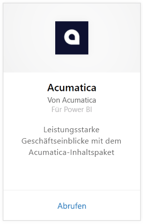
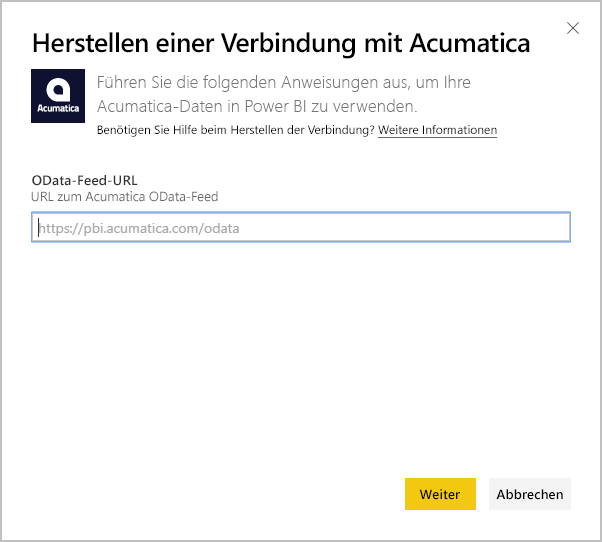
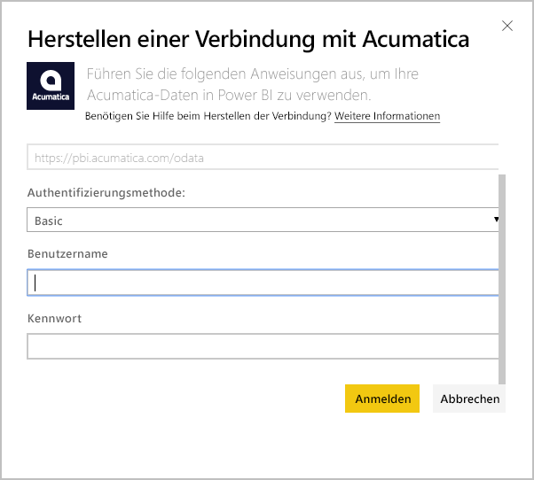
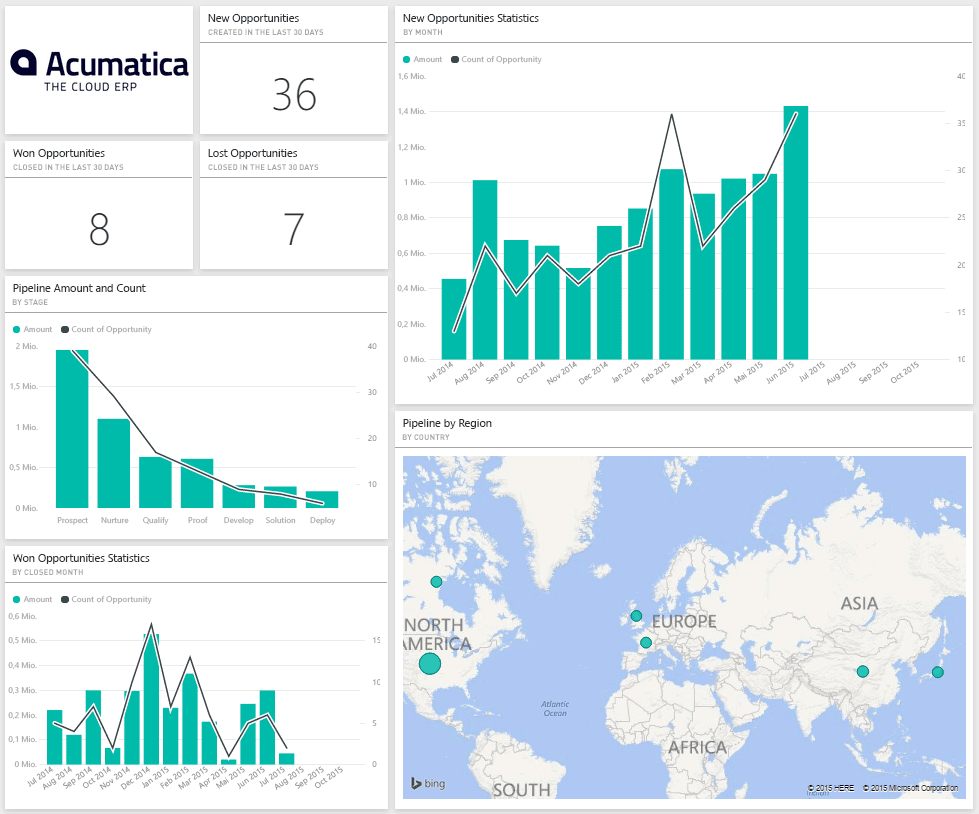
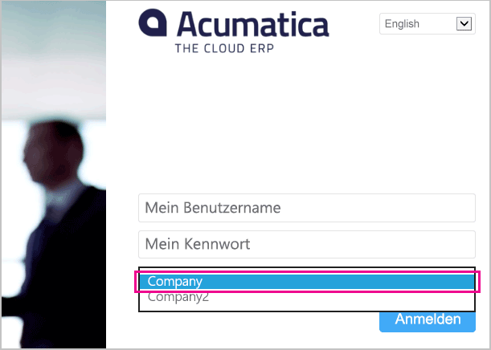

# Herstellen einer Verbindung mit Acumatica mithilfe von Power BI
Mit dem Power BI-Acumatica-Inhaltspaket können Sie schnell Erkenntnisse aus Ihren Verkaufschancendaten gewinnen. Power BI ruft Ihre Daten ab, einschließlich Verkaufschancen, Konten und Kunden, und erstellt dann auf der Grundlage dieser Daten ein Standarddashboard und zugehörige Berichte.

Stellen Sie eine Verbindung mit dem [Acumatica- Inhaltspaket](https://app.powerbi.com/getdata/services/acumatica) her, oder erfahren Sie mehr über die [Integration von Acumatica](https://powerbi.microsoft.com/integrations/acumatica) in Power BI.

>[!NOTE]
>Die Mindestversion von Acumatica für dieses Inhaltspaket ist 5.2.

## Herstellen der Verbindung
1. Wählen Sie unten im linken Navigationsbereich **Daten abrufen** aus.
   
   
2. Wählen Sie im Feld **Dienste** die Option **Abrufen**aus.
   
   
3. Wählen Sie **Acumatica** \> **Abrufen** aus.
   
   
4. Geben Sie Ihren Acumatica-OData-Endpunkt ein. Mithilfe eines OData-Endpunkts kann ein externes System Daten bei Acumatica abrufen. Ein Acumatica-OData-Endpunkt weist das folgende Format auf und sollte HTTPS verwenden:
   
     https://[Websitedomäne]/odata/[Firmenname]
   
   Der Firmenname ist nur erforderlich, wenn Sie eine Bereitstellung mit mehreren Unternehmen haben. Weitere Informationen zum Auffinden dieses Parameters in Ihrem Acumatica-Konto finden Sie unten.
   
   
5. Wählen Sie als Authentifizierungsmethode **Standard**aus. Geben Sie den Benutzernamen und das Kennwort Ihres Acumatica-Kontos ein, und klicken Sie dann auf **Anmelden**.
   
    
6. Nachdem die Daten von Power BI importiert wurden, werden im linken Navigationsbereich ein neues Dashboard, ein Bericht und ein Dataset angezeigt. Neue Elemente sind mit einem gelben Sternchen (\*) gekennzeichnet, das nach dem Auswählen ausgeblendet wird. Nach Auswahl des Dashboards wird ein Layout ähnlich wie das folgende gezeigt:
   
    

**Was nun?**

* Versuchen Sie, am oberen Rand des Dashboards [im Q&A-Feld eine Frage zu stellen](power-bi-q-and-a.md).
* [Ändern Sie die Kacheln](service-dashboard-edit-tile.md) im Dashboard.
* [Wählen Sie eine Kachel aus](service-dashboard-tiles.md), um den zugrunde liegenden Bericht zu öffnen.
* Ihr Dataset ist auf eine tägliche Aktualisierung festgelegt. Sie können jedoch das Aktualisierungsintervall ändern oder es über **Jetzt aktualisieren** nach Bedarf aktualisieren.

## Systemanforderungen
Dieses Inhaltspaket erfordert mindestens die Acumatica-Version 5.2. Prüfen Sie die Version mit Ihrem Acumatica-Administrator.

## Suchen von Parametern
**Acumatica OData-Endpunkt**

Der Acumatica-OData-Endpunkt weist das folgende Format auf und sollte HTTPS verwenden:

    https://[sitedomain]/odata/[companyname]

Wenn Sie bei Acumatica angemeldet sind, wird die Domäne der Anwendungswebsite in der Adressleiste des Browsers angezeigt. Im Beispiel unten ist die Websitedomäne „https://pbi.acumatica.com“, also ist der bereitzustellende OData-Endpunkt „https://pbi.acumatica.com/odata“.

 

Der Firmenname ist nur erforderlich, wenn Sie eine Bereitstellung mit mehreren Unternehmen haben. Diese Informationen finden Sie auf der Acumatica-Anmeldeseite.

## Problembehandlung
Wenn Sie sich nicht anmelden können, überprüfen Sie, ob der angegebene Automatica-OData-Endpunkt das richtige Format aufweist.

    https://<application site domain>/odata/<company name>

Wenn beim Herstellen der Verbindung Probleme auftreten, überprüfen Sie gemeinsam mit Ihrem Administrator Ihre Acumatica-Version. Für dieses Inhaltspaket ist die Version 5.2 oder höher erforderlich.

## Nächste Schritte
[Erste Schritte mit Power BI](service-get-started.md)

[Abrufen von Daten in Power BI](service-get-data.md)

