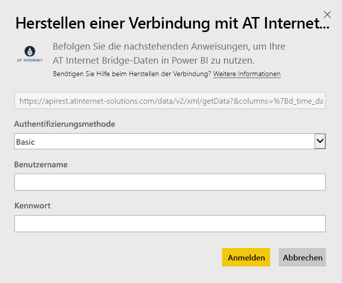

# Herstellen einer Verbindung mit AT Internet Bridge mithilfe von Power BI
AT Internet ermöglicht Ihnen mithilfe seiner Analytics Suite, einer vereinheitlichten digitalen Analyseplattform, einen unmittelbaren Nutzen aus Ihren Daten zu ziehen. Das AT Internet Bridge-Inhaltspaket für Power BI enthält Daten zu Seitenaufrufen, Datenquellen, Lokalisierung und Geräten für Ihre Website.

Stellen Sie die Verbindung zum [AT Internet Bridge-Inhaltspaket](https://app.powerbi.com/getdata/services/at-internet-bridge) für Power BI her.

## Herstellen der Verbindung
1. Wählen Sie unten im linken Navigationsbereich **Daten abrufen** aus.
   
    
2. Wählen Sie im Feld **Dienste** die Option **Abrufen**aus.
   
    
3. Wählen Sie **AT Internet Bridge** \> **Abrufen** aus.
   
   
4. Geben Sie Nummer der AT Internet-Website an, mit der Sie eine Verbindung herstellen möchten.
   
   
5. Wählen Sie als Authentifizierungsmechanismus **Standard** aus, geben Sie Ihren AT Internet-Benutzernamen und Ihr Kennwort an, und klicken Sie auf **Anmelden**.
   
   
6. Klicken Sie auf **Verbinden** , um den Importvorgang zu starten. Nach Abschluss des Vorgangs werden im Navigationsbereich ein neues Dashboard, ein Bericht und ein Modell angezeigt. Wählen Sie das Dashboard aus, um die importierten Daten anzuzeigen.
   
    

**Was nun?**

* Versuchen Sie, am oberen Rand des Dashboards [im Q&A-Feld eine Frage zu stellen](consumer/end-user-q-and-a.md).
* [Ändern Sie die Kacheln](service-dashboard-edit-tile.md) im Dashboard.
* [Wählen Sie eine Kachel aus](consumer/end-user-tiles.md), um den zugrunde liegenden Bericht zu öffnen.
* Zwar ist Ihr Dataset auf tägliche Aktualisierung festgelegt, jedoch können Sie das Aktualisierungsintervall ändern oder über **Jetzt aktualisieren** nach Bedarf aktualisieren.

## Inhalt
Dieses Inhaltspaket enthält Daten der letzten 45 Tage in den folgenden Tabellen:  

    - Conversion (Konvertierung)  
    - Devices (Geräte)  
    - Localization (Lokalisierung)  
    - Sources (Quellen)  
    - Global Visits (Besuche weltweit)  

## Nächste Schritte
[Was ist Power BI?](power-bi-overview.md)

[Grundlegende Konzepte für Designer im Power BI-Dienst](service-basic-concepts.md)

