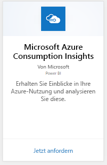
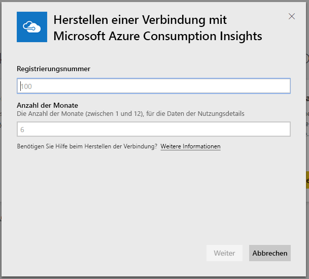
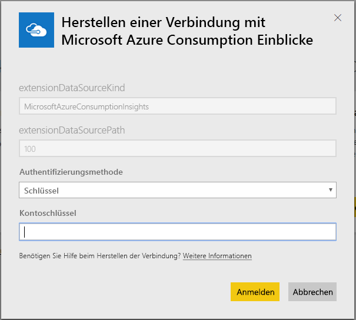

# Herstellen einer Verbindung mit Microsoft Azure Consumption Insights mithilfe von Power BI
Untersuchen und überwachen Sie Ihre Microsoft Azure-Nutzungsdaten in Power BI mit dem Power BI-Inhaltspaket. Die Daten werden automatisch einmal täglich aktualisiert.

Stellen Sie eine Verbindung mit dem [Microsoft Azure Consumption Insights-Inhaltspaket](https://app.powerbi.com/getdata/services/azureconsumption) für Power BI her.

## Herstellen der Verbindung
1. Wählen Sie unten im linken Navigationsbereich **Daten abrufen** aus.
   
    
2. Wählen Sie im Feld **Dienste** die Option **Abrufen**aus.
   
   
3. Wählen Sie **Microsoft Azure Consumption Insights** \> **jetzt**. 
   
   
4. Geben Sie die Anzahl der Monate, für die Sie Daten importieren möchten, und Ihre Azure Enterprise-Registrierungsnummer ein. Nachstehend finden Sie weitere Informationen zum [Suchen dieser Parameter](#FindingParams).
   
    
5. Geben Sie zum Herstellen der Verbindung Ihren Zugriffsschlüssel ein. Sie finden Ihre Schlüssel für die Registrierung im Azure EA-Portal. 
   
    
6. Der Importvorgang startet automatisch. Nach Abschluss des Vorgangs werden Sie im Navigationsbereich ein neues Dashboard, Bericht und Modell angezeigt. Wählen Sie das Dashboard aus, um die importierten Daten anzuzeigen.
   
   

**Was nun?**

* Versuchen Sie, am oberen Rand des Dashboards [im Q&A-Feld eine Frage zu stellen](consumer/end-user-q-and-a.md).
* [Ändern Sie die Kacheln](service-dashboard-edit-tile.md) im Dashboard.
* [Wählen Sie eine Kachel aus](consumer/end-user-tiles.md), um den zugrunde liegenden Bericht zu öffnen.
* Während das Dataset aktualisieren täglich geplant ist, können Sie jedoch das Aktualisierungsintervall ändern oder aktualisieren sie bei Bedarf mit **jetzt aktualisieren**

## Inhalt
Das Microsoft Azure Consumption Insights-Inhaltspaket enthält monatliche Berichtsdaten für den Monatsbereich, die, den Sie beim Herstellen einer Verbindung angegeben haben. Der Bereich ist ein bewegliches Fenster, sodass die enthaltenen Datumsangaben aktualisiert werden, da das Dataset aktualisiert.

## Systemanforderungen
Das Inhaltspaket erfordert Zugriff auf die Enterprise-Features im Azure-Portal. 

## Suchen von Parametern
Power BI-berichterstellung steht für direkte EA, Partner und indirekte Kunden zur Verfügung, die Abrechnungsinformationen anzeigen können. Unten finden Sie Informationen zum Suchen aller Werte, die der Verbindung erforderlichen erwartet wird.

**Anzahl Monate**

* Die Anzahl der Monate (1 und 36) von Daten von heute, die Sie importieren möchten.

**Registrierungsnummer**

* Ihre Azure Enterprise-Registrierungsnummer, finden Sie unter den [Azure Enterprise Portal](https://ea.azure.com/) home-Bildschirm unter **Registrierungsdetails**.
  
    

**Zugriffsschlüssel**

* Sie finden den Zugriffsschlüssel im Azure Enterprise-Portal unter **Nutzung herunterladen** > **API-Zugriffsschlüssel**.
  
    

**Zusätzliche Hilfe**

* Für zusätzliche Hilfe bei der Einrichtung der Azure Enterprise Power BI-Paket, melden Sie sich beim Azure Enterprise Portal, und zeigen Sie die API-Hilfedatei unter **Hilfe**. Sie erhalten auch weitere Anweisungen unter **Berichte** -> **Nutzung herunterladen** -> **API-Zugriffsschlüssel**.

## Nächste Schritte
[Erste Schritte mit Power BI](service-get-started.md)

[Abrufen von Daten in Power BI](service-get-data.md)

