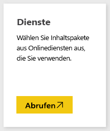
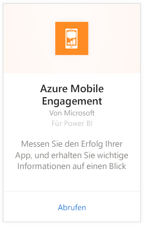
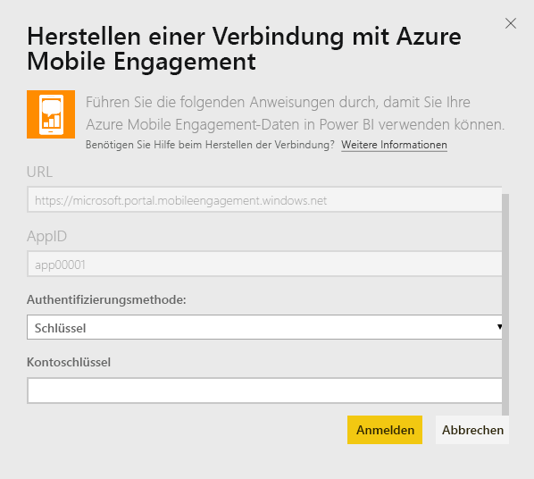

# Herstellen einer Verbindung mit Azure Mobile Engagement mithilfe von Power BI
Mit dem Power BI Azure Mobile Engagement-Inhaltspaket können Sie schnell Erkenntnisse aus Ihren App-Daten gewinnen.

Stellen Sie eine Verbindung mit dem [Azure Mobile Engagement-Inhaltspaket](https://app.powerbi.com/groups/me/getdata/services/azme) für Power BI her.

## Herstellen der Verbindung
1. Wählen Sie unten im linken Navigationsbereich **Daten abrufen** aus.
   
    
2. Wählen Sie im Feld **Dienste** die Option **Abrufen**aus.
   
    
3. Wählen Sie **Azure Mobile Engagement** \> **Abrufen** aus.
   
     
4. Geben Sie Ihre App-Sammlung und den Namen der App an. Diese Informationen finden Sie in Ihrem Azure Mobile Engagement-Konto.
   
     
5. Geben Sie als Authentifizierungsmethode Ihren Schlüssel an, und klicken Sie dann auf „Anmelden“.
   
    
6. Nachdem die Daten von Power BI importiert wurden, werden im linken Navigationsbereich ein neues Dashboard, ein Bericht und ein Dataset angezeigt. Neue Elemente sind mit einem gelben Sternchen (\*) gekennzeichnet, das nach der Auswahl ausgeblendet wird:
   
    

 **Was nun?**

* Versuchen Sie, am oberen Rand des Dashboards [im Q&A-Feld eine Frage zu stellen](power-bi-q-and-a.md).
* [Ändern Sie die Kacheln](service-dashboard-edit-tile.md) im Dashboard.
* [Wählen Sie eine Kachel aus](service-dashboard-tiles.md), um den zugrunde liegenden Bericht zu öffnen.
* Ihr Dataset ist auf eine tägliche Aktualisierung festgelegt. Sie können jedoch das Aktualisierungsintervall ändern oder es über **Jetzt aktualisieren** nach Bedarf aktualisieren.

## Nächste Schritte
[Erste Schritte mit Power BI](service-get-started.md)

[Abrufen von Daten in Power BI](service-get-data.md)

