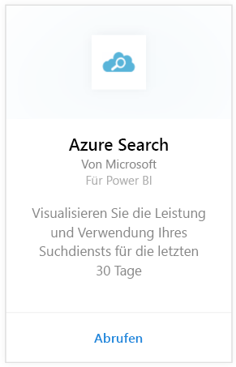
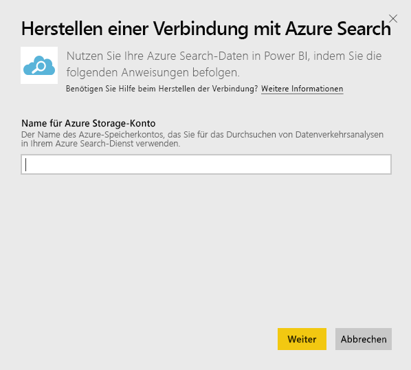
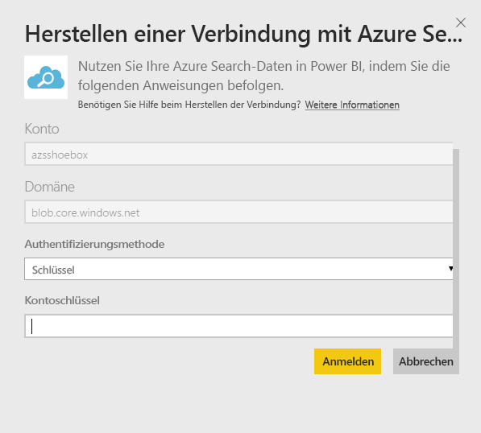
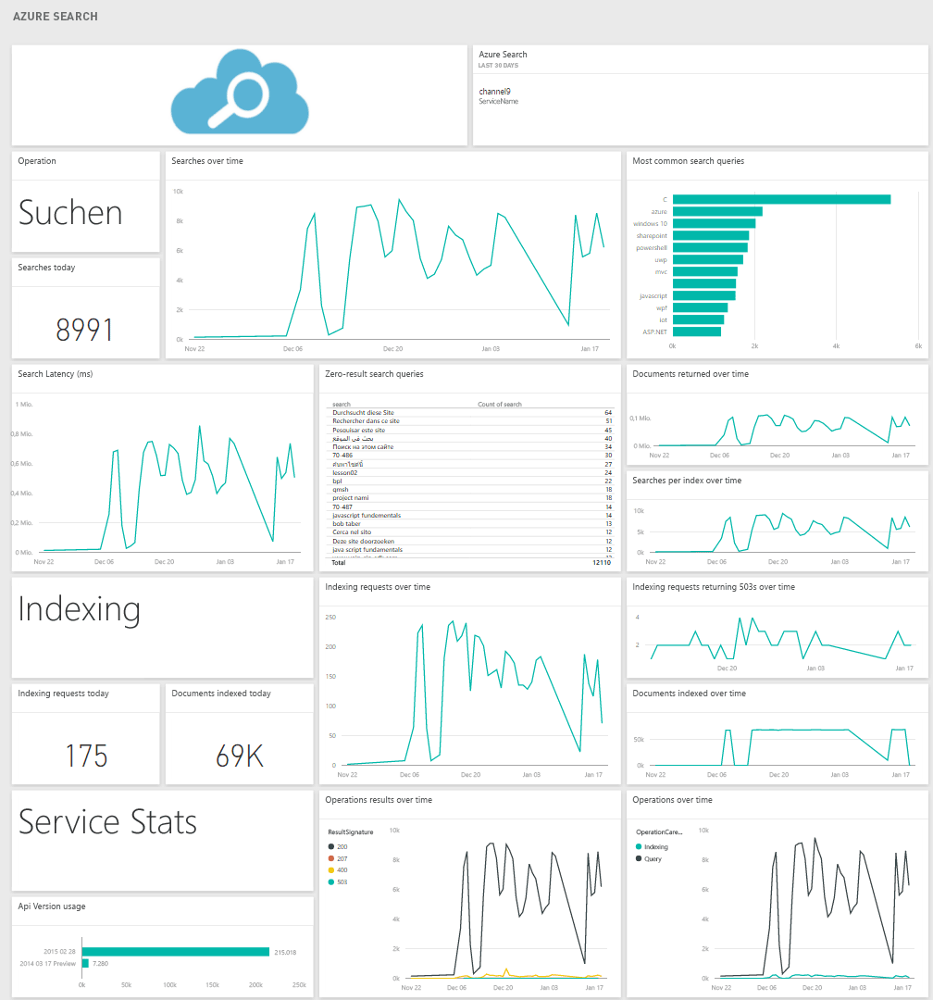

# Herstellen einer Verbindung mit Azure Search mithilfe von Power BI
Azure Search Traffic Analytics ermöglicht das Überwachen und Verstehen des Datenverkehrs zu Ihrem Azure Search-Dienst. Das Azure Search-Inhaltspaket für Power BI bietet detaillierte Einblicke in Ihre Suchdaten, einschließlich Suchen, Indizierung, Dienststatistiken und Latenz der letzten 30 Tage. Weitere Informationen finden Sie im [Azure-Blogbeitrag](https://azure.microsoft.com/blog/analyzing-your-azure-search-traffic/).

Stellen Sie eine Verbindung mit dem [Azure Search-Inhaltspaket](https://app.powerbi.com/getdata/services/azure-search) für Power BI her.

## Herstellen der Verbindung
1. Wählen Sie unten im linken Navigationsbereich **Daten abrufen** aus.
   
    
2. Wählen Sie im Feld **Dienste** die Option **Abrufen**aus.
   
    
3. Wählen Sie **Azure Search** \> **Abrufen** aus.
   
   
4. Geben Sie den Namen des Tabellenspeicherkontos an, in dem Ihre Azure Search-Analysen gespeichert werden.
   
   
5. Wählen Sie **Schlüssel** als Authentifizierungsmechanismus aus, und geben Sie den Schlüssel Ihres Speicherkontos ein. Klicken Sie auf **Anmelden** , und starten Sie den Ladevorgang.
   
   
6. Nach Abschluss des Ladevorgangs werden im Navigationsbereich ein neues Dashboard, ein Bericht und ein Modell angezeigt. Wählen Sie das Dashboard aus, um die importierten Daten anzuzeigen.
   
    

**Was nun?**

* Versuchen Sie, am oberen Rand des Dashboards [im Q&A-Feld eine Frage zu stellen](power-bi-q-and-a.md).
* [Ändern Sie die Kacheln](service-dashboard-edit-tile.md) im Dashboard.
* [Wählen Sie eine Kachel aus](service-dashboard-tiles.md), um den zugrunde liegenden Bericht zu öffnen.
* Ihr Dataset ist auf eine tägliche Aktualisierung festgelegt. Sie können jedoch das Aktualisierungsintervall ändern oder es über **Jetzt aktualisieren** nach Bedarf aktualisieren.

## Systemanforderungen
Das Azure Search-Inhaltspaket erfordert, dass Azure Search Traffic Analytics für das Konto aktiviert ist.

## Problembehandlung
Stellen Sie sicher, dass der Name des Speicherkontos zusammen mit dem Vollzugriffsschlüssel ordnungsgemäß angegeben wird. Der Name des Speicherkontos muss dem Konto entsprechen, das mit Azure Search Traffic Analytics konfiguriert ist.

## Nächste Schritte
[Erste Schritte mit Power BI](service-get-started.md)

[Power BI – Grundkonzepte](service-basic-concepts.md)

