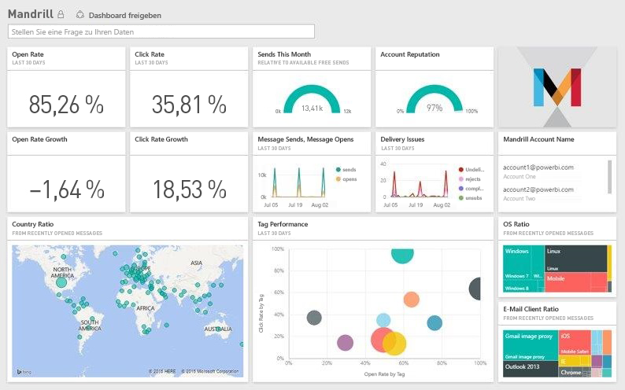

# Herstellen einer Verbindung mit Mandrill mithilfe von Power BI
Das Power BI-Inhaltspaket ruft Daten aus Ihrem Mandrill-Konto ab und generiert ein Dashboard, eine Reihe von Berichten sowie ein Dataset, damit Sie Ihre Daten analysieren können. Verwenden Sie die Analysefunktionen von Mandrill, um schnell Erkenntnisse aus Ihrer Newsletter- oder Marketingkampagne zu gewinnen. Die Daten werden täglich aktualisiert, um sicherzustellen, dass sie auf dem neuesten Stand sind.

Stellen Sie eine Verbindung mit dem [Mandrill-Inhaltspaket für Power BI](http://app.powerbi.com/getdata/services/mandrill) her.

## Herstellen der Verbindung
1. Wählen Sie unten im linken Navigationsbereich **Daten abrufen** aus.
   
    
2. Wählen Sie im Feld **Dienste** die Option **Abrufen**aus.
   
    
3. Wählen Sie **Mandrill** > **Abrufen** aus.
   
    
4. Wählen Sie unter **Authentifizierungsmethode**die Option **Schlüssel** aus, und geben Sie Ihren API-Schlüssel an. Den Schlüssel finden Sie auf der Registerkarte **Einstellungen** des Mandrill-Dashboards. Wählen Sie **Anmelden** aus, um den Importvorgang zu starten, der je nach der Datenmenge in Ihrem Konto einige Minuten dauern kann.
   
    
5. Nachdem die Daten von Power BI importiert wurden, werden im linken Navigationsbereich ein neues Dashboard, ein Bericht und ein Dataset angezeigt. Dies ist der Standarddashboard, das Power BI zum Anzeigen Ihrer Daten erstellt hat.
   
    

**Was nun?**

* Versuchen Sie, am oberen Rand des Dashboards [im Q&A-Feld eine Frage zu stellen](consumer/end-user-q-and-a.md).
* [Ändern Sie die Kacheln](service-dashboard-edit-tile.md) im Dashboard.
* [Wählen Sie eine Kachel aus](consumer/end-user-tiles.md), um den zugrunde liegenden Bericht zu öffnen.
* Zwar ist Ihr Dataset auf tägliche Aktualisierung festgelegt, jedoch können Sie das Aktualisierungsintervall ändern oder über **Jetzt aktualisieren** nach Bedarf aktualisieren.

## Nächste Schritte
[Was ist Power BI?](power-bi-overview.md)

[Grundlegende Konzepte für Designer im Power BI-Dienst](service-basic-concepts.md)

