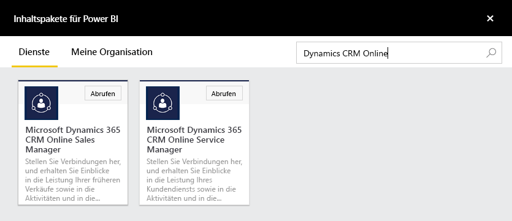
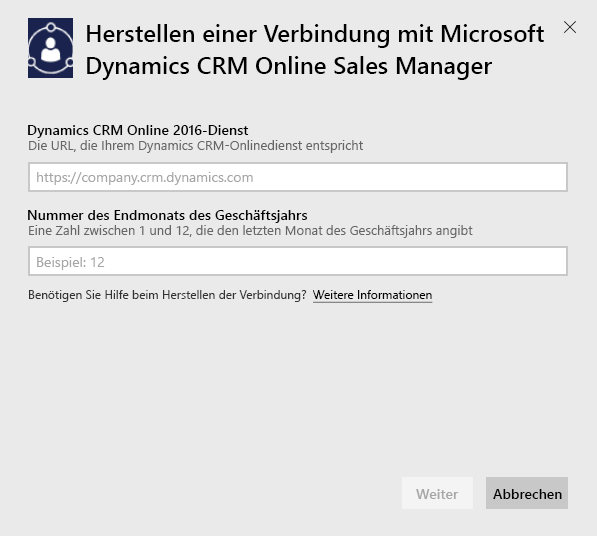
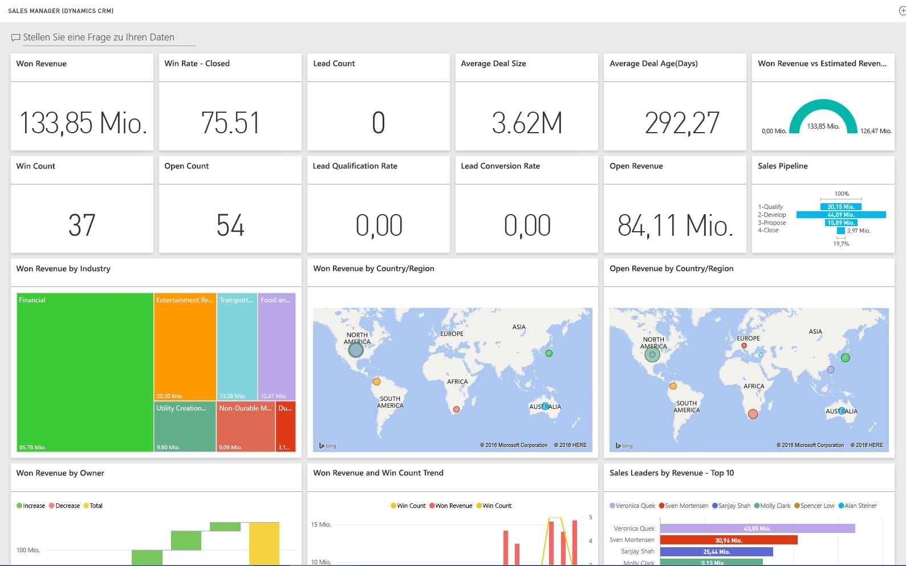

# Herstellen einer Verbindung mit Microsoft Dynamics CRM mithilfe von Power BI
Mit Microsoft Dynamics CRM Online für Power BI können Sie einfach auf Ihre Daten zuzugreifen und sie analysieren. Power BI verwendet den OData-Feed, um ein anschauliches Modell mit allen erforderlichen Entitäten und Measures zu erstellen, z.B. Konten, Aktivitäten, Verkaufschancen, Produkte, Leads, Benutzer usw. Nachdem Sie die App installiert haben, können Sie das Dashboard und die Berichte im Power BI-Dienst ([https://powerbi.com](https://powerbi.com)) und in den mobilen Power BI-Apps anzeigen. 

Stellen Sie eine Verbindung mit Dynamics CRM Online [Sales Manager](https://msit.powerbi.com/groups/me/getdata/services/dynamics-crm-sales-manager) oder [Service Manager](https://msit.powerbi.com/groups/me/getdata/services/dynamics-crm-customer-service) her. Erfahren Sie mehr über die [Integration von Dynamics CRM Online](https://powerbi.microsoft.com/integrations/microsoft-dynamicscrm) in Power BI.

Für diese Verbindung ist **Microsoft Dynamics CRM Online 2016 oder höher** erforderlich. Weitere Informationen zu den [Anforderungen](#Requirements) finden Sie unten.

## Herstellen der Verbindung
[!INCLUDE [powerbi-service-apps-get-more-apps](./includes/powerbi-service-apps-get-more-apps.md)]

1. Wählen Sie **Microsoft Dynamics CRM Sales Manager** oder **Microsoft Dynamics CRM Service Manager** aus, und klicken Sie auf **Verbinden**.
   
   
2. Geben Sie die Ihrem Konto zugeordnete Dienst-URL an.  Diese hat das Format `https://company.crm.dynamics.com`, siehe weitere Informationen [unten](#FindingParams).
   
   
3. Geben Sie nach der entsprechenden Aufforderung Ihre Anmeldeinformationen ein (dieser Schritt kann übersprungen werden, wenn Sie bereits mit Ihrem Browser angemeldet sind). Geben Sie für die Authentifizierungsmethode **oAuth2** ein, und klicken Sie auf **Anmelden**:
   
   
4. Nachdem die Verbindung hergestellt ist, wird ein für Vertriebsleiter oder Serviceleiter angepasstes Dashboard mit Ihren eigenen Daten angezeigt:
   
   

## Anzeigen des Dashboards und der Berichte von Microsoft Dynamics CRM
[!INCLUDE [powerbi-service-apps-open-app](./includes/powerbi-service-apps-open-app.md)]

[!INCLUDE [powerbi-service-apps-open-app](./includes/powerbi-service-apps-what-now.md)]

## Inhalt
In den folgenden Abschnitten wird ausführlich beschrieben, was in den Personas [Sales Manager](#Sales) und [Service Manager](#Service) enthalten ist.

Beachten Sie, dass Daten zusätzlich basierend auf der Sicherheitsrolle, die dem Dynamics CRM Online-Benutzer zugewiesen wurde, beschränkt sind.

Das Dashboard und die Berichte sollen die Betriebsberichterstellung für zukünftige Daten mit Schwerpunkt auf einem Team oder einer Gruppe bereitstellen. Jede Abfrage ist begrenzt auf das Abrufen von maximal 100.000 Datensätzen von Dynamics CRM Online. Wenn diese Begrenzung aufgrund der großen Datenmenge in Ihrer Organisation überschritten wird, tritt ein Fehler bei der Bereitstellung auf, da die Datenaktualisierung über Dynamics CRM Online beendet wird. Wenn Ihr Konto zu groß ist, sollten Sie zum Erstellen einer benutzerdefinierten Lösung eine Verbindung über Power BI Desktop herstellen.

### Sales Manager
Das Dashboard und die Berichte enthalten Schlüsselmetriken, z.B.:  

* Won Revenue   
* Gewinnrate   
* Offener Umsatz   
* Verlorener Umsatz   
* Erwarteter Umsatz  
* Durchschnittliche Auftragsgröße und weitere.  

Darüber hinaus enthalten sie Schlüsseldiagramme, z.B.:  

* Trend bezüglich gewonnenem und verlorenem Umsatz, Trend bezüglich gewonnenem Umsatz vs. erwartetem Umsatz  
* Gewonnener Umsatz in verschiedenen Dimensionen, wie Industrie, Region, Gebiet   
* Vertriebsleiter nach Umsatz, Aktivitäten,   
* beste Konten, beste Gewinn/Verlust-Deals,    
* Trend bezüglich neuer potenzieller Kunden, Verkaufspipeline und weitere.   

Mithilfe dieser Metriken und Diagramme können Sie die Leistung Ihrer Vertriebsorganisation verstehen und die Vertriebspipeline über Ihr Vertriebsteam hinweg analysieren.

In der folgenden Tabelle werden die CRM-Entitäten aufgelistet, die für diesen Dienst verfügbar sind. Außerdem enthält sie Details zu den Filtern, die auf jeden der Entitätsdatensätze angewendet werden.

| CRM-Entität | Angewendete Filter |
| --- | --- |
| Account |Alle Konten, die über verknüpfte Verkaufschancen verfügen, die in den letzten 365 Tagen geändert wurden |
| Activity |Alle Aktivitäten, die in den letzten 90 Tagen geändert wurden   [modifiedon] > today - 90 days |
| Business Unit |Alle Unternehmenseinheiten, die nicht deaktiviert wurden   [isdisabled] = false |
| Lead |Alle Leads, die in den letzten 180 Tagen geändert wurden   [modifiedon] > today - 180 days |
| Opportunity |Alle Verkaufschancen, die in den letzten 365 Tagen geändert wurden   [modifiedon] > today - 365 days |
| Opportunity Product |Alle Verkaufschancenprodukte, die in den letzten 365 Tagen geändert wurden   [modifiedon] > today - 365 days |
| Product |Alle aktiven Produkte   [statecode] <> 1 |
| Territory |Alle Gebiete |
| User |Alle aktiven Benutzer und nicht delegierten Administratoren    [isdisabled] = false und [accessmode] <> 4 |

### Service Manager
Dieses Dashboard und seine Berichte enthalten Schlüsselmetriken, z.B.:  

* CSAT Percentage   
* SLA Met percentage   
* Escalated Cases Percentage   
* Average Handling Time   
* Total Resolved Cases  
* Total Active Cases  
* Number of Times KB Article Used in cases und weitere.    

Darüber hinaus enthalten sie Schlüsseldiagramme, z.B.:   

* Case Volume Trends for Incoming Cases, Resolved Cases, Escalated Cases   
* Case Volume by various dimensions such as Origin, Location, Priority, Type  
* Leaders by CSAT percentage, SLA met percentage, Activities, Resolved cases  
* Most Used and Most viewed KB Articles und weitere.  
    Mithilfe dieser Metriken und Diagramme können Sie die Leistung Ihrer Supportorganisation erkennen und die Workload der aktiven Anfragen für das gesamte Serviceteam und alle Dienstwarteschlangen analysieren.

In der folgenden Tabelle werden die CRM-Entitäten aufgelistet, die für diesen Dienst verfügbar sind. Außerdem werden Details zu den Filtern aufgelistet, die auf jeden der Entitätsdatensätze angewendet werden.

| CRM-Entität | Angewendete Filter |
| --- | --- |
| Account |Alle Konten, die über verknüpfte Fälle verfügen, die in den letzten 90 Tagen geändert wurden |
| Activity |Alle Aktivitäten, die in den letzten 90 Tagen geändert wurden   [modifiedon] > today - 90 days |
| Case |Alle Fälle, die in den letzten 90 Tagen geändert wurden   [modifiedon] > today - 90 days |
| Case Resolution Activity |Alle Anfrageabschlussaktivitäten, die in den letzten 90 Tagen geändert wurden   [modifiedon] > today - 90 days |
| Kontakt |Alle Kontakte, die über verknüpfte Fälle verfügen, die in den letzten 90 Tagen geändert wurden |
| Knowledge Article |Alle neuesten Versionen von Knowledge-Artikeln    [islatestversion] = true |
| Knowledge Article Incident |Alle Knowledge-Artikel-Vorfälle, die in den letzten 90 Tagen geändert wurden   [modifiedon] > today - 90 days |
| Queue |Alle aktiven Warteschlangen    [statecode] = 0 |
| Queue Item |Alle mit dem Fall verbundenen Warteschlangenelemente, die in den letzten 365 Tagen erstellt wurden    [createdon] > today - 365 days and   [objecttypecode] = 112 |
| User |Alle aktiven Benutzer    [isdisabled] = false |

## Systemanforderungen
* Eine gültige Instanz von Dynamics CRM Online 2016 oder höher (Power BI wird mit einer lokalen CRM-Version nicht ausgeführt). Wenn Sie nicht über 2016 oder höher verfügen:
* Ein Administrator muss den OData-Endpunkt in den Websiteeinstellungen aktivieren.
* Ein Konto mit weniger als 100.0000 Datensätzen in jeder der Tabellen. Hinweis: Wenn das Konto Zugriff auf mehr als 100.000 Datensätze hat, treten beim Import Fehler auf.

## Suchen von Parametern
Die Adresse der Instanz finden Sie in der URL-Leiste Ihres Browsers. Sie weist normalerweise das folgende Format auf: `https://[instance_name].crm.dynamics.com`.

Power BI unterstützt nur Dynamics CRM 2016-Endpunkte. Mit früheren Versionen von CRM Online kann die Verbindung nicht hergestellt werden. Verwenden Sie Power BI Desktop, um eine direkte Verbindung mit Ihrem Konto herzustellen.

## Problembehandlung
Wenn beim Herstellen einer Verbindung Probleme auftreten, stellen Sie sicher, dass:  

* Sie die richtige Instanz-URL bereitstellen (überprüfen Sie dies gemeinsam mit Ihrem Administrator)  
* es sich bei der Instanz um CRM Online 2016 handelt  
* der OData-Endpunkt aktiviert ist  

Versuchen Sie außerdem, mit der OData-URL `https://[instance_name].crm.dynamics.com/api/data/v8.0/` direkt in Power BI Desktop eine Verbindung herzustellen.

Wenn Sie sich vergewissert haben, dass Dynamics CRM Online 2016 verwendet wird, aber dennoch Verbindungsprobleme auftreten, wenden Sie sich an Ihren CRM-Administrator, um sicherzustellen, dass Sie über alle verfügbaren Updates verfügen.

Wenn Sie nicht über CRM Online 2016 oder höher verfügen, verwenden Sie Power BI Desktop, um direkt eine Verbindung mit Ihrem Konto herzustellen.

Falls ein Fehler mit dem Inhalt „Fehler bei der Datenaktualisierung, weil die Abfrage die maximale Anzahl von 100000 Datensätzen überschritten hat.“ angezeigt wird, erwägen Sie, die Verbindung direkt über Power BI Desktop herzustellen oder die CRM-Lösungsvorlage zu verwenden.

## Nächste Schritte
* [Was sind Apps in Power BI?](service-install-use-apps.md)
* [Abrufen von Daten in Power BI](service-get-data.md)
* Weitere Fragen? [Stellen Sie Ihre Frage in der Power BI-Community.](http://community.powerbi.com/)

