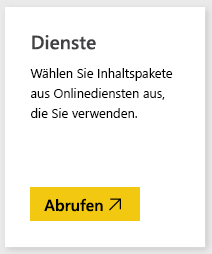
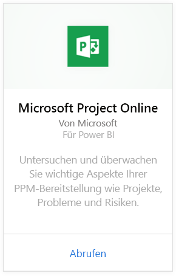
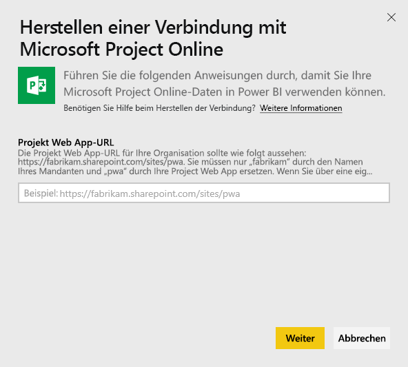

# Herstellen einer Verbindung mit Project Online mithilfe von Power BI
Microsoft Project Online ist eine flexible Onlinelösung für das Projektportfoliomanagement (PPM) und die tägliche Arbeit. Project Online versetzt Organisationen dazu in die Lage, die ersten Schritte zu unternehmen, Investitionen in Projektportfolios zu priorisieren und den beabsichtigten Geschäftserfolg zu realisieren. Das Projekt Online-Inhaltspaket für Power BI ermöglicht Ihnen, Ihre Projektdaten mit vordefinierten Metriken wie Portfoliostatus und Projektkonformität zu erkunden.

Stellen Sie eine Verbindung zum [Project Online-Inhaltspaket](https://app.powerbi.com/getdata/services/project-online) für Power BI her.

## Herstellen der Verbindung
1. Wählen Sie unten im linken Navigationsbereich **Daten abrufen** aus.
   
    
2. Wählen Sie im Feld **Dienste** die Option **Abrufen**aus.
   
   
3. Wählen Sie **Microsoft Project Online** \> **Abrufen** aus.
   
   
4. Geben Sie im Textfeld **Project Web App-URL** die URL für die Project Web App (PWA) ein, mit der Sie eine Verbindung herstellen möchten, und klicken Sie dann auf **Weiter**. Beachten Sie, dass dies bei Verwendung einer benutzerdefinierten Domäne vom Beispiel abweichen kann.
   
    
5. Wählen Sie als Authentifizierungsmethode die Option **oAuth2** \> **Anmelden** aus. Wenn Sie dazu aufgefordert werden, geben Sie Ihre Project Online-Anmeldeinformationen ein, und führen Sie den Authentifizierungsvorgang aus.
   
    
6. Eine Benachrichtigung wird angezeigt, dass Ihre Daten geladen werden. Je nach Größe Ihres Kontos kann dies einige Zeit dauern. Nachdem die Daten von Power BI importiert wurden, werden im linken Navigationsbereich ein neues Dashboard, ein Bericht und ein Dataset angezeigt. Dies ist der Standarddashboard, das Power BI zum Anzeigen Ihrer Daten erstellt hat. Sie können dieses Dashboard anpassen, damit Ihre Daten auf die gewünschte Weise angezeigt werden.
   
   

**Was nun?**

* Versuchen Sie, am oberen Rand des Dashboards [im Q&A-Feld eine Frage zu stellen](service-q-and-a.md).
* [Ändern Sie die Kacheln](service-dashboard-edit-tile.md) im Dashboard.
* [Wählen Sie eine Kachel aus](service-dashboard-tiles.md), um den zugrunde liegenden Bericht zu öffnen.
* Ihr Dataset ist auf eine tägliche Aktualisierung festgelegt. Sie können jedoch das Aktualisierungsintervall ändern oder es über **Jetzt aktualisieren** nach Bedarf aktualisieren.

## Nächste Schritte
[Erste Schritte mit Power BI](service-get-started.md)

[Abrufen von Daten in Power BI](service-get-data.md)

