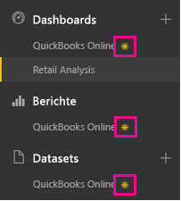
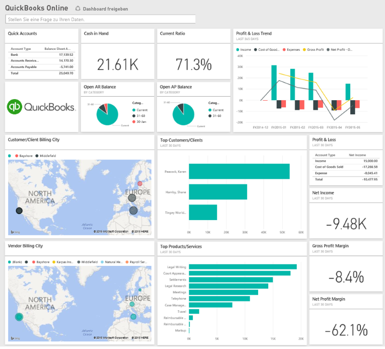

# Herstellen einer Verbindung mit QuickBooks Online mithilfe von Power BI
Wenn Sie über Power BI eine Verbindung mit Ihren QuickBooks Online-Daten herstellen, erhalten Sie sofort ein Power BI-Dashboard und Power BI-Berichte, die Rückschlüsse auf Cashflows im Unternehmen, Rentabilität, Kunden und weitere Informationen bereitstellen. Sie können die bereitgestellten Dashboards und Berichte unverändert verwenden oder sie anpassen, um die für Sie wichtigsten Informationen hervorzuheben. Die Daten werden automatisch einmal täglich aktualisiert.

Stellen Sie die Verbindung zum [QuickBooks Online-Inhaltspaket](https://dxt.powerbi.com/getdata/services/quickbooks-online) für Power BI her.

>[!NOTE]
>Damit Sie die QuickBooks Online-Daten in Power BI importieren können, müssen Sie für Ihr QuickBooks Online-Konto über Administratorrechte verfügen und sich mit Ihren Administratoranmeldeinformationen anmelden.

## Herstellen der Verbindung
1. Wählen Sie unten im linken Navigationsbereich **Daten abrufen** aus.
   
    
2. Wählen Sie im Feld **Dienste** die Option **Abrufen**aus.
   
    
3. Wählen Sie **QuickBooks Online** und dann **Abrufen** aus.
   
   
4. Wählen Sie als Authentifizierungsmethode die Option **oAuth2** und dann **Anmelden**aus. 
5. Geben Sie bei der entsprechenden Aufforderung Ihre QuickBooks Online-Anmeldeinformationen ein, und führen Sie den QuickBooks Online-Authentifizierungsprozess aus. Wenn Sie in Ihrem Browser bereits bei QuickBooks Online angemeldet sind, werden Sie möglicherweise nicht zur Eingabe von Anmeldeinformationen aufgefordert.
   >[!NOTE]
   >Für Ihr QuickBooks Online-Konto benötigen Sie Administratoranmeldeinformationen.
6. Wählen Sie auf dem nächsten Bildschirm das Unternehmen aus, das Sie mit Power BI verbinden möchten.
   
   
7. Wählen Sie auf dem nächsten Bildschirm **Autorisieren** aus, um den Importvorgang zu starten. Dies kann je nach Umfang Ihrer Unternehmensdaten einige Minuten dauern. 
   
   
   
   Nachdem die Daten von Power BI importiert wurden, werden im linken Navigationsbereich ein neues Dashboard, ein Bericht und ein Dataset angezeigt. Neue Elemente werden mit einem gelben Sternchen \* markiert.
   
   
8. Wählen Sie das QuickBooks Online-Dashboard aus. Dies ist das von Power BI automatisch erstellte Dashboard, um die importierten Daten anzuzeigen. Sie können dieses Dashboard anpassen, damit Ihre Daten auf die gewünschte Weise angezeigt werden. 
   
   

**Was nun?**

* Versuchen Sie, am oberen Rand des Dashboards [im Q&A-Feld eine Frage zu stellen](power-bi-q-and-a.md).
* [Ändern Sie die Kacheln](service-dashboard-edit-tile.md) im Dashboard.
* [Wählen Sie eine Kachel aus](service-dashboard-tiles.md), um den zugrunde liegenden Bericht zu öffnen.
* Ihr Dataset ist auf eine tägliche Aktualisierung festgelegt. Sie können jedoch das Aktualisierungsintervall ändern oder es über **Jetzt aktualisieren** nach Bedarf aktualisieren.

## Problembehandlung
**„Es ist ein Fehler aufgetreten“**

Wenn Sie diese Meldung nach der Auswahl von **Autorisieren**erhalten:

„Es ist ein Fehler aufgetreten“ Schließen Sie dieses Fenster, und versuchen Sie es erneut.

Die Anwendung wurde für dieses Unternehmen bereits von einem anderen Benutzer abonniert. Wenden Sie sich an [Admin-E-Mail], um Änderungen an diesem Abonnement vorzunehmen.“

Dies bedeutet, dass bereits ein anderer Administrator in Ihrem Unternehmen mit Power BI eine Verbindung mit den Unternehmensdaten hergestellt hat. Bitten Sie diesen Administrator, das Dashboard für Sie freizugeben. Derzeit kann jeweils nur ein Administratorbenutzer mit Power BI eine Verbindung zu einem bestimmten QuickBooks Online-Unternehmensdataset herstellen. Nachdem das Dashboard von Power BI erstellt wurde, kann es der Administrator für mehrere Kollegen auf denselben Power BI-Mandanten freigeben.

**„Diese Anwendung wurde nicht dafür konfiguriert, dass Verbindungen aus Ihrem Land zulässig sind“**

Derzeit unterstützt Power BI nur US-Versionen von QuickBooks Online. 

## Nächste Schritte
[Erste Schritte mit Power BI](service-get-started.md)

[Power BI – Grundkonzepte](service-basic-concepts.md)

