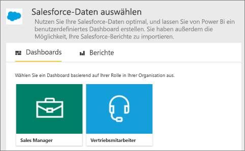
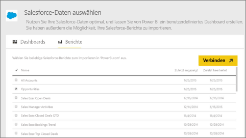

# Herstellen einer Verbindung mit Salesforce mithilfe von Power BI
Mit Power BI können Sie sich problemlos mit Ihrem Salesforce.com-Konto verbinden. Durch das Herstellen dieser Verbindung werden Ihre Daten abgerufen. Auf Basis dieser Daten werden dann automatisch ein Dashboard und zugehörige Berichte bereitgestellt.

Stellen Sie eine Verbindung mit dem [Salesforce-Inhaltspaket](https://app.powerbi.com/getdata/services/salesforce) für Power BI her, oder erfahren Sie mehr über die [Salesforce-Integration](https://powerbi.microsoft.com/integrations/salesforce) in Power BI.

## Herstellen der Verbindung
1. Wählen Sie unten im linken Navigationsbereich **Daten abrufen** aus.
   
    
2. Wählen Sie im Feld **Dienste** die Option **Abrufen**aus.
   
    
3. Klicken Sie auf **Salesforce**, und wählen Sie **Abrufen** aus.  
   
   
4. Wählen Sie **Anmelden** aus, um den Anmeldevorgang zu starten.
   
    
5. Wenn Sie dazu aufgefordert werden, geben Sie Ihre Salesforce-Anmeldeinformationen ein. Klicken Sie auf **Zulassen** , damit Power BI auf Ihre grundlegenden Salesforce-Informationen und -Daten zugreifen kann.
   
   
6. Konfigurieren Sie mithilfe der Dropdownoption, welche Daten Sie in Power BI importieren möchten:
   
   * **Dashboard**
     
     Wählen Sie auf Grundlage einer Persona ein vordefiniertes Dashboard aus (z.B. **Sales Manager**). Diese Dashboards übernehmen einen bestimmten Satz von Standarddaten aus Salesforce und beziehen keine benutzerdefinierten Felder mit ein.
     
     
   * **Berichte**
     
     Wählen Sie mindestens einen benutzerdefinierten Bericht aus Ihrem Salesforce-Konto aus. Diese Berichte entsprechen den Ansichten in Salesforce und können Daten aus benutzerdefinierten Feldern oder Objekten enthalten.
     
     
     
     Wenn keine Berichte angezeigt werden, können Sie diese über Ihr Salesforce-Konto hinzufügen oder erstellen. Anschließend stellen Sie die Verbindung erneut her.
7. Klicken Sie auf **Verbinden** , um den Importvorgang zu starten. Während des Imports wird eine Benachrichtigung angezeigt, dass der Import ausgeführt wird. Wenn der Importvorgang abgeschlossen ist, werden Dashboard, Bericht und Dataset für Ihre Salesforce-Daten im linken Navigationsbereich aufgeführt.
   
   

Sie können dieses Dashboard anpassen, damit Ihre Daten auf die gewünschte Weise angezeigt werden. Sie können im Q&A-Bereich eine Frage stellen, oder Sie klicken auf eine Kachel, um [den zugrunde liegenden Bericht zu öffnen](service-dashboard-tiles.md) und [die Kacheln zu ändern](service-dashboard-edit-tile.md), die sich im Dashboard befinden.

**Was nun?**

* Versuchen Sie, am oberen Rand des Dashboards [im Q&A-Feld eine Frage zu stellen](power-bi-q-and-a.md).
* [Ändern Sie die Kacheln](service-dashboard-edit-tile.md) im Dashboard.
* [Wählen Sie eine Kachel aus](service-dashboard-tiles.md), um den zugrunde liegenden Bericht zu öffnen.
* Ihr Dataset ist auf eine tägliche Aktualisierung festgelegt. Sie können jedoch das Aktualisierungsintervall ändern oder es über **Jetzt aktualisieren** nach Bedarf aktualisieren.

## Systemanforderungen
* Verbindung mit einem Salesforce-Produktionskonto, für das der API-Zugriff aktiviert ist.
* Berechtigung wurde der Power BI-App während der Anmeldung erteilt.
* Das Konto verfügt über ausreichend API-Aufrufe zum Abrufen und Aktualisieren der Daten.
* Für die Aktualisierung ist ein gültiges Authentifizierungstoken erforderlich. Stellen Sie sicher, dass Sie maximal fünf Salesforce-Datasets importiert haben, da für Salesforce ein Limit von fünf Authentifizierungstoken pro Anwendung besteht.

## Problembehandlung
Wenn Fehler auftreten, überprüfen Sie die oben genannten Anforderungen. Beachten Sie auch, dass es derzeit nicht möglich ist, sich bei einer benutzerdefinierten oder Sandkastendomäne anzumelden.

## Nächste Schritte
[Erste Schritte mit Power BI](service-get-started.md)

[Abrufen von Daten](service-get-data.md)

