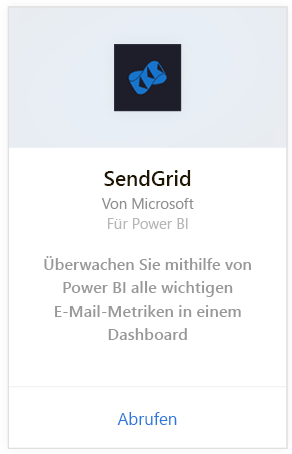
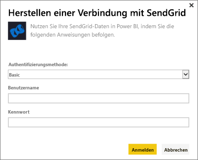
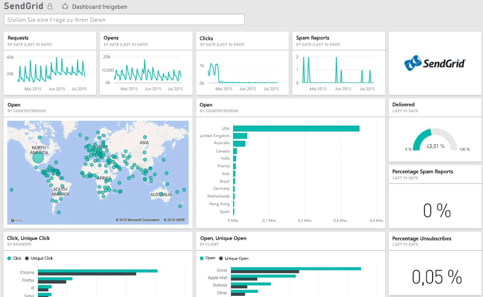

# Herstellen einer Verbindung mit SendGrid mithilfe von Power BI
Mit dem Power BI-Inhaltspaket für SendGrid erhalten Sie Einblicke in Ihr SendGrid-Konto, und Sie können Statistiken extrahieren. Mithilfe des SendGrid-Inhaltspakets können Sie die SendGrid-Statistik in einem Dashboard visualisieren.

Stellen Sie die Verbindung zum [SendGrid-Inhaltspaket](https://app.powerbi.com/getdata/services/sendgrid) für Power BI her.

## Herstellen der Verbindung
1. Wählen Sie unten im linken Navigationsbereich **Daten abrufen** aus.
   
    
2. Wählen Sie im Feld **Dienste** die Option **Abrufen**aus.
   
    
3. Wählen Sie das **SendGrid**-Inhaltspaket aus, und klicken Sie auf **Abrufen**.
   
    
4. Geben Sie nach der entsprechenden Aufforderung Ihren SendGrid-Benutzernamen und das zugehörige Kennwort an. Wählen Sie **Anmelden**aus.
   
   
5. Nachdem Power BI die Daten importiert hat, werden im linken Navigationsbereich ein neues Dashboard, ein Bericht und ein Dataset mit Ihrer E-Mail-Statistik für die letzten 90 Tage angezeigt. Neue Elemente werden mit einem gelben Sternchen \* markiert.
   
   

**Was nun?**

* Versuchen Sie, am oberen Rand des Dashboards [im Q&A-Feld eine Frage zu stellen](power-bi-q-and-a.md).
* [Ändern Sie die Kacheln](service-dashboard-edit-tile.md) im Dashboard.
* [Wählen Sie eine Kachel aus](service-dashboard-tiles.md), um den zugrunde liegenden Bericht zu öffnen.
* Ihr Dataset ist auf eine tägliche Aktualisierung festgelegt. Sie können jedoch das Aktualisierungsintervall ändern oder es über **Jetzt aktualisieren** nach Bedarf aktualisieren.

## Inhalt
Folgende Metriken sind im SendGrid-Dashboard verfügbar:

* Allgemeine E-Mail-Statistik – Anforderungen, Zugestellt, Zurückgesendet, blockierter Spam, Spambericht usw.
* E-Mail-Statistik nach Kategorie
* E-Mail-Statistik nach Geografie
* E-Mail-Statistik nach Internetdienstanbieter
* E-Mail-Statistik nach Gerät, Client, Browser

## Nächste Schritte
[Erste Schritte mit Power BI](service-get-started.md)

[Abrufen von Daten](service-get-data.md)

