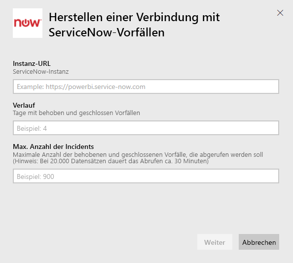
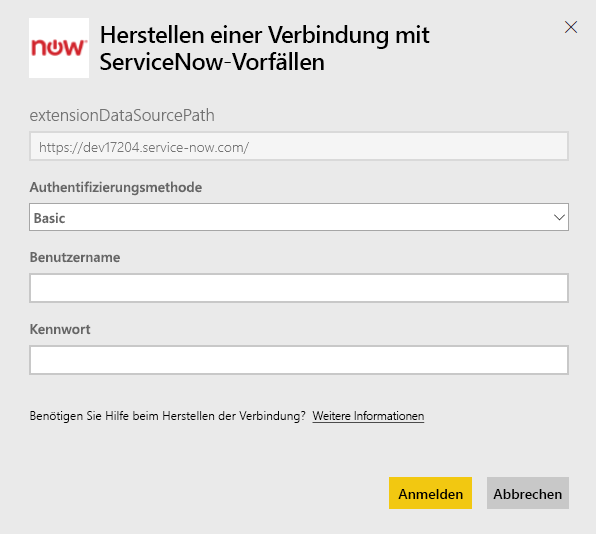

# Herstellen einer Verbindung mit ServiceNow mithilfe von Power BI für Berichte über Vorfälle
ServiceNow bietet mehrere Produkte und Lösungen für die Optimierung Ihres Unternehmens, u. a. Unternehmens-, Betriebs- und IT-Verwaltung. Dieses Inhaltspaket umfasst mehrere Berichte und Informationen zu offenen, kürzlich gelösten und kürzlich geschlossenen Vorfällen.  

Stellen Sie eine Verbindung mit dem Power BI-Inhaltspaket für [ServiceNow-Vorfälle](https://app.powerbi.com/getdata/services/servicenow) her.

## Herstellen der Verbindung
1. Wählen Sie unten im linken Navigationsbereich **Daten abrufen** aus.
   
    
2. Wählen Sie im Feld **Dienste** die Option **Abrufen**aus.
   
    
3. Wählen Sie **ServiceNow-Vorfälle** \> **Abrufen** aus.
   
   
4. Geben Sie die URL der ServiceNow-Instanz und den Bereich für die zu importierenden Tage/Datensätze ein. Beachten Sie, dass der Importvorgang beendet wird, sobald ein Grenzwert erreicht wird.
   
   
5. Wenn Sie dazu aufgefordert werden, geben Sie Ihre ServiceNow-Anmeldeinformationen für die **Standardauthentifizierung** ein. Beachten Sie, dass das einmalige Anmelden zurzeit nicht unterstützt wird. Weitere Informationen zu den Systemanforderungen finden Sie unten.
   
   
6. Nach Abschluss der Anmeldung wird den Importvorgang gestartet. Nach Abschluss des Vorgangs werden im Navigationsbereich ein neues Dashboard, ein Bericht und ein Modell angezeigt. Wählen Sie das Dashboard aus, um die importierten Daten anzuzeigen.
   
    

**Was nun?**

* Versuchen Sie, am oberen Rand des Dashboards [im Q&A-Feld eine Frage zu stellen](consumer/end-user-q-and-a.md).
* [Ändern Sie die Kacheln](service-dashboard-edit-tile.md) im Dashboard.
* [Wählen Sie eine Kachel aus](consumer/end-user-tiles.md), um den zugrunde liegenden Bericht zu öffnen.
* Zwar ist Ihr Dataset auf tägliche Aktualisierung festgelegt, jedoch können Sie das Aktualisierungsintervall ändern oder über **Jetzt aktualisieren** nach Bedarf aktualisieren.

## Systemanforderungen
Zum Herstellen der Verbindung benötigen Sie Folgendes:  

* Ein Konto, das mit Standardauthentifizierung auf „IhreOrganisation.service-now.com“ zugreifen kann (einmaliges Anmelden wird in dieser Version nicht unterstützt)  
* Das Konto muss die Rolle „rest_service“ und Lesezugriff auf die Liste der Vorfälle haben.  

## Problembehandlung
Wenn beim Laden ein Fehler mit den Anmeldeinformationen auftritt, überprüfen Sie die unten aufgeführten Zugriffsanforderungen. Wenn Sie über die richtigen Berechtigungen verfügen und trotzdem Probleme auftreten, wenden Sie sich an Ihren ServiceNow-Administrator, um sicherzustellen, dass Sie über alle zusätzlichen Berechtigungen verfügen, die möglicherweise für Ihre benutzerdefinierte Instanz benötigt werden.

Überprüfen Sie bei langen Ladezeiten die Anzahl der Vorfälle und die Anzahl der Tage, die für die Verbindung angegeben wurden, und erwägen Sie, die Werte zu reduzieren.

## Nächste Schritte
[Was ist Power BI?](power-bi-overview.md)

[Power BI – Grundkonzepte](consumer/end-user-basic-concepts.md)

