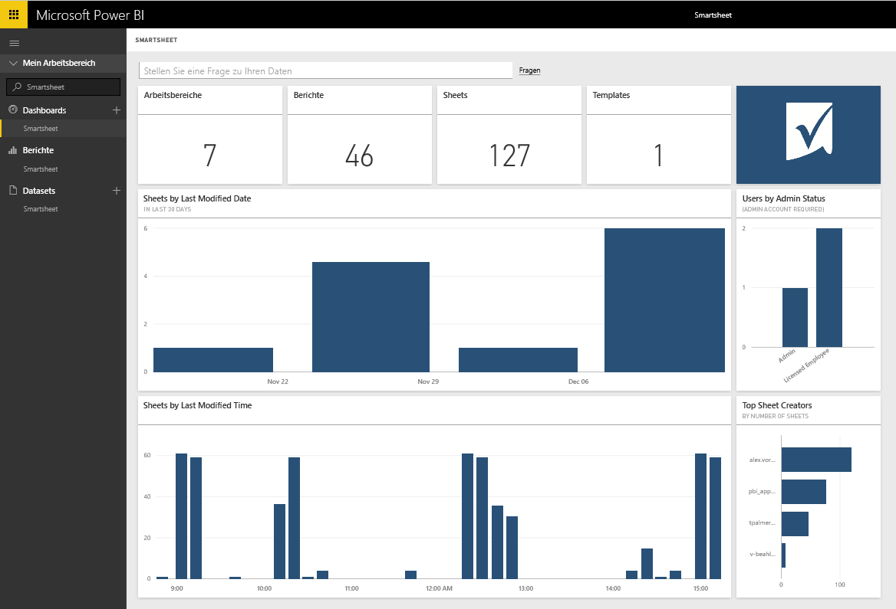

# Herstellen einer Verbindung mit Smartsheet mithilfe von Power BI
Smartsheet bietet eine einfache Plattform für Zusammenarbeit und Dateifreigabe. Das Smartsheet-Inhaltspaket für Power BI bietet ein Dashboard, Berichte und ein Dataset mit einer Übersicht über Ihr Smartsheet-Konto. Sie können sich auch über [Power BI Desktop](desktop-connect-to-data.md) direkt mit einzelnen Blättern in Ihrem Konto verbinden. 

Stellen Sie eine Verbindung mit dem [Smartsheet-Inhaltspaket](https://app.powerbi.com/groups/me/getdata/services/smartsheet) für Power BI her.

>[!NOTE]
>Zum Herstellen der Verbindung und Laden des Power BI-Inhaltspakets sollte nach Möglichkeit ein Smartsheet-Administratorkonto verwendet werden, da es über zusätzlichen Zugriff verfügt.

## Herstellen der Verbindung
1. Wählen Sie unten im linken Navigationsbereich **Daten abrufen** aus.
   
   
2. Wählen Sie im Feld **Dienste** die Option **Abrufen**aus.
   
    
3. Wählen Sie **Smartsheet \> Abrufen** aus.
   
   
4. Wählen Sie für die Authentifizierungsmethode **oAuth2 \> Anmelden** aus.
   
   Geben Sie bei der entsprechenden Aufforderung Ihre Smartsheet-Anmeldeinformationen ein, und führen Sie den Authentifizierungsvorgang aus.
   
   
   
   
5. Nachdem die Daten von Power BI importiert wurden, werden im linken Navigationsbereich ein neues Dashboard, ein Bericht und ein Dataset angezeigt. Neue Elemente sind mit einem gelben Sternchen (\*) markiert. Wählen Sie den Eintrag „Smartsheet“ aus.
   
   

**Was nun?**

* Versuchen Sie, am oberen Rand des Dashboards [im Q&A-Feld eine Frage zu stellen](consumer/end-user-q-and-a.md).
* [Ändern Sie die Kacheln](service-dashboard-edit-tile.md) im Dashboard.
* [Wählen Sie eine Kachel aus](consumer/end-user-tiles.md), um den zugrunde liegenden Bericht zu öffnen.
* Zwar ist Ihr Dataset auf tägliche Aktualisierung festgelegt, jedoch können Sie das Aktualisierungsintervall ändern oder über **Jetzt aktualisieren** nach Bedarf aktualisieren.

## Inhalt
Das Smartsheet-Inhaltspaket für Power BI enthält einen Überblick über Ihr Smartsheet-Konto, z.B. die Anzahl von Arbeitsbereichen, Berichten und Blättern, über die Sie verfügen, wenn sie geändert werden usw. Benutzer mit Administratorrechten sehen auch einige Informationen über die Benutzer in Ihrem System wie diejenigen, die die meisten Blätter erstellt haben.  

Sie können sich über den Smartsheet-Connector in [Power BI Desktop](desktop-connect-to-data.md) direkt mit einzelnen Blättern in Ihrem Konto verbinden.  

## Nächste Schritte:

[Was ist Power BI?](power-bi-overview.md)

[Abrufen von Daten in Power BI](service-get-data.md)