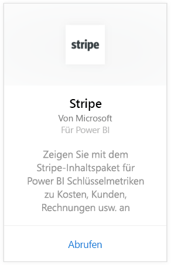
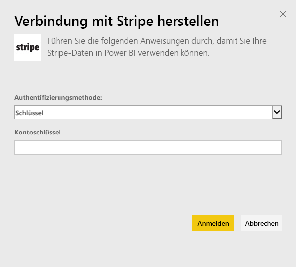

# Herstellen einer Verbindung mit Stripe mithilfe von Power BI
Visualisieren und durchsuchen Sie Ihre Stripe-Daten in Power BI mithilfe des Power BI-Inhaltspakets. Das Power BI Stripe-Inhaltspaket ruft Daten zu Kunden, Gebühren, Ereignissen und Rechnungen ab. Die Daten umfassen die neuesten 10.000 Ereignisse und 5.000 Gebühren innerhalb der letzten 30 Tage. Der Inhalt wird automatisch einmal täglich nach einem von Ihnen gesteuerten Zeitplan aktualisiert. 

Stellen Sie eine Verbindung mit dem [Stripe-Inhaltspaket](https://app.powerbi.com/getdata/services/stripe) für Power BI her.

## Herstellen der Verbindung
1. Wählen Sie unten im linken Navigationsbereich „Daten abrufen“ aus.  
   
    
2. Wählen Sie im Feld **Dienste** die Option **Abrufen**aus.  
   
      
3. Wählen Sie **Stripe** &gt; **Abrufen** aus.  
   
      
4. Geben Sie Ihren [API-Schlüssel](https://dashboard.stripe.com/account/apikeys) für Stripe ein, um die Verbindung herzustellen.  
   
    
5. Der Importvorgang startet automatisch. Nach Abschluss des Vorgangs werden im Navigationsbereich ein neues Dashboard, ein Bericht und ein Modell (mit einem Sternzeichen gekennzeichnet) angezeigt. Wählen Sie das Dashboard aus, um die importierten Daten anzuzeigen.
   
    

**Was nun?**

* Versuchen Sie, am oberen Rand des Dashboards [im Q&A-Feld eine Frage zu stellen](consumer/end-user-q-and-a.md).
* [Ändern Sie die Kacheln](service-dashboard-edit-tile.md) im Dashboard.
* [Wählen Sie eine Kachel aus](consumer/end-user-tiles.md), um den zugrunde liegenden Bericht zu öffnen.
* Zwar ist Ihr Dataset auf tägliche Aktualisierung festgelegt, jedoch können Sie das Aktualisierungsintervall ändern oder über **Jetzt aktualisieren** nach Bedarf aktualisieren.

## Nächste Schritte
[Was ist Power BI?](power-bi-overview.md)

[Abrufen von Daten in Power BI](service-get-data.md)

