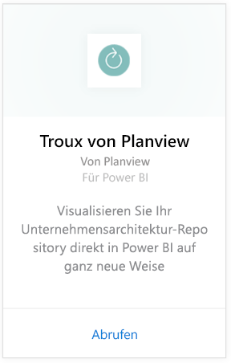
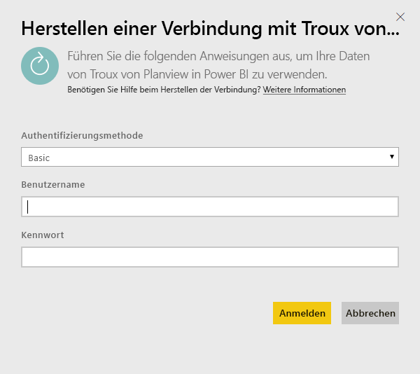
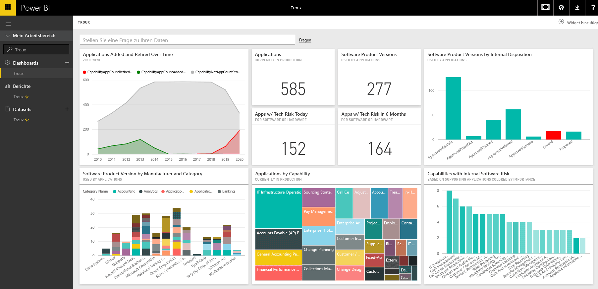

# Herstellen einer Verbindung mit Troux für Power BI
Mit dem Troux-Inhaltspaket können Sie Ihr Unternehmensarchitektur-Repository direkt in Power BI auf ganz neue Weise visualisieren. Das Inhaltspaket eröffnet Ihnen eine Reihe von Einsichten in Ihre Geschäftsperspektiven, die Anwendungen, die diese Perspektiven bereitstellen, und die Technologien, die diese Anwendungen unterstützen. All das in Power BI umfassend anpassbar.

Stellen Sie eine Verbindung zum [Troux-Inhaltspaket](https://app.powerbi.com/getdata/services/troux) für Power BI her.

## Herstellen der Verbindung
1. Wählen Sie unten im linken Navigationsbereich **Daten abrufen** aus.
   
   
2. Wählen Sie im Feld **Dienste** die Option **Abrufen**aus.
   
   
3. Wählen Sie **Troux** \> **Abrufen** aus.
   
   
4. Geben Sie Ihre Troux-OData-URL an. Unten finden Sie Einzelheiten zum [Suchen dieser Parameter](#FindingParams).
   
   
5. Wählen Sie als **Authentifizierungsmethode****Standard** aus, und geben Sie Ihren Benutzernamen und Ihr Kennwort ein (Groß- und Kleinschreibung müssen beachtet werden), und wählen Sie dann **Anmelden**aus.
   
    
6. Nach der Genehmigung wird der Importvorgang automatisch gestartet. Nach Abschluss des Vorgangs werden im Navigationsbereich ein neues Dashboard, ein Bericht und ein Modell angezeigt. Wählen Sie das Dashboard aus, um die importierten Daten anzuzeigen.
   
     

**Was nun?**

* Versuchen Sie, am oberen Rand des Dashboards [im Q&A-Feld eine Frage zu stellen](power-bi-q-and-a.md).
* [Ändern Sie die Kacheln](service-dashboard-edit-tile.md) im Dashboard.
* [Wählen Sie eine Kachel aus](service-dashboard-tiles.md), um den zugrunde liegenden Bericht zu öffnen.
* Ihr Dataset ist auf eine tägliche Aktualisierung festgelegt. Sie können jedoch das Aktualisierungsintervall ändern oder es über **Jetzt aktualisieren** nach Bedarf aktualisieren.

## Systemanforderungen
Zugriff auf den Troux-OData-Feed und Troux 9.5.1 oder höher sind erforderlich.

## Suchen von Parametern
Ihr Kundenbetreuungsteam kann Ihnen die eindeutige URL für Ihren Troux-OData-Feed zur Verfügung stellen

## Problembehandlung
Wenn nach der Eingabe der Anmeldeinformationen ein Timeoutfehler angezeigt wird, versuchen Sie, die Verbindung erneut herzustellen.

## Nächste Schritte
[Erste Schritte mit Power BI](service-get-started.md)

[Abrufen von Daten in Power BI](service-get-data.md)

